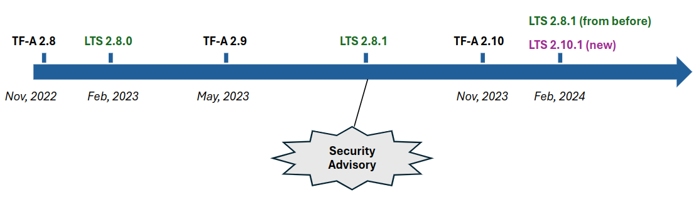

LTS - Long-Term Support
=======================

.. table:: Table 1: Document History

  +-------------+--------------------+-------------------------------------------------------+
  | Date        | Author             | Description                                           |
  +=============+====================+=======================================================+
  | 2022-07-20  | Okash Khawaja,     | Initial draft.                                        |
  |             | Varun Wadekar      |                                                       |
  +-------------+--------------------+-------------------------------------------------------+
  | 2022-07-21  | Varun Wadekar      | Refine the Maintainership guidelines and planning     |
  |             |                    | sections. Introduce a new section documenting a day   |
  |             |                    | in the life of a LTS branch maintainer                |
  +-------------+--------------------+-------------------------------------------------------+
  | 2022-08-05  | Okash Khawaja,     | Merge two drafts (draft 1 and 2), address comments    |
  |             | Varun Wadekar      | made by both authors, cosmetic changes to the content |
  |             |                    | all over the document                                 |
  +-------------+--------------------+-------------------------------------------------------+
  | 2022-08-05  | Okash Khawaja      | Add note about testing support available from TF.org  |
  +-------------+--------------------+-------------------------------------------------------+
  | 2022-08-05  | Varun Wadekar      | Changed the “Future plans” section to “FAQ” and       |
  |             |                    | answered some of the questions with feedback from     |
  |             |                    | the community.                                        |
  +-------------+--------------------+-------------------------------------------------------+
  | 2025-01-07  | Govindraj Raja     | Convert from pdf to rst.                              |
  +-------------+--------------------+-------------------------------------------------------+
  | 2025-01-07  | Govindraj Raja     | Updates based on learnings and suggestions.           |
  +-------------+--------------------+-------------------------------------------------------+
  | 2025-03-27  | Chris Palmer       | Playbook for making a new release.                    |
  +-------------+--------------------+-------------------------------------------------------+

This document proposes a plan for long-term support (LTS) of the |TF-A| project.

Why is LTS required?
--------------------
LTS is needed for commercial reasons. More specifically, on the device side,
when a product is released, the companies have to support that in-market product
such that the amount of changes to the firmware are kept to a minimum to avoid
the risk of regression. At the same time the companies don't want to exclude
critical patches such as those for security advisories. Similarly on the server side,
companies want to minimize the churn when deploying fixes during incident
response, e.g. due to critical security bugs.

Also, the European Cyber Resilience Act (CRA) is a new EU legislation that mandates
cybersecurity standards for products containing digital elements, aiming to
protect consumers and businesses by ensuring manufacturers build security into
their hardware and software throughout their lifecycle, including automatic
updates and incident reporting; essentially requiring all digital products
sold in the EU to meet specific cybersecurity requirements.

This means that companies have to maintain and backport critical updates to
old branches internally. As this effort is duplicated across different companies
using TF-A, it makes sense to factor out this effort into a community-wide LTS.

What does LTS mean for TF-A?
----------------------------
In this section we will define exactly what constitutes LTS for TF-A.
Specifically, we will define the following characteristics:

- criteria for selecting patches which will be backported to LTS branches
- lifetime and frequency of LTS branches

**Criteria**

We must have an objective criterion for selecting patches to be backported to
LTS branches. This will make maintenance easy because:

a. there will be less -- ideally no -- discussion when selecting patches to backport
b. large parts of the process can be automated

Below is the criteria

#. No features will be backported.
#. Security advisories: Any patch that makes it into :ref:`Security Advisories`
   is automatically selected for back porting. This includes patches to external
   components too, e.g. libfdt.
#. Workarounds for CPU and other ARM IP errata
#. Workarounds for non-ARM IP errata, e.g. TI UART
#. Fixes for platform bugs. These patches must not modify any code outside of
   the specific platform that the fix applies to.
#. Patches can only be backported from the master branch. In other words, the
   master branch will be a superset of all the changes in any LTS branch.

**Lifetime and frequency**

This section approaches three questions: for how long should an LTS release be
supported, how frequently should LTS releases be made and at which time(s) of
the year should the releases be made.

1. For how long should an LTS release be supported?

The Linux kernel maintainers supports an LTS branch for 2 years. Since firmware
tends to have less churn and longer lifetime than a HLOS, TF-A is trying to
support at-least 7 years for its LTS. Initially it was intended to support
5 years but there has been no objections to extend LTS support to 7 years.
There are many challenges that may influence the 7 year support from CI
infrastructure to availability of maintainers.

2. How frequently should LTS releases be made?

Given that many products that have a release cycle, have a yearly release
cycle, it would make sense to have yearly TF-A releases.

3. Which time(s) of the year should the releases be made?

TF-A releases are cut twice a year: May and November. Basing LTS release
on the November TF-A release has a few benefits. First, it aligns with Linux
LTS releases which happen towards the end of each year. Second, it aligns
with Android releases which tend to fall in Q3 each year. Since product
releases are timed with Android release, this gives enough time to harden
the TF-A LTS release during development so that it's ready for launch in
Q3 following year. On the other hand, if the May release of TF-A is chosen as
the basis for LTS then developers will have little time -- about a month,
taking into account the test-and-debug phase before LTS is cut (see below) --
before Android release.

To summarize, there will be one LTS release per year. It will be supported for
5 years and we can discuss extending it to 7 years later on. The LTS release
will be based on the November release of TF-A.

**Testing Criteria**

Every patch merged to the LTS branch will complete the following tests before
getting approved.

#. TFTF tests currently running in the testing farm
#. CI/CD static analysis scans
#. Coverity scans
#. Platform tests

Platforms that are not maintained upstream will undergo testing downstream in a
pre-defined window. The platform maintainer will complete the testing and provide
a verified score on the patch once testing is completed.

** A note about test coverage from TF.org **

Currently TF.org maintains a CI system to run TF-A automated tests on a
selection of HW boards donated by TF.org members (a benefit reserved to project
members, see the project charter for more details). This automated test coverage
will be extended to cover testing for LTS as well for boards that are part of
the CI system.

**TFTF Branching**

A note about testing here. After a patch is backported to an LTS branch, that
branch will need to be regression tested. Since TFTF moves forward with latest
TF-A changes, newer TFTF tests may not apply to old LTS branches. Therefore
TFTF will also need to be branched, in-sync with TF-A LTS branches. In other
words, there will be one TFTF LTS branch corresponding to each TF-A LTS branch.
The TFTF LTS branch will be used to regression test the corresponding TF-A LTS
branch.

As we work with the LTS branch of TFTF, we might also need fixes for TFTF
itself to be ported to LTS. However, decision-making about those patches need
not be as stringent as for TF-A.

**CI Scripts**

CI Scripts moves forward with TF-A changes, since we need to checkout the
corresponding release version of CI scripts for LTS.

Though we are unlikely to update CI scripts, but time to time migrating a newer
FVP version or deprecating certain tests due to unavailability of platforms may
influence updates to CI Scripts.

**Hafnium / OP-TEE**

Both Hafnium and OP-TEE move forward with TF-A changes so we need to freeze their
corresponding version from TF-A release for a LTS.

**MbedTLS**

Updates to the version of MbedTLS used with LTS will happen time to time based on
maintainers call to update them or not.

Release details
---------------
This section goes into details of what the LTS release process will look like.

**Test-and-debug period**

Since the LTS branch will be used in product releases, it is expected that more
testing and debugging will be done on the November release of TF-A. Therefore
it would make sense to leave at least a month after the November release and
then cut the LTS branch. We recommend two months, given that one of the months
is December which tends to be slower due to holidays. So, an end-of-November
TF-A release would result in a beginning-of-February LTS release. Note that
the LTS branch will be created at the same time as the TF-A November release,
but it will be officially released at the end of January or early February.
Going forward we should strive to make the period smaller and smaller until
ideally it coincides with TF-A November release which means that our test
and CI/CD infra is good enough to allow that to happen.

**Example timeline**

Below is an example timeline starting from the November 2022 release of TF-A.

- Nov 2022: TF-A 2.8 is released towards the end of Nov, 2022. Not shown in the
  diagram, at the same time LTS release candidate branch is made which is based
  on TF-A 2.8. This means new features going in 2.8 won’t go in the LTS branch.
  We can call it `LTS 2.8-rc`.
- Feb 2023: After testing and debugging LTS 2.8-rc for a couple of months,
  LTS 2.8.0 is officially released in early Feb 2023.
- May 2023: TF-A 2.9 is released but since this is not an LTS branch it doesn’t
  affect LTS.
- Somewhere between May and Nov of 2023: A security advisory comes up and the
  related patches go into TF-A master branch. Since these patches fall under
  LTS criteria, they are backported to LTS 2.8.0 which results in LTS 2.8.1
  being released. Note that here we don’t allow the extra testing and debugging
  time that we had between Nov 2022 and early Feb 2023. This is because there
  isn’t as much to test and debug as an annual LTS release has. Also companies
  might want to deploy critical patches soon.
- Nov 2023: TF-A 2.10 is released. Not shown in the diagram, at the same time
  LTS 2.10-rc is made. It’s tested by partners for a couple of months.
- Feb 2024: LTS 2.10.1 is released in early Feb. Now there are two LTS
  branches: 2.8.1 and 2.10.1.

Note that TFTF will follow similar branching model as TF-A LTS, i.e. there will
be TFTF LTS 2.8.0 in Feb 2023, 2.8.1 (if new TFTF tests need to be added for
the security advisory) when there is TF-A LTS 2.8.1 and so on.

Maintainership
--------------

**Guidelines & Responsibilities**

#. Maintainers shall be impartial and strive to work for the benefit of
   the community
#. Objective and well-defined merge criteria to avoid confusion and discussions
   at random points in time when there is a "candidate" patch
#. The maintainers shall explain the lifecycle of a patch to the community,
   with a detailed description of the maximum time spent in each step
#. Automate, automate, automate
#. Reviewers should not focus too much on "what" and instead focus on "how"
#. Constantly refine the merge criteria to include more partner use cases
#. Ensure that all candidate patches flow from the main branch to all LTS branches
#. Maintainers collaborate in the following discord channel -
   https://discord.com/channels/1106321706588577904/1162029539761852436
#. Maintainers discuss and provide updates about upcoming LTS releases in the above
   mentioned discord channel.

**Options**

These are some options in the order of preference.

#. Current set of :ref:`lts maintainers` from tf.org(or hired contractor) take care of the LTS
#. From the community, create a set of maintainers focused solely on the LTS branches

A day in the life of a maintainer
*********************************
This section documents the daily tasks that a maintainer might perform to
support the LTS program. It is expected that a maintainer follows clearly laid
down steps and does not have to make policy level decisions for merge, testing,
or candidate patch selection.

#. Monitor the main branch to identify candidate patches for the LTS branches
#. Monitor emails from LTS triage report to choose patches that should be
   cherry-picked for LTS branches.
#. Cherry-pick agreed patches to LTS branches co-ordinate review process and Monitor
   CI results.
#. Monitor the mailing list for any LTS related issues
#. Propose or solicit patches to the main branch and tag them as candidates for LTS

Playbook for new releases
-------------------------
To make a new minor release (e.g. 2.x.y → 2.x.y+1), follow these steps.

#. Every Friday, LTS maintainers receive a triage report email (subject: “TF-A
   LTS Triage report”) that contains attached CSV files, 1 per
   currently-supported LTS major release branch (e.g. lts-2.8, lts-2.10,
   lts-2.12, etc.). It contains a list of patches to be cherry-picked into a new
   minor release of each supported LTS branch.
#. Run ``git fetch origin``.
#. Run ``git checkout -b lts-v2.x.y+1 --track origin/lts-v2.x``.
#. Run ``git log`` and verify that the most recent commit is the changelog for
   the v2.x.y release, and that it has the origin/lts-v2.x tag.
#. For the version 2.x for which you want to create a new release, open its CSV
   file. For each patch listed, **from the bottom to the top**, run ``git
   cherry-pick -x sha1-hash``.
#. Some of the patches of this list may not be taken, mainly due to false
   positive. If in doubt, that can be discussed either in the “tf-a-lts” channel
   on Discord or during the LTS weekly meeting. There could also be patches to
   be taken in tf-a-ci-scripts or tf-a-tests.
#. Push the stack of changes: ``git push origin
   HEAD:refs/for/lts-v2.x%topic=for-lts-v2.x.y+1``. You might need the
   ``--no-verify`` option: ``git push origin --no-verify
   HEAD:refs/for/lts-v2.x%topic=for-lts-v2.x.y+1``.
#. The AllowCI+2 job runs automatically on each LTS branch once a new
   cherry-picked patch/patch-stack is pushed to the corresponding branch. If
   this CI run passes, it automatically applies the Verified+1 (V+1) label to
   the patch/all patches in the stack. The other LTS maintainers will provide
   MR+1 and COR+1 votes. If the CI is OK and votes V+1, and if the
   Maintainer-Review+1 (MR+1), Code-Owner-Review+1 (COR+1), and V+1 votes are
   present, Gerrit will automatically merge the patch. LTS maintainers will then
   trigger a Jenkins job that will take care of the release (tag, mail, and
   readthedocs update).

Execution Plan
**************
This section lists the steps needed to put the LTS system in place. However,
to kick start LTS in Nov ‘22, only a few steps are needed. The rest can follow
in the background.

Initial release steps
*********************

The following steps are necessary to kickstart the project and potentially
create the first LTS from the Nov’22 release.

#. Create a TF-A LTS release-candidate branch and a TFTF LTS branch immediately
   after the Nov’22 release
#. Request all platform-owners to test and debug the RC branch
#. Gather feedback from the test and debug cycle
#. Mark the TF-A LTS branch ready by the end of January
#. Announce the official LTS release availability on the mailing lists

Long term release plan
**********************
Above will buy us time to then work on the rest of the execution plan which
is given below.

#. The review criteria for LTS patches must be the same as TF-A patches
#. The maintainers shall publish the well-defined merge criteria to allow
   the community to choose candidate patches
#. The maintainers shall publish a well-defined test specification for any
   patch entering the LTS branch

   a. Tests required to pass in the CI/CD flow
   b. Static analysis scans
   c. Coverity scans

#. The maintainers shall publish a mechanism to choose candidate patches for
   the LTS branch
#. The maintainers shall publish a mechanism to report bugs `[1]`_ seen with
   an LTS branch
#. The maintainers shall publish a versioning mechanism for the LTS branch

   a. Bump minor version for any “logical” `[2]`_ fix(es) that gets merged

#. The CI/CD infrastructure shall provide test support for all “live” LTS
   branches at any given point in time
#. The CI/CD infrastructure shall provide means to

   a. notify all maintainers that a patch is ready for review
   b. automatically cherry-pick a patch to a given LTS branch
   c. get it through the CI/CD testing flow
   d. gentle ping in LTS discord channel asking for reviews to ensure
      cherry-picks are merged.

FAQ
***

In our discussions, in addition to the above points we also considered some
questions. They have been discussed on the mailing list too.

| Q. What happens when a bug fix applies just to a LTS branch and not to the
     master branch?
| A. This will be treated as a special case and the bug, and the fix will be
     discussed

| Q. When testing a backported patch, what if one of the partners needs more
     time while the patch fix is time-critical and, hence slowing other
     partners?
| A. The maintainers will add more detail to the review and merge process to
     handle this scenario.

| Q. How do we handle the increasing version numbers for errata fixes?
| A. Too many CPU errata workarounds resulting in too many LTS releases.
     We propose bumping the version number for each logical fix as
     described in the section “Long term release plan” above because
     that will help accurately track what changes have been deployed in-field.

| Q. What if LTS support duration needs to be extended to longer than 5 years?
| A. Still under discussion.

These are uncharted waters, and we will face some unseen problems. When they
become real problems, then we will have concrete data and be better able to
address them. This means that our LTS definition as presented in this document
is not the final one. We will constantly be discussing it and deciding how to
adapt it as we see practical problems.

.. _[1]:

[1] The plan is to create a system where reviewers can tag a patch on mainline which
gets automatically rebased on LTS and pushed to Gerrit. On seeing this patch,
the CI/CD starts tests and provides a score. In parallel, the system also sends
an email to the maintainers announcing the arrival of a candidate patch for the
LTS branch.

.. _[2]:

[2] Logical will be a patch or patches implementing a certain fix. For example, if a
security mitigation is fixed with the help of three patches, then all of them are
considered as one "logical" fix. The version is incremented only after all these
patches are merged. with the maintainers. If agreed unanimously, the bug fix
will be merged to the affected LTS branches after completing the review process.
