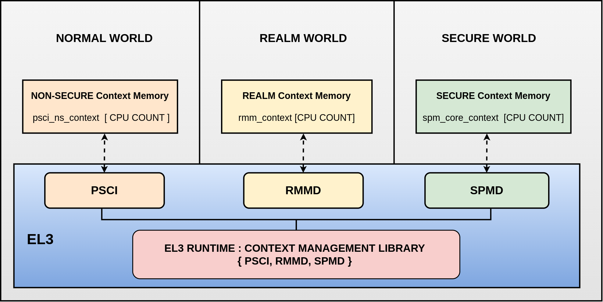
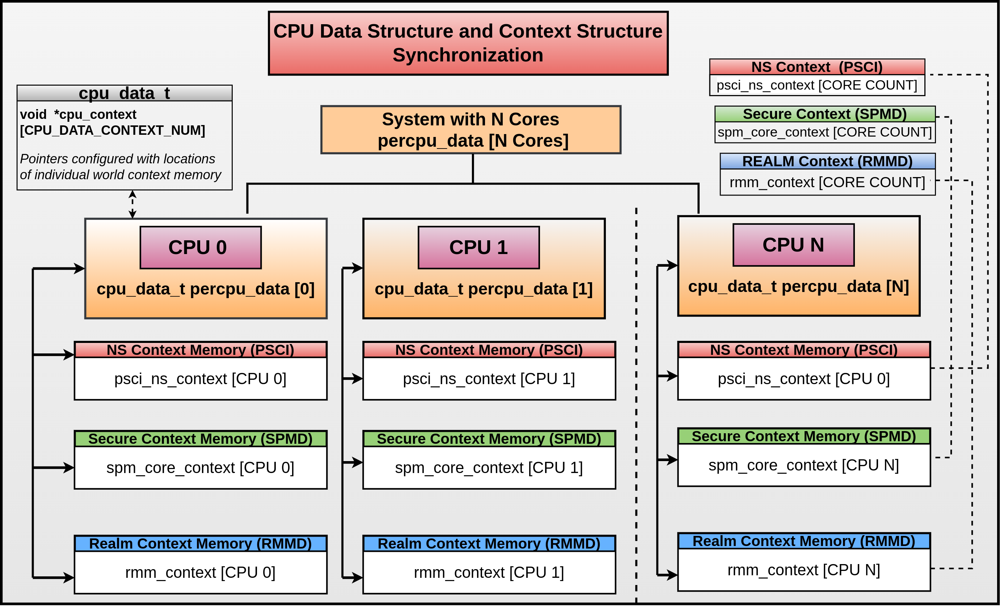
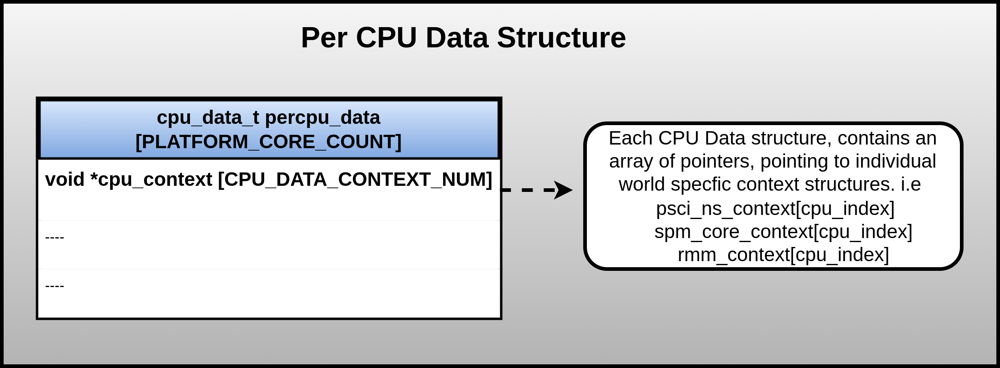
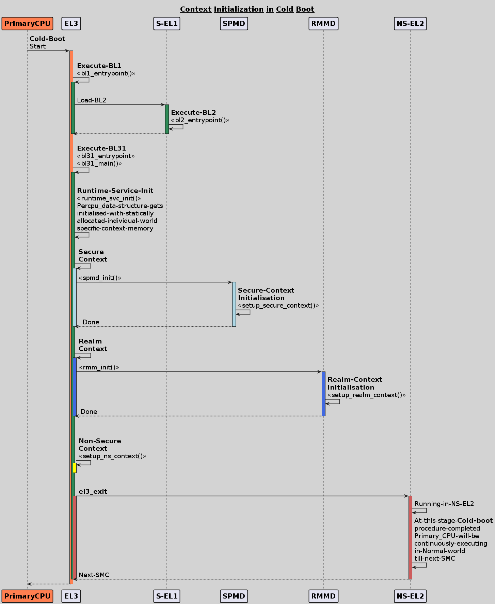
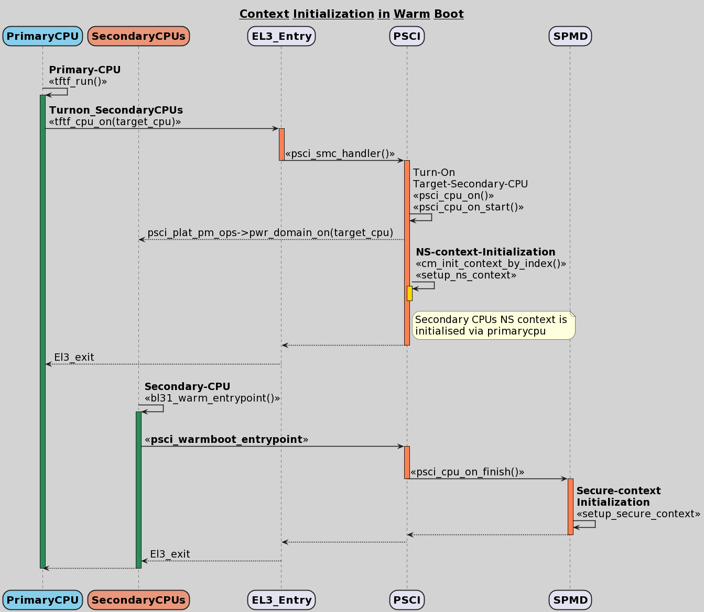
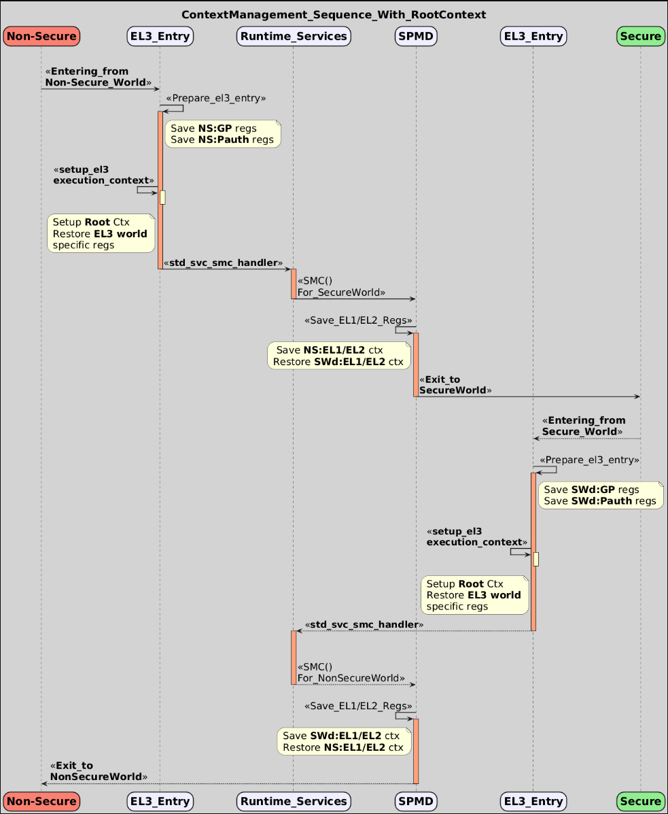

Context Management Library
**************************

This document provides an overview of the Context Management library implementation
in Trusted Firmware-A (TF-A). It enumerates and describes the APIs implemented
and their accessibility from other components at EL3.

Overview
========

Arm TrustZone architecture facilitates hardware-enforced isolation between
software running in various security states (Secure/Non-Secure/Realm).
The general-purpose registers, most of the system registers and vector registers
are not banked per world. When moving between the security states it is the
responsibility of the secure monitor software (BL31(AArch64) / BL32(Aarch32))
in TF-A, not the hardware, to save and restore register state.
Refer to `Trustzone for AArch64`_ for more details.

EL3 Runtime Firmware, also termed as secure monitor firmware, is integrated
with a context management library to handle the context of the CPU, managing the
saving and restoring of register states across the worlds.

TF-A Context
============

In TF-A, the context is represented as a data structure used by the EL3 firmware
to preserve the state of the CPU at the next lower exception level (EL) in a given
security state and save enough EL3 metadata to be able to return to that exception
level and security state. The memory for the context data structures are allocated
in BSS section of EL3 firmware.

In a trusted system at any instance, a given CPU could be executing in one of the
security states (Non-Secure, Secure, Realm). Each world must have its
configuration of system registers independent of other security states to access
and execute any of the architectural features.

If the CPU switches across security states (for example: from Non-secure to Secure
or vice versa), the register contents, especially the ones that are not banked
(EL2/EL1, vector, general-purpose registers), will be overwritten, as the software
running in either state has the privileges to access them. Additionally, some of
the architectural features enabled in the former security state will be unconditionally
accessible in the latter security state as well. This can be a major concern when
dealing with security-specific bits, as they need to be explicitly enabled or
disabled in each state to prevent data leakage across the worlds.

In general, an ideal trusted system should have Secure world-specific configurations
that are not influenced by Normal World operations. Therefore, for each CPU, we
need to maintain world-specific context to ensure that register entries from one
world do not leak or impact the execution of the CPU in other worlds.
This will help ensure the integrity and security of the system, preventing any
unauthorized access or data corruption between the different security states.

Design
======

The Context Management library in TF-A is designed to cover all the requirements
for maintaining world-specific context essential for a trusted system.
This includes implementing CPU context initialization and management routines,
as well as other helper APIs that are required by dispatcher components in EL3
firmware, which are collectively referred to as CPU Context Management.
The APIs and their usecases are listed in detail under the :ref:`Library APIs`
section.

Originally, the Context Management library in TF-A was designed to cater for a
two-world system, comprising of Non-Secure and Secure Worlds. In this case, the
EL3 Firmware is assumed to be running in Secure World.
With introduction of Realm Management Extension (RME), from Armv9.2 a system
can have four distinct worlds (Non-Secure, Secure, Realm, Root).
RME isolates EL3 from all other Security states and moves it into its own security
state called root. EL3 firmware now runs at Root World and thereby is
trusted from software in Non-secure, Secure, and Realm states.
Refer to `Security States with RME`_ for more details.

Key principles followed in designing the context management library :

1. **EL3 should only initialize immediate used lower EL**

Context Management library running at EL3 should only initialize and monitor the
immediate used lower EL. This implies that, when S-EL2 is present in the system,
EL3 should initialise and monitor S-EL2 registers only. S-EL1 registers should
not be the concern of EL3 while S-EL2 is in place. In systems where S-EL2 is
absent, S-EL1 registers should be initialised from EL3.

2. **Decentralized model for context management**

Each world (Non-Secure, Secure, and Realm) should have their separate component
in EL3 responsible for their respective world context management.
Both the Secure and Realm world have associated dispatcher components in EL3
firmware to allow management of the respective worlds. For the Non-Secure world,
PSCI Library (BL31)/context management library provides routines to help
initialize the Non-Secure world context.

3. **Flexibility for Dispatchers to select desired feature set to save and restore**

Each feature is supported with a helper function ``is_feature_supported(void)``,
to detect its presence at runtime. This helps dispatchers to select the desired
feature set, and thereby save and restore the configuration associated with them.

4. **Dynamic discovery of Feature enablement by EL3**

TF-A supports four states for feature enablement at EL3, to make them available
for lower exception levels.

.. code:: c

	#define FEAT_STATE_DISABLED     	0
	#define FEAT_STATE_ENABLED      	1
	#define FEAT_STATE_CHECK        	2
	#define FEAT_STATE_CHECK_ASYMMETRIC	3

A pattern is established for feature enablement behavior.
Each feature must support the 3 possible values with rigid semantics.

- **FEAT_STATE_DISABLED** - all code relating to this feature is always skipped.
  Firmware is unaware of this feature.

- **FEAT_STATE_ALWAYS** - all code relating to this feature is always executed.
  Firmware expects this feature to be present in hardware.

- **FEAT_STATE_CHECK** - same as ``FEAT_STATE_ALWAYS`` except that the feature's
  existence will be checked at runtime. Default on dynamic platforms (example: FVP).

- **FEAT_STATE_CHECK_ASYMMETRIC** - same as ``FEAT_STATE_CHECK`` except that the feature's
  existence is asymmetric across cores, which requires the feature existence is checked
  during warmboot path also. Note that only limited number of features can be asymmetric.

 .. note::
   Only limited number of features can be ``FEAT_STATE_CHECK_ASYMMETRIC`` this is due to
   the fact that Operating systems are designed for SMP systems.
   There are no clear guidelines what kind of mismatch is allowed but following pointers
   can help making a decision

    - All mandatory features must be symmetric.
    - Any feature that impacts the generation of page tables must be symmetric.
    - Any feature access which does not trap to EL3 should be symmetric.
    - Features related with profiling, debug and trace could be asymmetric
    - Migration of vCPU/tasks between CPUs should not cause an error

    Whenever there is asymmetric feature support is added for a feature TF-A need to add
    feature specific code in context management code.

 .. note::
   ``FEAT_RAS`` is an exception here, as it impacts the execution of EL3 and
   it is essential to know its presence at compile time. Refer to ``ENABLE_FEAT``
   macro under :ref:`Build Options` section for more details.

Code Structure
==============

`lib/el3_runtime/(aarch32/aarch64)`_ - Context library code directory.

Source Files
~~~~~~~~~~~~

#. ``context_mgmt.c`` : consists of core functions that setup, save and restore
   context for different security states alongside high level feature enablement
   APIs for individual worlds.

#. ``cpu_data_array.c`` : contains per_cpu_data structure instantiation.

#. ``context.S`` : consists of functions that save and restore some of the context
   structure members in assembly code.

#. ``cpu_data.S`` : consists of helper functions to initialise per_cpu_data pointers.

#. ``el3_common_macros.S`` : consists of macros to facilitate actions to be performed
   during cold and warmboot and el3 registers initialisation in assembly code.

Header Files
~~~~~~~~~~~~

#. ``context_mgmt.h`` :  contains the public interface to Context Management Library.

#. ``context.h`` : contains the helper macros and definitions for context entries.

#. ``cpu_data.h`` : contains the public interface to Per CPU data structure.

#. ``context_debug.h`` : contains public interface to report context memory
   utilisation across the security states.

#. ``context_el2.h`` : internal header consisting of helper macros to access EL2
   context entries. Used by ``context.h``.

Apart from these files, we have some context related source files under ``BL1``
and ``BL31`` directory. ``bl1_context_mgmt.c`` ``bl31_context_mgmt.c``

Bootloader Images utilizing Context Management Library
======================================================

+-------------------------------------------+-----------------------------+
|   Bootloader                              | Context Management Library  |
+-------------------------------------------+-----------------------------+
|   BL1                                     |       Yes                   |
+-------------------------------------------+-----------------------------+
|   BL2                                     |       No                    |
+-------------------------------------------+-----------------------------+
|   BL31 (Aarch64- EL3runtime firmware)     |       Yes                   |
+-------------------------------------------+-----------------------------+
|   BL32 (Aarch32- EL3runtime firmware)     |       Yes                   |
+-------------------------------------------+-----------------------------+

CPU Data Structure
==================
For a given system, depending on the CPU count, the platform statically
allocates memory for the CPU data structure.

.. code:: c

	/* The per_cpu_ptr_cache_t space allocation */
	cpu_data_t percpu_data[PLATFORM_CORE_COUNT];

This CPU data structure has a member element with an array of pointers to hold
the Non-Secure, Realm and Secure security state context structures as listed below.

.. code:: c

	typedef struct cpu_data {
	#ifdef __aarch64__
	void *cpu_context[CPU_DATA_CONTEXT_NUM];
	#endif

	....
	....

	}cpu_data_t;

|CPU Data Structure|

At runtime, ``cpu_context[CPU_DATA_CONTEXT_NUM]`` array will be intitialised with
the Secure, Non-Secure and Realm context structure addresses to ensure proper
handling of the register state.
See :ref:`Library APIs` section for more details.

CPU Context and Memory allocation
=================================

CPU Context
~~~~~~~~~~~
The members of the context structure used by the EL3 firmware to preserve the
state of CPU across exception levels for a given security state are listed below.

.. code:: c

	typedef struct cpu_context {
	gp_regs_t gpregs_ctx;
	el3_state_t el3state_ctx;

	cve_2018_3639_t cve_2018_3639_ctx;

	#if ERRATA_SPECULATIVE_AT
	errata_speculative_at_t errata_speculative_at_ctx;
	#endif

	#if CTX_INCLUDE_PAUTH_REGS
	pauth_t pauth_ctx;
	#endif

	#if (CTX_INCLUDE_EL2_REGS && IMAGE_BL31)
	el2_sysregs_t el2_sysregs_ctx;
	#else
	el1_sysregs_t el1_sysregs_ctx;
	#endif
	} cpu_context_t;

Context Memory Allocation
~~~~~~~~~~~~~~~~~~~~~~~~~

CPUs maintain their context per world. The individual context memory allocation
for each CPU per world is allocated by the world-specific dispatcher components
at compile time as shown below.

|Context memory allocation|

NS-Context Memory
~~~~~~~~~~~~~~~~~
It's important to note that the Normal world doesn't possess the dispatcher
component found in the Secure and Realm worlds. Instead, the PSCI library at EL3
handles memory allocation for ``Non-Secure`` world context for all CPUs.

.. code:: c

	static cpu_context_t psci_ns_context[PLATFORM_CORE_COUNT];

Secure-Context Memory
~~~~~~~~~~~~~~~~~~~~~
Secure World dispatcher (such as SPMD) at EL3 allocates the memory for ``Secure``
world context of all CPUs.

.. code:: c

	static spmd_spm_core_context_t spm_core_context[PLATFORM_CORE_COUNT];

Realm-Context Memory
~~~~~~~~~~~~~~~~~~~~
Realm World dispatcher (RMMD) at EL3 allocates the memory for ``Realm`` world
context of all CPUs.

.. code:: c

	rmmd_rmm_context_t rmm_context[PLATFORM_CORE_COUNT];

To summarize, the world-specific context structures are synchronized with
per-CPU data structures, which means that each CPU will have an array of pointers
to individual worlds. The figure below illustrates the same.

|CPU Context Memory Configuration|

Context Setup/Initialization
============================

The CPU has been assigned context structures for every security state, which include
Non-Secure, Secure and Realm. It is crucial to initialize each of these structures
during the bootup of every CPU before they enter any security state for the
first time. This section explains the specifics of how the initialization of
every CPU context takes place during both cold and warm boot paths.

Context Setup during Cold boot
~~~~~~~~~~~~~~~~~~~~~~~~~~~~~~
The cold boot path is mainly executed by the primary CPU, other than essential
CPU initialization executed by all CPUs. After executing BL1 and BL2, the Primary
CPU jumps to the BL31 image for runtime services initialization.
During this process, the per_cpu_data structure gets initialized with statically
allocated world-specific context memory.

Later in the cold boot sequence, the BL31 image at EL3 checks for the presence
of a Secure world image at S-EL2. If detected, it invokes the secure context
initialization sequence under SPMD. Additionally, based on RME enablement,
the Realm context gets initialized from the RMMD at EL3. Finally, before exiting
to the normal world, the Non-Secure context gets initialized via the context
management library. At this stage, all Primary CPU contexts are initialized
and the CPU exits EL3 to enter the Normal world.

|Context Init ColdBoot|

.. note::
   The figure above illustrates a scenario on FVP for one of the build
   configurations with TFTF component at NS-EL2.

Context Setup during Warmboot
~~~~~~~~~~~~~~~~~~~~~~~~~~~~~

During a warm boot sequence, the primary CPU is responsible for powering on the
secondary CPUs. Refer to :ref:`CPU Reset` and :ref:`Firmware Design` sections for
more details on the warm boot.

|Context Init WarmBoot|

The primary CPU initializes the Non-Secure context for the secondary CPU while
restoring re-entry information for the Non-Secure world.
It initialises via ``cm_init_context_by_index(target_idx, ep )``.

``psci_warmboot_entrypoint()`` is the warm boot entrypoint procedure.
During the warm bootup process, secondary CPUs have their secure context
initialized through SPMD at EL3. Upon successful SP initialization, the SPD
power management operations become shared with the PSCI library. During this
process, the SPMD duly registers its handlers with the PSCI library.

.. code:: c

	file: psci_common.c
	const spd_pm_ops_t *psci_spd_pm;

	file: spmd_pm.c
	const spd_pm_ops_t spmd_pm = {
	.svc_on_finish = spmd_cpu_on_finish_handler,
	.svc_off = spmd_cpu_off_handler
	}

Secondary CPUs during their bootup in the ``psci_cpu_on_finish()`` routine get
their secure context initialised via the registered SPMD handler
``spmd_cpu_on_finish_handler()`` at EL3.
The figure above illustrates the same with reference of Primary CPU running at
NS-EL2.

.. _Library APIs:

Library APIs
============

The public APIs and types can be found in ``include/lib/el3_runtime/context_management.h``
and this section is intended to provide additional details and clarifications.

Context Initialization for Individual Worlds
~~~~~~~~~~~~~~~~~~~~~~~~~~~~~~~~~~~~~~~~~~~~
The library implements high level APIs for the CPUs in setting up their individual
context for each world (Non-Secure, Secure and Realm).

.. c:function::	static void setup_context_common(cpu_context_t *ctx, const entry_point_info_t *ep);

This function is responsible for the general context initialization that applies
to all worlds. It will be invoked first, before calling the individual
world-specific context setup APIs.

.. c:function::	static void setup_ns_context(cpu_context_t *ctx, const struct entry_point_info *ep);
.. c:function::	static void setup_realm_context(cpu_context_t *ctx, const struct entry_point_info *ep);
.. c:function::	static void setup_secure_context(cpu_context_t *ctx, const struct entry_point_info *ep);

Depending on the security state that the CPU needs to enter, the respective
world-specific context setup handlers listed above will be invoked once per-CPU
to set up the context for their execution.

.. c:function::	void cm_manage_extensions_el3(void)

This function initializes all EL3 registers whose values do not change during the
lifetime of EL3 runtime firmware. It is invoked from each CPU via the cold boot
path ``bl31_main()`` and in the WarmBoot entry path ``void psci_warmboot_entrypoint()``.

Runtime Save and Restore of Registers
~~~~~~~~~~~~~~~~~~~~~~~~~~~~~~~~~~~~~

EL1 Registers
-------------

.. c:function::	void cm_el1_sysregs_context_save(uint32_t security_state);
.. c:function::	void cm_el1_sysregs_context_restore(uint32_t security_state);

These functions are utilized by the world-specific dispatcher components running
at EL3 to facilitate the saving and restoration of the EL1 system registers
during a world switch.

EL2 Registers
-------------

.. c:function::	void cm_el2_sysregs_context_save(uint32_t security_state);
.. c:function::	void cm_el2_sysregs_context_restore(uint32_t security_state);

These functions are utilized by the world-specific dispatcher components running
at EL3 to facilitate the saving and restoration of the EL2 system registers
during a world switch.

Pauth Registers
---------------

Pointer Authentication feature is enabled by default for Non-Secure world and
disabled for Secure and Realm worlds. In this case, we don't need to explicitly
save and restore the Pauth registers during world switch.
However, ``CTX_INCLUDE_PAUTH_REGS`` flag is explicitly used to enable Pauth for
lower exception levels of Secure and Realm worlds. In this scenario, we save the
general purpose and Pauth registers while we enter EL3 from lower ELs via
``prepare_el3_entry`` and restore them back while we exit EL3 to lower ELs
via ``el3_exit``.

.. code:: c

	.macro save_gp_pmcr_pauth_regs
	func restore_gp_pmcr_pauth_regs

Feature Enablement for Individual Worlds
~~~~~~~~~~~~~~~~~~~~~~~~~~~~~~~~~~~~~~~~

.. c:function::	static void manage_extensions_nonsecure(cpu_context_t *ctx);
.. c:function::	static void manage_extensions_secure(cpu_context_t *ctx);
.. c:function::	static void manage_extensions_realm(cpu_context_t *ctx)

Functions that allow the enabling and disabling of architectural features for
each security state. These functions are invoked from the top-level setup APIs
during context initialization.

Further, a pattern is established for feature enablement code (AArch64).
Each feature implements following APIs as applicable:
Note: (``xxx`` is the name of the feature in the APIs)

- ``is_feat_xxx_supported()`` and ``is_feat_xxx_present()`` - mandatory for all features.

- ``xxx_enable(cpu_context * )`` and ``xxx_disable(cpu_context * )`` - optional
  functions to enable the feature for the passed context only. To be called in
  the respective world's setup_context to select behaviour.

- ``xxx_init_el3()`` - optional function to enable the feature in-place in any EL3
  registers that are never context switched. The values they write must never
  change, otherwise the functions mentioned in previous point should be used.
  Invoked from ``cm_manage_extensions_el3()``.

- ``xxx_init_el2_unused()`` - optional function to enable the feature in-place
  in any EL2 registers that are necessary for execution in EL1 with no EL2 present.

The above mentioned rules, followed for ``FEAT_SME`` is shown below:

.. code:: c

	void sme_enable(cpu_context_t *context);
	void sme_init_el3(void);
	void sme_init_el2_unused(void);
	void sme_disable(cpu_context_t *context);

Per-world Context
=================

Apart from the CPU context structure, we have another structure to manage some
of the EL3 system registers whose values are identical across all the CPUs
referred to as ``per_world_context_t``.
The Per-world context structure is intended for managing EL3 system registers with
identical values across all CPUs, requiring only a singular context entry for each
individual world. This structure operates independently of the CPU context
structure and is intended to manage specific EL3 registers.

.. code-block:: c

	typedef struct per_world_context {
		uint64_t ctx_cptr_el3;
		uint64_t ctx_zcr_el3;
		uint64_t ctx_mpam3_el3;
	} per_world_context_t;

These functions facilitate the activation of architectural extensions that possess
identical values across all cores for the individual Non-secure, Secure, and
Realm worlds.

Root-Context (EL3-Execution-Context)
====================================

EL3/Root Context is the execution environment while the CPU is running at EL3.

Previously, while the CPU is in execution at EL3, the system registers persist
with the values of the incoming world. This implies that if the CPU is entering
EL3 from NS world, the EL1 and EL2 system registers which might be modified in
lower exception levels NS(EL2/EL1) will carry forward those values to EL3.
Further the EL3 registers also hold on to the values configured for Non-secure
world, written during the previous ERET from EL3 to NS(EL2/EL1).
Same policy is followed with respect to other worlds (Secure/Realm) depending on
the system configuration.

The firmware at EL3 has traditionally operated within the context of the incoming
world (Secure/Non-Secure/Realm). This becomes problematic in scenarios where the
EL3/Root world must explicitly use architectural features that depend on system
registers configured for lower exception levels.
A good example of this is the PAuth regs. The Root world would need to program
its own PAuth Keys while executing in EL3 and this needs to be restored in entry
to EL3 from any world.
Therefore, Root world should maintain its own distinct settings to access
features for its own execution at EL3.

Register values which are currently known to be of importance during EL3 execution,
is referred to as the EL3/Root context.
This includes ( MDCR_EL3.SDD, SCR_EL3.{EA, SIF}, PMCR_EL0.DP, PSTATE.DIT)
EL3 Context ensures, CPU executes under fixed EL3 system register settings
which is not affected by settings of other worlds.

Root Context needs to be setup as early as possible before we try and access/modify
architectural features at EL3. Its a simple restore operation ``setup_el3_execution_context``
that overwrites the selected bits listed above. EL3 never changes its mind about
what those values should be, sets it as required for EL3. Henceforth, a Root
context save operation is not required.

The figure below illustrates the same with NS-world as a reference while entering
EL3.

|Root Context Sequence|

.. code:: c

	# EL3/Root_Context routine
	.macro setup_el3_execution_context

EL3 execution context needs to setup at both boot time (cold and warm boot)
entrypaths and at all the possible exception handlers routing to EL3 at runtime.

*Copyright (c) 2024, Arm Limited and Contributors. All rights reserved.*

.. _Trustzone for AArch64: https://developer.arm.com/documentation/102418/0101/TrustZone-in-the-processor/Switching-between-Security-states
.. _Security States with RME: https://developer.arm.com/documentation/den0126/0100/Security-states
.. _lib/el3_runtime/(aarch32/aarch64): https://git.trustedfirmware.org/TF-A/trusted-firmware-a.git/tree/lib/el3_runtime
