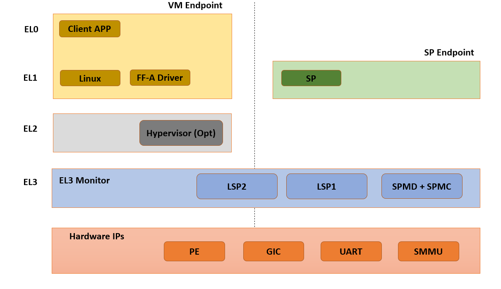
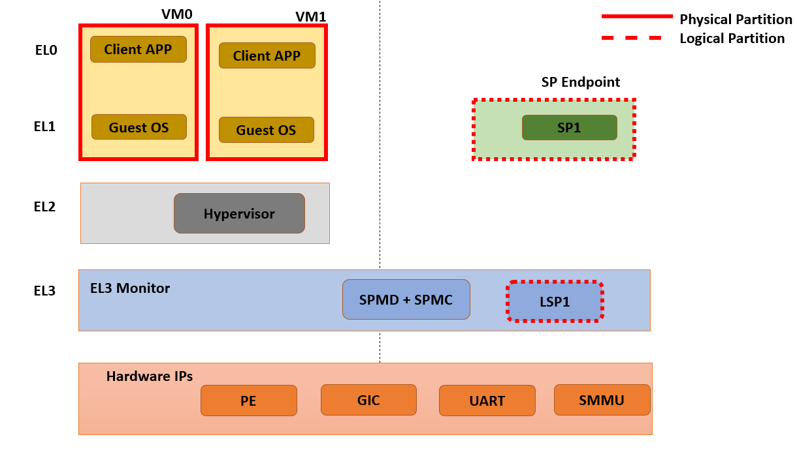

EL3 Secure Partition Manager
****************************

.. contents::

Foreword
========

This document describes the design of the EL3 SPMC based on the FF-A specification.
EL3 SPMC provides reference FF-A compliant implementation without S-EL2 virtualization support,
to help adopt and migrate to FF-A early.
EL3 SPMC implementation in TF-A:

- Manages a single S-EL1 Secure Partition
- Provides a standard protocol for communication and memory sharing between FF-A endpoints.
- Provides support for EL3 Logical Partitions to support easy migration from EL3 to S-EL1.

Sample reference stack
======================

The following diagram illustrates a possible configuration when the
FEAT_SEL2 architecture extension is not implemented, showing the SPMD
and SPMC at EL3, one S-EL1 secure partition, with an optional
Hypervisor:

TF-A build options
==================

This section explains the TF-A build options involved in building
an FF-A based SPM where the SPMD and SPMC are located at EL3:

- **SPD=spmd**: this option selects the SPMD component to relay the FF-A
  protocol from NWd to SWd back and forth. It is not possible to
  enable another Secure Payload Dispatcher when this option is chosen.
- **SPMC_AT_EL3**: this option adjusts the SPMC exception level to being
  at EL3.
- **ARM_SPMC_MANIFEST_DTS**: this option specifies a manifest file
  providing SP description. It is required when
  ``SPMC_AT_EL3`` is enabled, the secure partitions are loaded
  by BL2 on behalf of the SPMC.

Notes:

- BL32 option is re-purposed to specify the S-EL1 TEE or SP image.
  BL32 option can be omitted if using TF-A Test Secure Payload as SP.
- BL33 option can specify the TFTF binary or a normal world loader
  such as U-Boot or the UEFI framework payload.

Sample TF-A build command line when the SPMC is located at EL3:

.. code:: shell

    make \
    CROSS_COMPILE=aarch64-none-elf- \
    SPD=spmd \
    SPMD_SPM_AT_SEL2=0 \
    SPMC_AT_EL3=1 \
    BL32=<path-to-tee-binary> (opt for TSP) \
    BL33=<path-to-bl33-binary> \
    PLAT=fvp \
    all fip

FVP model invocation
====================

Sample FVP command line invocation:

.. code:: shell

    <path-to-fvp-model>/FVP_Base_RevC-2xAEMvA -C pctl.startup=0.0.0.0 \
    -C cluster0.NUM_CORES=4 -C cluster1.NUM_CORES=4 -C bp.secure_memory=1 \
    -C bp.secureflashloader.fname=trusted-firmware-a/build/fvp/debug/bl1.bin \
    -C bp.flashloader0.fname=trusted-firmware-a/build/fvp/debug/fip.bin \
    -C bp.pl011_uart0.out_file=fvp-uart0.log -C bp.pl011_uart1.out_file=fvp-uart1.log \
    -C bp.pl011_uart2.out_file=fvp-uart2.log -C bp.vis.disable_visualisation=1

Platform Guide
==============

- Platform Hooks  See - `[4]`_

  - plat_spmc_shmem_begin
  - plat_spmc_shmem_reclaim

SPMC provides platform hooks related to memory management interfaces.
These hooks can be used for platform specific implementations like
for managing access control, programming TZ Controller or MPUs.
These hooks are called by SPMC before the initial share request completes,
and after the final reclaim has been completed.

- Datastore

  - plat_spmc_shmem_datastore_get

    EL3 SPMC uses datastore for tracking memory transaction descriptors.
    On FVP platform datastore is allocated from TZC DRAM section.
    Other platforms need to allocate a similar secure memory region
    to be used as shared memory datastore.

    The accessor function is used during SPMC initialization to obtain
    address and size of the datastore.
    SPMC will also zero out the provided memory region.

- Platform Defines See - `[5]`_

  - SECURE_PARTITION_COUNT
    Number of Secure Partitions supported: must be 1.

  - NS_PARTITION_COUNT
    Number of NWd Partitions supported.

  - MAX_EL3_LP_DESCS_COUNT
    Number of Logical Partitions supported.

Logical Secure Partition (LSP)
==============================

- The SPMC provides support for statically allocated EL3 Logical Secure Partitions
  as per FF-A v1.1 specification.
- The DECLARE_LOGICAL_PARTITION macro can be used to add a LSP.
- For reference implementation See - `[2]`_

SPMC boot
=========

The SPMD and SPMC are built into the BL31 image along with TF-A's runtime components.
BL2 loads the BL31 image as a part of (secure) boot process.

The SPMC manifest is loaded by BL2 as the ``TOS_FW_CONFIG`` image `[9]`_.

BL2 passes the SPMC manifest address to BL31 through a register.

At boot time, the SPMD in BL31 runs from the primary core, initializes the core
contexts and launches the SPMC passing the following information through
registers:

- X0 holds the SPMC manifest blob address.
- X4 holds the currently running core linear id.

Parsing SP partition manifests
------------------------------

SPMC consumes the SP manifest, as defined in `[7]`_.
SP manifest fields align with Hafnium SP manifest for easy porting.

.. code:: shell

	compatible = "arm,ffa-manifest-1.0";

	ffa-version = <0x00010001>; /* 31:16 - Major, 15:0 - Minor */
	id = <0x8001>;
	uuid = <0x6b43b460 0x74a24b78 0xade24502 0x40682886>;
	messaging-method = <0x3>; /* Direct Messaging Only */
	exception-level = <0x2>;  /* S-EL1 */
	execution-state = <0>;
	execution-ctx-count = <8>;
	gp-register-num = <0>;
	power-management-messages = <0x7>;

Passing boot data to the SP
---------------------------

In `[1]`_ , the section  "Boot information protocol" defines a method for passing
data to the SPs at boot time. It specifies the format for the boot information
descriptor and boot information header structures, which describe the data to be
exchanged between SPMC and SP.
The specification also defines the types of data that can be passed.
The aggregate of both the boot info structures and the data itself is designated
the boot information blob, and is passed to a Partition as a contiguous memory
region.

Currently, the SPM implementation supports the FDT type which is used to pass the
partition's DTB manifest.

The region for the boot information blob is statically allocated (4K) by SPMC.
BLOB contains Boot Info Header, followed by SP Manifest contents.

The configuration of the boot protocol is done in the SP manifest. As defined by
the specification, the manifest field 'gp-register-num' configures the GP register
which shall be used to pass the address to the partitions boot information blob when
booting the partition.

Supported interfaces
====================

The following interfaces are exposed to SPs only:

-  ``FFA_MSG_WAIT``
-  ``FFA_MEM_RETRIEVE_REQ``
-  ``FFA_MEM_RETRIEVE_RESP``
-  ``FFA_MEM_RELINQUISH``
-  ``FFA_SECONDARY_EP_REGISTER``

The following interfaces are exposed to both NS Client and SPs:

-  ``FFA_VERSION``
-  ``FFA_FEATURES``
-  ``FFA_RX_RELEASE``
-  ``FFA_RXTX_MAP``
-  ``FFA_RXTX_UNMAP``
-  ``FFA_PARTITION_INFO_GET``
-  ``FFA_ID_GET``
-  ``FFA_MSG_SEND_DIRECT_REQ``
-  ``FFA_MSG_SEND_DIRECT_RESP``
-  ``FFA_MEM_FRAG_TX``
-  ``FFA_SPM_ID_GET``

The following additional interfaces are forwarded from SPMD to support NS Client:

-  ``FFA_RUN``
-  ``FFA_MEM_LEND``
-  ``FFA_MEM_SHARE``
-  ``FFA_MEM_FRAG_RX``
-  ``FFA_MEM_RECLAIM``

FFA_VERSION
-----------

``FFA_VERSION`` requires a *requested_version* parameter from the caller.
SPMD forwards call to SPMC, the SPMC returns its own implemented version.
SPMC asserts SP and SPMC are at same FF-A Version.

FFA_FEATURES
------------

FF-A features supported by the SPMC may be discovered by secure partitions at
boot (that is prior to NWd is booted) or run-time.

The SPMC calling FFA_FEATURES at secure physical FF-A instance always get
FFA_SUCCESS from the SPMD.

The request made by an Hypervisor or OS kernel is forwarded to the SPMC and
the response relayed back to the NWd.

FFA_RXTX_MAP
------------

FFA_RXTX_UNMAP
--------------

When invoked from a secure partition FFA_RXTX_MAP maps the provided send and
receive buffers described by their PAs to the EL3 translation regime
as secure buffers in the MMU descriptors.

When invoked from the Hypervisor or OS kernel, the buffers are mapped into the
SPMC EL3 translation regime and marked as NS buffers in the MMU
descriptors.

The FFA_RXTX_UNMAP unmaps the RX/TX pair from the translation regime of the
caller, either it being the Hypervisor or OS kernel, as well as a secure
partition.

FFA_PARTITION_INFO_GET
----------------------

Partition info get call can originate:

- from SP to SPMC
- from Hypervisor or OS kernel to SPMC. The request is relayed by the SPMD.

The format (v1.0 or v1.1) of the populated data structure returned is based upon the
FFA version of the calling entity.

EL3 SPMC also supports returning only the count of partitions deployed.

All LSPs and SP are discoverable from FFA_PARTITION_INFO_GET call made by
either SP or NWd entities.

FFA_ID_GET
----------

The FF-A ID space is split into a non-secure space and secure space:

- FF-A ID with bit 15 clear relates to VMs.
- FF-A ID with bit 15 set related to SPs or LSPs.
- FF-A IDs 0, 0xffff, 0x8000 are assigned respectively to the Hypervisor
  (or OS Kernel if Hyp is absent), SPMD and SPMC.

This convention helps the SPM to determine the origin and destination worlds in
an FF-A ABI invocation. In particular the SPM shall filter unauthorized
transactions in its world switch routine. It must not be permitted for a VM to
use a secure FF-A ID as origin world by spoofing:

- A VM-to-SP direct request/response shall set the origin world to be non-secure
  (FF-A ID bit 15 clear) and destination world to be secure (FF-A ID bit 15
  set).
- Similarly, an SP-to-LSP direct request/response shall set the FF-A ID bit 15
  for both origin and destination IDs.

An incoming direct message request arriving at SPMD from NWd is forwarded to
SPMC without a specific check. The SPMC is resumed through eret and "knows" the
message is coming from normal world in this specific code path. Thus the origin
endpoint ID must be checked by SPMC for being a normal world ID.

An SP sending a direct message request must have bit 15 set in its origin
endpoint ID and this can be checked by the SPMC when the SP invokes the ABI.

The SPMC shall reject the direct message if the claimed world in origin endpoint
ID is not consistent:

-  It is either forwarded by SPMD and thus origin endpoint ID must be a "normal
   world ID",
-  or initiated by an SP and thus origin endpoint ID must be a "secure world ID".

FFA_MSG_SEND_DIRECT_REQ
-----------------------

FFA_MSG_SEND_DIRECT_RESP
------------------------

This is a mandatory interface for secure partitions participating in direct request
and responses with the following rules:

- An SP can send a direct request to LSP.
- An LSP can send a direct response to SP.
- An SP cannot send a direct request to an Hypervisor or OS kernel.
- An Hypervisor or OS kernel can send a direct request to an SP or LSP.
- An SP and LSP can send a direct response to an Hypervisor or OS kernel.
- SPMD can send direct request to SPMC.

FFA_SPM_ID_GET
--------------

Returns the FF-A ID allocated to an SPM component which can be one of SPMD
or SPMC.

At initialization, the SPMC queries the SPMD for the SPMC ID, using the
FFA_ID_GET interface, and records it. The SPMC can also query the SPMD ID using
the FFA_SPM_ID_GET interface at the secure physical FF-A instance.

Secure partitions call this interface at the virtual FF-A instance, to which
the SPMC returns the SPMC ID.

The Hypervisor or OS kernel can issue the FFA_SPM_ID_GET call handled by the
SPMD, which returns the SPMC ID.

FFA_ID_GET
----------

Returns the FF-A ID of the calling endpoint.

FFA_MEM_SHARE
-------------

FFA_MEM_LEND
------------

- If SP is borrower in the memory transaction, these calls are forwarded to SPMC.
  SPMC performs Relayer responsibilities, caches the memory descriptors in the datastore,
  and allocates FF-A memory handle.
- If format of descriptor was v1.0, SPMC converts the descriptor to v1.1 before caching.
  In case of fragmented sharing, conversion of memory descriptors happens after last
  fragment has been received.
- Multiple borrowers (including NWd endpoint) and fragmented memory sharing are supported.

FFA_MEM_RETRIEVE_REQ
--------------------

FFA_MEM_RETRIEVE_RESP
---------------------

- Memory retrieve is supported only from SP.
- SPMC fetches the cached memory descriptor from the datastore,
- Performs Relayer responsiilities and sends FFA_MEM_RETRIEVE_RESP back to SP.
- If descriptor size is more than RX buffer size, SPMC will send the descriptor in fragments.
- SPMC will set NS Bit to 1 in memory descriptor response.

FFA_MEM_FRAG_RX
---------------

FFA_MEM_FRAG_TX
---------------

FFA_MEM_FRAG_RX is to be used by:

- SP if FFA_MEM_RETRIEVE_RESP returned descriptor with fragment length less than total length.
- or by SPMC if FFA_MEM_SHARE/FFA_MEM_LEND is called with fragment length less than total length.

SPMC validates handle and Endpoint ID and returns response with FFA_MEM_FRAG_TX.

FFA_SECONDARY_EP_REGISTER
-------------------------

When the SPMC boots, secure partition is initialized on its primary
Execution Context.

The FFA_SECONDARY_EP_REGISTER interface is to be used by a secure partition
from its first execution context, to provide the entry point address for
secondary execution contexts.

A secondary EC is first resumed either upon invocation of PSCI_CPU_ON from
the NWd or by invocation of FFA_RUN.

Power management
================

In platforms with or without secure virtualization:

- The NWd owns the platform PM policy.
- The Hypervisor or OS kernel is the component initiating PSCI service calls.
- The EL3 PSCI library is in charge of the PM coordination and control
  (eventually writing to platform registers).
- While coordinating PM events, the PSCI library calls backs into the Secure
  Payload Dispatcher for events the latter has statically registered to.

When using the SPMD as a Secure Payload Dispatcher:

- A power management event is relayed through the SPD hook to the SPMC.
- In the current implementation CPU_ON (svc_on_finish), CPU_OFF
  (svc_off), CPU_SUSPEND (svc_suspend) and CPU_SUSPEND_RESUME (svc_suspend_finish)
  hooks are registered.

Secure partitions scheduling
============================

The FF-A specification `[1]`_ provides two ways to relinquinsh CPU time to
secure partitions. For this a VM (Hypervisor or OS kernel), or SP invokes one of:

- the FFA_MSG_SEND_DIRECT_REQ interface.
- the FFA_RUN interface.

Additionally a secure interrupt can pre-empt the normal world execution and give
CPU cycles by transitioning to EL3.

Partition Runtime State and Model
=================================

EL3 SPMC implements Partition runtime states are described in v1.1 FF-A specification `[1]`_

An SP can be in one of the following state:

- RT_STATE_WAITING
- RT_STATE_RUNNING
- RT_STATE_PREEMPTED
- RT_STATE_BLOCKED

An SP will transition to one of the following runtime model when not in waiting state:

- RT_MODEL_DIR_REQ
- RT_MODEL_RUN
- RT_MODEL_INIT
- RT_MODEL_INTR

Platform topology
=================

SPMC only supports a single Pinned MP S-EL1 SP. The *execution-ctx-count*
SP manifest field should match the number of physical PE.

Interrupt handling
==================

Secure Interrupt handling
-------------------------

- SPMC is capable of forwarding Secure interrupt to S-EL1 SP
  which has preempted the normal world.
- Interrupt is forwarded to SP using FFA_INTERRUPT interface.
- Interrupt Number is not passed, S-EL1 SP can access the GIC registers directly.
- Upon completion of Interrupt handling SP is expected to return to
  SPMC using FFA_MSG_WAIT interface.
- SPMC returns to normal world after interrupt handling is completed.

In the scenario when secure interrupt occurs while the secure partition is running,
the SPMC is not involved and the handling is implementation defined in the TOS.

Non-Secure Interrupt handling
-----------------------------

The 'managed exit' scenario is the responsibility of the TOS and the SPMC is not involved.

Test Secure Payload (TSP)
=========================

- TSP provides reference implementation of FF-A programming model.
- TSP has the following support:

  - SP initialization on all CPUs.
  - Consuming Power Messages including CPU_ON, CPU_OFF, CPU_SUSPEND, CPU_SUSPEND_RESUME.
  - Event Loop to receive Direct Requests.
  - Sending Direct Response.
  - Memory Sharing helper library.
  - Ability to handle secure interrupt (timer).

TSP Tests in CI
---------------

- TSP Tests are exercised in the TF-A CI using prebuilt FF-A Linux Test driver in NWd.
- Expected output:

.. code:: shell

        #ioctl 255
        Test: Echo Message to SP.
        Status: Completed Test Case: 1
        Test Executed Successfully

        Test: Message Relay vis SP to EL3 LSP.
        Status: Completed Test Case: 2
        Test Executed Successfully

        Test: Memory Send.
        Verified 1 constituents successfully
        Status: Completed Test Case: 3
        Test Executed Successfully

        Test: Memory Send in Fragments.
        Verified 256 constituents successfully
        Status: Completed Test Case: 4
        Test Executed Successfully

        Test: Memory Lend.
        Verified 1 constituents successfully
        Status: Completed Test Case: 5
        Test Executed Successfully

        Test: Memory Lend in Fragments.
        Verified 256 constituents successfully
        Status: Completed Test Case: 6
        Test Executed Successfully

        Test: Memory Send with Multiple Endpoints.
        random: fast init done
        Verified 256 constituents successfully
        Status: Completed Test Case: 7
        Test Executed Successfully

        Test: Memory Lend with Multiple Endpoints.
        Verified 256 constituents successfully
        Status: Completed Test Case: 8
        Test Executed Successfully

        Test: Ensure Duplicate Memory Send Requests are Rejected.
        Status: Completed Test Case: 9
        Test Executed Successfully

        Test: Ensure Duplicate Memory Lend Requests are Rejected.
        Status: Completed Test Case: 10
        Test Executed Successfully

        0 Tests Failed

        Exiting Test Application -  Total Failures: 0

References
==========

.. _[1]:

[1] `Arm Firmware Framework for Arm A-profile <https://developer.arm.com/docs/den0077/latest>`__

.. _[2]:

[2] https://git.trustedfirmware.org/TF-A/trusted-firmware-a.git/tree/plat/arm/board/fvp/fvp_el3_spmc_logical_sp.c

.. _[3]:

[3] `Trusted Boot Board Requirements
Client <https://developer.arm.com/documentation/den0006/d/>`__

.. _[4]:

[4] https://git.trustedfirmware.org/TF-A/trusted-firmware-a.git/tree/plat/arm/board/fvp/fvp_el3_spmc.c

.. _[5]:

[5] https://git.trustedfirmware.org/TF-A/trusted-firmware-a.git/tree/plat/arm/board/fvp/include/platform_def.h

.. _[6]:

[6] https://trustedfirmware-a.readthedocs.io/en/latest/components/ffa-manifest-binding.html

.. _[7]:

[7] https://git.trustedfirmware.org/TF-A/trusted-firmware-a.git/tree/plat/arm/board/fvp/fdts/fvp_tsp_sp_manifest.dts

.. _[8]:

[8] https://lists.trustedfirmware.org/archives/list/tf-a@lists.trustedfirmware.org/thread/CFQFGU6H2D5GZYMUYGTGUSXIU3OYZP6U/

.. _[9]:

[9] https://trustedfirmware-a.readthedocs.io/en/latest/design/firmware-design.html#dynamic-configuration-during-cold-boot

--------------

*Copyright (c) 2020-2022, Arm Limited and Contributors. All rights reserved.*
