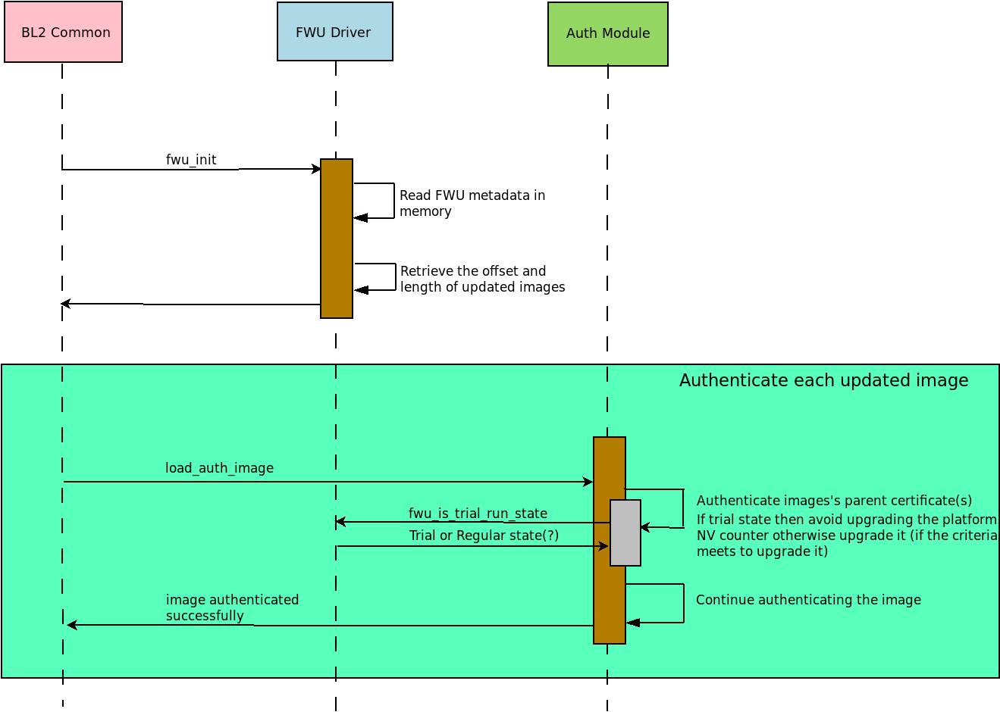

Firmware Update (FWU)
=====================

This document describes the design of the various Firmware Update (FWU)
mechanisms available in TF-A.

1. PSA Firmware Update (PSA FWU)
2. TBBR Firmware Update (TBBR FWU)

PSA Firmware Update implements the specification of the same name (Arm document
IHI 0093), which defines a standard firmware interface for installing firmware
updates.
On the other hand, TBBR Firmware Update only covers firmware recovery. Arguably,
its name is somewhat misleading but the TBBR specification and terminology
predates PSA FWU. Both mechanisms are complementary in the sense that PSA FWU
assumes that the device has a backup or recovery capability in the event of a
failed update, which can be fulfilled with TBBR FWU implementation.

.. _PSA Firmware Update:

PSA Firmware Update (PSA FWU)
-----------------------------

Introduction
~~~~~~~~~~~~
The `PSA FW update specification`_ defines the concepts of ``Firmware Update
Client`` and ``Firmware Update Agent``.
The new firmware images are provided by the ``Client`` to the ``Update Agent``
to flash them in non-volatile storage.

A common system design will place the ``Update Agent`` in the Secure-world
while the ``Client`` executes in the Normal-world.
The `PSA FW update specification`_ provides ABIs meant for a Normal-world
entity aka ``Client`` to transmit the firmware images to the ``Update Agent``.

Scope
~~~~~
The design of the ``Client`` and ``Update Agent`` is out of scope of this
document.
This document mainly covers ``Platform Boot`` details i.e. the role of
the second stage Bootloader after FWU has been done by ``Client`` and
``Update Agent``.

Overview
~~~~~~~~

There are active and update banks in the non-volatile storage identified
by the ``active_index`` and the ``update_index`` respectively.
An active bank stores running firmware, whereas an update bank contains
firmware updates.

Once Firmwares are updated in the update bank of the non-volatile
storage, then ``Update Agent`` marks the update bank as the active bank,
and write updated FWU metadata in non-volatile storage.
On subsequent reboot, the second stage Bootloader (BL2) performs the
following actions:

-  Read FWU metadata in memory
-  Retrieve the image specification (offset and length) of updated images
   present in non-volatile storage with the help of FWU metadata
-  Set these image specification in the corresponding I/O policies of the
   updated images using the FWU platform functions
   ``plat_fwu_set_images_source()`` and ``plat_fwu_set_metadata_image_source()``,
   please refer :ref:`Porting Guide`
-  Use these I/O policies to read the images from this address into the memory

By default, the platform uses the active bank of non-volatile storage to boot
the images in ``trial state``. If images pass through the authentication check
and also if the system successfully booted the Normal-world image then
``Update Agent`` marks this update as accepted after further sanitisation
checking at Normal-world.

The second stage Bootloader (BL2) avoids upgrading the platform NV-counter until
it's been confirmed that given update is accepted.

The following sequence diagram shows platform-boot flow:

If the platform fails to boot from active bank due to any reasons such
as authentication failure or non-fuctionality of Normal-world software then the
watchdog will reset to give a chance to the platform to fix the issue. This
boot failure & reset sequence might be repeated up to ``trial state`` times.
After that, the platform can decide to boot from the ``previous_active_index``
bank.

If the images still does not boot successfully from the ``previous_active_index``
bank (e.g. due to ageing effect of non-volatile storage) then the platform can
choose firmware recovery mechanism :ref:`TBBR Firmware Update` to bring system
back to life.

.. _TBBR Firmware Update:

TBBR Firmware Update (TBBR FWU)
-------------------------------

Introduction
~~~~~~~~~~~~

This technique enables authenticated firmware to update firmware images from
external interfaces such as USB, UART, SD-eMMC, NAND, NOR or Ethernet to SoC
Non-Volatile memories such as NAND Flash, LPDDR2-NVM or any memory determined
by the platform.
This feature functions even when the current firmware in the system is corrupt
or missing; it therefore may be used as a recovery mode. It may also be
complemented by other, higher level firmware update software.

FWU implements a specific part of the Trusted Board Boot Requirements (TBBR)
specification, Arm DEN0006C-1. It should be used in conjunction with the
:ref:`Trusted Board Boot` design document, which describes the image
authentication parts of the Trusted Firmware-A (TF-A) TBBR implementation.

It can be used as a last resort when all firmware updates that are carried out
as part of the :ref:`PSA Firmware Update` procedure have failed to function.

Scope
~~~~~

This document describes the secure world FWU design. It is beyond its scope to
describe how normal world FWU images should operate. To implement normal world
FWU images, please refer to the "Non-Trusted Firmware Updater" requirements in
the TBBR.

Overview
~~~~~~~~

The FWU boot flow is primarily mediated by BL1. Since BL1 executes in ROM, and
it is usually desirable to minimize the amount of ROM code, the design allows
some parts of FWU to be implemented in other secure and normal world images.
Platform code may choose which parts are implemented in which images but the
general expectation is:

-  BL1 handles:

   -  Detection and initiation of the FWU boot flow.
   -  Copying images from non-secure to secure memory
   -  FWU image authentication
   -  Context switching between the normal and secure world during the FWU
      process.

-  Other secure world FWU images handle platform initialization required by
   the FWU process.
-  Normal world FWU images handle loading of firmware images from external
   interfaces to non-secure memory.

The primary requirements of the FWU feature are:

#. Export a BL1 SMC interface to interoperate with other FWU images executing
   at other Exception Levels.
#. Export a platform interface to provide FWU common code with the information
   it needs, and to enable platform specific FWU functionality. See the
   :ref:`Porting Guide` for details of this interface.

TF-A uses abbreviated image terminology for FWU images like for other TF-A
images. See the :ref:`Image Terminology` document for an explanation of these
terms.

The following diagram shows the FWU boot flow for Arm development platforms.
Arm CSS platforms like Juno have a System Control Processor (SCP), and these
use all defined FWU images. Other platforms may use a subset of these.

|Flow Diagram|

Image Identification
~~~~~~~~~~~~~~~~~~~~

Each FWU image and certificate is identified by a unique ID, defined by the
platform, which BL1 uses to fetch an image descriptor (``image_desc_t``) via a
call to ``bl1_plat_get_image_desc()``. The same ID is also used to prepare the
Chain of Trust (Refer to the :ref:`Authentication Framework & Chain of Trust`
document for more information).

The image descriptor includes the following information:

-  Executable or non-executable image. This indicates whether the normal world
   is permitted to request execution of a secure world FWU image (after
   authentication). Secure world certificates and non-AP images are examples
   of non-executable images.
-  Secure or non-secure image. This indicates whether the image is
   authenticated/executed in secure or non-secure memory.
-  Image base address and size.
-  Image entry point configuration (an ``entry_point_info_t``).
-  FWU image state.

BL1 uses the FWU image descriptors to:

-  Validate the arguments of FWU SMCs
-  Manage the state of the FWU process
-  Initialize the execution state of the next FWU image.

FWU State Machine
~~~~~~~~~~~~~~~~~

BL1 maintains state for each FWU image during FWU execution. FWU images at lower
Exception Levels raise SMCs to invoke FWU functionality in BL1, which causes
BL1 to update its FWU image state. The BL1 image states and valid state
transitions are shown in the diagram below. Note that secure images have a more
complex state machine than non-secure images.

|FWU state machine|

The following is a brief description of the supported states:

-  RESET: This is the initial state of every image at the start of FWU.
   Authentication failure also leads to this state. A secure
   image may yield to this state if it has completed execution.
   It can also be reached by using ``FWU_SMC_IMAGE_RESET``.

-  COPYING: This is the state of a secure image while BL1 is copying it
   in blocks from non-secure to secure memory.

-  COPIED: This is the state of a secure image when BL1 has completed
   copying it to secure memory.

-  AUTHENTICATED: This is the state of an image when BL1 has successfully
   authenticated it.

-  EXECUTED: This is the state of a secure, executable image when BL1 has
   passed execution control to it.

-  INTERRUPTED: This is the state of a secure, executable image after it has
   requested BL1 to resume normal world execution.

BL1 SMC Interface
~~~~~~~~~~~~~~~~~

BL1_SMC_CALL_COUNT
^^^^^^^^^^^^^^^^^^

::

    Arguments:
        uint32_t function ID : 0x0

    Return:
        uint32_t

This SMC returns the number of SMCs supported by BL1.

BL1_SMC_UID
^^^^^^^^^^^

::

    Arguments:
        uint32_t function ID : 0x1

    Return:
        UUID : 32 bits in each of w0-w3 (or r0-r3 for AArch32 callers)

This SMC returns the 128-bit `Universally Unique Identifier`_ for the
BL1 SMC service.

BL1_SMC_VERSION
^^^^^^^^^^^^^^^

::

    Argument:
        uint32_t function ID : 0x3

    Return:
        uint32_t : Bits [31:16] Major Version
                   Bits [15:0] Minor Version

This SMC returns the current version of the BL1 SMC service.

BL1_SMC_RUN_IMAGE
^^^^^^^^^^^^^^^^^

::

    Arguments:
        uint32_t           function ID : 0x4
        entry_point_info_t *ep_info

    Return:
        void

    Pre-conditions:
        if (normal world caller) synchronous exception
        if (ep_info not EL3) synchronous exception

This SMC passes execution control to an EL3 image described by the provided
``entry_point_info_t`` structure. In the normal TF-A boot flow, BL2 invokes
this SMC for BL1 to pass execution control to BL31.

FWU_SMC_IMAGE_COPY
^^^^^^^^^^^^^^^^^^

::

    Arguments:
        uint32_t     function ID : 0x10
        unsigned int image_id
        uintptr_t    image_addr
        unsigned int block_size
        unsigned int image_size

    Return:
        int : 0 (Success)
            : -ENOMEM
            : -EPERM

    Pre-conditions:
        if (image_id is invalid) return -EPERM
        if (image_id is non-secure image) return -EPERM
        if (image_id state is not (RESET or COPYING)) return -EPERM
        if (secure world caller) return -EPERM
        if (image_addr + block_size overflows) return -ENOMEM
        if (image destination address + image_size overflows) return -ENOMEM
        if (source block is in secure memory) return -ENOMEM
        if (source block is not mapped into BL1) return -ENOMEM
        if (image_size > free secure memory) return -ENOMEM
        if (image overlaps another image) return -EPERM

This SMC copies the secure image indicated by ``image_id`` from non-secure memory
to secure memory for later authentication. The image may be copied in a single
block or multiple blocks. In either case, the total size of the image must be
provided in ``image_size`` when invoking this SMC for the first time for each
image; it is ignored in subsequent calls (if any) for the same image.

The ``image_addr`` and ``block_size`` specify the source memory block to copy from.
The destination address is provided by the platform code.

If ``block_size`` is greater than the amount of remaining bytes to copy for this
image then the former is truncated to the latter. The copy operation is then
considered as complete and the FWU state machine transitions to the "COPIED"
state. If there is still more to copy, the FWU state machine stays in or
transitions to the COPYING state (depending on the previous state).

When using multiple blocks, the source blocks do not necessarily need to be in
contiguous memory.

Once the SMC is handled, BL1 returns from exception to the normal world caller.

FWU_SMC_IMAGE_AUTH
^^^^^^^^^^^^^^^^^^

::

    Arguments:
        uint32_t     function ID : 0x11
        unsigned int image_id
        uintptr_t    image_addr
        unsigned int image_size

    Return:
        int : 0 (Success)
            : -ENOMEM
            : -EPERM
            : -EAUTH

    Pre-conditions:
        if (image_id is invalid) return -EPERM
        if (secure world caller)
            if (image_id state is not RESET) return -EPERM
            if (image_addr/image_size is not mapped into BL1) return -ENOMEM
        else // normal world caller
            if (image_id is secure image)
                if (image_id state is not COPIED) return -EPERM
            else // image_id is non-secure image
                if (image_id state is not RESET) return -EPERM
                if (image_addr/image_size is in secure memory) return -ENOMEM
                if (image_addr/image_size not mapped into BL1) return -ENOMEM

This SMC authenticates the image specified by ``image_id``. If the image is in the
RESET state, BL1 authenticates the image in place using the provided
``image_addr`` and ``image_size``. If the image is a secure image in the COPIED
state, BL1 authenticates the image from the secure memory that BL1 previously
copied the image into.

BL1 returns from exception to the caller. If authentication succeeds then BL1
sets the image state to AUTHENTICATED. If authentication fails then BL1 returns
the -EAUTH error and sets the image state back to RESET.

FWU_SMC_IMAGE_EXECUTE
^^^^^^^^^^^^^^^^^^^^^

::

    Arguments:
        uint32_t     function ID : 0x12
        unsigned int image_id

    Return:
        int : 0 (Success)
            : -EPERM

    Pre-conditions:
        if (image_id is invalid) return -EPERM
        if (secure world caller) return -EPERM
        if (image_id is non-secure image) return -EPERM
        if (image_id is non-executable image) return -EPERM
        if (image_id state is not AUTHENTICATED) return -EPERM

This SMC initiates execution of a previously authenticated image specified by
``image_id``, in the other security world to the caller. The current
implementation only supports normal world callers initiating execution of a
secure world image.

BL1 saves the normal world caller's context, sets the secure image state to
EXECUTED, and returns from exception to the secure image.

FWU_SMC_IMAGE_RESUME
^^^^^^^^^^^^^^^^^^^^

::

    Arguments:
        uint32_t   function ID : 0x13
        register_t image_param

    Return:
        register_t : image_param (Success)
                   : -EPERM

    Pre-conditions:
        if (normal world caller and no INTERRUPTED secure image) return -EPERM

This SMC resumes execution in the other security world while there is a secure
image in the EXECUTED/INTERRUPTED state.

For normal world callers, BL1 sets the previously interrupted secure image state
to EXECUTED. For secure world callers, BL1 sets the previously executing secure
image state to INTERRUPTED. In either case, BL1 saves the calling world's
context, restores the resuming world's context and returns from exception into
the resuming world. If the call is successful then the caller provided
``image_param`` is returned to the resumed world, otherwise an error code is
returned to the caller.

FWU_SMC_SEC_IMAGE_DONE
^^^^^^^^^^^^^^^^^^^^^^

::

    Arguments:
        uint32_t function ID : 0x14

    Return:
        int : 0 (Success)
            : -EPERM

    Pre-conditions:
        if (normal world caller) return -EPERM

This SMC indicates completion of a previously executing secure image.

BL1 sets the previously executing secure image state to the RESET state,
restores the normal world context and returns from exception into the normal
world.

FWU_SMC_UPDATE_DONE
^^^^^^^^^^^^^^^^^^^

::

    Arguments:
        uint32_t   function ID : 0x15
        register_t client_cookie

    Return:
        N/A

This SMC completes the firmware update process. BL1 calls the platform specific
function ``bl1_plat_fwu_done``, passing the optional argument ``client_cookie`` as
a ``void *``. The SMC does not return.

FWU_SMC_IMAGE_RESET
^^^^^^^^^^^^^^^^^^^

::

    Arguments:
        uint32_t     function ID : 0x16
        unsigned int image_id

    Return:
        int : 0 (Success)
            : -EPERM

    Pre-conditions:
        if (secure world caller) return -EPERM
        if (image in EXECUTED) return -EPERM

This SMC sets the state of an image to RESET and zeroes the memory used by it.

This is only allowed if the image is not being executed.

--------------

*Copyright (c) 2015-2022, Arm Limited and Contributors. All rights reserved.*

.. _Universally Unique Identifier: https://tools.ietf.org/rfc/rfc4122.txt
.. |Flow Diagram| image:: ../resources/diagrams/fwu_flow.png
.. |FWU state machine| image:: ../resources/diagrams/fwu_states.png
.. _PSA FW update specification: https://developer.arm.com/documentation/den0118/a/
