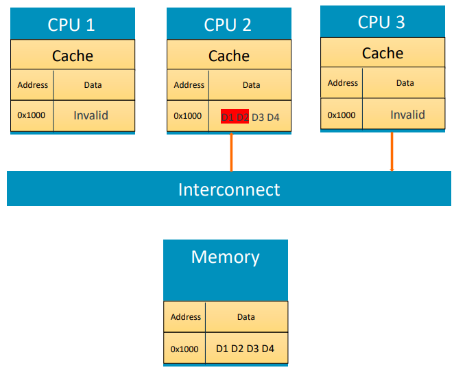

NUMA-Aware Per-CPU Framework
============================

.. contents::
   :local:
   :depth: 2

Introduction
------------

Modern system designs increasingly adopt multi-node architectures, where the
system is divided into multiple topological units such as chiplets, sockets, or
other isolated compute and memory units. Each node typically has its own local
memory, and CPUs within a node can access this memory with lower latency than
CPUs on remote nodes. In TF-A's current implementation, per-CPU data (for
example, PSCI or SPM context) is stored in a global array or contiguous region,
usually located in the memory of a single node. This approach introduces two key
issues in multi-node systems:

- **Storage Constraints:** As systems scale to include more CPUs and nodes, this
  centralized allocation becomes a bottleneck. The memory capacity of a single
  node may be insufficient to hold per-CPU data for all CPUs. This constraint
  limits scalability in systems where each node has limited local memory.

  .. figure:: ../resources/diagrams/per-cpu-numa-disabled.png
     :alt: Diagram showing the BL31 binary section layout in TF-A within local
           memory. From bottom to top: \`.text\`, \`.rodata\`, \`.data\`,
           \`.stack\`, \`.bss\`, and \`xlat\` sections. The \`.text\`,
           \`.rodata\`, and \`.data\` segments are \`PROGBITS\` sections, while
           \`.stack\`, \`.bss\`, and \`xlat\` form the \`NOBITS\` sections at
           the top. The memory extends from the local memory start address at
           the bottom to the end address at the top.

  *Figure: Typical BL31/BL32 binary storage in local memory*

- **Non-Uniform Memory Access (NUMA) Latency:** In multi-node systems, memory
  access across nodes incurs additional latency because of interconnect
  traversal. When per-CPU data is centralized on a single node, CPUs on remote
  nodes must access that data via the interconnect, leading to increased latency
  for frequent operations such as context switching, exception handling, and
  crash reporting. This violates NUMA design principles, where data locality is
  critical to achieving performance and scalability.

To address these challenges, TF-A provides the NUMA-Aware Per-CPU Framework. The
framework optimizes the allocation and access of per-CPU objects by letting
platforms place them in the nodes with the lowest access latency.

Design
------

The framework provides standardized interfaces and mechanisms for
**allocating**, **defining**, and **accessing** per-CPU data in a NUMA-aware
environment. This ensures portability and maintainability across different
platforms while optimizing for performance in multi-node systems.

``.per_cpu`` Section
~~~~~~~~~~~~~~~~~~~~

The framework dedicates a zero-initialized, cache-aligned ``.per_cpu`` section
to **allocate** per-CPU global variables and ensure that these objects reside in
the local memory of each NUMA node. The figure below illustrates how per-CPU
objects are allocated in the local memory of their respective nodes.

.. figure:: ../resources/diagrams/per-cpu-numa-enabled.png
   :align: center
   :alt: Diagram comparing the TF-A BL31 memory layout with NUMA disabled versus
         NUMA enabled. When NUMA is disabled, Node 0 contains a local memory
         layout with the \`.text\`, \`.rodata\`, \`.data\`, \`.stack\`,
         \`.bss\`, and \`xlat\` sections stacked vertically. When NUMA is
         enabled, Node 0 includes an additional \`.per_cpu\` section between
         \`.bss\` and \`xlat\` to represent per-CPU data allocation, while
         remote nodes (Node 1 through Node N) each contain their own local
         per-CPU memory regions.

*Figure: BL31/BL32 binary storage in local memory of per node when per-cpu NUMA
framework is enabled*

At link time, TF-A linker scripts carve out this section and publish section
bounds and per-object stride via internal symbols so that they can be replicated
and initialized across the non-primary nodes.

This linker section also addresses a common performance issue in modern
multi-CPU systems known as **false sharing**. This issue arises when multiple
CPUs access different addresses that lie on the same cache line. Although the
accessed variables may be logically independent, their proximity in memory can
result in repeated cache invalidations and reloads. Cache-coherency mechanisms
operate at the granularity of cache lines (typically 64 bytes). If two CPUs
write to different addresses within the same cache line, the line bounces
between cores and incurs unnecessary overhead.

         own cache, connected through a shared interconnect to main memory. At
         address 0x1000, CPU 2's cache holds data values D1, D2, D3, and D4
         representing per-CPU data objects, while CPU 1 and CPU 3 have that
         cache line marked as invalid. CPU 3 is attempting to read from its own
         per-CPU data object, triggering a coherence transaction over the
         interconnect.

*Figure: Two processors modifying different variables placed too closely in
memory, leading to false sharing*

To eliminate false sharing, this framework employs **linker-script-based
alignment**, which:

- Places all per-CPU variables into a **dedicated, aligned** section
  (``.per_cpu``).
- Aligns that section using the cache granularity size
  (``CACHE_WRITEBACK_GRANULE``).

Definer Interfaces
~~~~~~~~~~~~~~~~~~

The NUMA-Aware Per-CPU Framework provides a set of macros to define and declare
per-CPU objects efficiently in multi-node systems.

- ``PER_CPU_DECLARE(TYPE, NAME)``

  Declares an external per-CPU object so that other translation units can refer
  to it without allocating storage.

- ``PER_CPU_DEFINE(TYPE, NAME)``

  Defines a per-CPU object and assigns it to ``PER_CPU_SECTION_NAME`` so the
  linker emits it into the ``.per_cpu`` section that the framework manages.

Accessor Interfaces
~~~~~~~~~~~~~~~~~~~

The NUMA-Aware Per-CPU Framework also provides macros to access per-CPU objects
efficiently in multi-node systems.

- ``PER_CPU_BY_INDEX(NAME, CPU)``

  Returns a pointer to the per-CPU object ``NAME`` for the specified CPU by
  combining the per-node base with the object's offset within ``.per_cpu``.

- ``PER_CPU_CUR(NAME)``

  Returns a pointer to the per-CPU object ``NAME`` for the current CPU.

For use in assembly routines, a corresponding macro version is provided:

In assembly routines, the ``per_cpu_cur`` helper macro performs the same
calculation. It accepts the label of the per-CPU object and optional register
arguments (destination and clobber) to materialize the per-CPU pointer without
duplicating addressing logic in assembly files.

Platform Responsibilities (NUMA-only)
-------------------------------------

When NUMA is enabled, the platform is required to comply with some additional
requirements in order for the runtime to correctly set up per-CPU sections on
remote nodes:

1. Enable the Framework
~~~~~~~~~~~~~~~~~~~~~~~

Set ``PLATFORM_NODE_COUNT`` to a value greater than 1 (>=2) in the platform
makefile to enable NUMA-aware per-CPU support:

.. code-block:: make

   PLATFORM_NODE_COUNT := 2  # >= 2 enables NUMA-aware per-CPU support

Platforms that are not multi-node do not need to modify this value because the
default ``PLATFORM_NODE_COUNT`` is 1. The NUMA framework is not supported in
32-bit images such as BL32 SP_MIN.

2. Provide Per-CPU Section Base Address Data
~~~~~~~~~~~~~~~~~~~~~~~~~~~~~~~~~~~~~~~~~~~~

Ensure that the platform can supply the base address of the ``.per_cpu`` section
for each node and CPU when implementing ``plat_per_cpu_node_base`` and
``plat_per_cpu_base``. The framework does not mandate how this information is
obtained, only that each hook returns a valid base address. Platforms may:

- derive the base addresses from platform descriptors or firmware configuration
  data;
- read them from device tree nodes or other runtime discovery mechanisms; or
- encode them in platform-specific tables compiled into the image.

If a node described in platform data is not populated at runtime, the hooks may
return ``UINT64_MAX`` to signal that no per-CPU section exists for that node.

The platform is free to maintain this mapping however it prefers, and may do so
at either compile-time or through employing runtime discovery. The only
requirement is that the ``plat_per_cpu_node_base`` and ``plat_per_cpu_base``
hooks translate a node or CPU identifier into the base address of the
corresponding ``.per_cpu`` section.

Platform-defined regions that hold remote per-CPU sections must have
page-aligned bases and sizes for page table mapping through the xlat library,
which requires page alignment for mapped entries. The per-CPU section itself
requires only cache writeback granule alignment for its base.

3. Implement Required Platform Hooks
~~~~~~~~~~~~~~~~~~~~~~~~~~~~~~~~~~~~

Provide the following platform-specific functions:

- ``uintptr_t plat_per_cpu_base(uint64_t cpu)``

  Returns the base address of the ``.per_cpu`` section for the specified CPU.

- ``uintptr_t plat_per_cpu_node_base(uint64_t node)``

  Returns the base address of the ``.per_cpu`` section for the specified node.

- ``uintptr_t plat_per_cpu_dcache_clean(void)``

  Cleans the entire per-CPU section from the data cache. This ensures that any
  modifications made to per-CPU data are written back to memory, making them
  visible to other CPUs or system components that may access this memory. This
  step is especially important on platforms that do not support hardware-managed
  coherency early in the boot process.

References
----------

- Original presentation:
  https://www.trustedfirmware.org/docs/NUMA-aware-PER-CPU-framework-18Jul24.pdf

--------------

*Copyright (c) 2025, Arm Limited and Contributors. All rights reserved.*
