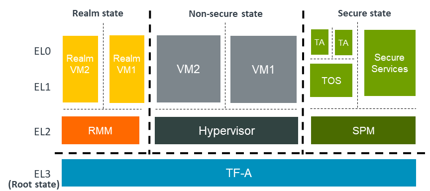

Realm Management Extension (RME)
====================================

FEAT_RME (or RME for short) is an Armv9-A extension and is one component of the
`Arm Confidential Compute Architecture (Arm CCA)`_. TF-A supports RME starting
from version 2.6. This chapter discusses the changes to TF-A to support RME and
provides instructions on how to build and run TF-A with RME.

RME support in TF-A
---------------------

The following diagram shows an Arm CCA software architecture with TF-A as the
EL3 firmware. In the Arm CCA architecture there are two additional security
states and address spaces: ``Root`` and ``Realm``. TF-A firmware runs in the
Root world. In the realm world, a Realm Management Monitor firmware (RMM)
manages the execution of Realm VMs and their interaction with the hypervisor.

RME is the hardware extension to support Arm CCA. To support RME, various
changes have been introduced to TF-A. We discuss those changes below.

Changes to translation tables library
***************************************
RME adds Root and Realm Physical address spaces. To support this, two new
memory type macros, ``MT_ROOT`` and ``MT_REALM``, have been added to the
:ref:`Translation (XLAT) Tables Library`. These macros are used to configure
memory regions as Root or Realm respectively.

.. note::

 Only version 2 of the translation tables library supports the new memory
 types.

Changes to context management
*******************************
A new CPU context for the Realm world has been added. The existing
:ref:`CPU context management API<PSCI Library Integration guide for Armv8-A
AArch32 systems>` can be used to manage Realm context.

Boot flow changes
*******************
In a typical TF-A boot flow, BL2 runs at Secure-EL1. However when RME is
enabled, TF-A runs in the Root world at EL3. Therefore, the boot flow is
modified to run BL2 at EL3 when RME is enabled. In addition to this, a
Realm-world firmware (RMM) is loaded by BL2 in the Realm physical address
space.

The boot flow when RME is enabled looks like the following:

1. BL1 loads and executes BL2 at EL3
2. BL2 loads images including RMM
3. BL2 transfers control to BL31
4. BL31 initializes SPM (if SPM is enabled)
5. BL31 initializes RMM
6. BL31 transfers control to Normal-world software

Granule Protection Tables (GPT) library
*****************************************
Isolation between the four physical address spaces is enforced by a process
called Granule Protection Check (GPC) performed by the MMU downstream any
address translation. GPC makes use of Granule Protection Table (GPT) in the
Root world that describes the physical address space assignment of every
page (granule). A GPT library that provides APIs to initialize GPTs and to
transition granules between different physical address spaces has been added.
More information about the GPT library can be found in the
:ref:`Granule Protection Tables Library` chapter.

RMM Dispatcher (RMMD)
************************
RMMD is a new standard runtime service that handles the switch to the Realm
world. It initializes the RMM and handles Realm Management Interface (RMI)
SMC calls from Non-secure and Realm worlds.

There is a contract between RMM and RMMD that defines the arguments that the
former needs to take in order to initialize and also the possible return values.
This contract is defined in the RMM Boot Interface, which can be found at
:ref:`rmm_el3_boot_interface`.

There is also a specification of the runtime services provided by TF-A
to RMM. This can be found at :ref:`runtime_services_and_interface`.

Test Realm Payload (TRP)
*************************
TRP is a small test payload that runs at R-EL2 and implements a subset of
the Realm Management Interface (RMI) commands to primarily test EL3 firmware
and the interface between R-EL2 and EL3. When building TF-A with RME enabled,
if a path to an RMM image is not provided, TF-A builds the TRP by default
and uses it as RMM image.

Building and running TF-A with RME
------------------------------------

This section describes how you can build and run TF-A with RME enabled.
We assume you have all the :ref:`Prerequisites` to build TF-A.

To enable RME, you need to set the ENABLE_RME build flag when building
TF-A. Currently, this feature is only supported for the FVP platform.

The following instructions show you how to build and run TF-A with RME
for two scenarios: TF-A with TF-A Tests, and four-world execution with
Hafnium and TF-A Tests. The instructions assume you have already obtained
TF-A. You can use the following command to clone TF-A.

.. code:: shell

 git clone https://git.trustedfirmware.org/TF-A/trusted-firmware-a.git

To run the tests, you need an FVP model. Please use the :ref:`latest version
<Arm Fixed Virtual Platforms (FVP)>` of *FVP_Base_RevC-2xAEMvA* model.

.. note::

 ENABLE_RME build option is currently experimental.

Building TF-A with TF-A Tests
********************************************
Use the following instructions to build TF-A with `TF-A Tests`_ as the
non-secure payload (BL33).

**1. Obtain and build TF-A Tests**

.. code:: shell

 git clone https://git.trustedfirmware.org/TF-A/tf-a-tests.git
 cd tf-a-tests
 make CROSS_COMPILE=aarch64-none-elf- PLAT=fvp DEBUG=1

This produces a TF-A Tests binary (*tftf.bin*) in the *build/fvp/debug* directory.

**2. Build TF-A**

.. code:: shell

 cd trusted-firmware-a
 make CROSS_COMPILE=aarch64-none-elf- \
 PLAT=fvp \
 ENABLE_RME=1 \
 FVP_HW_CONFIG_DTS=fdts/fvp-base-gicv3-psci-1t.dts \
 DEBUG=1 \
 BL33=<path/to/tftf.bin> \
 all fip

This produces *bl1.bin* and *fip.bin* binaries in the *build/fvp/debug* directory.
The above command also builds TRP. The TRP binary is packaged in *fip.bin*.

Four-world execution with Hafnium and TF-A Tests
****************************************************
Four-world execution involves software components at each security state: root,
secure, realm and non-secure. This section describes how to build TF-A
with four-world support. We use TF-A as the root firmware, `Hafnium`_ as the
secure component, TRP as the realm-world firmware and TF-A Tests as the
non-secure payload.

Before building TF-A, you first need to build the other software components.
You can find instructions on how to get and build TF-A Tests above.

**1. Obtain and build Hafnium**

.. code:: shell

 git clone --recurse-submodules https://git.trustedfirmware.org/hafnium/hafnium.git
 cd hafnium
 #  Use the default prebuilt LLVM/clang toolchain
 PATH=$PWD/prebuilts/linux-x64/clang/bin:$PWD/prebuilts/linux-x64/dtc:$PATH
 make PROJECT=reference

The Hafnium binary should be located at
*out/reference/secure_aem_v8a_fvp_clang/hafnium.bin*

**2. Build TF-A**

Build TF-A with RME as well as SPM enabled.

.. code:: shell

 make CROSS_COMPILE=aarch64-none-elf- \
 PLAT=fvp \
 ENABLE_RME=1 \
 FVP_HW_CONFIG_DTS=fdts/fvp-base-gicv3-psci-1t.dts \
 SPD=spmd \
 SPMD_SPM_AT_SEL2=1 \
 BRANCH_PROTECTION=1 \
 CTX_INCLUDE_PAUTH_REGS=1 \
 DEBUG=1 \
 SP_LAYOUT_FILE=<path/to/tf-a-tests>/build/fvp/debug/sp_layout.json> \
 BL32=<path/to/hafnium.bin> \
 BL33=<path/to/tftf.bin> \
 all fip

Running the tests
*********************
Use the following command to run the tests on FVP. TF-A Tests should boot
and run the default tests including RME tests.

.. code:: shell

 FVP_Base_RevC-2xAEMvA \
 -C bp.flashloader0.fname=<path/to/fip.bin> \
 -C bp.secureflashloader.fname=<path/to/bl1.bin> \
 -C bp.refcounter.non_arch_start_at_default=1 \
 -C bp.refcounter.use_real_time=0 \
 -C bp.ve_sysregs.exit_on_shutdown=1 \
 -C cache_state_modelled=1 \
 -C cluster0.NUM_CORES=4 \
 -C cluster0.PA_SIZE=48 \
 -C cluster0.ecv_support_level=2 \
 -C cluster0.gicv3.cpuintf-mmap-access-level=2 \
 -C cluster0.gicv3.without-DS-support=1 \
 -C cluster0.gicv4.mask-virtual-interrupt=1 \
 -C cluster0.has_arm_v8-6=1 \
 -C cluster0.has_branch_target_exception=1 \
 -C cluster0.has_rme=1 \
 -C cluster0.has_rndr=1 \
 -C cluster0.has_amu=1 \
 -C cluster0.has_v8_7_pmu_extension=2 \
 -C cluster0.max_32bit_el=-1 \
 -C cluster0.restriction_on_speculative_execution=2 \
 -C cluster0.restriction_on_speculative_execution_aarch32=2 \
 -C cluster1.NUM_CORES=4 \
 -C cluster1.PA_SIZE=48 \
 -C cluster1.ecv_support_level=2 \
 -C cluster1.gicv3.cpuintf-mmap-access-level=2 \
 -C cluster1.gicv3.without-DS-support=1 \
 -C cluster1.gicv4.mask-virtual-interrupt=1 \
 -C cluster1.has_arm_v8-6=1 \
 -C cluster1.has_branch_target_exception=1 \
 -C cluster1.has_rme=1 \
 -C cluster1.has_rndr=1 \
 -C cluster1.has_amu=1 \
 -C cluster1.has_v8_7_pmu_extension=2 \
 -C cluster1.max_32bit_el=-1 \
 -C cluster1.restriction_on_speculative_execution=2 \
 -C cluster1.restriction_on_speculative_execution_aarch32=2 \
 -C pci.pci_smmuv3.mmu.SMMU_AIDR=2 \
 -C pci.pci_smmuv3.mmu.SMMU_IDR0=0x0046123B \
 -C pci.pci_smmuv3.mmu.SMMU_IDR1=0x00600002 \
 -C pci.pci_smmuv3.mmu.SMMU_IDR3=0x1714 \
 -C pci.pci_smmuv3.mmu.SMMU_IDR5=0xFFFF0475 \
 -C pci.pci_smmuv3.mmu.SMMU_S_IDR1=0xA0000002 \
 -C pci.pci_smmuv3.mmu.SMMU_S_IDR2=0 \
 -C pci.pci_smmuv3.mmu.SMMU_S_IDR3=0 \
 -C bp.pl011_uart0.out_file=uart0.log \
 -C bp.pl011_uart1.out_file=uart1.log \
 -C bp.pl011_uart2.out_file=uart2.log \
 -C pctl.startup=0.0.0.0 \
 -Q 1000 \
 "$@"

The bottom of the output from *uart0* should look something like the following.

.. code-block:: shell

 ...

 > Test suite 'FF-A Interrupt'
                                                                Passed
 > Test suite 'SMMUv3 tests'
                                                                Passed
 > Test suite 'PMU Leakage'
                                                                Passed
 > Test suite 'DebugFS'
                                                                Passed
 > Test suite 'Realm payload tests'
                                                                Passed
 > Test suite 'Invalid memory access'
                                                                Passed
 ...

.. _Arm Confidential Compute Architecture (Arm CCA): https://www.arm.com/why-arm/architecture/security-features/arm-confidential-compute-architecture
.. _Arm Architecture Models website: https://developer.arm.com/tools-and-software/simulation-models/fixed-virtual-platforms/arm-ecosystem-models
.. _TF-A Tests: https://trustedfirmware-a-tests.readthedocs.io/en/latest
.. _Hafnium: https://www.trustedfirmware.org/projects/hafnium
