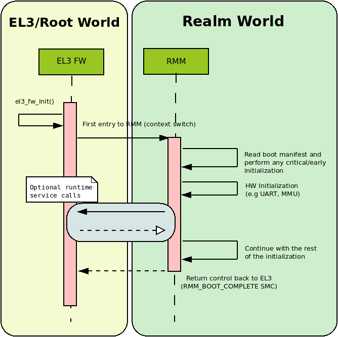
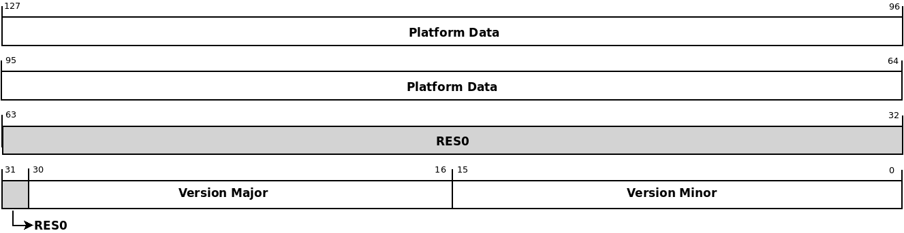

RMM-EL3 Communication interface
*******************************

This document defines the communication interface between RMM and EL3.
There are two parts in this interface: the boot interface and the runtime
interface.

The Boot Interface defines the ABI between EL3 and RMM when the CPU enters
R-EL2 for the first time after boot. The cold boot interface defines the ABI
for the cold boot path and the warm boot interface defines the same for the
warm path.

The RMM-EL3 runtime interface defines the ABI for EL3 services which can be
invoked by RMM as well as the register save-restore convention when handling an
SMC call from NS.

The below sections discuss these interfaces more in detail.

.. _rmm_el3_ifc_versioning:

RMM-EL3 Interface versioning
____________________________

The RMM Boot and Runtime Interface uses a version number to check
compatibility with the register arguments passed as part of Boot Interface and
RMM-EL3 runtime interface.

The Boot Manifest, discussed later in section :ref:`rmm_el3_boot_manifest`,
uses a separate version number but with the same scheme.

The version number is a 32-bit type with the following fields:

.. csv-table::
   :header: "Bits", "Value"

   [0:15],``VERSION_MINOR``
   [16:30],``VERSION_MAJOR``
   [31],RES0

The version numbers are sequentially increased and the rules for updating them
are explained below:

  - ``VERSION_MAJOR``: This value is increased when changes break
    compatibility with previous versions. If the changes
    on the ABI are compatible with the previous one, ``VERSION_MAJOR``
    remains unchanged.

  - ``VERSION_MINOR``: This value is increased on any change that is backwards
    compatible with the previous version. When ``VERSION_MAJOR`` is increased,
    ``VERSION_MINOR`` must be set to 0.

  - ``RES0``: Bit 31 of the version number is reserved 0 as to maintain
    consistency with the versioning schemes used in other parts of RMM.

This document specifies the 0.1 version of Boot Interface ABI and RMM-EL3
services specification and the 0.1 version of the Boot Manifest.

.. _rmm_el3_boot_interface:

RMM Boot Interface
__________________

This section deals with the Boot Interface part of the specification.

One of the goals of the Boot Interface is to allow EL3 firmware to pass
down into RMM certain platform specific information dynamically. This allows
RMM to be less platform dependent and be more generic across platform
variations. It also allows RMM to be decoupled from the other boot loader
images in the boot sequence and remain agnostic of any particular format used
for configuration files.

The Boot Interface ABI defines a set of register conventions and
also a memory based manifest file to pass information from EL3 to RMM. The
boot manifest and the associated platform data in it can be dynamically created
by EL3 and there is no restriction on how the data can be obtained (e.g by DTB,
hoblist or other).

The register convention and the manifest are versioned separately to manage
future enhancements and compatibility.

RMM completes the boot by issuing the ``RMM_BOOT_COMPLETE`` SMC (0xC40001CF)
back to EL3. After the RMM has finished the boot process, it can only be
entered from EL3 as part of RMI handling.

If RMM returns an error during boot (in any CPU), then RMM must not be entered
from any CPU.

.. _rmm_cold_boot_interface:

Cold Boot Interface
~~~~~~~~~~~~~~~~~~~

During cold boot RMM expects the following register values:

.. csv-table::
   :header: "Register", "Value"
   :widths: 1, 5

   x0,Linear index of this PE. This index starts from 0 and must be less than the maximum number of CPUs to be supported at runtime (see x2).
   x1,Version for this Boot Interface as defined in :ref:`rmm_el3_ifc_versioning`.
   x2,Maximum number of CPUs to be supported at runtime. RMM should ensure that it can support this maximum number.
   x3,Base address for the shared buffer used for communication between EL3 firmware and RMM. This buffer must be of 4KB size (1 page). The boot manifest must be present at the base of this shared buffer during cold boot.

During cold boot, EL3 firmware needs to allocate a 4K page that will be
passed to RMM in x3. This memory will be used as shared buffer for communication
between EL3 and RMM. It must be assigned to Realm world and must be mapped with
Normal memory attributes (IWB-OWB-ISH) at EL3. At boot, this memory will be
used to populate the Boot Manifest. Since the Boot Manifest can be accessed by
RMM prior to enabling its MMU, EL3 must ensure that proper cache maintenance
operations are performed after the Boot Manifest is populated.

EL3 should also ensure that this shared buffer is always available for use by RMM
during the lifetime of the system and that it can be used for runtime
communication between RMM and EL3. For example, when RMM invokes attestation
service commands in EL3, this buffer can be used to exchange data between RMM
and EL3. It is also allowed for RMM to invoke runtime services provided by EL3
utilizing this buffer during the boot phase, prior to return back to EL3 via
RMM_BOOT_COMPLETE SMC.

RMM should map this memory page into its Stage 1 page-tables using Normal
memory attributes.

During runtime, it is the RMM which initiates any communication with EL3. If that
communication requires the use of the shared area, it is expected that RMM needs
to do the necessary concurrency protection to prevent the use of the same buffer
by other PEs.

The following sequence diagram shows how a generic EL3 Firmware would boot RMM.

Warm Boot Interface
~~~~~~~~~~~~~~~~~~~

At warm boot, RMM is already initialized and only some per-CPU initialization
is still pending. The only argument that is required by RMM at this stage is
the CPU Id, which will be passed through register x0 whilst x1 to x3 are RES0.
This is summarized in the following table:

.. csv-table::
   :header: "Register", "Value"
   :widths: 1, 5

   x0,Linear index of this PE. This index starts from 0 and must be less than the maximum number of CPUs to be supported at runtime (see x2).
   x1 - x3,RES0

Boot error handling and return values
~~~~~~~~~~~~~~~~~~~~~~~~~~~~~~~~~~~~~

After boot up and initialization, RMM returns control back to EL3 through a
``RMM_BOOT_COMPLETE`` SMC call. The only argument of this SMC call will
be returned in x1 and it will encode a signed integer with the error reason
as per the following table:

.. csv-table::
   :header: "Error code", "Description", "ID"
   :widths: 2 4 1

   ``E_RMM_BOOT_SUCCESS``,Boot successful,0
   ``E_RMM_BOOT_ERR_UNKNOWN``,Unknown error,-1
   ``E_RMM_BOOT_VERSION_NOT_VALID``,Boot Interface version reported by EL3 is not supported by RMM,-2
   ``E_RMM_BOOT_CPUS_OUT_OF_RAGE``,Number of CPUs reported by EL3 larger than maximum supported by RMM,-3
   ``E_RMM_BOOT_CPU_ID_OUT_OF_RAGE``,Current CPU Id is higher or equal than the number of CPUs supported by RMM,-4
   ``E_RMM_BOOT_INVALID_SHARED_BUFFER``,Invalid pointer to shared memory area,-5
   ``E_RMM_BOOT_MANIFEST_VERSION_NOT_SUPPORTED``,Version reported by the boot manifest not supported by RMM,-6
   ``E_RMM_BOOT_MANIFEST_DATA_ERROR``,Error parsing core boot manifest,-7

For any error detected in RMM during cold or warm boot, RMM will return back to
EL3 using ``RMM_BOOT_COMPLETE`` SMC with an appropriate error code. It is
expected that EL3 will take necessary action to disable Realm world for further
entry from NS Host on receiving an error. This will be done across all the PEs
in the system so as to present a symmetric view to the NS Host. Any further
warm boot by any PE should not enter RMM using the warm boot interface.

.. _rmm_el3_boot_manifest:

Boot Manifest
~~~~~~~~~~~~~

During cold boot, EL3 Firmware passes a memory boot manifest to RMM containing
platform information.

This boot manifest is versioned independently of the boot interface, to help
evolve the boot manifest independent of the rest of Boot Manifest.
The current version for the boot manifest is ``v0.1`` and the rules explained
in :ref:`rmm_el3_ifc_versioning` apply on this version as well.

The boot manifest is divided into two different components:

   - Core Manifest: This is the generic parameters passed to RMM by EL3 common to all platforms.
   - Platform data: This is defined by the platform owner and contains information specific to that platform.

For the current version of the manifest, the core manifest contains a pointer
to the platform data. EL3 must ensure that the whole boot manifest,
including the platform data, if available, fits inside the RMM EL3 shared
buffer.

For the type specification of the RMM Boot Manifest v0.1, refer to
:ref:`rmm_el3_manifest_struct`

.. _runtime_services_and_interface:

RMM-EL3 Runtime Interface
__________________________

This section defines the RMM-EL3 runtime interface which specifies the ABI for
EL3 services expected by RMM at runtime as well as the register save and
restore convention between EL3 and RMM as part of RMI call handling. It is
important to note that RMM is allowed to invoke EL3-RMM runtime interface
services during the boot phase as well. The EL3 runtime service handling must
not result in a world switch to another world unless specified. Both the RMM
and EL3 are allowed to make suitable optimizations based on this assumption.

If the interface requires the use of memory, then the memory references should
be within the shared buffer communicated as part of the boot interface. See
:ref:`rmm_cold_boot_interface` for properties of this shared buffer which both
EL3 and RMM must adhere to.

RMM-EL3 runtime service return codes
~~~~~~~~~~~~~~~~~~~~~~~~~~~~~~~~~~~~

The return codes from EL3 to RMM is a 32 bit signed integer which encapsulates
error condition as described in the following table:

.. csv-table::
   :header: "Error code", "Description", "ID"
   :widths: 2 4 1

   ``E_RMM_OK``,No errors detected,0
   ``E_RMM_UNK``,Unknown/Generic error,-1
   ``E_RMM_BAD_ADDR``,The value of an address used as argument was invalid,-2
   ``E_RMM_BAD_PAS``,Incorrect PAS,-3
   ``E_RMM_NOMEM``,Not enough memory to perform an operation,-4
   ``E_RMM_INVAL``,The value of an argument was invalid,-5

If multiple failure conditions are detected in an RMM to EL3 command, then EL3
is allowed to return an error code corresponding to any of the failure
conditions.

RMM-EL3 runtime services
~~~~~~~~~~~~~~~~~~~~~~~~

The following table summarizes the RMM runtime services that need to be
implemented by EL3 Firmware.

.. csv-table::
   :header: "FID", "Command"
   :widths: 2 5

   0xC400018F,``RMM_RMI_REQ_COMPLETE``
   0xC40001B0,``RMM_GTSI_DELEGATE``
   0xC40001B1,``RMM_GTSI_UNDELEGATE``
   0xC40001B2,``RMM_ATTEST_GET_REALM_KEY``
   0xC40001B3,``RMM_ATTEST_GET_PLAT_TOKEN``

RMM_RMI_REQ_COMPLETE command
============================

Notifies the completion of an RMI call to the Non-Secure world.

This call is the only function currently in RMM-EL3 runtime interface which
results in a world switch to NS. This call is the reply to the original RMI
call and it is forwarded by EL3 to the NS world.

FID
---

``0xC400018F``

Input values
------------

.. csv-table::
   :header: "Name", "Register", "Field", "Type", "Description"
   :widths: 1 1 1 1 5

   fid,x0,[63:0],UInt64,Command FID
   err_code,x1,[63:0],RmiCommandReturnCode,Error code returned by the RMI service invoked by NS World. See Realm Management Monitor specification for more info

Output values
-------------

This call does not return.

Failure conditions
------------------

Since this call does not return to RMM, there is no failure condition which
can be notified back to RMM.

RMM_GTSI_DELEGATE command
=========================

Delegate a memory granule by changing its PAS from Non-Secure to Realm.

FID
---

``0xC40001B0``

Input values
------------

.. csv-table::
   :header: "Name", "Register", "Field", "Type", "Description"
   :widths: 1 1 1 1 5

   fid,x0,[63:0],UInt64,Command FID
   base_pa,x1,[63:0],Address,PA of the start of the granule to be delegated

Output values
-------------

.. csv-table::
   :header: "Name", "Register", "Field", "Type", "Description"
   :widths: 1 1 1 2 4

   Result,x0,[63:0],Error Code,Command return status

Failure conditions
------------------

The table below shows all the possible error codes returned in ``Result`` upon
a failure. The errors are ordered by condition check.

.. csv-table::
   :header: "ID", "Condition"
   :widths: 1 5

   ``E_RMM_BAD_ADDR``,``PA`` does not correspond to a valid granule address
   ``E_RMM_BAD_PAS``,The granule pointed by ``PA`` does not belong to Non-Secure PAS
   ``E_RMM_OK``,No errors detected

RMM_GTSI_UNDELEGATE command
===========================

Undelegate a memory granule by changing its PAS from Realm to Non-Secure.

FID
---

``0xC40001B1``

Input values
------------

.. csv-table::
   :header: "Name", "Register", "Field", "Type", "Description"
   :widths: 1 1 1 1 5

   fid,x0,[63:0],UInt64,Command FID
   base_pa,x1,[63:0],Address,PA of the start of the granule to be undelegated

Output values
-------------

.. csv-table::
   :header: "Name", "Register", "Field", "Type", "Description"
   :widths: 1 1 1 2 4

   Result,x0,[63:0],Error Code,Command return status

Failure conditions
------------------

The table below shows all the possible error codes returned in ``Result`` upon
a failure. The errors are ordered by condition check.

.. csv-table::
   :header: "ID", "Condition"
   :widths: 1 5

   ``E_RMM_BAD_ADDR``,``PA`` does not correspond to a valid granule address
   ``E_RMM_BAD_PAS``,The granule pointed by ``PA`` does not belong to Realm PAS
   ``E_RMM_OK``,No errors detected

RMM_ATTEST_GET_REALM_KEY command
================================

Retrieve the Realm Attestation Token Signing key from EL3.

FID
---

``0xC40001B2``

Input values
------------

.. csv-table::
   :header: "Name", "Register", "Field", "Type", "Description"
   :widths: 1 1 1 1 5

   fid,x0,[63:0],UInt64,Command FID
   buf_pa,x1,[63:0],Address,PA where the Realm Attestation Key must be stored by EL3. The PA must belong to the shared buffer
   buf_size,x2,[63:0],Size,Size in bytes of the Realm Attestation Key buffer. ``bufPa + bufSize`` must lie within the shared buffer
   ecc_curve,x3,[63:0],Enum,Type of the elliptic curve to which the requested attestation key belongs to. See :ref:`ecc_curves`

Output values
-------------

.. csv-table::
   :header: "Name", "Register", "Field", "Type", "Description"
   :widths: 1 1 1 1 5

   Result,x0,[63:0],Error Code,Command return status
   keySize,x1,[63:0],Size,Size of the Realm Attestation Key

Failure conditions
------------------

The table below shows all the possible error codes returned in ``Result`` upon
a failure. The errors are ordered by condition check.

.. csv-table::
   :header: "ID", "Condition"
   :widths: 1 5

   ``E_RMM_BAD_ADDR``,``PA`` is outside the shared buffer
   ``E_RMM_INVAL``,``PA + BSize`` is outside the shared buffer
   ``E_RMM_INVAL``,``Curve`` is not one of the listed in :ref:`ecc_curves`
   ``E_RMM_UNK``,An unknown error occurred whilst processing the command
   ``E_RMM_OK``,No errors detected

.. _ecc_curves:

Supported ECC Curves
--------------------

.. csv-table::
   :header: "ID", "Curve"
   :widths: 1 5

   0,ECC SECP384R1

RMM_ATTEST_GET_PLAT_TOKEN command
=================================

Retrieve the Platform Token from EL3.

FID
---

``0xC40001B3``

Input values
------------

.. csv-table::
   :header: "Name", "Register", "Field", "Type", "Description"
   :widths: 1 1 1 1 5

   fid,x0,[63:0],UInt64,Command FID
   buf_pa,x1,[63:0],Address,PA of the platform attestation token. The challenge object is passed in this buffer. The PA must belong to the shared buffer
   buf_size,x2,[63:0],Size,Size in bytes of the platform attestation token buffer. ``bufPa + bufSize`` must lie within the shared buffer
   c_size,x3,[63:0],Size,Size in bytes of the challenge object. It corresponds to the size of one of the defined SHA algorithms

Output values
-------------

.. csv-table::
   :header: "Name", "Register", "Field", "Type", "Description"
   :widths: 1 1 1 1 5

   Result,x0,[63:0],Error Code,Command return status
   tokenSize,x1,[63:0],Size,Size of the platform token

Failure conditions
------------------

The table below shows all the possible error codes returned in ``Result`` upon
a failure. The errors are ordered by condition check.

.. csv-table::
   :header: "ID", "Condition"
   :widths: 1 5

   ``E_RMM_BAD_ADDR``,``PA`` is outside the shared buffer
   ``E_RMM_INVAL``,``PA + BSize`` is outside the shared buffer
   ``E_RMM_INVAL``,``CSize`` does not represent the size of a supported SHA algorithm
   ``E_RMM_UNK``,An unknown error occurred whilst processing the command
   ``E_RMM_OK``,No errors detected

RMM-EL3 world switch register save restore convention
_____________________________________________________

As part of NS world switch, EL3 is expected to maintain a register context
specific to each world and will save and restore the registers
appropriately. This section captures the contract between EL3 and RMM on the
register set to be saved and restored.

EL3 must maintain a separate register context for the following:

   #. General purpose registers (x0-x30) and ``sp_el0``, ``sp_el2`` stack pointers
   #. EL2 system register context for all enabled features by EL3. These include system registers with the ``_EL2`` prefix. The EL2 physical and virtual timer registers must not be included in this.

It is the responsibility of EL3 that the above registers will not be leaked to
the NS Host and to maintain the confidentiality of the Realm World.

EL3 will not save some registers as mentioned in the below list. It is the
responsibility of RMM to ensure that these are appropriately saved if the
Realm World makes use of them:

   #. FP/SIMD registers
   #. SVE registers
   #. SME registers
   #. EL1/0 registers

SMCCC v1.3 allows NS world to specify whether SVE context is in use. In this
case, RMM could choose to not save the incoming SVE context but must ensure
to clear SVE registers if they have been used in Realm World. The same applies
to SME registers.

Types
_____

.. _rmm_el3_manifest_struct:

RMM-EL3 Boot Manifest Version
~~~~~~~~~~~~~~~~~~~~~~~~~~~~~

The RMM-EL3 Boot Manifest structure contains platform boot information passed
from EL3 to RMM. The width of the Boot Manifest is 128 bits

The members of the RMM-EL3 Boot Manifest structure are shown in the following
table:

.. csv-table::
   :header: "Name", "Range", "Type", Description
   :widths: 2 1 1 4

   ``Version Minor``,15:0,uint16_t,Version Minor part of the Boot Manifest Version.
   ``Version Major``,30:16,uint16_t,Version Major part of the Boot Manifest Version.
   ``RES0``,31,bit,Reserved. Set to 0.
   ``Platform Data``,127:64,Address,Pointer to the Platform Data section of the Boot Manifest.
