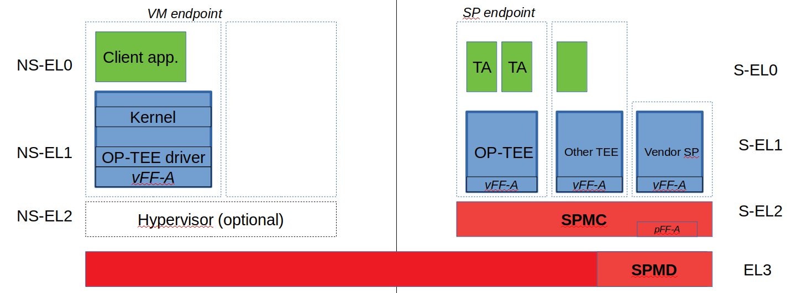
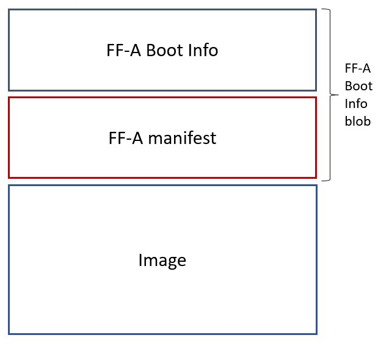
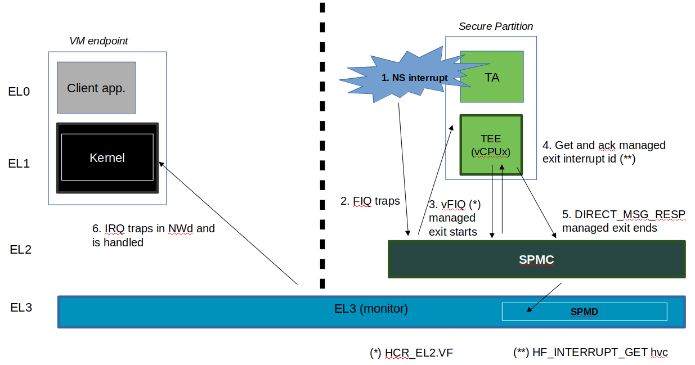
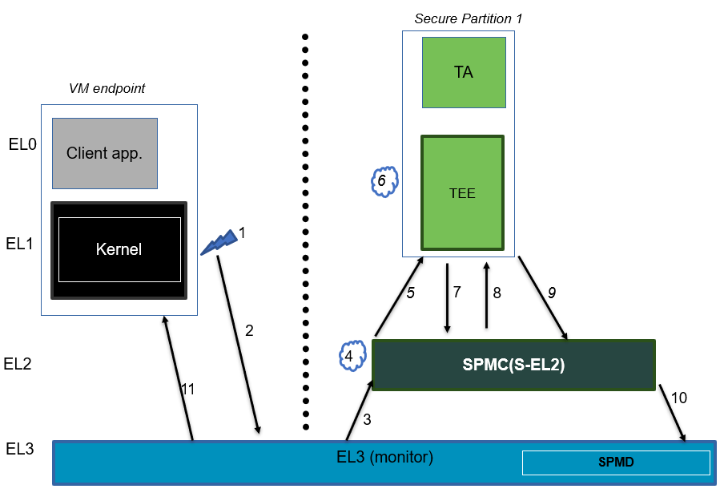
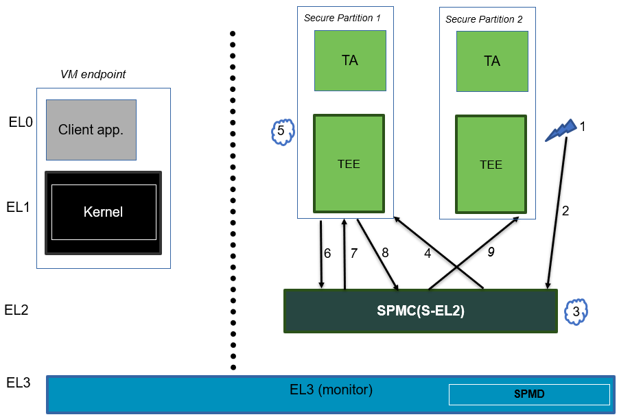
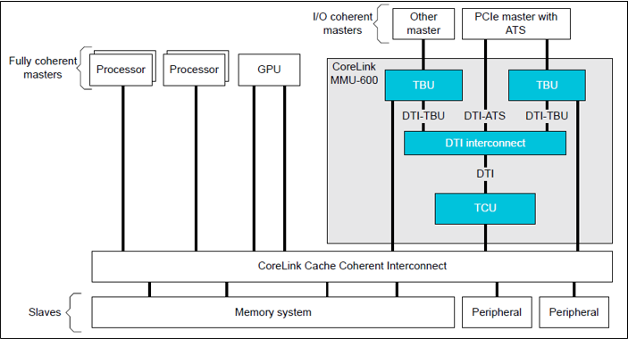

Secure Partition Manager
************************

.. contents::

.. toctree::
  ffa-manifest-binding

Acronyms
========

+--------+--------------------------------------+
| CoT    | Chain of Trust                       |
+--------+--------------------------------------+
| DMA    | Direct Memory Access                 |
+--------+--------------------------------------+
| DTB    | Device Tree Blob                     |
+--------+--------------------------------------+
| DTS    | Device Tree Source                   |
+--------+--------------------------------------+
| EC     | Execution Context                    |
+--------+--------------------------------------+
| FIP    | Firmware Image Package               |
+--------+--------------------------------------+
| FF-A   | Firmware Framework for Arm A-profile |
+--------+--------------------------------------+
| IPA    | Intermediate Physical Address        |
+--------+--------------------------------------+
| JOP    | Jump-Oriented Programming            |
+--------+--------------------------------------+
| NWd    | Normal World                         |
+--------+--------------------------------------+
| ODM    | Original Design Manufacturer         |
+--------+--------------------------------------+
| OEM    | Original Equipment Manufacturer      |
+--------+--------------------------------------+
| PA     | Physical Address                     |
+--------+--------------------------------------+
| PE     | Processing Element                   |
+--------+--------------------------------------+
| PM     | Power Management                     |
+--------+--------------------------------------+
| PVM    | Primary VM                           |
+--------+--------------------------------------+
| ROP    | Return-Oriented Programming          |
+--------+--------------------------------------+
| SMMU   | System Memory Management Unit        |
+--------+--------------------------------------+
| SP     | Secure Partition                     |
+--------+--------------------------------------+
| SPD    | Secure Payload Dispatcher            |
+--------+--------------------------------------+
| SPM    | Secure Partition Manager             |
+--------+--------------------------------------+
| SPMC   | SPM Core                             |
+--------+--------------------------------------+
| SPMD   | SPM Dispatcher                       |
+--------+--------------------------------------+
| SiP    | Silicon Provider                     |
+--------+--------------------------------------+
| SWd    | Secure World                         |
+--------+--------------------------------------+
| TLV    | Tag-Length-Value                     |
+--------+--------------------------------------+
| TOS    | Trusted Operating System             |
+--------+--------------------------------------+
| VM     | Virtual Machine                      |
+--------+--------------------------------------+

Foreword
========

Three implementations of a Secure Partition Manager co-exist in the TF-A
codebase:

#. S-EL2 SPMC based on the FF-A specification `[1]`_, enabling virtualization in
   the secure world, managing multiple S-EL1 or S-EL0 partitions.
#. EL3 SPMC based on the FF-A specification, managing a single S-EL1 partition
   without virtualization in the secure world.
#. EL3 SPM based on the MM specification, legacy implementation managing a
   single S-EL0 partition `[2]`_.

These implementations differ in their respective SW architecture and only one
can be selected at build time. This document:

- describes the implementation from bullet 1. when the SPMC resides at S-EL2.
- is not an architecture specification and it might provide assumptions
  on sections mandated as implementation-defined in the specification.
- covers the implications to TF-A used as a bootloader, and Hafnium used as a
  reference code base for an S-EL2/SPMC secure firmware on platforms
  implementing the FEAT_SEL2 architecture extension.

Terminology
-----------

- The term Hypervisor refers to the NS-EL2 component managing Virtual Machines
  (or partitions) in the normal world.
- The term SPMC refers to the S-EL2 component managing secure partitions in
  the secure world when the FEAT_SEL2 architecture extension is implemented.
- Alternatively, SPMC can refer to an S-EL1 component, itself being a secure
  partition and implementing the FF-A ABI on platforms not implementing the
  FEAT_SEL2 architecture extension.
- The term VM refers to a normal world Virtual Machine managed by an Hypervisor.
- The term SP refers to a secure world "Virtual Machine" managed by an SPMC.

Support for legacy platforms
----------------------------

The SPM is split into a dispatcher and a core component (respectively SPMD and
SPMC) residing at different exception levels. To permit the FF-A specification
adoption and a smooth migration, the SPMD supports an SPMC residing either at
S-EL1 or S-EL2:

- The SPMD is located at EL3 and mainly relays the FF-A protocol from NWd
  (Hypervisor or OS kernel) to the SPMC.
- The same SPMD component is used for both S-EL1 and S-EL2 SPMC configurations.
- The SPMC exception level is a build time choice.

TF-A supports both cases:

- S-EL1 SPMC for platforms not supporting the FEAT_SEL2 architecture
  extension. The SPMD relays the FF-A protocol from EL3 to S-EL1.
- S-EL2 SPMC for platforms implementing the FEAT_SEL2 architecture
  extension. The SPMD relays the FF-A protocol from EL3 to S-EL2.

Sample reference stack
======================

The following diagram illustrates a possible configuration when the
FEAT_SEL2 architecture extension is implemented, showing the SPMD
and SPMC, one or multiple secure partitions, with an optional
Hypervisor:

TF-A build options
==================

This section explains the TF-A build options involved in building with
support for an FF-A based SPM where the SPMD is located at EL3 and the
SPMC located at S-EL1, S-EL2 or EL3:

- **SPD=spmd**: this option selects the SPMD component to relay the FF-A
  protocol from NWd to SWd back and forth. It is not possible to
  enable another Secure Payload Dispatcher when this option is chosen.
- **SPMD_SPM_AT_SEL2**: this option adjusts the SPMC exception
  level to being at S-EL2. It defaults to enabled (value 1) when
  SPD=spmd is chosen.
- **SPMC_AT_EL3**: this option adjusts the SPMC exception level to being
  at EL3.
- If neither ``SPMD_SPM_AT_SEL2`` or ``SPMC_AT_EL3`` are enabled the SPMC
  exception level is set to S-EL1.
- **CTX_INCLUDE_EL2_REGS**: this option permits saving (resp.
  restoring) the EL2 system register context before entering (resp.
  after leaving) the SPMC. It is mandatorily enabled when
  ``SPMD_SPM_AT_SEL2`` is enabled. The context save/restore routine
  and exhaustive list of registers is visible at `[4]`_.
- **SP_LAYOUT_FILE**: this option specifies a text description file
  providing paths to SP binary images and manifests in DTS format
  (see `Describing secure partitions`_). It
  is required when ``SPMD_SPM_AT_SEL2`` is enabled hence when multiple
  secure partitions are to be loaded by BL2 on behalf of the SPMC.

+---------------+----------------------+------------------+-------------+
|               | CTX_INCLUDE_EL2_REGS | SPMD_SPM_AT_SEL2 | SPMC_AT_EL3 |
+---------------+----------------------+------------------+-------------+
| SPMC at S-EL1 |         0            |        0         |      0      |
+---------------+----------------------+------------------+-------------+
| SPMC at S-EL2 |         1            | 1 (default when  |      0      |
|               |                      |    SPD=spmd)     |             |
+---------------+----------------------+------------------+-------------+
| SPMC at EL3   |         0            |        0         |      1      |
+---------------+----------------------+------------------+-------------+

Other combinations of such build options either break the build or are not
supported.

Notes:

- Only Arm's FVP platform is supported to use with the TF-A reference software
  stack.
- When ``SPMD_SPM_AT_SEL2=1``, the reference software stack assumes enablement
  of FEAT_PAuth, FEAT_BTI and FEAT_MTE architecture extensions.
- The ``CTX_INCLUDE_EL2_REGS`` option provides the generic support for
  barely saving/restoring EL2 registers from an Arm arch perspective. As such
  it is decoupled from the ``SPD=spmd`` option.
- BL32 option is re-purposed to specify the SPMC image. It can specify either
  the Hafnium binary path (built for the secure world) or the path to a TEE
  binary implementing FF-A interfaces.
- BL33 option can specify the TFTF binary or a normal world loader
  such as U-Boot or the UEFI framework payload.

Sample TF-A build command line when the SPMC is located at S-EL1
(e.g. when the FEAT_SEL2 architecture extension is not implemented):

.. code:: shell

    make \
    CROSS_COMPILE=aarch64-none-elf- \
    SPD=spmd \
    SPMD_SPM_AT_SEL2=0 \
    BL32=<path-to-tee-binary> \
    BL33=<path-to-bl33-binary> \
    PLAT=fvp \
    all fip

Sample TF-A build command line when FEAT_SEL2 architecture extension is
implemented and the SPMC is located at S-EL2:
.. code:: shell

    make \
    CROSS_COMPILE=aarch64-none-elf- \
    PLAT=fvp \
    SPD=spmd \
    CTX_INCLUDE_EL2_REGS=1 \
    ARM_ARCH_MINOR=5 \
    BRANCH_PROTECTION=1 \
    CTX_INCLUDE_PAUTH_REGS=1 \
    CTX_INCLUDE_MTE_REGS=1 \
    BL32=<path-to-hafnium-binary> \
    BL33=<path-to-bl33-binary> \
    SP_LAYOUT_FILE=sp_layout.json \
    all fip

Sample TF-A build command line when FEAT_SEL2 architecture extension is
implemented, the SPMC is located at S-EL2, and enabling secure boot:
.. code:: shell

    make \
    CROSS_COMPILE=aarch64-none-elf- \
    PLAT=fvp \
    SPD=spmd \
    CTX_INCLUDE_EL2_REGS=1 \
    ARM_ARCH_MINOR=5 \
    BRANCH_PROTECTION=1 \
    CTX_INCLUDE_PAUTH_REGS=1 \
    CTX_INCLUDE_MTE_REGS=1 \
    BL32=<path-to-hafnium-binary> \
    BL33=<path-to-bl33-binary> \
    SP_LAYOUT_FILE=sp_layout.json \
    MBEDTLS_DIR=<path-to-mbedtls-lib> \
    TRUSTED_BOARD_BOOT=1 \
    COT=dualroot \
    ARM_ROTPK_LOCATION=devel_rsa \
    ROT_KEY=plat/arm/board/common/rotpk/arm_rotprivk_rsa.pem \
    GENERATE_COT=1 \
    all fip

Sample TF-A build command line when the SPMC is located at EL3:

.. code:: shell

    make \
    CROSS_COMPILE=aarch64-none-elf- \
    SPD=spmd \
    SPMD_SPM_AT_SEL2=0 \
    SPMC_AT_EL3=1 \
    BL32=<path-to-tee-binary> \
    BL33=<path-to-bl33-binary> \
    PLAT=fvp \
    all fip

FVP model invocation
====================

The FVP command line needs the following options to exercise the S-EL2 SPMC:

+---------------------------------------------------+------------------------------------+
| - cluster0.has_arm_v8-5=1                         | Implements FEAT_SEL2, FEAT_PAuth,  |
| - cluster1.has_arm_v8-5=1                         | and FEAT_BTI.                      |
+---------------------------------------------------+------------------------------------+
| - pci.pci_smmuv3.mmu.SMMU_AIDR=2                  | Parameters required for the        |
| - pci.pci_smmuv3.mmu.SMMU_IDR0=0x0046123B         | SMMUv3.2 modeling.                 |
| - pci.pci_smmuv3.mmu.SMMU_IDR1=0x00600002         |                                    |
| - pci.pci_smmuv3.mmu.SMMU_IDR3=0x1714             |                                    |
| - pci.pci_smmuv3.mmu.SMMU_IDR5=0xFFFF0472         |                                    |
| - pci.pci_smmuv3.mmu.SMMU_S_IDR1=0xA0000002       |                                    |
| - pci.pci_smmuv3.mmu.SMMU_S_IDR2=0                |                                    |
| - pci.pci_smmuv3.mmu.SMMU_S_IDR3=0                |                                    |
+---------------------------------------------------+------------------------------------+
| - cluster0.has_branch_target_exception=1          | Implements FEAT_BTI.               |
| - cluster1.has_branch_target_exception=1          |                                    |
+---------------------------------------------------+------------------------------------+
| - cluster0.has_pointer_authentication=2           | Implements FEAT_PAuth              |
| - cluster1.has_pointer_authentication=2           |                                    |
+---------------------------------------------------+------------------------------------+
| - cluster0.memory_tagging_support_level=2         | Implements FEAT_MTE2               |
| - cluster1.memory_tagging_support_level=2         |                                    |
| - bp.dram_metadata.is_enabled=1                   |                                    |
+---------------------------------------------------+------------------------------------+

Sample FVP command line invocation:

.. code:: shell

    <path-to-fvp-model>/FVP_Base_RevC-2xAEMvA -C pctl.startup=0.0.0.0 \
    -C cluster0.NUM_CORES=4 -C cluster1.NUM_CORES=4 -C bp.secure_memory=1 \
    -C bp.secureflashloader.fname=trusted-firmware-a/build/fvp/debug/bl1.bin \
    -C bp.flashloader0.fname=trusted-firmware-a/build/fvp/debug/fip.bin \
    -C bp.pl011_uart0.out_file=fvp-uart0.log -C bp.pl011_uart1.out_file=fvp-uart1.log \
    -C bp.pl011_uart2.out_file=fvp-uart2.log \
    -C cluster0.has_arm_v8-5=1 -C cluster1.has_arm_v8-5=1 \
    -C cluster0.has_pointer_authentication=2 -C cluster1.has_pointer_authentication=2 \
    -C cluster0.has_branch_target_exception=1 -C cluster1.has_branch_target_exception=1 \
    -C cluster0.memory_tagging_support_level=2 -C cluster1.memory_tagging_support_level=2 \
    -C bp.dram_metadata.is_enabled=1 \
    -C pci.pci_smmuv3.mmu.SMMU_AIDR=2 -C pci.pci_smmuv3.mmu.SMMU_IDR0=0x0046123B \
    -C pci.pci_smmuv3.mmu.SMMU_IDR1=0x00600002 -C pci.pci_smmuv3.mmu.SMMU_IDR3=0x1714 \
    -C pci.pci_smmuv3.mmu.SMMU_IDR5=0xFFFF0472 -C pci.pci_smmuv3.mmu.SMMU_S_IDR1=0xA0000002 \
    -C pci.pci_smmuv3.mmu.SMMU_S_IDR2=0 -C pci.pci_smmuv3.mmu.SMMU_S_IDR3=0

Boot process
============

Loading Hafnium and secure partitions in the secure world
---------------------------------------------------------

TF-A BL2 is the bootlader for the SPMC and SPs in the secure world.

SPs may be signed by different parties (SiP, OEM/ODM, TOS vendor, etc.).
Thus they are supplied as distinct signed entities within the FIP flash
image. The FIP image itself is not signed hence this provides the ability
to upgrade SPs in the field.

Booting through TF-A
--------------------

SP manifests
~~~~~~~~~~~~

An SP manifest describes SP attributes as defined in `[1]`_
(partition manifest at virtual FF-A instance) in DTS format. It is
represented as a single file associated with the SP. A sample is
provided by `[5]`_. A binding document is provided by `[6]`_.

Secure Partition packages
~~~~~~~~~~~~~~~~~~~~~~~~~

Secure partitions are bundled as independent package files consisting
of:

- a header
- a DTB
- an image payload

The header starts with a magic value and offset values to SP DTB and
image payload. Each SP package is loaded independently by BL2 loader
and verified for authenticity and integrity.

The SP package identified by its UUID (matching FF-A uuid property) is
inserted as a single entry into the FIP at end of the TF-A build flow
as shown:

.. code:: shell

    Trusted Boot Firmware BL2: offset=0x1F0, size=0x8AE1, cmdline="--tb-fw"
    EL3 Runtime Firmware BL31: offset=0x8CD1, size=0x13000, cmdline="--soc-fw"
    Secure Payload BL32 (Trusted OS): offset=0x1BCD1, size=0x15270, cmdline="--tos-fw"
    Non-Trusted Firmware BL33: offset=0x30F41, size=0x92E0, cmdline="--nt-fw"
    HW_CONFIG: offset=0x3A221, size=0x2348, cmdline="--hw-config"
    TB_FW_CONFIG: offset=0x3C569, size=0x37A, cmdline="--tb-fw-config"
    SOC_FW_CONFIG: offset=0x3C8E3, size=0x48, cmdline="--soc-fw-config"
    TOS_FW_CONFIG: offset=0x3C92B, size=0x427, cmdline="--tos-fw-config"
    NT_FW_CONFIG: offset=0x3CD52, size=0x48, cmdline="--nt-fw-config"
    B4B5671E-4A90-4FE1-B81F-FB13DAE1DACB: offset=0x3CD9A, size=0xC168, cmdline="--blob"
    D1582309-F023-47B9-827C-4464F5578FC8: offset=0x48F02, size=0xC168, cmdline="--blob"

.. uml:: ../resources/diagrams/plantuml/fip-secure-partitions.puml

Describing secure partitions
~~~~~~~~~~~~~~~~~~~~~~~~~~~~

A json-formatted description file is passed to the build flow specifying paths
to the SP binary image and associated DTS partition manifest file. The latter
is processed by the dtc compiler to generate a DTB fed into the SP package.
Optionally, the partition's json description can contain offsets for both
the image and partition manifest within the SP package. Both offsets need to be
4KB aligned, because it is the translation granule supported by Hafnium SPMC.
These fields can be leveraged to support SPs with S1 translation granules that
differ from 4KB, and to configure the regions allocated within the SP package,
as well as to comply with the requirements for the implementation of the boot
information protocol (see `Passing boot data to the SP`_ for more details). In
case the offsets are absent in their json node, they default to 0x1000 and
0x4000 for the manifest offset and image offset respectively.
This file also specifies the SP owner (as an optional field) identifying the
signing domain in case of dual root CoT.
The SP owner can either be the silicon or the platform provider. The
corresponding "owner" field value can either take the value of "SiP" or "Plat".
In absence of "owner" field, it defaults to "SiP" owner.
The UUID of the partition can be specified as a field in the description file or
if it does not exist there the UUID is extracted from the DTS partition
manifest.

.. code:: shell

    {
        "tee1" : {
            "image": "tee1.bin",
             "pm": "tee1.dts",
             "owner": "SiP",
             "uuid": "1b1820fe-48f7-4175-8999-d51da00b7c9f"
        },

        "tee2" : {
            "image": "tee2.bin",
            "pm": "tee2.dts",
            "owner": "Plat"
        },

        "tee3" : {
            "image": {
                "file": "tee3.bin",
                "offset":"0x2000"
             },
            "pm": {
                "file": "tee3.dts",
                "offset":"0x6000"
             },
            "owner": "Plat"
        },
    }

SPMC manifest
~~~~~~~~~~~~~

This manifest contains the SPMC *attribute* node consumed by the SPMD at boot
time. It implements `[1]`_ (SP manifest at physical FF-A instance) and serves
two different cases:

- The SPMC resides at S-EL1: the SPMC manifest is used by the SPMD to setup a
  SP that co-resides with the SPMC and executes at S-EL1 or Secure Supervisor
  mode.
- The SPMC resides at S-EL2: the SPMC manifest is used by the SPMD to setup
  the environment required by the SPMC to run at S-EL2. SPs run at S-EL1 or
  S-EL0.

.. code:: shell

    attribute {
        spmc_id = <0x8000>;
        maj_ver = <0x1>;
        min_ver = <0x1>;
        exec_state = <0x0>;
        load_address = <0x0 0x6000000>;
        entrypoint = <0x0 0x6000000>;
        binary_size = <0x60000>;
    };

- *spmc_id* defines the endpoint ID value that SPMC can query through
  ``FFA_ID_GET``.
- *maj_ver/min_ver*. SPMD checks provided version versus its internal
  version and aborts if not matching.
- *exec_state* defines the SPMC execution state (AArch64 or AArch32).
  Notice Hafnium used as a SPMC only supports AArch64.
- *load_address* and *binary_size* are mostly used to verify secondary
  entry points fit into the loaded binary image.
- *entrypoint* defines the cold boot primary core entry point used by
  SPMD (currently matches ``BL32_BASE``) to enter the SPMC.

Other nodes in the manifest are consumed by Hafnium in the secure world.
A sample can be found at `[7]`_:

- The *hypervisor* node describes SPs. *is_ffa_partition* boolean attribute
  indicates a FF-A compliant SP. The *load_address* field specifies the load
  address at which BL2 loaded the SP package.
- *cpus* node provide the platform topology and allows MPIDR to VMPIDR mapping.
  Note the primary core is declared first, then secondary cores are declared
  in reverse order.
- The *memory* node provides platform information on the ranges of memory
  available to the SPMC.

SPMC boot
~~~~~~~~~

The SPMC is loaded by BL2 as the BL32 image.

The SPMC manifest is loaded by BL2 as the ``TOS_FW_CONFIG`` image `[9]`_.

BL2 passes the SPMC manifest address to BL31 through a register.

At boot time, the SPMD in BL31 runs from the primary core, initializes the core
contexts and launches the SPMC (BL32) passing the following information through
registers:

- X0 holds the ``TOS_FW_CONFIG`` physical address (or SPMC manifest blob).
- X1 holds the ``HW_CONFIG`` physical address.
- X4 holds the currently running core linear id.

Loading of SPs
~~~~~~~~~~~~~~

At boot time, BL2 loads SPs sequentially in addition to the SPMC as depicted
below:

.. uml:: ../resources/diagrams/plantuml/bl2-loading-sp.puml

Note this boot flow is an implementation sample on Arm's FVP platform.
Platforms not using TF-A's *Firmware CONFiguration* framework would adjust to a
different boot flow. The flow restricts to a maximum of 8 secure partitions.

Secure boot
~~~~~~~~~~~

The SP content certificate is inserted as a separate FIP item so that BL2 loads SPMC,
SPMC manifest, secure partitions and verifies them for authenticity and integrity.
Refer to TBBR specification `[3]`_.

The multiple-signing domain feature (in current state dual signing domain `[8]`_) allows
the use of two root keys namely S-ROTPK and NS-ROTPK:

- SPMC (BL32) and SPMC manifest are signed by the SiP using the S-ROTPK.
- BL33 may be signed by the OEM using NS-ROTPK.
- An SP may be signed either by SiP (using S-ROTPK) or by OEM (using NS-ROTPK).
- A maximum of 4 partitions can be signed with the S-ROTPK key and 4 partitions
  signed with the NS-ROTPK key.

Also refer to `Describing secure partitions`_ and `TF-A build options`_ sections.

Hafnium in the secure world
===========================

General considerations
----------------------

Build platform for the secure world
~~~~~~~~~~~~~~~~~~~~~~~~~~~~~~~~~~~

In the Hafnium reference implementation specific code parts are only relevant to
the secure world. Such portions are isolated in architecture specific files
and/or enclosed by a ``SECURE_WORLD`` macro.

Secure partitions scheduling
~~~~~~~~~~~~~~~~~~~~~~~~~~~~

The FF-A specification `[1]`_ provides two ways to relinquinsh CPU time to
secure partitions. For this a VM (Hypervisor or OS kernel), or SP invokes one of:

- the FFA_MSG_SEND_DIRECT_REQ interface.
- the FFA_RUN interface.

Additionally a secure interrupt can pre-empt the normal world execution and give
CPU cycles by transitioning to EL3 and S-EL2.

Platform topology
~~~~~~~~~~~~~~~~~

The *execution-ctx-count* SP manifest field can take the value of one or the
total number of PEs. The FF-A specification `[1]`_  recommends the
following SP types:

- Pinned MP SPs: an execution context matches a physical PE. MP SPs must
  implement the same number of ECs as the number of PEs in the platform.
- Migratable UP SPs: a single execution context can run and be migrated on any
  physical PE. Such SP declares a single EC in its SP manifest. An UP SP can
  receive a direct message request originating from any physical core targeting
  the single execution context.

Parsing SP partition manifests
------------------------------

Hafnium consumes SP manifests as defined in `[1]`_ and `SP manifests`_.
Note the current implementation may not implement all optional fields.

The SP manifest may contain memory and device regions nodes. In case of
an S-EL2 SPMC:

- Memory regions are mapped in the SP EL1&0 Stage-2 translation regime at
  load time (or EL1&0 Stage-1 for an S-EL1 SPMC). A memory region node can
  specify RX/TX buffer regions in which case it is not necessary for an SP
  to explicitly invoke the ``FFA_RXTX_MAP`` interface.
- Device regions are mapped in the SP EL1&0 Stage-2 translation regime (or
  EL1&0 Stage-1 for an S-EL1 SPMC) as peripherals and possibly allocate
  additional resources (e.g. interrupts).

For the S-EL2 SPMC, base addresses for memory and device region nodes are IPAs
provided the SPMC identity maps IPAs to PAs within SP EL1&0 Stage-2 translation
regime.

Note: in the current implementation both VTTBR_EL2 and VSTTBR_EL2 point to the
same set of page tables. It is still open whether two sets of page tables shall
be provided per SP. The memory region node as defined in the specification
provides a memory security attribute hinting to map either to the secure or
non-secure EL1&0 Stage-2 table if it exists.

Passing boot data to the SP
---------------------------

In `[1]`_ , the section  "Boot information protocol" defines a method for passing
data to the SPs at boot time. It specifies the format for the boot information
descriptor and boot information header structures, which describe the data to be
exchanged between SPMC and SP.
The specification also defines the types of data that can be passed.
The aggregate of both the boot info structures and the data itself is designated
the boot information blob, and is passed to a Partition as a contiguous memory
region.

Currently, the SPM implementation supports the FDT type which is used to pass the
partition's DTB manifest.

The region for the boot information blob is allocated through the SP package.

To adjust the space allocated for the boot information blob, the json description
of the SP (see section `Describing secure partitions`_) shall be updated to contain
the manifest offset. If no offset is provided the manifest offset defaults to 0x1000,
which is the page size in the Hafnium SPMC.

The configuration of the boot protocol is done in the SPs manifest. As defined by
the specification, the manifest field 'gp-register-num' configures the GP register
which shall be used to pass the address to the partitions boot information blob when
booting the partition.
In addition, the Hafnium SPMC implementation requires the boot information arguments
to be listed in a designated DT node:

.. code:: shell

  boot-info {
      compatible = "arm,ffa-manifest-boot-info";
      ffa_manifest;
  };

The whole secure partition package image (see `Secure Partition packages`_) is
mapped to the SP secure EL1&0 Stage-2 translation regime. As such, the SP can
retrieve the address for the boot information blob in the designated GP register,
process the boot information header and descriptors, access its own manifest
DTB blob and extract its partition manifest properties.

SP Boot order
-------------

SP manifests provide an optional boot order attribute meant to resolve
dependencies such as an SP providing a service required to properly boot
another SP. SPMC boots the SPs in accordance to the boot order attribute,
lowest to the highest value. If the boot order attribute is absent from the FF-A
manifest, the SP is treated as if it had the highest boot order value
(i.e. lowest booting priority).

It is possible for an SP to call into another SP through a direct request
provided the latter SP has already been booted.

Boot phases
-----------

Primary core boot-up
~~~~~~~~~~~~~~~~~~~~

Upon boot-up, BL31 hands over to the SPMC (BL32) on the primary boot physical
core. The SPMC performs its platform initializations and registers the SPMC
secondary physical core entry point physical address by the use of the
`FFA_SECONDARY_EP_REGISTER`_ interface (SMC invocation from the SPMC to the SPMD
at secure physical FF-A instance).

The SPMC then creates secure partitions based on SP packages and manifests. Each
secure partition is launched in sequence (`SP Boot order`_) on their "primary"
execution context. If the primary boot physical core linear id is N, an MP SP is
started using EC[N] on PE[N] (see `Platform topology`_). If the partition is a
UP SP, it is started using its unique EC0 on PE[N].

The SP primary EC (or the EC used when the partition is booted as described
above):

- Performs the overall SP boot time initialization, and in case of a MP SP,
  prepares the SP environment for other execution contexts.
- In the case of a MP SP, it invokes the FFA_SECONDARY_EP_REGISTER at secure
  virtual FF-A instance (SMC invocation from SP to SPMC) to provide the IPA
  entry point for other execution contexts.
- Exits through ``FFA_MSG_WAIT`` to indicate successful initialization or
  ``FFA_ERROR`` in case of failure.

Secondary cores boot-up
~~~~~~~~~~~~~~~~~~~~~~~

Once the system is started and NWd brought up, a secondary physical core is
woken up by the ``PSCI_CPU_ON`` service invocation. The TF-A SPD hook mechanism
calls into the SPMD on the newly woken up physical core. Then the SPMC is
entered at the secondary physical core entry point.

In the current implementation, the first SP is resumed on the coresponding EC
(the virtual CPU which matches the physical core). The implication is that the
first SP must be a MP SP.

In a linux based system, once secure and normal worlds are booted but prior to
a NWd FF-A driver has been loaded:

- The first SP has initialized all its ECs in response to primary core boot up
  (at system initialization) and secondary core boot up (as a result of linux
  invoking PSCI_CPU_ON for all secondary cores).
- Other SPs have their first execution context initialized as a result of secure
  world initialization on the primary boot core. Other ECs for those SPs have to
  be run first through ffa_run to complete their initialization (which results
  in the EC completing with FFA_MSG_WAIT).

Refer to `Power management`_ for further details.

Notifications
-------------

The FF-A v1.1 specification `[1]`_ defines notifications as an asynchronous
communication mechanism with non-blocking semantics. It allows for one FF-A
endpoint to signal another for service provision, without hindering its current
progress.

Hafnium currently supports 64 notifications. The IDs of each notification define
a position in a 64-bit bitmap.

The signaling of notifications can interchangeably happen between NWd and SWd
FF-A endpoints.

The SPMC is in charge of managing notifications from SPs to SPs, from SPs to
VMs, and from VMs to SPs. An hypervisor component would only manage
notifications from VMs to VMs. Given the SPMC has no visibility of the endpoints
deployed in NWd, the Hypervisor or OS kernel must invoke the interface
FFA_NOTIFICATION_BITMAP_CREATE to allocate the notifications bitmap per FF-A
endpoint in the NWd that supports it.

A sender can signal notifications once the receiver has provided it with
permissions. Permissions are provided by invoking the interface
FFA_NOTIFICATION_BIND.

Notifications are signaled by invoking FFA_NOTIFICATION_SET. Henceforth
they are considered to be in a pending sate. The receiver can retrieve its
pending notifications invoking FFA_NOTIFICATION_GET, which, from that moment,
are considered to be handled.

Per the FF-A v1.1 spec, each FF-A endpoint must be associated with a scheduler
that is in charge of donating CPU cycles for notifications handling. The
FF-A driver calls FFA_NOTIFICATION_INFO_GET to retrieve the information about
which FF-A endpoints have pending notifications. The receiver scheduler is
called and informed by the FF-A driver, and it should allocate CPU cycles to the
receiver.

There are two types of notifications supported:

- Global, which are targeted to a FF-A endpoint and can be handled within any of
  its execution contexts, as determined by the scheduler of the system.
- Per-vCPU, which are targeted to a FF-A endpoint and to be handled within a
  a specific execution context, as determined by the sender.

The type of a notification is set when invoking FFA_NOTIFICATION_BIND to give
permissions to the sender.

Notification signaling resorts to two interrupts:

- Schedule Receiver Interrupt: non-secure physical interrupt to be handled by
  the FF-A driver within the receiver scheduler. At initialization the SPMC
  donates a SGI ID chosen from the secure SGI IDs range and configures it as
  non-secure. The SPMC triggers this SGI on the currently running core when
  there are pending notifications, and the respective receivers need CPU cycles
  to handle them.
- Notifications Pending Interrupt: virtual interrupt to be handled by the
  receiver of the notification. Set when there are pending notifications for the
  given secure partition. The NPI is pended when the NWd relinquishes CPU cycles
  to an SP.

The notifications receipt support is enabled in the partition FF-A manifest.

Mandatory interfaces
--------------------

The following interfaces are exposed to SPs:

-  ``FFA_VERSION``
-  ``FFA_FEATURES``
-  ``FFA_RX_RELEASE``
-  ``FFA_RXTX_MAP``
-  ``FFA_RXTX_UNMAP``
-  ``FFA_PARTITION_INFO_GET``
-  ``FFA_ID_GET``
-  ``FFA_MSG_WAIT``
-  ``FFA_MSG_SEND_DIRECT_REQ``
-  ``FFA_MSG_SEND_DIRECT_RESP``
-  ``FFA_MEM_DONATE``
-  ``FFA_MEM_LEND``
-  ``FFA_MEM_SHARE``
-  ``FFA_MEM_RETRIEVE_REQ``
-  ``FFA_MEM_RETRIEVE_RESP``
-  ``FFA_MEM_RELINQUISH``
-  ``FFA_MEM_FRAG_RX``
-  ``FFA_MEM_FRAG_TX``
-  ``FFA_MEM_RECLAIM``
-  ``FFA_RUN``

As part of the FF-A v1.1 support, the following interfaces were added:

 - ``FFA_NOTIFICATION_BITMAP_CREATE``
 - ``FFA_NOTIFICATION_BITMAP_DESTROY``
 - ``FFA_NOTIFICATION_BIND``
 - ``FFA_NOTIFICATION_UNBIND``
 - ``FFA_NOTIFICATION_SET``
 - ``FFA_NOTIFICATION_GET``
 - ``FFA_NOTIFICATION_INFO_GET``
 - ``FFA_SPM_ID_GET``
 - ``FFA_SECONDARY_EP_REGISTER``
 - ``FFA_MEM_PERM_GET``
 - ``FFA_MEM_PERM_SET``

FFA_VERSION
~~~~~~~~~~~

``FFA_VERSION`` requires a *requested_version* parameter from the caller.
The returned value depends on the caller:

- Hypervisor or OS kernel in NS-EL1/EL2: the SPMD returns the SPMC version
  specified in the SPMC manifest.
- SP: the SPMC returns its own implemented version.
- SPMC at S-EL1/S-EL2: the SPMD returns its own implemented version.

FFA_FEATURES
~~~~~~~~~~~~

FF-A features supported by the SPMC may be discovered by secure partitions at
boot (that is prior to NWd is booted) or run-time.

The SPMC calling FFA_FEATURES at secure physical FF-A instance always get
FFA_SUCCESS from the SPMD.

The request made by an Hypervisor or OS kernel is forwarded to the SPMC and
the response relayed back to the NWd.

FFA_RXTX_MAP/FFA_RXTX_UNMAP
~~~~~~~~~~~~~~~~~~~~~~~~~~~

When invoked from a secure partition FFA_RXTX_MAP maps the provided send and
receive buffers described by their IPAs to the SP EL1&0 Stage-2 translation
regime as secure buffers in the MMU descriptors.

When invoked from the Hypervisor or OS kernel, the buffers are mapped into the
SPMC EL2 Stage-1 translation regime and marked as NS buffers in the MMU
descriptors.

The FFA_RXTX_UNMAP unmaps the RX/TX pair from the translation regime of the
caller, either it being the Hypervisor or OS kernel, as well as a secure
partition.

FFA_PARTITION_INFO_GET
~~~~~~~~~~~~~~~~~~~~~~

Partition info get call can originate:

- from SP to SPMC
- from Hypervisor or OS kernel to SPMC. The request is relayed by the SPMD.

FFA_ID_GET
~~~~~~~~~~

The FF-A id space is split into a non-secure space and secure space:

- FF-A ID with bit 15 clear relates to VMs.
- FF-A ID with bit 15 set related to SPs.
- FF-A IDs 0, 0xffff, 0x8000 are assigned respectively to the Hypervisor, SPMD
  and SPMC.

The SPMD returns:

- The default zero value on invocation from the Hypervisor.
- The ``spmc_id`` value specified in the SPMC manifest on invocation from
  the SPMC (see `SPMC manifest`_)

This convention helps the SPMC to determine the origin and destination worlds in
an FF-A ABI invocation. In particular the SPMC shall filter unauthorized
transactions in its world switch routine. It must not be permitted for a VM to
use a secure FF-A ID as origin world by spoofing:

- A VM-to-SP direct request/response shall set the origin world to be non-secure
  (FF-A ID bit 15 clear) and destination world to be secure (FF-A ID bit 15
  set).
- Similarly, an SP-to-SP direct request/response shall set the FF-A ID bit 15
  for both origin and destination IDs.

An incoming direct message request arriving at SPMD from NWd is forwarded to
SPMC without a specific check. The SPMC is resumed through eret and "knows" the
message is coming from normal world in this specific code path. Thus the origin
endpoint ID must be checked by SPMC for being a normal world ID.

An SP sending a direct message request must have bit 15 set in its origin
endpoint ID and this can be checked by the SPMC when the SP invokes the ABI.

The SPMC shall reject the direct message if the claimed world in origin endpoint
ID is not consistent:

-  It is either forwarded by SPMD and thus origin endpoint ID must be a "normal
   world ID",
-  or initiated by an SP and thus origin endpoint ID must be a "secure world ID".

FFA_MSG_SEND_DIRECT_REQ/FFA_MSG_SEND_DIRECT_RESP
~~~~~~~~~~~~~~~~~~~~~~~~~~~~~~~~~~~~~~~~~~~~~~~~

This is a mandatory interface for secure partitions consisting in direct request
and responses with the following rules:

- An SP can send a direct request to another SP.
- An SP can receive a direct request from another SP.
- An SP can send a direct response to another SP.
- An SP cannot send a direct request to an Hypervisor or OS kernel.
- An Hypervisor or OS kernel can send a direct request to an SP.
- An SP can send a direct response to an Hypervisor or OS kernel.

FFA_NOTIFICATION_BITMAP_CREATE/FFA_NOTIFICATION_BITMAP_DESTROY
~~~~~~~~~~~~~~~~~~~~~~~~~~~~~~~~~~~~~~~~~~~~~~~~~~~~~~~~~~~~~~

The secure partitions notifications bitmap are statically allocated by the SPMC.
Hence, this interface is not to be issued by secure partitions.

At initialization, the SPMC is not aware of VMs/partitions deployed in the
normal world. Hence, the Hypervisor or OS kernel must use both ABIs for SPMC
to be prepared to handle notifications for the provided VM ID.

FFA_NOTIFICATION_BIND/FFA_NOTIFICATION_UNBIND
~~~~~~~~~~~~~~~~~~~~~~~~~~~~~~~~~~~~~~~~~~~~~

Pair of interfaces to manage permissions to signal notifications. Prior to
handling notifications, an FF-A endpoint must allow a given sender to signal a
bitmap of notifications.

If the receiver doesn't have notification support enabled in its FF-A manifest,
it won't be able to bind notifications, hence forbidding it to receive any
notifications.

FFA_NOTIFICATION_SET/FFA_NOTIFICATION_GET
~~~~~~~~~~~~~~~~~~~~~~~~~~~~~~~~~~~~~~~~~

FFA_NOTIFICATION_GET retrieves all pending global notifications and
per-vCPU notifications targeted to the current vCPU.

Hafnium maintains a global count of pending notifications which gets incremented
and decremented when handling FFA_NOTIFICATION_SET and FFA_NOTIFICATION_GET
respectively. A delayed SRI is triggered if the counter is non-zero when the
SPMC returns to normal world.

FFA_NOTIFICATION_INFO_GET
~~~~~~~~~~~~~~~~~~~~~~~~~

Hafnium maintains a global count of pending notifications whose information
has been retrieved by this interface. The count is incremented and decremented
when handling FFA_NOTIFICATION_INFO_GET and FFA_NOTIFICATION_GET respectively.
It also tracks notifications whose information has been retrieved individually,
such that it avoids duplicating returned information for subsequent calls to
FFA_NOTIFICATION_INFO_GET. For each notification, this state information is
reset when receiver called FFA_NOTIFICATION_GET to retrieve them.

FFA_SPM_ID_GET
~~~~~~~~~~~~~~

Returns the FF-A ID allocated to an SPM component which can be one of SPMD
or SPMC.

At initialization, the SPMC queries the SPMD for the SPMC ID, using the
FFA_ID_GET interface, and records it. The SPMC can also query the SPMD ID using
the FFA_SPM_ID_GET interface at the secure physical FF-A instance.

Secure partitions call this interface at the virtual FF-A instance, to which
the SPMC returns the priorly retrieved SPMC ID.

The Hypervisor or OS kernel can issue the FFA_SPM_ID_GET call handled by the
SPMD, which returns the SPMC ID.

FFA_SECONDARY_EP_REGISTER
~~~~~~~~~~~~~~~~~~~~~~~~~

When the SPMC boots, all secure partitions are initialized on their primary
Execution Context.

The FFA_SECONDARY_EP_REGISTER interface is to be used by a secure partition
from its first execution context, to provide the entry point address for
secondary execution contexts.

A secondary EC is first resumed either upon invocation of PSCI_CPU_ON from
the NWd or by invocation of FFA_RUN.

SPMC-SPMD direct requests/responses
-----------------------------------

Implementation-defined FF-A IDs are allocated to the SPMC and SPMD.
Using those IDs in source/destination fields of a direct request/response
permits SPMD to SPMC communication and either way.

- SPMC to SPMD direct request/response uses SMC conduit.
- SPMD to SPMC direct request/response uses ERET conduit.

This is used in particular to convey power management messages.

PE MMU configuration
--------------------

With secure virtualization enabled (``HCR_EL2.VM = 1``) and for S-EL1
partitions, two IPA spaces (secure and non-secure) are output from the
secure EL1&0 Stage-1 translation.
The EL1&0 Stage-2 translation hardware is fed by:

- A secure IPA when the SP EL1&0 Stage-1 MMU is disabled.
- One of secure or non-secure IPA when the secure EL1&0 Stage-1 MMU is enabled.

``VTCR_EL2`` and ``VSTCR_EL2`` provide configuration bits for controlling the
NS/S IPA translations. The following controls are set up:
``VSTCR_EL2.SW = 0`` , ``VSTCR_EL2.SA = 0``, ``VTCR_EL2.NSW = 0``,
``VTCR_EL2.NSA = 1``:

- Stage-2 translations for the NS IPA space access the NS PA space.
- Stage-2 translation table walks for the NS IPA space are to the secure PA space.

Secure and non-secure IPA regions (rooted to by ``VTTBR_EL2`` and ``VSTTBR_EL2``)
use the same set of Stage-2 page tables within a SP.

The ``VTCR_EL2/VSTCR_EL2/VTTBR_EL2/VSTTBR_EL2`` virtual address space
configuration is made part of a vCPU context.

For S-EL0 partitions with VHE enabled, a single secure EL2&0 Stage-1 translation
regime is used for both Hafnium and the partition.

Interrupt management
--------------------

GIC ownership
~~~~~~~~~~~~~

The SPMC owns the GIC configuration. Secure and non-secure interrupts are
trapped at S-EL2. The SPMC manages interrupt resources and allocates interrupt
IDs based on SP manifests. The SPMC acknowledges physical interrupts and injects
virtual interrupts by setting the use of vIRQ/vFIQ bits before resuming a SP.

Non-secure interrupt handling
~~~~~~~~~~~~~~~~~~~~~~~~~~~~~

The following illustrate the scenarios of non secure physical interrupts trapped
by the SPMC:

- The SP handles a managed exit operation:

- The SP is pre-empted without managed exit:

.. image:: ../resources/diagrams/ffa-ns-interrupt-handling-sp-preemption.png

Secure interrupt handling
-------------------------

This section documents the support implemented for secure interrupt handling in
SPMC as per the guidance provided by FF-A v1.1 Beta0 specification.
The following assumptions are made about the system configuration:

  - In the current implementation, S-EL1 SPs are expected to use the para
    virtualized ABIs for interrupt management rather than accessing virtual GIC
    interface.
  - Unless explicitly stated otherwise, this support is applicable only for
    S-EL1 SPs managed by SPMC.
  - Secure interrupts are configured as G1S or G0 interrupts.
  - All physical interrupts are routed to SPMC when running a secure partition
    execution context.

A physical secure interrupt could preempt normal world execution. Moreover, when
the execution is in secure world, it is highly likely that the target of a
secure interrupt is not the currently running execution context of an SP. It
could be targeted to another FF-A component. Consequently, secure interrupt
management depends on the state of the target execution context of the SP that
is responsible for handling the interrupt. Hence, the spec provides guidance on
how to signal start and completion of secure interrupt handling as discussed in
further sections.

Secure interrupt signaling mechanisms
~~~~~~~~~~~~~~~~~~~~~~~~~~~~~~~~~~~~~

Signaling refers to the mechanisms used by SPMC to indicate to the SP execution
context that it has a pending virtual interrupt and to further run the SP
execution context, such that it can handle the virtual interrupt. SPMC uses
either the FFA_INTERRUPT interface with ERET conduit or vIRQ signal for signaling
to S-EL1 SPs. When normal world execution is preempted by a secure interrupt,
the SPMD uses the FFA_INTERRUPT ABI with ERET conduit to signal interrupt to SPMC
running in S-EL2.

+-----------+---------+---------------+---------------------------------------+
| SP State  | Conduit | Interface and | Description                           |
|           |         | parameters    |                                       |
+-----------+---------+---------------+---------------------------------------+
| WAITING   | ERET,   | FFA_INTERRUPT,| SPMC signals to SP the ID of pending  |
|           | vIRQ    | Interrupt ID  | interrupt. It pends vIRQ signal and   |
|           |         |               | resumes execution context of SP       |
|           |         |               | through ERET.                         |
+-----------+---------+---------------+---------------------------------------+
| BLOCKED   | ERET,   | FFA_INTERRUPT | SPMC signals to SP that an interrupt  |
|           | vIRQ    |               | is pending. It pends vIRQ signal and  |
|           |         |               | resumes execution context of SP       |
|           |         |               | through ERET.                         |
+-----------+---------+---------------+---------------------------------------+
| PREEMPTED | vIRQ    | NA            | SPMC pends the vIRQ signal but does   |
|           |         |               | not resume execution context of SP.   |
+-----------+---------+---------------+---------------------------------------+
| RUNNING   | ERET,   | NA            | SPMC pends the vIRQ signal and resumes|
|           | vIRQ    |               | execution context of SP through ERET. |
+-----------+---------+---------------+---------------------------------------+

Secure interrupt completion mechanisms
~~~~~~~~~~~~~~~~~~~~~~~~~~~~~~~~~~~~~~

A SP signals secure interrupt handling completion to the SPMC through the
following mechanisms:

  - ``FFA_MSG_WAIT`` ABI if it was in WAITING state.
  - ``FFA_RUN`` ABI if its was in BLOCKED state.

In the current implementation, S-EL1 SPs use para-virtualized HVC interface
implemented by SPMC to perform priority drop and interrupt deactivation (we
assume EOImode = 0, i.e. priority drop and deactivation are done together).

If normal world execution was preempted by secure interrupt, SPMC uses
FFA_NORMAL_WORLD_RESUME ABI to indicate completion of secure interrupt handling
and further return execution to normal world. If the current SP execution
context was preempted by a secure interrupt to be handled by execution context
of target SP, SPMC resumes current SP after signal completion by target SP
execution context.

An action is broadly a set of steps taken by the SPMC in response to a physical
interrupt. In order to simplify the design, the current version of secure
interrupt management support in SPMC (Hafnium) does not fully implement the
Scheduling models and Partition runtime models. However, the current
implementation loosely maps to the following actions that are legally allowed
by the specification. Please refer to the Table 8.4 in the spec for further
description of actions. The action specified for a type of interrupt when the
SP is in the message processing running state cannot be less permissive than the
action specified for the same type of interrupt when the SP is in the interrupt
handling running state.

+--------------------+--------------------+------------+-------------+
| Runtime Model      | NS-Int             | Self S-Int | Other S-Int |
+--------------------+--------------------+------------+-------------+
| Message Processing | Signalable with ME | Signalable | Signalable  |
+--------------------+--------------------+------------+-------------+
| Interrupt Handling | Queued             | Queued     | Queued      |
+--------------------+--------------------+------------+-------------+

Abbreviations:

  - NS-Int: A Non-secure physical interrupt. It requires a switch to the Normal
    world to be handled.
  - Other S-Int: A secure physical interrupt targeted to an SP different from
    the one that is currently running.
  - Self S-Int: A secure physical interrupt targeted to the SP that is currently
    running.

The following figure describes interrupt handling flow when secure interrupt
triggers while in normal world:

A brief description of the events:

  - 1) Secure interrupt triggers while normal world is running.
  - 2) FIQ gets trapped to EL3.
  - 3) SPMD signals secure interrupt to SPMC at S-EL2 using FFA_INTERRUPT ABI.
  - 4) SPMC identifies target vCPU of SP and injects virtual interrupt (pends
       vIRQ).
  - 5) Since SP1 vCPU is in WAITING state, SPMC signals using FFA_INTERRUPT with
       interrupt id as argument and resume it using ERET.
  - 6) Execution traps to vIRQ handler in SP1 provided that interrupt is not
       masked i.e., PSTATE.I = 0
  - 7) SP1 services the interrupt and invokes the de-activation HVC call.
  - 8) SPMC does internal state management and further de-activates the physical
       interrupt and resumes SP vCPU.
  - 9) SP performs secure interrupt completion through FFA_MSG_WAIT ABI.
  - 10) SPMC returns control to EL3 using FFA_NORMAL_WORLD_RESUME.
  - 11) EL3 resumes normal world execution.

The following figure describes interrupt handling flow when secure interrupt
triggers while in secure world:

A brief description of the events:

  - 1) Secure interrupt triggers while SP2 is running and SP1 is blocked.
  - 2) Gets trapped to SPMC as IRQ.
  - 3) SPMC finds the target vCPU of secure partition responsible for handling
       this secure interrupt. In this scenario, it is SP1.
  - 4) SPMC pends vIRQ for SP1 and signals through FFA_INTERRUPT interface.
       SPMC further resumes SP1 through ERET conduit.
  - 5) Execution traps to vIRQ handler in SP1 provided that interrupt is not
       masked i.e., PSTATE.I = 0
  - 6) SP1 services the secure interrupt and invokes the de-activation HVC call.
  - 7) SPMC does internal state management, de-activates the physical interrupt
       and resumes SP1 vCPU.
  - 8) Assuming SP1 is in BLOCKED state, SP1 performs secure interrupt completion
       through FFA_RUN ABI.
  - 9) SPMC resumes the pre-empted vCPU of SP2.

Power management
----------------

In platforms with or without secure virtualization:

- The NWd owns the platform PM policy.
- The Hypervisor or OS kernel is the component initiating PSCI service calls.
- The EL3 PSCI library is in charge of the PM coordination and control
  (eventually writing to platform registers).
- While coordinating PM events, the PSCI library calls backs into the Secure
  Payload Dispatcher for events the latter has statically registered to.

When using the SPMD as a Secure Payload Dispatcher:

- A power management event is relayed through the SPD hook to the SPMC.
- In the current implementation only cpu on (svc_on_finish) and cpu off
  (svc_off) hooks are registered.
- The behavior for the cpu on event is described in `Secondary cores boot-up`_.
  The SPMC is entered through its secondary physical core entry point.
- The cpu off event occurs when the NWd calls PSCI_CPU_OFF. The PM event is
  signaled to the SPMC through a power management framework message.
  It consists in a SPMD-to-SPMC direct request/response (`SPMC-SPMD direct
  requests/responses`_) conveying the event details and SPMC response.
  The SPMD performs a synchronous entry into the SPMC. The SPMC is entered and
  updates its internal state to reflect the physical core is being turned off.
  In the current implementation no SP is resumed as a consequence. This behavior
  ensures a minimal support for CPU hotplug e.g. when initiated by the NWd linux
  userspace.

Arm architecture extensions for security hardening
==================================================

Hafnium supports the following architecture extensions for security hardening:

- Pointer authentication (FEAT_PAuth): the extension permits detection of forged
  pointers used by ROP type of attacks through the signing of the pointer
  value. Hafnium is built with the compiler branch protection option to permit
  generation of a pointer authentication code for return addresses (pointer
  authentication for instructions). The APIA key is used while Hafnium runs.
  A random key is generated at boot time and restored upon entry into Hafnium
  at run-time. APIA and other keys (APIB, APDA, APDB, APGA) are saved/restored
  in vCPU contexts permitting to enable pointer authentication in VMs/SPs.
- Branch Target Identification (FEAT_BTI): the extension permits detection of
  unexpected indirect branches used by JOP type of attacks. Hafnium is built
  with the compiler branch protection option, inserting land pads at function
  prologues that are reached by indirect branch instructions (BR/BLR).
  Hafnium code pages are marked as guarded in the EL2 Stage-1 MMU descriptors
  such that an indirect branch must always target a landpad. A fault is
  triggered otherwise. VMs/SPs can (independently) mark their code pages as
  guarded in the EL1&0 Stage-1 translation regime.
- Memory Tagging Extension (FEAT_MTE): the option permits detection of out of
  bound memory array accesses or re-use of an already freed memory region.
  Hafnium enables the compiler option permitting to leverage MTE stack tagging
  applied to core stacks. Core stacks are marked as normal tagged memory in the
  EL2 Stage-1 translation regime. A synchronous data abort is generated upon tag
  check failure on load/stores. A random seed is generated at boot time and
  restored upon entry into Hafnium. MTE system registers are saved/restored in
  vCPU contexts permitting MTE usage from VMs/SPs.

SMMUv3 support in Hafnium
=========================

An SMMU is analogous to an MMU in a CPU. It performs address translations for
Direct Memory Access (DMA) requests from system I/O devices.
The responsibilities of an SMMU include:

-  Translation: Incoming DMA requests are translated from bus address space to
   system physical address space using translation tables compliant to
   Armv8/Armv7 VMSA descriptor format.
-  Protection: An I/O device can be prohibited from read, write access to a
   memory region or allowed.
-  Isolation: Traffic from each individial device can be independently managed.
   The devices are differentiated from each other using unique translation
   tables.

The following diagram illustrates a typical SMMU IP integrated in a SoC with
several I/O devices along with Interconnect and Memory system.

SMMU has several versions including SMMUv1, SMMUv2 and SMMUv3. Hafnium provides
support for SMMUv3 driver in both normal and secure world. A brief introduction
of SMMUv3 functionality and the corresponding software support in Hafnium is
provided here.

SMMUv3 features
---------------

-  SMMUv3 provides Stage1, Stage2 translation as well as nested (Stage1 + Stage2)
   translation support. It can either bypass or abort incoming translations as
   well.
-  Traffic (memory transactions) from each upstream I/O peripheral device,
   referred to as Stream, can be independently managed using a combination of
   several memory based configuration structures. This allows the SMMUv3 to
   support a large number of streams with each stream assigned to a unique
   translation context.
-  Support for Armv8.1 VMSA where the SMMU shares the translation tables with
   a Processing Element. AArch32(LPAE) and AArch64 translation table format
   are supported by SMMUv3.
-  SMMUv3 offers non-secure stream support with secure stream support being
   optional. Logically, SMMUv3 behaves as if there is an indepdendent SMMU
   instance for secure and non-secure stream support.
-  It also supports sub-streams to differentiate traffic from a virtualized
   peripheral associated with a VM/SP.
-  Additionally, SMMUv3.2 provides support for PEs implementing Armv8.4-A
   extensions. Consequently, SPM depends on Secure EL2 support in SMMUv3.2
   for providing Secure Stage2 translation support to upstream peripheral
   devices.

SMMUv3 Programming Interfaces
-----------------------------

SMMUv3 has three software interfaces that are used by the Hafnium driver to
configure the behaviour of SMMUv3 and manage the streams.

-  Memory based data strutures that provide unique translation context for
   each stream.
-  Memory based circular buffers for command queue and event queue.
-  A large number of SMMU configuration registers that are memory mapped during
   boot time by Hafnium driver. Except a few registers, all configuration
   registers have independent secure and non-secure versions to configure the
   behaviour of SMMUv3 for translation of secure and non-secure streams
   respectively.

Peripheral device manifest
--------------------------

Currently, SMMUv3 driver in Hafnium only supports dependent peripheral devices.
These devices are dependent on PE endpoint to initiate and receive memory
management transactions on their behalf. The acccess to the MMIO regions of
any such device is assigned to the endpoint during boot. Moreover, SMMUv3 driver
uses the same stage 2 translations for the device as those used by partition
manager on behalf of the PE endpoint. This ensures that the peripheral device
has the same visibility of the physical address space as the endpoint. The
device node of the corresponding partition manifest (refer to `[1]`_ section 3.2
) must specify these additional properties for each peripheral device in the
system :

-  smmu-id: This field helps to identify the SMMU instance that this device is
   upstream of.
-  stream-ids: List of stream IDs assigned to this device.

.. code:: shell

    smmuv3-testengine {
        base-address = <0x00000000 0x2bfe0000>;
        pages-count = <32>;
        attributes = <0x3>;
        smmu-id = <0>;
        stream-ids = <0x0 0x1>;
        interrupts = <0x2 0x3>, <0x4 0x5>;
        exclusive-access;
    };

SMMUv3 driver limitations
-------------------------

The primary design goal for the Hafnium SMMU driver is to support secure
streams.

-  Currently, the driver only supports Stage2 translations. No support for
   Stage1 or nested translations.
-  Supports only AArch64 translation format.
-  No support for features such as PCI Express (PASIDs, ATS, PRI), MSI, RAS,
   Fault handling, Performance Monitor Extensions, Event Handling, MPAM.
-  No support for independent peripheral devices.

S-EL0 Partition support
=======================
The SPMC (Hafnium) has limited capability to run S-EL0 FF-A partitions using
FEAT_VHE (mandatory with ARMv8.1 in non-secure state, and in secure world
with ARMv8.4 and FEAT_SEL2).

S-EL0 partitions are useful for simple partitions that don't require full
Trusted OS functionality. It is also useful to reduce jitter and cycle
stealing from normal world since they are more lightweight than VMs.

S-EL0 partitions are presented, loaded and initialized the same as S-EL1 VMs by
the SPMC. They are differentiated primarily by the 'exception-level' property
and the 'execution-ctx-count' property in the SP manifest. They are host apps
under the single EL2&0 Stage-1 translation regime controlled by the SPMC and
call into the SPMC through SVCs as opposed to HVCs and SMCs. These partitions
can use FF-A defined services (FFA_MEM_PERM_*) to update or change permissions
for memory regions.

S-EL0 partitions are required by the FF-A specification to be UP endpoints,
capable of migrating, and the SPMC enforces this requirement. The SPMC allows
a S-EL0 partition to accept a direct message from secure world and normal world,
and generate direct responses to them.

Memory sharing between and with S-EL0 partitions is supported.
Indirect messaging, Interrupt handling and Notifications are not supported with
S-EL0 partitions and is work in progress, planned for future releases.
All S-EL0 partitions must use AArch64. AArch32 S-EL0 partitions are not
supported.

References
==========

.. _[1]:

[1] `Arm Firmware Framework for Arm A-profile <https://developer.arm.com/docs/den0077/latest>`__

.. _[2]:

[2] :ref:`Secure Partition Manager using MM interface<Secure Partition Manager (MM)>`

.. _[3]:

[3] `Trusted Boot Board Requirements
Client <https://developer.arm.com/documentation/den0006/d/>`__

.. _[4]:

[4] https://git.trustedfirmware.org/TF-A/trusted-firmware-a.git/tree/lib/el3_runtime/aarch64/context.S#n45

.. _[5]:

[5] https://git.trustedfirmware.org/TF-A/tf-a-tests.git/tree/spm/cactus/plat/arm/fvp/fdts/cactus.dts

.. _[6]:

[6] https://trustedfirmware-a.readthedocs.io/en/latest/components/ffa-manifest-binding.html

.. _[7]:

[7] https://git.trustedfirmware.org/TF-A/trusted-firmware-a.git/tree/plat/arm/board/fvp/fdts/fvp_spmc_manifest.dts

.. _[8]:

[8] https://lists.trustedfirmware.org/archives/list/tf-a@lists.trustedfirmware.org/thread/CFQFGU6H2D5GZYMUYGTGUSXIU3OYZP6U/

.. _[9]:

[9] https://trustedfirmware-a.readthedocs.io/en/latest/design/firmware-design.html#dynamic-configuration-during-cold-boot

--------------

*Copyright (c) 2020-2022, Arm Limited and Contributors. All rights reserved.*
