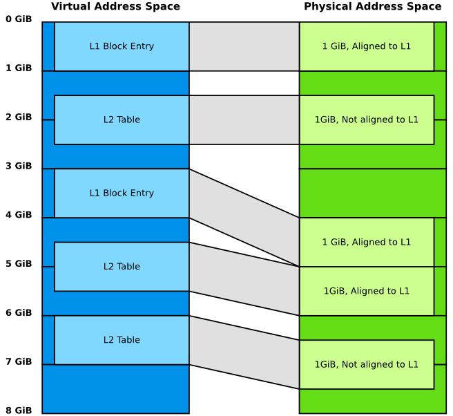

Translation (XLAT) Tables Library
=================================

This document describes the design of the translation tables library (version 2)
used by Trusted Firmware-A (TF-A). This library provides APIs to create page
tables based on a description of the memory layout, as well as setting up system
registers related to the Memory Management Unit (MMU) and performing the
required Translation Lookaside Buffer (TLB) maintenance operations.

More specifically, some use cases that this library aims to support are:

#. Statically allocate translation tables and populate them (at run-time) based
   upon a description of the memory layout. The memory layout is typically
   provided by the platform port as a list of memory regions;

#. Support for generating translation tables pertaining to a different
   translation regime than the exception level the library code is executing at;

#. Support for dynamic mapping and unmapping of regions, even while the MMU is
   on. This can be used to temporarily map some memory regions and unmap them
   later on when no longer needed;

#. Support for non-identity virtual to physical mappings to compress the virtual
   address space;

#. Support for changing memory attributes of memory regions at run-time.

About version 1, version 2 and MPU libraries
--------------------------------------------

This document focuses on version 2 of the library, whose sources are available
in the ``lib/xlat_tables_v2`` directory. Version 1 of the library can still be
found in ``lib/xlat_tables`` directory but it is less flexible and doesn't
support dynamic mapping. ``lib/xlat_mpu``, which configures Arm's MPU
equivalently, is also addressed here. The ``lib/xlat_mpu`` is experimental,
meaning that its API may change. It currently strives for consistency and
code-reuse with xlat_tables_v2.  Future versions may be more MPU-specific (e.g.,
removing all mentions of virtual addresses). Although potential bug fixes will
be applied to all versions of the xlat_* libs, future feature enhancements will
focus on version 2 and might not be back-ported to version 1 and MPU versions.
Therefore, it is recommended to use version 2, especially for new platform
ports (unless the platform uses an MPU).

However, please note that version 2 and the MPU version are still in active
development and is not considered stable yet. Hence, compatibility breaks might
be introduced.

From this point onwards, this document will implicitly refer to version 2 of the
library, unless stated otherwise.

Design concepts and interfaces
------------------------------

This section presents some of the key concepts and data structures used in the
translation tables library.

`mmap` regions
~~~~~~~~~~~~~~

An ``mmap_region`` is an abstract, concise way to represent a memory region to
map. It is one of the key interfaces to the library. It is identified by:

- its physical base address;
- its virtual base address;
- its size;
- its attributes;
- its mapping granularity (optional).

See the ``struct mmap_region`` type in ``xlat_tables_v2.h``.

The user usually provides a list of such mmap regions to map and lets the
library transpose that in a set of translation tables. As a result, the library
might create new translation tables, update or split existing ones.

The region attributes specify the type of memory (for example device or cached
normal memory) as well as the memory access permissions (read-only or
read-write, executable or not, secure or non-secure, and so on). In the case of
the EL1&0 translation regime, the attributes also specify whether the region is
a User region (EL0) or Privileged region (EL1). See the ``MT_xxx`` definitions
in ``xlat_tables_v2.h``. Note that for the EL1&0 translation regime the Execute
Never attribute is set simultaneously for both EL1 and EL0.

The granularity controls the translation table level to go down to when mapping
the region. For example, assuming the MMU has been configured to use a 4KB
granule size, the library might map a 2MB memory region using either of the two
following options:

- using a single level-2 translation table entry;
- using a level-2 intermediate entry to a level-3 translation table (which
  contains 512 entries, each mapping 4KB).

The first solution potentially requires less translation tables, hence
potentially less memory.  However, if part of this 2MB region is later remapped
with different memory attributes, the library might need to split the existing
page tables to refine the mappings. If a single level-2 entry has been used
here, a level-3 table will need to be allocated on the fly and the level-2
modified to point to this new level-3 table. This has a performance cost at
run-time.

If the user knows upfront that such a remapping operation is likely to happen
then they might enforce a 4KB mapping granularity for this 2MB region from the
beginning; remapping some of these 4KB pages on the fly then becomes a
lightweight operation.

The region's granularity is an optional field; if it is not specified the
library will choose the mapping granularity for this region as it sees fit (more
details can be found in `The memory mapping algorithm`_ section below).

The MPU library also uses ``struct mmap_region`` to specify translations, but
the MPU's translations are limited to specification of valid addresses and
access permissions.  If the requested virtual and physical addresses mismatch
the system will panic. Being register-based for deterministic memory-reference
timing, the MPU hardware does not involve memory-resident translation tables.

Currently, the MPU library is also limited to MPU translation at EL2 with no
MMU translation at other ELs.  These limitations, however, are expected to be
overcome in future library versions.

Translation Context
~~~~~~~~~~~~~~~~~~~

The library can create or modify translation tables pertaining to a different
translation regime than the exception level the library code is executing at.
For example, the library might be used by EL3 software (for instance BL31) to
create translation tables pertaining to the S-EL1&0 translation regime.

This flexibility comes from the use of *translation contexts*. A *translation
context* constitutes the superset of information used by the library to track
the status of a set of translation tables for a given translation regime.

The library internally allocates a default translation context, which pertains
to the translation regime of the current exception level. Additional contexts
may be explicitly allocated and initialized using the
``REGISTER_XLAT_CONTEXT()`` macro. Separate APIs are provided to act either on
the default translation context or on an alternative one.

To register a translation context, the user must provide the library with the
following information:

* A name.

  The resulting translation context variable will be called after this name, to
  which ``_xlat_ctx`` is appended. For example, if the macro name parameter is
  ``foo``, the context variable name will be ``foo_xlat_ctx``.

* The maximum number of `mmap` regions to map.

  Should account for both static and dynamic regions, if applicable.

* The number of sub-translation tables to allocate.

  Number of translation tables to statically allocate for this context,
  excluding the initial lookup level translation table, which is always
  allocated. For example, if the initial lookup level is 1, this parameter would
  specify the number of level-2 and level-3 translation tables to pre-allocate
  for this context.

* The size of the virtual address space.

  Size in bytes of the virtual address space to map using this context. This
  will incidentally determine the number of entries in the initial lookup level
  translation table : the library will allocate as many entries as is required
  to map the entire virtual address space.

* The size of the physical address space.

  Size in bytes of the physical address space to map using this context.

The default translation context is internally initialized using information
coming (for the most part) from platform-specific defines:

- name: hard-coded to ``tf`` ; hence the name of the default context variable is
  ``tf_xlat_ctx``;
- number of `mmap` regions: ``MAX_MMAP_REGIONS``;
- number of sub-translation tables: ``MAX_XLAT_TABLES``;
- size of the virtual address space: ``PLAT_VIRT_ADDR_SPACE_SIZE``;
- size of the physical address space: ``PLAT_PHY_ADDR_SPACE_SIZE``.

Please refer to the :ref:`Porting Guide` for more details about these macros.

Static and dynamic memory regions
~~~~~~~~~~~~~~~~~~~~~~~~~~~~~~~~~

The library optionally supports dynamic memory mapping. This feature may be
enabled using the ``PLAT_XLAT_TABLES_DYNAMIC`` platform build flag.

When dynamic memory mapping is enabled, the library categorises mmap regions as
*static* or *dynamic*.

- *Static regions* are fixed for the lifetime of the system. They can only be
  added early on, before the translation tables are created and populated. They
  cannot be removed afterwards.

- *Dynamic regions* can be added or removed any time.

When the dynamic memory mapping feature is disabled, only static regions exist.

The dynamic memory mapping feature may be used to map and unmap transient memory
areas. This is useful when the user needs to access some memory for a fixed
period of time, after which the memory may be discarded and reclaimed. For
example, a memory region that is only required at boot time while the system is
initializing, or to temporarily share a memory buffer between the normal world
and trusted world. Note that it is up to the caller to ensure that these regions
are not accessed concurrently while the regions are being added or removed.

Although this feature provides some level of dynamic memory allocation, this
does not allow dynamically allocating an arbitrary amount of memory at an
arbitrary memory location. The user is still required to declare at compile-time
the limits of these allocations ; the library will deny any mapping request that
does not fit within this pre-allocated pool of memory.

Library APIs
------------

The external APIs exposed by this library are declared and documented in the
``xlat_tables_v2.h`` header file. This should be the reference point for
getting information about the usage of the different APIs this library
provides. This section just provides some extra details and clarifications.

Although the ``mmap_region`` structure is a publicly visible type, it is not
recommended to populate these structures by hand. Instead, wherever APIs expect
function arguments of type ``mmap_region_t``, these should be constructed using
the ``MAP_REGION*()`` family of helper macros. This is to limit the risk of
compatibility breaks, should the ``mmap_region`` structure type evolve in the
future.

The ``MAP_REGION()`` and ``MAP_REGION_FLAT()`` macros do not allow specifying a
mapping granularity, which leaves the library implementation free to choose
it. However, in cases where a specific granularity is required, the
``MAP_REGION2()`` macro might be used instead. Using ``MAP_REGION_FLAT()`` only
to define regions for the MPU library is strongly recommended.

As explained earlier in this document, when the dynamic mapping feature is
disabled, there is no notion of dynamic regions. Conceptually, there are only
static regions. For this reason (and to retain backward compatibility with the
version 1 of the library), the APIs that map static regions do not embed the
word *static* in their functions names (for example ``mmap_add_region()``), in
contrast with the dynamic regions APIs (for example
``mmap_add_dynamic_region()``).

Although the definition of static and dynamic regions is not based on the state
of the MMU, the two are still related in some way. Static regions can only be
added before ``init_xlat_tables()`` is called and ``init_xlat_tables()`` must be
called while the MMU is still off. As a result, static regions cannot be added
once the MMU has been enabled. Dynamic regions can be added with the MMU on or
off. In practice, the usual call flow would look like this:

#. The MMU is initially off.

#. Add some static regions, add some dynamic regions.

#. Initialize translation tables based on the list of mmap regions (using one of
   the ``init_xlat_tables*()`` APIs).

#. At this point, it is no longer possible to add static regions. Dynamic
   regions can still be added or removed.

#. Enable the MMU.

#. Dynamic regions can continue to be added or removed.

Because static regions are added early on at boot time and are all in the
control of the platform initialization code, the ``mmap_add*()`` family of APIs
are not expected to fail. They do not return any error code.

Nonetheless, these APIs will check upfront whether the region can be
successfully added before updating the translation context structure. If the
library detects that there is insufficient memory to meet the request, or that
the new region will overlap another one in an invalid way, or if any other
unexpected error is encountered, they will print an error message on the UART.
Additionally, when asserts are enabled (typically in debug builds), an assertion
will be triggered. Otherwise, the function call will just return straight away,
without adding the offending memory region.

Library limitations
-------------------

Dynamic regions are not allowed to overlap each other. Static regions are
allowed to overlap as long as one of them is fully contained inside the other
one. This is allowed for backwards compatibility with the previous behaviour in
the version 1 of the library.

Implementation details
----------------------

Code structure
~~~~~~~~~~~~~~

The library is divided into 4 modules:

- **Core module**

  Provides the main functionality of the library, such as the initialization of
  translation tables contexts and mapping/unmapping memory regions. This module
  provides functions such as ``mmap_add_region_ctx`` that let the caller specify
  the translation tables context affected by them.

  See ``xlat_tables_core.c``.

- **Active context module**

  Instantiates the context that is used by the current BL image and provides
  helpers to manipulate it, abstracting it from the rest of the code.
  This module provides functions such as ``mmap_add_region``, that directly
  affect the BL image using them.

  See ``xlat_tables_context.c``.

- **Utilities module**

  Provides additional functionality like debug print of the current state of the
  translation tables and helpers to query memory attributes and to modify them.

  See ``xlat_tables_utils.c``.

- **Architectural module**

  Provides functions that are dependent on the current execution state
  (AArch32/AArch64), such as the functions used for TLB invalidation, setup the
  MMU, or calculate the Physical Address Space size. They do not need a
  translation context to work on.

  See ``aarch32/xlat_tables_arch.c`` and ``aarch64/xlat_tables_arch.c``.

From mmap regions to translation tables
~~~~~~~~~~~~~~~~~~~~~~~~~~~~~~~~~~~~~~~

A translation context contains a list of ``mmap_region_t``, which holds the
information of all the regions that are mapped at any given time. Whenever there
is a request to map (resp. unmap) a memory region, it is added to (resp. removed
from) the ``mmap_region_t`` list.

The mmap regions list is a conceptual way to represent the memory layout. At
some point, the library has to convert this information into actual translation
tables to program into the MMU.

Before the ``init_xlat_tables()`` API is called, the library only acts on the
mmap regions list. Adding a static or dynamic region at this point through one
of the ``mmap_add*()`` APIs does not affect the translation tables in any way,
they only get registered in the internal mmap region list. It is only when the
user calls the ``init_xlat_tables()`` that the translation tables are populated
in memory based on the list of mmap regions registered so far. This is an
optimization that allows creation of the initial set of translation tables in
one go, rather than having to edit them every time while the MMU is disabled.

After the ``init_xlat_tables()`` API has been called, only dynamic regions can
be added. Changes to the translation tables (as well as the mmap regions list)
will take effect immediately.

The memory mapping algorithm
~~~~~~~~~~~~~~~~~~~~~~~~~~~~

The mapping function is implemented as a recursive algorithm. It is however
bound by the level of depth of the translation tables (the Armv8-A architecture
allows up to 4 lookup levels).

By default [#granularity]_, the algorithm will attempt to minimize the
number of translation tables created to satisfy the user's request. It will
favour mapping a region using the biggest possible blocks, only creating a
sub-table if it is strictly necessary. This is to reduce the memory footprint of
the firmware.

The most common reason for needing a sub-table is when a specific mapping
requires a finer granularity. Misaligned regions also require a finer
granularity than what the user may had originally expected, using a lot more
memory than expected. The reason is that all levels of translation are
restricted to address translations of the same granularity as the size of the
blocks of that level.  For example, for a 4 KiB page size, a level 2 block entry
can only translate up to a granularity of 2 MiB. If the Physical Address is not
aligned to 2 MiB then additional level 3 tables are also needed.

Note that not every translation level allows any type of descriptor. Depending
on the page size, levels 0 and 1 of translation may only allow table
descriptors. If a block entry could be able to describe a translation, but that
level does not allow block descriptors, a table descriptor will have to be used
instead, as well as additional tables at the next level.

|Alignment Example|

The mmap regions are sorted in a way that simplifies the code that maps
them. Even though this ordering is only strictly needed for overlapping static
regions, it must also be applied for dynamic regions to maintain a consistent
order of all regions at all times. As each new region is mapped, existing
entries in the translation tables are checked to ensure consistency. Please
refer to the comments in the source code of the core module for more details
about the sorting algorithm in use.

This mapping algorithm does not apply to the MPU library, since the MPU hardware
directly maps regions by "base" and "limit" (bottom and top) addresses.

TLB maintenance operations
~~~~~~~~~~~~~~~~~~~~~~~~~~

The library takes care of performing TLB maintenance operations when required.
For example, when the user requests removing a dynamic region, the library
invalidates all TLB entries associated to that region to ensure that these
changes are visible to subsequent execution, including speculative execution,
that uses the changed translation table entries.

A counter-example is the initialization of translation tables. In this case,
explicit TLB maintenance is not required. The Armv8-A architecture guarantees
that all TLBs are disabled from reset and their contents have no effect on
address translation at reset [#tlb-reset-ref]_. Therefore, the TLBs invalidation
is deferred to the ``enable_mmu*()`` family of functions, just before the MMU is
turned on.

Regarding enabling and disabling memory management, for the MPU library, to
reduce confusion, calls to enable or disable the MPU use ``mpu`` in their names
in place of ``mmu``. For example, the ``enable_mmu_el2()`` call is changed to
``enable_mpu_el2()``.

TLB invalidation is not required when adding dynamic regions either. Dynamic
regions are not allowed to overlap existing memory region. Therefore, if the
dynamic mapping request is deemed legitimate, it automatically concerns memory
that was not mapped in this translation regime and the library will have
initialized its corresponding translation table entry to an invalid
descriptor. Given that the TLBs are not architecturally permitted to hold any
invalid translation table entry [#tlb-no-invalid-entry]_, this means that this
mapping cannot be cached in the TLBs.

.. rubric:: Footnotes

.. [#granularity] That is, when mmap regions do not enforce their mapping
                  granularity.

.. [#tlb-reset-ref] See section D4.9 ``Translation Lookaside Buffers (TLBs)``,
                    subsection ``TLB behavior at reset`` in Armv8-A, rev C.a.

.. [#tlb-no-invalid-entry] See section D4.10.1 ``General TLB maintenance
                           requirements`` in Armv8-A, rev C.a.

--------------

*Copyright (c) 2017-2021, Arm Limited and Contributors. All rights reserved.*

