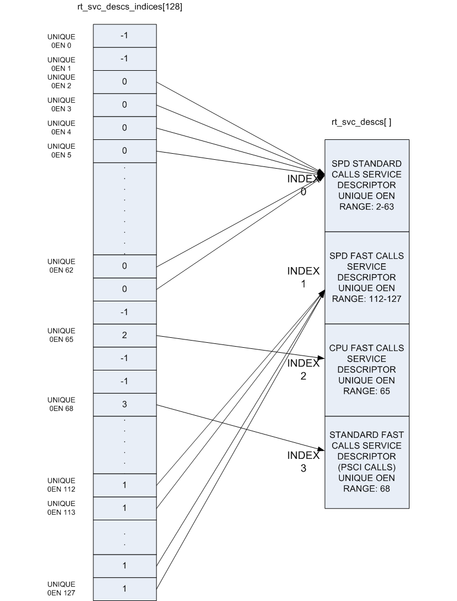

Firmware Design
===============

Trusted Firmware-A (TF-A) implements a subset of the Trusted Board Boot
Requirements (TBBR) Platform Design Document (PDD) for Arm reference
platforms.

The TBB sequence starts when the platform is powered on and runs up
to the stage where it hands-off control to firmware running in the normal
world in DRAM. This is the cold boot path.

TF-A also implements the `Power State Coordination Interface PDD`_ as a
runtime service. PSCI is the interface from normal world software to firmware
implementing power management use-cases (for example, secondary CPU boot,
hotplug and idle). Normal world software can access TF-A runtime services via
the Arm SMC (Secure Monitor Call) instruction. The SMC instruction must be
used as mandated by the SMC Calling Convention (`SMCCC`_).

TF-A implements a framework for configuring and managing interrupts generated
in either security state. The details of the interrupt management framework
and its design can be found in :ref:`Interrupt Management Framework`.

TF-A also implements a library for setting up and managing the translation
tables. The details of this library can be found in
:ref:`Translation (XLAT) Tables Library`.

TF-A can be built to support either AArch64 or AArch32 execution state.

.. note::

 The descriptions in this chapter are for the Arm TrustZone architecture.
 For changes to the firmware design for the
 `Arm Confidential Compute Architecture (Arm CCA)`_ please refer to the
 chapter :ref:`Realm Management Extension (RME)`.

Cold boot
---------

The cold boot path starts when the platform is physically turned on. If
``COLD_BOOT_SINGLE_CPU=0``, one of the CPUs released from reset is chosen as the
primary CPU, and the remaining CPUs are considered secondary CPUs. The primary
CPU is chosen through platform-specific means. The cold boot path is mainly
executed by the primary CPU, other than essential CPU initialization executed by
all CPUs. The secondary CPUs are kept in a safe platform-specific state until
the primary CPU has performed enough initialization to boot them.

Refer to the :ref:`CPU Reset` for more information on the effect of the
``COLD_BOOT_SINGLE_CPU`` platform build option.

The cold boot path in this implementation of TF-A depends on the execution
state. For AArch64, it is divided into five steps (in order of execution):

-  Boot Loader stage 1 (BL1) *AP Trusted ROM*
-  Boot Loader stage 2 (BL2) *Trusted Boot Firmware*
-  Boot Loader stage 3-1 (BL31) *EL3 Runtime Software*
-  Boot Loader stage 3-2 (BL32) *Secure-EL1 Payload* (optional)
-  Boot Loader stage 3-3 (BL33) *Non-trusted Firmware*

For AArch32, it is divided into four steps (in order of execution):

-  Boot Loader stage 1 (BL1) *AP Trusted ROM*
-  Boot Loader stage 2 (BL2) *Trusted Boot Firmware*
-  Boot Loader stage 3-2 (BL32) *EL3 Runtime Software*
-  Boot Loader stage 3-3 (BL33) *Non-trusted Firmware*

Arm development platforms (Fixed Virtual Platforms (FVPs) and Juno) implement a
combination of the following types of memory regions. Each bootloader stage uses
one or more of these memory regions.

-  Regions accessible from both non-secure and secure states. For example,
   non-trusted SRAM, ROM and DRAM.
-  Regions accessible from only the secure state. For example, trusted SRAM and
   ROM. The FVPs also implement the trusted DRAM which is statically
   configured. Additionally, the Base FVPs and Juno development platform
   configure the TrustZone Controller (TZC) to create a region in the DRAM
   which is accessible only from the secure state.

The sections below provide the following details:

-  dynamic configuration of Boot Loader stages
-  initialization and execution of the first three stages during cold boot
-  specification of the EL3 Runtime Software (BL31 for AArch64 and BL32 for
   AArch32) entrypoint requirements for use by alternative Trusted Boot
   Firmware in place of the provided BL1 and BL2

Dynamic Configuration during cold boot
~~~~~~~~~~~~~~~~~~~~~~~~~~~~~~~~~~~~~~

Each of the Boot Loader stages may be dynamically configured if required by the
platform. The Boot Loader stage may optionally specify a firmware
configuration file and/or hardware configuration file as listed below:

-  FW_CONFIG - The firmware configuration file. Holds properties shared across
   all BLx images.
   An example is the "dtb-registry" node, which contains the information about
   the other device tree configurations (load-address, size, image_id).
-  HW_CONFIG - The hardware configuration file. Can be shared by all Boot Loader
   stages and also by the Normal World Rich OS.
-  TB_FW_CONFIG - Trusted Boot Firmware configuration file. Shared between BL1
   and BL2.
-  SOC_FW_CONFIG - SoC Firmware configuration file. Used by BL31.
-  TOS_FW_CONFIG - Trusted OS Firmware configuration file. Used by Trusted OS
   (BL32).
-  NT_FW_CONFIG - Non Trusted Firmware configuration file. Used by Non-trusted
   firmware (BL33).

The Arm development platforms use the Flattened Device Tree format for the
dynamic configuration files.

Each Boot Loader stage can pass up to 4 arguments via registers to the next
stage.  BL2 passes the list of the next images to execute to the *EL3 Runtime
Software* (BL31 for AArch64 and BL32 for AArch32) via `arg0`. All the other
arguments are platform defined. The Arm development platforms use the following
convention:

-  BL1 passes the address of a meminfo_t structure to BL2 via ``arg1``. This
   structure contains the memory layout available to BL2.
-  When dynamic configuration files are present, the firmware configuration for
   the next Boot Loader stage is populated in the first available argument and
   the generic hardware configuration is passed the next available argument.
   For example,

   -  FW_CONFIG is loaded by BL1, then its address is passed in ``arg0`` to BL2.
   -  TB_FW_CONFIG address is retrieved by BL2 from FW_CONFIG device tree.
   -  If HW_CONFIG is loaded by BL1, then its address is passed in ``arg2`` to
      BL2. Note, ``arg1`` is already used for meminfo_t.
   -  If SOC_FW_CONFIG is loaded by BL2, then its address is passed in ``arg1``
      to BL31. Note, ``arg0`` is used to pass the list of executable images.
   -  Similarly, if HW_CONFIG is loaded by BL1 or BL2, then its address is
      passed in ``arg2`` to BL31.
   -  For other BL3x images, if the firmware configuration file is loaded by
      BL2, then its address is passed in ``arg0`` and if HW_CONFIG is loaded
      then its address is passed in ``arg1``.
   -  In case of the Arm FVP platform, FW_CONFIG address passed in ``arg1`` to
      BL31/SP_MIN, and the SOC_FW_CONFIG and HW_CONFIG details are retrieved
      from FW_CONFIG device tree.

BL1
~~~

This stage begins execution from the platform's reset vector at EL3. The reset
address is platform dependent but it is usually located in a Trusted ROM area.
The BL1 data section is copied to trusted SRAM at runtime.

On the Arm development platforms, BL1 code starts execution from the reset
vector defined by the constant ``BL1_RO_BASE``. The BL1 data section is copied
to the top of trusted SRAM as defined by the constant ``BL1_RW_BASE``.

The functionality implemented by this stage is as follows.

Determination of boot path
^^^^^^^^^^^^^^^^^^^^^^^^^^

Whenever a CPU is released from reset, BL1 needs to distinguish between a warm
boot and a cold boot. This is done using platform-specific mechanisms (see the
``plat_get_my_entrypoint()`` function in the :ref:`Porting Guide`). In the case
of a warm boot, a CPU is expected to continue execution from a separate
entrypoint. In the case of a cold boot, the secondary CPUs are placed in a safe
platform-specific state (see the ``plat_secondary_cold_boot_setup()`` function in
the :ref:`Porting Guide`) while the primary CPU executes the remaining cold boot
path as described in the following sections.

This step only applies when ``PROGRAMMABLE_RESET_ADDRESS=0``. Refer to the
:ref:`CPU Reset` for more information on the effect of the
``PROGRAMMABLE_RESET_ADDRESS`` platform build option.

Architectural initialization
^^^^^^^^^^^^^^^^^^^^^^^^^^^^

BL1 performs minimal architectural initialization as follows.

-  Exception vectors

   BL1 sets up simple exception vectors for both synchronous and asynchronous
   exceptions. The default behavior upon receiving an exception is to populate
   a status code in the general purpose register ``X0/R0`` and call the
   ``plat_report_exception()`` function (see the :ref:`Porting Guide`). The
   status code is one of:

   For AArch64:

   ::

       0x0 : Synchronous exception from Current EL with SP_EL0
       0x1 : IRQ exception from Current EL with SP_EL0
       0x2 : FIQ exception from Current EL with SP_EL0
       0x3 : System Error exception from Current EL with SP_EL0
       0x4 : Synchronous exception from Current EL with SP_ELx
       0x5 : IRQ exception from Current EL with SP_ELx
       0x6 : FIQ exception from Current EL with SP_ELx
       0x7 : System Error exception from Current EL with SP_ELx
       0x8 : Synchronous exception from Lower EL using aarch64
       0x9 : IRQ exception from Lower EL using aarch64
       0xa : FIQ exception from Lower EL using aarch64
       0xb : System Error exception from Lower EL using aarch64
       0xc : Synchronous exception from Lower EL using aarch32
       0xd : IRQ exception from Lower EL using aarch32
       0xe : FIQ exception from Lower EL using aarch32
       0xf : System Error exception from Lower EL using aarch32

   For AArch32:

   ::

       0x10 : User mode
       0x11 : FIQ mode
       0x12 : IRQ mode
       0x13 : SVC mode
       0x16 : Monitor mode
       0x17 : Abort mode
       0x1a : Hypervisor mode
       0x1b : Undefined mode
       0x1f : System mode

   The ``plat_report_exception()`` implementation on the Arm FVP port programs
   the Versatile Express System LED register in the following format to
   indicate the occurrence of an unexpected exception:

   ::

       SYS_LED[0]   - Security state (Secure=0/Non-Secure=1)
       SYS_LED[2:1] - Exception Level (EL3=0x3, EL2=0x2, EL1=0x1, EL0=0x0)
                      For AArch32 it is always 0x0
       SYS_LED[7:3] - Exception Class (Sync/Async & origin). This is the value
                      of the status code

   A write to the LED register reflects in the System LEDs (S6LED0..7) in the
   CLCD window of the FVP.

   BL1 does not expect to receive any exceptions other than the SMC exception.
   For the latter, BL1 installs a simple stub. The stub expects to receive a
   limited set of SMC types (determined by their function IDs in the general
   purpose register ``X0/R0``):

   -  ``BL1_SMC_RUN_IMAGE``: This SMC is raised by BL2 to make BL1 pass control
      to EL3 Runtime Software.
   -  All SMCs listed in section "BL1 SMC Interface" in the :ref:`Firmware Update (FWU)`
      Design Guide are supported for AArch64 only. These SMCs are currently
      not supported when BL1 is built for AArch32.

   Any other SMC leads to an assertion failure.

-  CPU initialization

   BL1 calls the ``reset_handler()`` function which in turn calls the CPU
   specific reset handler function (see the section: "CPU specific operations
   framework").

-  Control register setup (for AArch64)

   -  ``SCTLR_EL3``. Instruction cache is enabled by setting the ``SCTLR_EL3.I``
      bit. Alignment and stack alignment checking is enabled by setting the
      ``SCTLR_EL3.A`` and ``SCTLR_EL3.SA`` bits. Exception endianness is set to
      little-endian by clearing the ``SCTLR_EL3.EE`` bit.

   -  ``SCR_EL3``. The register width of the next lower exception level is set
      to AArch64 by setting the ``SCR.RW`` bit. The ``SCR.EA`` bit is set to trap
      both External Aborts and SError Interrupts in EL3. The ``SCR.SIF`` bit is
      also set to disable instruction fetches from Non-secure memory when in
      secure state.

   -  ``CPTR_EL3``. Accesses to the ``CPACR_EL1`` register from EL1 or EL2, or the
      ``CPTR_EL2`` register from EL2 are configured to not trap to EL3 by
      clearing the ``CPTR_EL3.TCPAC`` bit. Access to the trace functionality is
      configured not to trap to EL3 by clearing the ``CPTR_EL3.TTA`` bit.
      Instructions that access the registers associated with Floating Point
      and Advanced SIMD execution are configured to not trap to EL3 by
      clearing the ``CPTR_EL3.TFP`` bit.

   -  ``DAIF``. The SError interrupt is enabled by clearing the SError interrupt
      mask bit.

   -  ``MDCR_EL3``. The trap controls, ``MDCR_EL3.TDOSA``, ``MDCR_EL3.TDA`` and
      ``MDCR_EL3.TPM``, are set so that accesses to the registers they control
      do not trap to EL3. AArch64 Secure self-hosted debug is disabled by
      setting the ``MDCR_EL3.SDD`` bit. Also ``MDCR_EL3.SPD32`` is set to
      disable AArch32 Secure self-hosted privileged debug from S-EL1.

-  Control register setup (for AArch32)

   -  ``SCTLR``. Instruction cache is enabled by setting the ``SCTLR.I`` bit.
      Alignment checking is enabled by setting the ``SCTLR.A`` bit.
      Exception endianness is set to little-endian by clearing the
      ``SCTLR.EE`` bit.

   -  ``SCR``. The ``SCR.SIF`` bit is set to disable instruction fetches from
      Non-secure memory when in secure state.

   -  ``CPACR``. Allow execution of Advanced SIMD instructions at PL0 and PL1,
      by clearing the ``CPACR.ASEDIS`` bit. Access to the trace functionality
      is configured not to trap to undefined mode by clearing the
      ``CPACR.TRCDIS`` bit.

   -  ``NSACR``. Enable non-secure access to Advanced SIMD functionality and
      system register access to implemented trace registers.

   -  ``FPEXC``. Enable access to the Advanced SIMD and floating-point
      functionality from all Exception levels.

   -  ``CPSR.A``. The Asynchronous data abort interrupt is enabled by clearing
      the Asynchronous data abort interrupt mask bit.

   -  ``SDCR``. The ``SDCR.SPD`` field is set to disable AArch32 Secure
      self-hosted privileged debug.

Platform initialization
^^^^^^^^^^^^^^^^^^^^^^^

On Arm platforms, BL1 performs the following platform initializations:

-  Enable the Trusted Watchdog.
-  Initialize the console.
-  Configure the Interconnect to enable hardware coherency.
-  Enable the MMU and map the memory it needs to access.
-  Configure any required platform storage to load the next bootloader image
   (BL2).
-  If the BL1 dynamic configuration file, ``TB_FW_CONFIG``, is available, then
   load it to the platform defined address and make it available to BL2 via
   ``arg0``.
-  Configure the system timer and program the `CNTFRQ_EL0` for use by NS-BL1U
   and NS-BL2U firmware update images.

Firmware Update detection and execution
^^^^^^^^^^^^^^^^^^^^^^^^^^^^^^^^^^^^^^^

After performing platform setup, BL1 common code calls
``bl1_plat_get_next_image_id()`` to determine if :ref:`Firmware Update (FWU)` is
required or to proceed with the normal boot process. If the platform code
returns ``BL2_IMAGE_ID`` then the normal boot sequence is executed as described
in the next section, else BL1 assumes that :ref:`Firmware Update (FWU)` is
required and execution passes to the first image in the
:ref:`Firmware Update (FWU)` process. In either case, BL1 retrieves a descriptor
of the next image by calling ``bl1_plat_get_image_desc()``. The image descriptor
contains an ``entry_point_info_t`` structure, which BL1 uses to initialize the
execution state of the next image.

BL2 image load and execution
^^^^^^^^^^^^^^^^^^^^^^^^^^^^

In the normal boot flow, BL1 execution continues as follows:

#. BL1 prints the following string from the primary CPU to indicate successful
   execution of the BL1 stage:

   ::

       "Booting Trusted Firmware"

#. BL1 loads a BL2 raw binary image from platform storage, at a
   platform-specific base address. Prior to the load, BL1 invokes
   ``bl1_plat_handle_pre_image_load()`` which allows the platform to update or
   use the image information. If the BL2 image file is not present or if
   there is not enough free trusted SRAM the following error message is
   printed:

   ::

       "Failed to load BL2 firmware."

#. BL1 invokes ``bl1_plat_handle_post_image_load()`` which again is intended
   for platforms to take further action after image load. This function must
   populate the necessary arguments for BL2, which may also include the memory
   layout. Further description of the memory layout can be found later
   in this document.

#. BL1 passes control to the BL2 image at Secure EL1 (for AArch64) or at
   Secure SVC mode (for AArch32), starting from its load address.

BL2
~~~

BL1 loads and passes control to BL2 at Secure-EL1 (for AArch64) or at Secure
SVC mode (for AArch32) . BL2 is linked against and loaded at a platform-specific
base address (more information can be found later in this document).
The functionality implemented by BL2 is as follows.

Architectural initialization
^^^^^^^^^^^^^^^^^^^^^^^^^^^^

For AArch64, BL2 performs the minimal architectural initialization required
for subsequent stages of TF-A and normal world software. EL1 and EL0 are given
access to Floating Point and Advanced SIMD registers by setting the
``CPACR.FPEN`` bits.

For AArch32, the minimal architectural initialization required for subsequent
stages of TF-A and normal world software is taken care of in BL1 as both BL1
and BL2 execute at PL1.

Platform initialization
^^^^^^^^^^^^^^^^^^^^^^^

On Arm platforms, BL2 performs the following platform initializations:

-  Initialize the console.
-  Configure any required platform storage to allow loading further bootloader
   images.
-  Enable the MMU and map the memory it needs to access.
-  Perform platform security setup to allow access to controlled components.
-  Reserve some memory for passing information to the next bootloader image
   EL3 Runtime Software and populate it.
-  Define the extents of memory available for loading each subsequent
   bootloader image.
-  If BL1 has passed TB_FW_CONFIG dynamic configuration file in ``arg0``,
   then parse it.

Image loading in BL2
^^^^^^^^^^^^^^^^^^^^

BL2 generic code loads the images based on the list of loadable images
provided by the platform. BL2 passes the list of executable images
provided by the platform to the next handover BL image.

The list of loadable images provided by the platform may also contain
dynamic configuration files. The files are loaded and can be parsed as
needed in the ``bl2_plat_handle_post_image_load()`` function. These
configuration files can be passed to next Boot Loader stages as arguments
by updating the corresponding entrypoint information in this function.

SCP_BL2 (System Control Processor Firmware) image load
^^^^^^^^^^^^^^^^^^^^^^^^^^^^^^^^^^^^^^^^^^^^^^^^^^^^^^

Some systems have a separate System Control Processor (SCP) for power, clock,
reset and system control. BL2 loads the optional SCP_BL2 image from platform
storage into a platform-specific region of secure memory. The subsequent
handling of SCP_BL2 is platform specific. For example, on the Juno Arm
development platform port the image is transferred into SCP's internal memory
using the Boot Over MHU (BOM) protocol after being loaded in the trusted SRAM
memory. The SCP executes SCP_BL2 and signals to the Application Processor (AP)
for BL2 execution to continue.

EL3 Runtime Software image load
^^^^^^^^^^^^^^^^^^^^^^^^^^^^^^^

BL2 loads the EL3 Runtime Software image from platform storage into a platform-
specific address in trusted SRAM. If there is not enough memory to load the
image or image is missing it leads to an assertion failure.

AArch64 BL32 (Secure-EL1 Payload) image load
^^^^^^^^^^^^^^^^^^^^^^^^^^^^^^^^^^^^^^^^^^^^

BL2 loads the optional BL32 image from platform storage into a platform-
specific region of secure memory. The image executes in the secure world. BL2
relies on BL31 to pass control to the BL32 image, if present. Hence, BL2
populates a platform-specific area of memory with the entrypoint/load-address
of the BL32 image. The value of the Saved Processor Status Register (``SPSR``)
for entry into BL32 is not determined by BL2, it is initialized by the
Secure-EL1 Payload Dispatcher (see later) within BL31, which is responsible for
managing interaction with BL32. This information is passed to BL31.

BL33 (Non-trusted Firmware) image load
^^^^^^^^^^^^^^^^^^^^^^^^^^^^^^^^^^^^^^

BL2 loads the BL33 image (e.g. UEFI or other test or boot software) from
platform storage into non-secure memory as defined by the platform.

BL2 relies on EL3 Runtime Software to pass control to BL33 once secure state
initialization is complete. Hence, BL2 populates a platform-specific area of
memory with the entrypoint and Saved Program Status Register (``SPSR``) of the
normal world software image. The entrypoint is the load address of the BL33
image. The ``SPSR`` is determined as specified in Section 5.13 of the
`Power State Coordination Interface PDD`_. This information is passed to the
EL3 Runtime Software.

AArch64 BL31 (EL3 Runtime Software) execution
^^^^^^^^^^^^^^^^^^^^^^^^^^^^^^^^^^^^^^^^^^^^^

BL2 execution continues as follows:

#. BL2 passes control back to BL1 by raising an SMC, providing BL1 with the
   BL31 entrypoint. The exception is handled by the SMC exception handler
   installed by BL1.

#. BL1 turns off the MMU and flushes the caches. It clears the
   ``SCTLR_EL3.M/I/C`` bits, flushes the data cache to the point of coherency
   and invalidates the TLBs.

#. BL1 passes control to BL31 at the specified entrypoint at EL3.

Running BL2 at EL3 execution level
~~~~~~~~~~~~~~~~~~~~~~~~~~~~~~~~~~

Some platforms have a non-TF-A Boot ROM that expects the next boot stage
to execute at EL3. On these platforms, TF-A BL1 is a waste of memory
as its only purpose is to ensure TF-A BL2 is entered at S-EL1. To avoid
this waste, a special mode enables BL2 to execute at EL3, which allows
a non-TF-A Boot ROM to load and jump directly to BL2. This mode is selected
when the build flag BL2_AT_EL3 is enabled. The main differences in this
mode are:

#. BL2 includes the reset code and the mailbox mechanism to differentiate
   cold boot and warm boot. It runs at EL3 doing the arch
   initialization required for EL3.

#. BL2 does not receive the meminfo information from BL1 anymore. This
   information can be passed by the Boot ROM or be internal to the
   BL2 image.

#. Since BL2 executes at EL3, BL2 jumps directly to the next image,
   instead of invoking the RUN_IMAGE SMC call.

We assume 3 different types of BootROM support on the platform:

#. The Boot ROM always jumps to the same address, for both cold
   and warm boot. In this case, we will need to keep a resident part
   of BL2 whose memory cannot be reclaimed by any other image. The
   linker script defines the symbols __TEXT_RESIDENT_START__ and
   __TEXT_RESIDENT_END__ that allows the platform to configure
   correctly the memory map.
#. The platform has some mechanism to indicate the jump address to the
   Boot ROM. Platform code can then program the jump address with
   psci_warmboot_entrypoint during cold boot.
#. The platform has some mechanism to program the reset address using
   the PROGRAMMABLE_RESET_ADDRESS feature. Platform code can then
   program the reset address with psci_warmboot_entrypoint during
   cold boot, bypassing the boot ROM for warm boot.

In the last 2 cases, no part of BL2 needs to remain resident at
runtime. In the first 2 cases, we expect the Boot ROM to be able to
differentiate between warm and cold boot, to avoid loading BL2 again
during warm boot.

This functionality can be tested with FVP loading the image directly
in memory and changing the address where the system jumps at reset.
For example:

	-C cluster0.cpu0.RVBAR=0x4022000
	--data cluster0.cpu0=bl2.bin@0x4022000

With this configuration, FVP is like a platform of the first case,
where the Boot ROM jumps always to the same address. For simplification,
BL32 is loaded in DRAM in this case, to avoid other images reclaiming
BL2 memory.

AArch64 BL31
~~~~~~~~~~~~

The image for this stage is loaded by BL2 and BL1 passes control to BL31 at
EL3. BL31 executes solely in trusted SRAM. BL31 is linked against and
loaded at a platform-specific base address (more information can be found later
in this document). The functionality implemented by BL31 is as follows.

Architectural initialization
^^^^^^^^^^^^^^^^^^^^^^^^^^^^

Currently, BL31 performs a similar architectural initialization to BL1 as
far as system register settings are concerned. Since BL1 code resides in ROM,
architectural initialization in BL31 allows override of any previous
initialization done by BL1.

BL31 initializes the per-CPU data framework, which provides a cache of
frequently accessed per-CPU data optimised for fast, concurrent manipulation
on different CPUs. This buffer includes pointers to per-CPU contexts, crash
buffer, CPU reset and power down operations, PSCI data, platform data and so on.

It then replaces the exception vectors populated by BL1 with its own. BL31
exception vectors implement more elaborate support for handling SMCs since this
is the only mechanism to access the runtime services implemented by BL31 (PSCI
for example). BL31 checks each SMC for validity as specified by the
`SMC Calling Convention`_ before passing control to the required SMC
handler routine.

BL31 programs the ``CNTFRQ_EL0`` register with the clock frequency of the system
counter, which is provided by the platform.

Platform initialization
^^^^^^^^^^^^^^^^^^^^^^^

BL31 performs detailed platform initialization, which enables normal world
software to function correctly.

On Arm platforms, this consists of the following:

-  Initialize the console.
-  Configure the Interconnect to enable hardware coherency.
-  Enable the MMU and map the memory it needs to access.
-  Initialize the generic interrupt controller.
-  Initialize the power controller device.
-  Detect the system topology.

Runtime services initialization
^^^^^^^^^^^^^^^^^^^^^^^^^^^^^^^

BL31 is responsible for initializing the runtime services. One of them is PSCI.

As part of the PSCI initializations, BL31 detects the system topology. It also
initializes the data structures that implement the state machine used to track
the state of power domain nodes. The state can be one of ``OFF``, ``RUN`` or
``RETENTION``. All secondary CPUs are initially in the ``OFF`` state. The cluster
that the primary CPU belongs to is ``ON``; any other cluster is ``OFF``. It also
initializes the locks that protect them. BL31 accesses the state of a CPU or
cluster immediately after reset and before the data cache is enabled in the
warm boot path. It is not currently possible to use 'exclusive' based spinlocks,
therefore BL31 uses locks based on Lamport's Bakery algorithm instead.

The runtime service framework and its initialization is described in more
detail in the "EL3 runtime services framework" section below.

Details about the status of the PSCI implementation are provided in the
"Power State Coordination Interface" section below.

AArch64 BL32 (Secure-EL1 Payload) image initialization
^^^^^^^^^^^^^^^^^^^^^^^^^^^^^^^^^^^^^^^^^^^^^^^^^^^^^^

If a BL32 image is present then there must be a matching Secure-EL1 Payload
Dispatcher (SPD) service (see later for details). During initialization
that service must register a function to carry out initialization of BL32
once the runtime services are fully initialized. BL31 invokes such a
registered function to initialize BL32 before running BL33. This initialization
is not necessary for AArch32 SPs.

Details on BL32 initialization and the SPD's role are described in the
:ref:`firmware_design_sel1_spd` section below.

BL33 (Non-trusted Firmware) execution
^^^^^^^^^^^^^^^^^^^^^^^^^^^^^^^^^^^^^

EL3 Runtime Software initializes the EL2 or EL1 processor context for normal-
world cold boot, ensuring that no secure state information finds its way into
the non-secure execution state. EL3 Runtime Software uses the entrypoint
information provided by BL2 to jump to the Non-trusted firmware image (BL33)
at the highest available Exception Level (EL2 if available, otherwise EL1).

Using alternative Trusted Boot Firmware in place of BL1 & BL2 (AArch64 only)
~~~~~~~~~~~~~~~~~~~~~~~~~~~~~~~~~~~~~~~~~~~~~~~~~~~~~~~~~~~~~~~~~~~~~~~~~~~~

Some platforms have existing implementations of Trusted Boot Firmware that
would like to use TF-A BL31 for the EL3 Runtime Software. To enable this
firmware architecture it is important to provide a fully documented and stable
interface between the Trusted Boot Firmware and BL31.

Future changes to the BL31 interface will be done in a backwards compatible
way, and this enables these firmware components to be independently enhanced/
updated to develop and exploit new functionality.

Required CPU state when calling ``bl31_entrypoint()`` during cold boot
^^^^^^^^^^^^^^^^^^^^^^^^^^^^^^^^^^^^^^^^^^^^^^^^^^^^^^^^^^^^^^^^^^^^^^

This function must only be called by the primary CPU.

On entry to this function the calling primary CPU must be executing in AArch64
EL3, little-endian data access, and all interrupt sources masked:

::

    PSTATE.EL = 3
    PSTATE.RW = 1
    PSTATE.DAIF = 0xf
    SCTLR_EL3.EE = 0

X0 and X1 can be used to pass information from the Trusted Boot Firmware to the
platform code in BL31:

::

    X0 : Reserved for common TF-A information
    X1 : Platform specific information

BL31 zero-init sections (e.g. ``.bss``) should not contain valid data on entry,
these will be zero filled prior to invoking platform setup code.

Use of the X0 and X1 parameters
'''''''''''''''''''''''''''''''

The parameters are platform specific and passed from ``bl31_entrypoint()`` to
``bl31_early_platform_setup()``. The value of these parameters is never directly
used by the common BL31 code.

The convention is that ``X0`` conveys information regarding the BL31, BL32 and
BL33 images from the Trusted Boot firmware and ``X1`` can be used for other
platform specific purpose. This convention allows platforms which use TF-A's
BL1 and BL2 images to transfer additional platform specific information from
Secure Boot without conflicting with future evolution of TF-A using ``X0`` to
pass a ``bl31_params`` structure.

BL31 common and SPD initialization code depends on image and entrypoint
information about BL33 and BL32, which is provided via BL31 platform APIs.
This information is required until the start of execution of BL33. This
information can be provided in a platform defined manner, e.g. compiled into
the platform code in BL31, or provided in a platform defined memory location
by the Trusted Boot firmware, or passed from the Trusted Boot Firmware via the
Cold boot Initialization parameters. This data may need to be cleaned out of
the CPU caches if it is provided by an earlier boot stage and then accessed by
BL31 platform code before the caches are enabled.

TF-A's BL2 implementation passes a ``bl31_params`` structure in
``X0`` and the Arm development platforms interpret this in the BL31 platform
code.

MMU, Data caches & Coherency
''''''''''''''''''''''''''''

BL31 does not depend on the enabled state of the MMU, data caches or
interconnect coherency on entry to ``bl31_entrypoint()``. If these are disabled
on entry, these should be enabled during ``bl31_plat_arch_setup()``.

Data structures used in the BL31 cold boot interface
''''''''''''''''''''''''''''''''''''''''''''''''''''

These structures are designed to support compatibility and independent
evolution of the structures and the firmware images. For example, a version of
BL31 that can interpret the BL3x image information from different versions of
BL2, a platform that uses an extended entry_point_info structure to convey
additional register information to BL31, or a ELF image loader that can convey
more details about the firmware images.

To support these scenarios the structures are versioned and sized, which enables
BL31 to detect which information is present and respond appropriately. The
``param_header`` is defined to capture this information:

.. code:: c

    typedef struct param_header {
        uint8_t type;       /* type of the structure */
        uint8_t version;    /* version of this structure */
        uint16_t size;      /* size of this structure in bytes */
        uint32_t attr;      /* attributes: unused bits SBZ */
    } param_header_t;

The structures using this format are ``entry_point_info``, ``image_info`` and
``bl31_params``. The code that allocates and populates these structures must set
the header fields appropriately, and the ``SET_PARAM_HEAD()`` a macro is defined
to simplify this action.

Required CPU state for BL31 Warm boot initialization
^^^^^^^^^^^^^^^^^^^^^^^^^^^^^^^^^^^^^^^^^^^^^^^^^^^^

When requesting a CPU power-on, or suspending a running CPU, TF-A provides
the platform power management code with a Warm boot initialization
entry-point, to be invoked by the CPU immediately after the reset handler.
On entry to the Warm boot initialization function the calling CPU must be in
AArch64 EL3, little-endian data access and all interrupt sources masked:

::

    PSTATE.EL = 3
    PSTATE.RW = 1
    PSTATE.DAIF = 0xf
    SCTLR_EL3.EE = 0

The PSCI implementation will initialize the processor state and ensure that the
platform power management code is then invoked as required to initialize all
necessary system, cluster and CPU resources.

AArch32 EL3 Runtime Software entrypoint interface
~~~~~~~~~~~~~~~~~~~~~~~~~~~~~~~~~~~~~~~~~~~~~~~~~

To enable this firmware architecture it is important to provide a fully
documented and stable interface between the Trusted Boot Firmware and the
AArch32 EL3 Runtime Software.

Future changes to the entrypoint interface will be done in a backwards
compatible way, and this enables these firmware components to be independently
enhanced/updated to develop and exploit new functionality.

Required CPU state when entering during cold boot
^^^^^^^^^^^^^^^^^^^^^^^^^^^^^^^^^^^^^^^^^^^^^^^^^

This function must only be called by the primary CPU.

On entry to this function the calling primary CPU must be executing in AArch32
EL3, little-endian data access, and all interrupt sources masked:

::

    PSTATE.AIF = 0x7
    SCTLR.EE = 0

R0 and R1 are used to pass information from the Trusted Boot Firmware to the
platform code in AArch32 EL3 Runtime Software:

::

    R0 : Reserved for common TF-A information
    R1 : Platform specific information

Use of the R0 and R1 parameters
'''''''''''''''''''''''''''''''

The parameters are platform specific and the convention is that ``R0`` conveys
information regarding the BL3x images from the Trusted Boot firmware and ``R1``
can be used for other platform specific purpose. This convention allows
platforms which use TF-A's BL1 and BL2 images to transfer additional platform
specific information from Secure Boot without conflicting with future
evolution of TF-A using ``R0`` to pass a ``bl_params`` structure.

The AArch32 EL3 Runtime Software is responsible for entry into BL33. This
information can be obtained in a platform defined manner, e.g. compiled into
the AArch32 EL3 Runtime Software, or provided in a platform defined memory
location by the Trusted Boot firmware, or passed from the Trusted Boot Firmware
via the Cold boot Initialization parameters. This data may need to be cleaned
out of the CPU caches if it is provided by an earlier boot stage and then
accessed by AArch32 EL3 Runtime Software before the caches are enabled.

When using AArch32 EL3 Runtime Software, the Arm development platforms pass a
``bl_params`` structure in ``R0`` from BL2 to be interpreted by AArch32 EL3 Runtime
Software platform code.

MMU, Data caches & Coherency
''''''''''''''''''''''''''''

AArch32 EL3 Runtime Software must not depend on the enabled state of the MMU,
data caches or interconnect coherency in its entrypoint. They must be explicitly
enabled if required.

Data structures used in cold boot interface
'''''''''''''''''''''''''''''''''''''''''''

The AArch32 EL3 Runtime Software cold boot interface uses ``bl_params`` instead
of ``bl31_params``. The ``bl_params`` structure is based on the convention
described in AArch64 BL31 cold boot interface section.

Required CPU state for warm boot initialization
^^^^^^^^^^^^^^^^^^^^^^^^^^^^^^^^^^^^^^^^^^^^^^^

When requesting a CPU power-on, or suspending a running CPU, AArch32 EL3
Runtime Software must ensure execution of a warm boot initialization entrypoint.
If TF-A BL1 is used and the PROGRAMMABLE_RESET_ADDRESS build flag is false,
then AArch32 EL3 Runtime Software must ensure that BL1 branches to the warm
boot entrypoint by arranging for the BL1 platform function,
plat_get_my_entrypoint(), to return a non-zero value.

In this case, the warm boot entrypoint must be in AArch32 EL3, little-endian
data access and all interrupt sources masked:

::

    PSTATE.AIF = 0x7
    SCTLR.EE = 0

The warm boot entrypoint may be implemented by using TF-A
``psci_warmboot_entrypoint()`` function. In that case, the platform must fulfil
the pre-requisites mentioned in the
:ref:`PSCI Library Integration guide for Armv8-A AArch32 systems`.

EL3 runtime services framework
------------------------------

Software executing in the non-secure state and in the secure state at exception
levels lower than EL3 will request runtime services using the Secure Monitor
Call (SMC) instruction. These requests will follow the convention described in
the SMC Calling Convention PDD (`SMCCC`_). The `SMCCC`_ assigns function
identifiers to each SMC request and describes how arguments are passed and
returned.

The EL3 runtime services framework enables the development of services by
different providers that can be easily integrated into final product firmware.
The following sections describe the framework which facilitates the
registration, initialization and use of runtime services in EL3 Runtime
Software (BL31).

The design of the runtime services depends heavily on the concepts and
definitions described in the `SMCCC`_, in particular SMC Function IDs, Owning
Entity Numbers (OEN), Fast and Yielding calls, and the SMC32 and SMC64 calling
conventions. Please refer to that document for more detailed explanation of
these terms.

The following runtime services are expected to be implemented first. They have
not all been instantiated in the current implementation.

#. Standard service calls

   This service is for management of the entire system. The Power State
   Coordination Interface (`PSCI`_) is the first set of standard service calls
   defined by Arm (see PSCI section later).

#. Secure-EL1 Payload Dispatcher service

   If a system runs a Trusted OS or other Secure-EL1 Payload (SP) then
   it also requires a *Secure Monitor* at EL3 to switch the EL1 processor
   context between the normal world (EL1/EL2) and trusted world (Secure-EL1).
   The Secure Monitor will make these world switches in response to SMCs. The
   `SMCCC`_ provides for such SMCs with the Trusted OS Call and Trusted
   Application Call OEN ranges.

   The interface between the EL3 Runtime Software and the Secure-EL1 Payload is
   not defined by the `SMCCC`_ or any other standard. As a result, each
   Secure-EL1 Payload requires a specific Secure Monitor that runs as a runtime
   service - within TF-A this service is referred to as the Secure-EL1 Payload
   Dispatcher (SPD).

   TF-A provides a Test Secure-EL1 Payload (TSP) and its associated Dispatcher
   (TSPD). Details of SPD design and TSP/TSPD operation are described in the
   :ref:`firmware_design_sel1_spd` section below.

#. CPU implementation service

   This service will provide an interface to CPU implementation specific
   services for a given platform e.g. access to processor errata workarounds.
   This service is currently unimplemented.

Additional services for Arm Architecture, SiP and OEM calls can be implemented.
Each implemented service handles a range of SMC function identifiers as
described in the `SMCCC`_.

Registration
~~~~~~~~~~~~

A runtime service is registered using the ``DECLARE_RT_SVC()`` macro, specifying
the name of the service, the range of OENs covered, the type of service and
initialization and call handler functions. This macro instantiates a ``const struct rt_svc_desc`` for the service with these details (see ``runtime_svc.h``).
This structure is allocated in a special ELF section ``rt_svc_descs``, enabling
the framework to find all service descriptors included into BL31.

The specific service for a SMC Function is selected based on the OEN and call
type of the Function ID, and the framework uses that information in the service
descriptor to identify the handler for the SMC Call.

The service descriptors do not include information to identify the precise set
of SMC function identifiers supported by this service implementation, the
security state from which such calls are valid nor the capability to support
64-bit and/or 32-bit callers (using SMC32 or SMC64). Responding appropriately
to these aspects of a SMC call is the responsibility of the service
implementation, the framework is focused on integration of services from
different providers and minimizing the time taken by the framework before the
service handler is invoked.

Details of the parameters, requirements and behavior of the initialization and
call handling functions are provided in the following sections.

Initialization
~~~~~~~~~~~~~~

``runtime_svc_init()`` in ``runtime_svc.c`` initializes the runtime services
framework running on the primary CPU during cold boot as part of the BL31
initialization. This happens prior to initializing a Trusted OS and running
Normal world boot firmware that might in turn use these services.
Initialization involves validating each of the declared runtime service
descriptors, calling the service initialization function and populating the
index used for runtime lookup of the service.

The BL31 linker script collects all of the declared service descriptors into a
single array and defines symbols that allow the framework to locate and traverse
the array, and determine its size.

The framework does basic validation of each descriptor to halt firmware
initialization if service declaration errors are detected. The framework does
not check descriptors for the following error conditions, and may behave in an
unpredictable manner under such scenarios:

#. Overlapping OEN ranges
#. Multiple descriptors for the same range of OENs and ``call_type``
#. Incorrect range of owning entity numbers for a given ``call_type``

Once validated, the service ``init()`` callback is invoked. This function carries
out any essential EL3 initialization before servicing requests. The ``init()``
function is only invoked on the primary CPU during cold boot. If the service
uses per-CPU data this must either be initialized for all CPUs during this call,
or be done lazily when a CPU first issues an SMC call to that service. If
``init()`` returns anything other than ``0``, this is treated as an initialization
error and the service is ignored: this does not cause the firmware to halt.

The OEN and call type fields present in the SMC Function ID cover a total of
128 distinct services, but in practice a single descriptor can cover a range of
OENs, e.g. SMCs to call a Trusted OS function. To optimize the lookup of a
service handler, the framework uses an array of 128 indices that map every
distinct OEN/call-type combination either to one of the declared services or to
indicate the service is not handled. This ``rt_svc_descs_indices[]`` array is
populated for all of the OENs covered by a service after the service ``init()``
function has reported success. So a service that fails to initialize will never
have it's ``handle()`` function invoked.

The following figure shows how the ``rt_svc_descs_indices[]`` index maps the SMC
Function ID call type and OEN onto a specific service handler in the
``rt_svc_descs[]`` array.

|Image 1|

.. _handling-an-smc:

Handling an SMC
~~~~~~~~~~~~~~~

When the EL3 runtime services framework receives a Secure Monitor Call, the SMC
Function ID is passed in W0 from the lower exception level (as per the
`SMCCC`_). If the calling register width is AArch32, it is invalid to invoke an
SMC Function which indicates the SMC64 calling convention: such calls are
ignored and return the Unknown SMC Function Identifier result code ``0xFFFFFFFF``
in R0/X0.

Bit[31] (fast/yielding call) and bits[29:24] (owning entity number) of the SMC
Function ID are combined to index into the ``rt_svc_descs_indices[]`` array. The
resulting value might indicate a service that has no handler, in this case the
framework will also report an Unknown SMC Function ID. Otherwise, the value is
used as a further index into the ``rt_svc_descs[]`` array to locate the required
service and handler.

The service's ``handle()`` callback is provided with five of the SMC parameters
directly, the others are saved into memory for retrieval (if needed) by the
handler. The handler is also provided with an opaque ``handle`` for use with the
supporting library for parameter retrieval, setting return values and context
manipulation. The ``flags`` parameter indicates the security state of the caller
and the state of the SVE hint bit per the SMCCCv1.3. The framework finally sets
up the execution stack for the handler, and invokes the services ``handle()``
function.

On return from the handler the result registers are populated in X0-X7 as needed
before restoring the stack and CPU state and returning from the original SMC.

Exception Handling Framework
----------------------------

Please refer to the :ref:`Exception Handling Framework` document.

Power State Coordination Interface
----------------------------------

TODO: Provide design walkthrough of PSCI implementation.

The PSCI v1.1 specification categorizes APIs as optional and mandatory. All the
mandatory APIs in PSCI v1.1, PSCI v1.0 and in PSCI v0.2 draft specification
`Power State Coordination Interface PDD`_ are implemented. The table lists
the PSCI v1.1 APIs and their support in generic code.

An API implementation might have a dependency on platform code e.g. CPU_SUSPEND
requires the platform to export a part of the implementation. Hence the level
of support of the mandatory APIs depends upon the support exported by the
platform port as well. The Juno and FVP (all variants) platforms export all the
required support.

+-----------------------------+-------------+-------------------------------+
| PSCI v1.1 API               | Supported   | Comments                      |
+=============================+=============+===============================+
| ``PSCI_VERSION``            | Yes         | The version returned is 1.1   |
+-----------------------------+-------------+-------------------------------+
| ``CPU_SUSPEND``             | Yes\*       |                               |
+-----------------------------+-------------+-------------------------------+
| ``CPU_OFF``                 | Yes\*       |                               |
+-----------------------------+-------------+-------------------------------+
| ``CPU_ON``                  | Yes\*       |                               |
+-----------------------------+-------------+-------------------------------+
| ``AFFINITY_INFO``           | Yes         |                               |
+-----------------------------+-------------+-------------------------------+
| ``MIGRATE``                 | Yes\*\*     |                               |
+-----------------------------+-------------+-------------------------------+
| ``MIGRATE_INFO_TYPE``       | Yes\*\*     |                               |
+-----------------------------+-------------+-------------------------------+
| ``MIGRATE_INFO_CPU``        | Yes\*\*     |                               |
+-----------------------------+-------------+-------------------------------+
| ``SYSTEM_OFF``              | Yes\*       |                               |
+-----------------------------+-------------+-------------------------------+
| ``SYSTEM_RESET``            | Yes\*       |                               |
+-----------------------------+-------------+-------------------------------+
| ``PSCI_FEATURES``           | Yes         |                               |
+-----------------------------+-------------+-------------------------------+
| ``CPU_FREEZE``              | No          |                               |
+-----------------------------+-------------+-------------------------------+
| ``CPU_DEFAULT_SUSPEND``     | No          |                               |
+-----------------------------+-------------+-------------------------------+
| ``NODE_HW_STATE``           | Yes\*       |                               |
+-----------------------------+-------------+-------------------------------+
| ``SYSTEM_SUSPEND``          | Yes\*       |                               |
+-----------------------------+-------------+-------------------------------+
| ``PSCI_SET_SUSPEND_MODE``   | No          |                               |
+-----------------------------+-------------+-------------------------------+
| ``PSCI_STAT_RESIDENCY``     | Yes\*       |                               |
+-----------------------------+-------------+-------------------------------+
| ``PSCI_STAT_COUNT``         | Yes\*       |                               |
+-----------------------------+-------------+-------------------------------+
| ``SYSTEM_RESET2``           | Yes\*       |                               |
+-----------------------------+-------------+-------------------------------+
| ``MEM_PROTECT``             | Yes\*       |                               |
+-----------------------------+-------------+-------------------------------+
| ``MEM_PROTECT_CHECK_RANGE`` | Yes\*       |                               |
+-----------------------------+-------------+-------------------------------+

\*Note : These PSCI APIs require platform power management hooks to be
registered with the generic PSCI code to be supported.

\*\*Note : These PSCI APIs require appropriate Secure Payload Dispatcher
hooks to be registered with the generic PSCI code to be supported.

The PSCI implementation in TF-A is a library which can be integrated with
AArch64 or AArch32 EL3 Runtime Software for Armv8-A systems. A guide to
integrating PSCI library with AArch32 EL3 Runtime Software can be found
at :ref:`PSCI Library Integration guide for Armv8-A AArch32 systems`.

.. _firmware_design_sel1_spd:

Secure-EL1 Payloads and Dispatchers
-----------------------------------

On a production system that includes a Trusted OS running in Secure-EL1/EL0,
the Trusted OS is coupled with a companion runtime service in the BL31
firmware. This service is responsible for the initialisation of the Trusted
OS and all communications with it. The Trusted OS is the BL32 stage of the
boot flow in TF-A. The firmware will attempt to locate, load and execute a
BL32 image.

TF-A uses a more general term for the BL32 software that runs at Secure-EL1 -
the *Secure-EL1 Payload* - as it is not always a Trusted OS.

TF-A provides a Test Secure-EL1 Payload (TSP) and a Test Secure-EL1 Payload
Dispatcher (TSPD) service as an example of how a Trusted OS is supported on a
production system using the Runtime Services Framework. On such a system, the
Test BL32 image and service are replaced by the Trusted OS and its dispatcher
service. The TF-A build system expects that the dispatcher will define the
build flag ``NEED_BL32`` to enable it to include the BL32 in the build either
as a binary or to compile from source depending on whether the ``BL32`` build
option is specified or not.

The TSP runs in Secure-EL1. It is designed to demonstrate synchronous
communication with the normal-world software running in EL1/EL2. Communication
is initiated by the normal-world software

-  either directly through a Fast SMC (as defined in the `SMCCC`_)

-  or indirectly through a `PSCI`_ SMC. The `PSCI`_ implementation in turn
   informs the TSPD about the requested power management operation. This allows
   the TSP to prepare for or respond to the power state change

The TSPD service is responsible for.

-  Initializing the TSP

-  Routing requests and responses between the secure and the non-secure
   states during the two types of communications just described

Initializing a BL32 Image
~~~~~~~~~~~~~~~~~~~~~~~~~

The Secure-EL1 Payload Dispatcher (SPD) service is responsible for initializing
the BL32 image. It needs access to the information passed by BL2 to BL31 to do
so. This is provided by:

.. code:: c

    entry_point_info_t *bl31_plat_get_next_image_ep_info(uint32_t);

which returns a reference to the ``entry_point_info`` structure corresponding to
the image which will be run in the specified security state. The SPD uses this
API to get entry point information for the SECURE image, BL32.

In the absence of a BL32 image, BL31 passes control to the normal world
bootloader image (BL33). When the BL32 image is present, it is typical
that the SPD wants control to be passed to BL32 first and then later to BL33.

To do this the SPD has to register a BL32 initialization function during
initialization of the SPD service. The BL32 initialization function has this
prototype:

.. code:: c

    int32_t init(void);

and is registered using the ``bl31_register_bl32_init()`` function.

TF-A supports two approaches for the SPD to pass control to BL32 before
returning through EL3 and running the non-trusted firmware (BL33):

#. In the BL32 setup function, use ``bl31_set_next_image_type()`` to
   request that the exit from ``bl31_main()`` is to the BL32 entrypoint in
   Secure-EL1. BL31 will exit to BL32 using the asynchronous method by
   calling ``bl31_prepare_next_image_entry()`` and ``el3_exit()``.

   When the BL32 has completed initialization at Secure-EL1, it returns to
   BL31 by issuing an SMC, using a Function ID allocated to the SPD. On
   receipt of this SMC, the SPD service handler should switch the CPU context
   from trusted to normal world and use the ``bl31_set_next_image_type()`` and
   ``bl31_prepare_next_image_entry()`` functions to set up the initial return to
   the normal world firmware BL33. On return from the handler the framework
   will exit to EL2 and run BL33.

#. The BL32 setup function registers an initialization function using
   ``bl31_register_bl32_init()`` which provides a SPD-defined mechanism to
   invoke a 'world-switch synchronous call' to Secure-EL1 to run the BL32
   entrypoint.

   .. note::
      The Test SPD service included with TF-A provides one implementation
      of such a mechanism.

   On completion BL32 returns control to BL31 via a SMC, and on receipt the
   SPD service handler invokes the synchronous call return mechanism to return
   to the BL32 initialization function. On return from this function,
   ``bl31_main()`` will set up the return to the normal world firmware BL33 and
   continue the boot process in the normal world.

Crash Reporting in BL31
-----------------------

BL31 implements a scheme for reporting the processor state when an unhandled
exception is encountered. The reporting mechanism attempts to preserve all the
register contents and report it via a dedicated UART (PL011 console). BL31
reports the general purpose, EL3, Secure EL1 and some EL2 state registers.

A dedicated per-CPU crash stack is maintained by BL31 and this is retrieved via
the per-CPU pointer cache. The implementation attempts to minimise the memory
required for this feature. The file ``crash_reporting.S`` contains the
implementation for crash reporting.

The sample crash output is shown below.

::

    x0             = 0x000000002a4a0000
    x1             = 0x0000000000000001
    x2             = 0x0000000000000002
    x3             = 0x0000000000000003
    x4             = 0x0000000000000004
    x5             = 0x0000000000000005
    x6             = 0x0000000000000006
    x7             = 0x0000000000000007
    x8             = 0x0000000000000008
    x9             = 0x0000000000000009
    x10            = 0x0000000000000010
    x11            = 0x0000000000000011
    x12            = 0x0000000000000012
    x13            = 0x0000000000000013
    x14            = 0x0000000000000014
    x15            = 0x0000000000000015
    x16            = 0x0000000000000016
    x17            = 0x0000000000000017
    x18            = 0x0000000000000018
    x19            = 0x0000000000000019
    x20            = 0x0000000000000020
    x21            = 0x0000000000000021
    x22            = 0x0000000000000022
    x23            = 0x0000000000000023
    x24            = 0x0000000000000024
    x25            = 0x0000000000000025
    x26            = 0x0000000000000026
    x27            = 0x0000000000000027
    x28            = 0x0000000000000028
    x29            = 0x0000000000000029
    x30            = 0x0000000088000b78
    scr_el3        = 0x000000000003073d
    sctlr_el3      = 0x00000000b0cd183f
    cptr_el3       = 0x0000000000000000
    tcr_el3        = 0x000000008080351c
    daif           = 0x00000000000002c0
    mair_el3       = 0x00000000004404ff
    spsr_el3       = 0x0000000060000349
    elr_el3        = 0x0000000088000114
    ttbr0_el3      = 0x0000000004018201
    esr_el3        = 0x00000000be000000
    far_el3        = 0x0000000000000000
    spsr_el1       = 0x0000000000000000
    elr_el1        = 0x0000000000000000
    spsr_abt       = 0x0000000000000000
    spsr_und       = 0x0000000000000000
    spsr_irq       = 0x0000000000000000
    spsr_fiq       = 0x0000000000000000
    sctlr_el1      = 0x0000000030d00800
    actlr_el1      = 0x0000000000000000
    cpacr_el1      = 0x0000000000000000
    csselr_el1     = 0x0000000000000000
    sp_el1         = 0x0000000000000000
    esr_el1        = 0x0000000000000000
    ttbr0_el1      = 0x0000000000000000
    ttbr1_el1      = 0x0000000000000000
    mair_el1       = 0x0000000000000000
    amair_el1      = 0x0000000000000000
    tcr_el1        = 0x0000000000000000
    tpidr_el1      = 0x0000000000000000
    tpidr_el0      = 0x0000000000000000
    tpidrro_el0    = 0x0000000000000000
    par_el1        = 0x0000000000000000
    mpidr_el1      = 0x0000000080000000
    afsr0_el1      = 0x0000000000000000
    afsr1_el1      = 0x0000000000000000
    contextidr_el1 = 0x0000000000000000
    vbar_el1       = 0x0000000000000000
    cntp_ctl_el0   = 0x0000000000000000
    cntp_cval_el0  = 0x0000000000000000
    cntv_ctl_el0   = 0x0000000000000000
    cntv_cval_el0  = 0x0000000000000000
    cntkctl_el1    = 0x0000000000000000
    sp_el0         = 0x0000000004014940
    isr_el1        = 0x0000000000000000
    dacr32_el2     = 0x0000000000000000
    ifsr32_el2     = 0x0000000000000000
    icc_hppir0_el1 = 0x00000000000003ff
    icc_hppir1_el1 = 0x00000000000003ff
    icc_ctlr_el3   = 0x0000000000080400
    gicd_ispendr regs (Offsets 0x200-0x278)
    Offset		    Value
    0x200:	     0x0000000000000000
    0x208:	     0x0000000000000000
    0x210:	     0x0000000000000000
    0x218:	     0x0000000000000000
    0x220:	     0x0000000000000000
    0x228:	     0x0000000000000000
    0x230:	     0x0000000000000000
    0x238:	     0x0000000000000000
    0x240:	     0x0000000000000000
    0x248:	     0x0000000000000000
    0x250:	     0x0000000000000000
    0x258:	     0x0000000000000000
    0x260:	     0x0000000000000000
    0x268:	     0x0000000000000000
    0x270:	     0x0000000000000000
    0x278:	     0x0000000000000000

Guidelines for Reset Handlers
-----------------------------

TF-A implements a framework that allows CPU and platform ports to perform
actions very early after a CPU is released from reset in both the cold and warm
boot paths. This is done by calling the ``reset_handler()`` function in both
the BL1 and BL31 images. It in turn calls the platform and CPU specific reset
handling functions.

Details for implementing a CPU specific reset handler can be found in
Section 8. Details for implementing a platform specific reset handler can be
found in the :ref:`Porting Guide` (see the ``plat_reset_handler()`` function).

When adding functionality to a reset handler, keep in mind that if a different
reset handling behavior is required between the first and the subsequent
invocations of the reset handling code, this should be detected at runtime.
In other words, the reset handler should be able to detect whether an action has
already been performed and act as appropriate. Possible courses of actions are,
e.g. skip the action the second time, or undo/redo it.

.. _configuring-secure-interrupts:

Configuring secure interrupts
-----------------------------

The GIC driver is responsible for performing initial configuration of secure
interrupts on the platform. To this end, the platform is expected to provide the
GIC driver (either GICv2 or GICv3, as selected by the platform) with the
interrupt configuration during the driver initialisation.

Secure interrupt configuration are specified in an array of secure interrupt
properties. In this scheme, in both GICv2 and GICv3 driver data structures, the
``interrupt_props`` member points to an array of interrupt properties. Each
element of the array specifies the interrupt number and its attributes
(priority, group, configuration). Each element of the array shall be populated
by the macro ``INTR_PROP_DESC()``. The macro takes the following arguments:

- 10-bit interrupt number,

- 8-bit interrupt priority,

- Interrupt type (one of ``INTR_TYPE_EL3``, ``INTR_TYPE_S_EL1``,
  ``INTR_TYPE_NS``),

- Interrupt configuration (either ``GIC_INTR_CFG_LEVEL`` or
  ``GIC_INTR_CFG_EDGE``).

.. _firmware_design_cpu_ops_fwk:

CPU specific operations framework
---------------------------------

Certain aspects of the Armv8-A architecture are implementation defined,
that is, certain behaviours are not architecturally defined, but must be
defined and documented by individual processor implementations. TF-A
implements a framework which categorises the common implementation defined
behaviours and allows a processor to export its implementation of that
behaviour. The categories are:

#. Processor specific reset sequence.

#. Processor specific power down sequences.

#. Processor specific register dumping as a part of crash reporting.

#. Errata status reporting.

Each of the above categories fulfils a different requirement.

#. allows any processor specific initialization before the caches and MMU
   are turned on, like implementation of errata workarounds, entry into
   the intra-cluster coherency domain etc.

#. allows each processor to implement the power down sequence mandated in
   its Technical Reference Manual (TRM).

#. allows a processor to provide additional information to the developer
   in the event of a crash, for example Cortex-A53 has registers which
   can expose the data cache contents.

#. allows a processor to define a function that inspects and reports the status
   of all errata workarounds on that processor.

Please note that only 2. is mandated by the TRM.

The CPU specific operations framework scales to accommodate a large number of
different CPUs during power down and reset handling. The platform can specify
any CPU optimization it wants to enable for each CPU. It can also specify
the CPU errata workarounds to be applied for each CPU type during reset
handling by defining CPU errata compile time macros. Details on these macros
can be found in the :ref:`Arm CPU Specific Build Macros` document.

The CPU specific operations framework depends on the ``cpu_ops`` structure which
needs to be exported for each type of CPU in the platform. It is defined in
``include/lib/cpus/aarch64/cpu_macros.S`` and has the following fields : ``midr``,
``reset_func()``, ``cpu_pwr_down_ops`` (array of power down functions) and
``cpu_reg_dump()``.

The CPU specific files in ``lib/cpus`` export a ``cpu_ops`` data structure with
suitable handlers for that CPU. For example, ``lib/cpus/aarch64/cortex_a53.S``
exports the ``cpu_ops`` for Cortex-A53 CPU. According to the platform
configuration, these CPU specific files must be included in the build by
the platform makefile. The generic CPU specific operations framework code exists
in ``lib/cpus/aarch64/cpu_helpers.S``.

CPU specific Reset Handling
~~~~~~~~~~~~~~~~~~~~~~~~~~~

After a reset, the state of the CPU when it calls generic reset handler is:
MMU turned off, both instruction and data caches turned off and not part
of any coherency domain.

The BL entrypoint code first invokes the ``plat_reset_handler()`` to allow
the platform to perform any system initialization required and any system
errata workarounds that needs to be applied. The ``get_cpu_ops_ptr()`` reads
the current CPU midr, finds the matching ``cpu_ops`` entry in the ``cpu_ops``
array and returns it. Note that only the part number and implementer fields
in midr are used to find the matching ``cpu_ops`` entry. The ``reset_func()`` in
the returned ``cpu_ops`` is then invoked which executes the required reset
handling for that CPU and also any errata workarounds enabled by the platform.
This function must preserve the values of general purpose registers x20 to x29.

Refer to Section "Guidelines for Reset Handlers" for general guidelines
regarding placement of code in a reset handler.

CPU specific power down sequence
~~~~~~~~~~~~~~~~~~~~~~~~~~~~~~~~

During the BL31 initialization sequence, the pointer to the matching ``cpu_ops``
entry is stored in per-CPU data by ``init_cpu_ops()`` so that it can be quickly
retrieved during power down sequences.

Various CPU drivers register handlers to perform power down at certain power
levels for that specific CPU. The PSCI service, upon receiving a power down
request, determines the highest power level at which to execute power down
sequence for a particular CPU. It uses the ``prepare_cpu_pwr_dwn()`` function to
pick the right power down handler for the requested level. The function
retrieves ``cpu_ops`` pointer member of per-CPU data, and from that, further
retrieves ``cpu_pwr_down_ops`` array, and indexes into the required level. If the
requested power level is higher than what a CPU driver supports, the handler
registered for highest level is invoked.

At runtime the platform hooks for power down are invoked by the PSCI service to
perform platform specific operations during a power down sequence, for example
turning off CCI coherency during a cluster power down.

CPU specific register reporting during crash
~~~~~~~~~~~~~~~~~~~~~~~~~~~~~~~~~~~~~~~~~~~~

If the crash reporting is enabled in BL31, when a crash occurs, the crash
reporting framework calls ``do_cpu_reg_dump`` which retrieves the matching
``cpu_ops`` using ``get_cpu_ops_ptr()`` function. The ``cpu_reg_dump()`` in
``cpu_ops`` is invoked, which then returns the CPU specific register values to
be reported and a pointer to the ASCII list of register names in a format
expected by the crash reporting framework.

.. _firmware_design_cpu_errata_reporting:

CPU errata status reporting
~~~~~~~~~~~~~~~~~~~~~~~~~~~

Errata workarounds for CPUs supported in TF-A are applied during both cold and
warm boots, shortly after reset. Individual Errata workarounds are enabled as
build options. Some errata workarounds have potential run-time implications;
therefore some are enabled by default, others not. Platform ports shall
override build options to enable or disable errata as appropriate. The CPU
drivers take care of applying errata workarounds that are enabled and applicable
to a given CPU. Refer to :ref:`arm_cpu_macros_errata_workarounds` for more
information.

Functions in CPU drivers that apply errata workaround must follow the
conventions listed below.

The errata workaround must be authored as two separate functions:

-  One that checks for errata. This function must determine whether that errata
   applies to the current CPU. Typically this involves matching the current
   CPUs revision and variant against a value that's known to be affected by the
   errata. If the function determines that the errata applies to this CPU, it
   must return ``ERRATA_APPLIES``; otherwise, it must return
   ``ERRATA_NOT_APPLIES``. The utility functions ``cpu_get_rev_var`` and
   ``cpu_rev_var_ls`` functions may come in handy for this purpose.

For an errata identified as ``E``, the check function must be named
``check_errata_E``.

This function will be invoked at different times, both from assembly and from
C run time. Therefore it must follow AAPCS, and must not use stack.

-  Another one that applies the errata workaround. This function would call the
   check function described above, and applies errata workaround if required.

CPU drivers that apply errata workaround can optionally implement an assembly
function that report the status of errata workarounds pertaining to that CPU.
For a driver that registers the CPU, for example, ``cpux`` via ``declare_cpu_ops``
macro, the errata reporting function, if it exists, must be named
``cpux_errata_report``. This function will always be called with MMU enabled; it
must follow AAPCS and may use stack.

In a debug build of TF-A, on a CPU that comes out of reset, both BL1 and the
runtime firmware (BL31 in AArch64, and BL32 in AArch32) will invoke errata
status reporting function, if one exists, for that type of CPU.

To report the status of each errata workaround, the function shall use the
assembler macro ``report_errata``, passing it:

-  The build option that enables the errata;

-  The name of the CPU: this must be the same identifier that CPU driver
   registered itself with, using ``declare_cpu_ops``;

-  And the errata identifier: the identifier must match what's used in the
   errata's check function described above.

The errata status reporting function will be called once per CPU type/errata
combination during the software's active life time.

It's expected that whenever an errata workaround is submitted to TF-A, the
errata reporting function is appropriately extended to report its status as
well.

Reporting the status of errata workaround is for informational purpose only; it
has no functional significance.

Memory layout of BL images
--------------------------

Each bootloader image can be divided in 2 parts:

-  the static contents of the image. These are data actually stored in the
   binary on the disk. In the ELF terminology, they are called ``PROGBITS``
   sections;

-  the run-time contents of the image. These are data that don't occupy any
   space in the binary on the disk. The ELF binary just contains some
   metadata indicating where these data will be stored at run-time and the
   corresponding sections need to be allocated and initialized at run-time.
   In the ELF terminology, they are called ``NOBITS`` sections.

All PROGBITS sections are grouped together at the beginning of the image,
followed by all NOBITS sections. This is true for all TF-A images and it is
governed by the linker scripts. This ensures that the raw binary images are
as small as possible. If a NOBITS section was inserted in between PROGBITS
sections then the resulting binary file would contain zero bytes in place of
this NOBITS section, making the image unnecessarily bigger. Smaller images
allow faster loading from the FIP to the main memory.

For BL31, a platform can specify an alternate location for NOBITS sections
(other than immediately following PROGBITS sections) by setting
``SEPARATE_NOBITS_REGION`` to 1 and defining ``BL31_NOBITS_BASE`` and
``BL31_NOBITS_LIMIT``.

Linker scripts and symbols
~~~~~~~~~~~~~~~~~~~~~~~~~~

Each bootloader stage image layout is described by its own linker script. The
linker scripts export some symbols into the program symbol table. Their values
correspond to particular addresses. TF-A code can refer to these symbols to
figure out the image memory layout.

Linker symbols follow the following naming convention in TF-A.

-  ``__<SECTION>_START__``

   Start address of a given section named ``<SECTION>``.

-  ``__<SECTION>_END__``

   End address of a given section named ``<SECTION>``. If there is an alignment
   constraint on the section's end address then ``__<SECTION>_END__`` corresponds
   to the end address of the section's actual contents, rounded up to the right
   boundary. Refer to the value of ``__<SECTION>_UNALIGNED_END__`` to know the
   actual end address of the section's contents.

-  ``__<SECTION>_UNALIGNED_END__``

   End address of a given section named ``<SECTION>`` without any padding or
   rounding up due to some alignment constraint.

-  ``__<SECTION>_SIZE__``

   Size (in bytes) of a given section named ``<SECTION>``. If there is an
   alignment constraint on the section's end address then ``__<SECTION>_SIZE__``
   corresponds to the size of the section's actual contents, rounded up to the
   right boundary. In other words, ``__<SECTION>_SIZE__ = __<SECTION>_END__ - _<SECTION>_START__``. Refer to the value of ``__<SECTION>_UNALIGNED_SIZE__``
   to know the actual size of the section's contents.

-  ``__<SECTION>_UNALIGNED_SIZE__``

   Size (in bytes) of a given section named ``<SECTION>`` without any padding or
   rounding up due to some alignment constraint. In other words,
   ``__<SECTION>_UNALIGNED_SIZE__ = __<SECTION>_UNALIGNED_END__ - __<SECTION>_START__``.

Some of the linker symbols are mandatory as TF-A code relies on them to be
defined. They are listed in the following subsections. Some of them must be
provided for each bootloader stage and some are specific to a given bootloader
stage.

The linker scripts define some extra, optional symbols. They are not actually
used by any code but they help in understanding the bootloader images' memory
layout as they are easy to spot in the link map files.

Common linker symbols
^^^^^^^^^^^^^^^^^^^^^

All BL images share the following requirements:

-  The BSS section must be zero-initialised before executing any C code.
-  The coherent memory section (if enabled) must be zero-initialised as well.
-  The MMU setup code needs to know the extents of the coherent and read-only
   memory regions to set the right memory attributes. When
   ``SEPARATE_CODE_AND_RODATA=1``, it needs to know more specifically how the
   read-only memory region is divided between code and data.

The following linker symbols are defined for this purpose:

-  ``__BSS_START__``
-  ``__BSS_SIZE__``
-  ``__COHERENT_RAM_START__`` Must be aligned on a page-size boundary.
-  ``__COHERENT_RAM_END__`` Must be aligned on a page-size boundary.
-  ``__COHERENT_RAM_UNALIGNED_SIZE__``
-  ``__RO_START__``
-  ``__RO_END__``
-  ``__TEXT_START__``
-  ``__TEXT_END__``
-  ``__RODATA_START__``
-  ``__RODATA_END__``

BL1's linker symbols
^^^^^^^^^^^^^^^^^^^^

BL1 being the ROM image, it has additional requirements. BL1 resides in ROM and
it is entirely executed in place but it needs some read-write memory for its
mutable data. Its ``.data`` section (i.e. its allocated read-write data) must be
relocated from ROM to RAM before executing any C code.

The following additional linker symbols are defined for BL1:

-  ``__BL1_ROM_END__`` End address of BL1's ROM contents, covering its code
   and ``.data`` section in ROM.
-  ``__DATA_ROM_START__`` Start address of the ``.data`` section in ROM. Must be
   aligned on a 16-byte boundary.
-  ``__DATA_RAM_START__`` Address in RAM where the ``.data`` section should be
   copied over. Must be aligned on a 16-byte boundary.
-  ``__DATA_SIZE__`` Size of the ``.data`` section (in ROM or RAM).
-  ``__BL1_RAM_START__`` Start address of BL1 read-write data.
-  ``__BL1_RAM_END__`` End address of BL1 read-write data.

How to choose the right base addresses for each bootloader stage image
~~~~~~~~~~~~~~~~~~~~~~~~~~~~~~~~~~~~~~~~~~~~~~~~~~~~~~~~~~~~~~~~~~~~~~

There is currently no support for dynamic image loading in TF-A. This means
that all bootloader images need to be linked against their ultimate runtime
locations and the base addresses of each image must be chosen carefully such
that images don't overlap each other in an undesired way. As the code grows,
the base addresses might need adjustments to cope with the new memory layout.

The memory layout is completely specific to the platform and so there is no
general recipe for choosing the right base addresses for each bootloader image.
However, there are tools to aid in understanding the memory layout. These are
the link map files: ``build/<platform>/<build-type>/bl<x>/bl<x>.map``, with ``<x>``
being the stage bootloader. They provide a detailed view of the memory usage of
each image. Among other useful information, they provide the end address of
each image.

-  ``bl1.map`` link map file provides ``__BL1_RAM_END__`` address.
-  ``bl2.map`` link map file provides ``__BL2_END__`` address.
-  ``bl31.map`` link map file provides ``__BL31_END__`` address.
-  ``bl32.map`` link map file provides ``__BL32_END__`` address.

For each bootloader image, the platform code must provide its start address
as well as a limit address that it must not overstep. The latter is used in the
linker scripts to check that the image doesn't grow past that address. If that
happens, the linker will issue a message similar to the following:

::

    aarch64-none-elf-ld: BLx has exceeded its limit.

Additionally, if the platform memory layout implies some image overlaying like
on FVP, BL31 and TSP need to know the limit address that their PROGBITS
sections must not overstep. The platform code must provide those.

TF-A does not provide any mechanism to verify at boot time that the memory
to load a new image is free to prevent overwriting a previously loaded image.
The platform must specify the memory available in the system for all the
relevant BL images to be loaded.

For example, in the case of BL1 loading BL2, ``bl1_plat_sec_mem_layout()`` will
return the region defined by the platform where BL1 intends to load BL2. The
``load_image()`` function performs bounds check for the image size based on the
base and maximum image size provided by the platforms. Platforms must take
this behaviour into account when defining the base/size for each of the images.

Memory layout on Arm development platforms
^^^^^^^^^^^^^^^^^^^^^^^^^^^^^^^^^^^^^^^^^^

The following list describes the memory layout on the Arm development platforms:

-  A 4KB page of shared memory is used for communication between Trusted
   Firmware and the platform's power controller. This is located at the base of
   Trusted SRAM. The amount of Trusted SRAM available to load the bootloader
   images is reduced by the size of the shared memory.

   The shared memory is used to store the CPUs' entrypoint mailbox. On Juno,
   this is also used for the MHU payload when passing messages to and from the
   SCP.

-  Another 4 KB page is reserved for passing memory layout between BL1 and BL2
   and also the dynamic firmware configurations.

-  On FVP, BL1 is originally sitting in the Trusted ROM at address ``0x0``. On
   Juno, BL1 resides in flash memory at address ``0x0BEC0000``. BL1 read-write
   data are relocated to the top of Trusted SRAM at runtime.

-  BL2 is loaded below BL1 RW

-  EL3 Runtime Software, BL31 for AArch64 and BL32 for AArch32 (e.g. SP_MIN),
   is loaded at the top of the Trusted SRAM, such that its NOBITS sections will
   overwrite BL1 R/W data and BL2. This implies that BL1 global variables
   remain valid only until execution reaches the EL3 Runtime Software entry
   point during a cold boot.

-  On Juno, SCP_BL2 is loaded temporarily into the EL3 Runtime Software memory
   region and transferred to the SCP before being overwritten by EL3 Runtime
   Software.

-  BL32 (for AArch64) can be loaded in one of the following locations:

   -  Trusted SRAM
   -  Trusted DRAM (FVP only)
   -  Secure region of DRAM (top 16MB of DRAM configured by the TrustZone
      controller)

   When BL32 (for AArch64) is loaded into Trusted SRAM, it is loaded below
   BL31.

The location of the BL32 image will result in different memory maps. This is
illustrated for both FVP and Juno in the following diagrams, using the TSP as
an example.

.. note::
   Loading the BL32 image in TZC secured DRAM doesn't change the memory
   layout of the other images in Trusted SRAM.

CONFIG section in memory layouts shown below contains:

::

    +--------------------+
    |bl2_mem_params_descs|
    |--------------------|
    |     fw_configs     |
    +--------------------+

``bl2_mem_params_descs`` contains parameters passed from BL2 to next the
BL image during boot.

``fw_configs`` includes soc_fw_config, tos_fw_config, tb_fw_config and fw_config.

**FVP with TSP in Trusted SRAM with firmware configs :**
(These diagrams only cover the AArch64 case)

::

                   DRAM
    0xffffffff +----------+
               :          :
    0x82100000 |----------|
               |HW_CONFIG |
    0x82000000 |----------|  (non-secure)
               |          |
    0x80000000 +----------+

               Trusted DRAM
    0x08000000 +----------+
               |HW_CONFIG |
    0x07f00000 |----------|
               :          :
               |          |
    0x06000000 +----------+

               Trusted SRAM
    0x04040000 +----------+  loaded by BL2  +----------------+
               | BL1 (rw) |  <<<<<<<<<<<<<  |                |
               |----------|  <<<<<<<<<<<<<  |  BL31 NOBITS   |
               |   BL2    |  <<<<<<<<<<<<<  |                |
               |----------|  <<<<<<<<<<<<<  |----------------|
               |          |  <<<<<<<<<<<<<  | BL31 PROGBITS  |
               |          |  <<<<<<<<<<<<<  |----------------|
               |          |  <<<<<<<<<<<<<  |     BL32       |
    0x04003000 +----------+                 +----------------+
               |  CONFIG  |
    0x04001000 +----------+
               |  Shared  |
    0x04000000 +----------+

               Trusted ROM
    0x04000000 +----------+
               | BL1 (ro) |
    0x00000000 +----------+

**FVP with TSP in Trusted DRAM with firmware configs (default option):**

::

                     DRAM
    0xffffffff +--------------+
               :              :
    0x82100000 |--------------|
               |  HW_CONFIG   |
    0x82000000 |--------------|  (non-secure)
               |              |
    0x80000000 +--------------+

                 Trusted DRAM
    0x08000000 +--------------+
               |  HW_CONFIG   |
    0x07f00000 |--------------|
               :              :
               |    BL32      |
    0x06000000 +--------------+

                 Trusted SRAM
    0x04040000 +--------------+  loaded by BL2  +----------------+
               |   BL1 (rw)   |  <<<<<<<<<<<<<  |                |
               |--------------|  <<<<<<<<<<<<<  |  BL31 NOBITS   |
               |     BL2      |  <<<<<<<<<<<<<  |                |
               |--------------|  <<<<<<<<<<<<<  |----------------|
               |              |  <<<<<<<<<<<<<  | BL31 PROGBITS  |
               |              |                 +----------------+
    0x04003000 +--------------+
               |    CONFIG    |
    0x04001000 +--------------+
               |    Shared    |
    0x04000000 +--------------+

                 Trusted ROM
    0x04000000 +--------------+
               |   BL1 (ro)   |
    0x00000000 +--------------+

**FVP with TSP in TZC-Secured DRAM with firmware configs :**

::

                   DRAM
    0xffffffff +----------+
               |  BL32    |  (secure)
    0xff000000 +----------+
               |          |
    0x82100000 |----------|
               |HW_CONFIG |
    0x82000000 |----------|  (non-secure)
               |          |
    0x80000000 +----------+

               Trusted DRAM
    0x08000000 +----------+
               |HW_CONFIG |
    0x7f000000 |----------|
               :          :
               |          |
    0x06000000 +----------+

               Trusted SRAM
    0x04040000 +----------+  loaded by BL2  +----------------+
               | BL1 (rw) |  <<<<<<<<<<<<<  |                |
               |----------|  <<<<<<<<<<<<<  |  BL31 NOBITS   |
               |   BL2    |  <<<<<<<<<<<<<  |                |
               |----------|  <<<<<<<<<<<<<  |----------------|
               |          |  <<<<<<<<<<<<<  | BL31 PROGBITS  |
               |          |                 +----------------+
    0x04003000 +----------+
               |  CONFIG  |
    0x04001000 +----------+
               |  Shared  |
    0x04000000 +----------+

               Trusted ROM
    0x04000000 +----------+
               | BL1 (ro) |
    0x00000000 +----------+

**Juno with BL32 in Trusted SRAM :**

::

                  Flash0
    0x0C000000 +----------+
               :          :
    0x0BED0000 |----------|
               | BL1 (ro) |
    0x0BEC0000 |----------|
               :          :
    0x08000000 +----------+                  BL31 is loaded
                                             after SCP_BL2 has
               Trusted SRAM                  been sent to SCP
    0x04040000 +----------+  loaded by BL2  +----------------+
               | BL1 (rw) |  <<<<<<<<<<<<<  |                |
               |----------|  <<<<<<<<<<<<<  |  BL31 NOBITS   |
               |   BL2    |  <<<<<<<<<<<<<  |                |
               |----------|  <<<<<<<<<<<<<  |----------------|
               | SCP_BL2  |  <<<<<<<<<<<<<  | BL31 PROGBITS  |
               |          |  <<<<<<<<<<<<<  |----------------|
               |          |  <<<<<<<<<<<<<  |     BL32       |
               |          |                 +----------------+
               |          |
    0x04001000 +----------+
               |   MHU    |
    0x04000000 +----------+

**Juno with BL32 in TZC-secured DRAM :**

::

                   DRAM
    0xFFE00000 +----------+
               |  BL32    |  (secure)
    0xFF000000 |----------|
               |          |
               :          :  (non-secure)
               |          |
    0x80000000 +----------+

                  Flash0
    0x0C000000 +----------+
               :          :
    0x0BED0000 |----------|
               | BL1 (ro) |
    0x0BEC0000 |----------|
               :          :
    0x08000000 +----------+                  BL31 is loaded
                                             after SCP_BL2 has
               Trusted SRAM                  been sent to SCP
    0x04040000 +----------+  loaded by BL2  +----------------+
               | BL1 (rw) |  <<<<<<<<<<<<<  |                |
               |----------|  <<<<<<<<<<<<<  |  BL31 NOBITS   |
               |   BL2    |  <<<<<<<<<<<<<  |                |
               |----------|  <<<<<<<<<<<<<  |----------------|
               | SCP_BL2  |  <<<<<<<<<<<<<  | BL31 PROGBITS  |
               |          |                 +----------------+
    0x04001000 +----------+
               |   MHU    |
    0x04000000 +----------+

.. _firmware_design_fip:

Firmware Image Package (FIP)
----------------------------

Using a Firmware Image Package (FIP) allows for packing bootloader images (and
potentially other payloads) into a single archive that can be loaded by TF-A
from non-volatile platform storage. A driver to load images from a FIP has
been added to the storage layer and allows a package to be read from supported
platform storage. A tool to create Firmware Image Packages is also provided
and described below.

Firmware Image Package layout
~~~~~~~~~~~~~~~~~~~~~~~~~~~~~

The FIP layout consists of a table of contents (ToC) followed by payload data.
The ToC itself has a header followed by one or more table entries. The ToC is
terminated by an end marker entry, and since the size of the ToC is 0 bytes,
the offset equals the total size of the FIP file. All ToC entries describe some
payload data that has been appended to the end of the binary package. With the
information provided in the ToC entry the corresponding payload data can be
retrieved.

::

    ------------------
    | ToC Header     |
    |----------------|
    | ToC Entry 0    |
    |----------------|
    | ToC Entry 1    |
    |----------------|
    | ToC End Marker |
    |----------------|
    |                |
    |     Data 0     |
    |                |
    |----------------|
    |                |
    |     Data 1     |
    |                |
    ------------------

The ToC header and entry formats are described in the header file
``include/tools_share/firmware_image_package.h``. This file is used by both the
tool and TF-A.

The ToC header has the following fields:

::

    `name`: The name of the ToC. This is currently used to validate the header.
    `serial_number`: A non-zero number provided by the creation tool
    `flags`: Flags associated with this data.
        Bits 0-31: Reserved
        Bits 32-47: Platform defined
        Bits 48-63: Reserved

A ToC entry has the following fields:

::

    `uuid`: All files are referred to by a pre-defined Universally Unique
        IDentifier [UUID] . The UUIDs are defined in
        `include/tools_share/firmware_image_package.h`. The platform translates
        the requested image name into the corresponding UUID when accessing the
        package.
    `offset_address`: The offset address at which the corresponding payload data
        can be found. The offset is calculated from the ToC base address.
    `size`: The size of the corresponding payload data in bytes.
    `flags`: Flags associated with this entry. None are yet defined.

Firmware Image Package creation tool
~~~~~~~~~~~~~~~~~~~~~~~~~~~~~~~~~~~~

The FIP creation tool can be used to pack specified images into a binary
package that can be loaded by TF-A from platform storage. The tool currently
only supports packing bootloader images. Additional image definitions can be
added to the tool as required.

The tool can be found in ``tools/fiptool``.

Loading from a Firmware Image Package (FIP)
~~~~~~~~~~~~~~~~~~~~~~~~~~~~~~~~~~~~~~~~~~~

The Firmware Image Package (FIP) driver can load images from a binary package on
non-volatile platform storage. For the Arm development platforms, this is
currently NOR FLASH.

Bootloader images are loaded according to the platform policy as specified by
the function ``plat_get_image_source()``. For the Arm development platforms, this
means the platform will attempt to load images from a Firmware Image Package
located at the start of NOR FLASH0.

The Arm development platforms' policy is to only allow loading of a known set of
images. The platform policy can be modified to allow additional images.

Use of coherent memory in TF-A
------------------------------

There might be loss of coherency when physical memory with mismatched
shareability, cacheability and memory attributes is accessed by multiple CPUs
(refer to section B2.9 of `Arm ARM`_ for more details). This possibility occurs
in TF-A during power up/down sequences when coherency, MMU and caches are
turned on/off incrementally.

TF-A defines coherent memory as a region of memory with Device nGnRE attributes
in the translation tables. The translation granule size in TF-A is 4KB. This
is the smallest possible size of the coherent memory region.

By default, all data structures which are susceptible to accesses with
mismatched attributes from various CPUs are allocated in a coherent memory
region (refer to section 2.1 of :ref:`Porting Guide`). The coherent memory
region accesses are Outer Shareable, non-cacheable and they can be accessed with
the Device nGnRE attributes when the MMU is turned on. Hence, at the expense of
at least an extra page of memory, TF-A is able to work around coherency issues
due to mismatched memory attributes.

The alternative to the above approach is to allocate the susceptible data
structures in Normal WriteBack WriteAllocate Inner shareable memory. This
approach requires the data structures to be designed so that it is possible to
work around the issue of mismatched memory attributes by performing software
cache maintenance on them.

Disabling the use of coherent memory in TF-A
~~~~~~~~~~~~~~~~~~~~~~~~~~~~~~~~~~~~~~~~~~~~

It might be desirable to avoid the cost of allocating coherent memory on
platforms which are memory constrained. TF-A enables inclusion of coherent
memory in firmware images through the build flag ``USE_COHERENT_MEM``.
This flag is enabled by default. It can be disabled to choose the second
approach described above.

The below sections analyze the data structures allocated in the coherent memory
region and the changes required to allocate them in normal memory.

Coherent memory usage in PSCI implementation
~~~~~~~~~~~~~~~~~~~~~~~~~~~~~~~~~~~~~~~~~~~~

The ``psci_non_cpu_pd_nodes`` data structure stores the platform's power domain
tree information for state management of power domains. By default, this data
structure is allocated in the coherent memory region in TF-A because it can be
accessed by multiple CPUs, either with caches enabled or disabled.

.. code:: c

    typedef struct non_cpu_pwr_domain_node {
        /*
         * Index of the first CPU power domain node level 0 which has this node
         * as its parent.
         */
        unsigned int cpu_start_idx;

        /*
         * Number of CPU power domains which are siblings of the domain indexed
         * by 'cpu_start_idx' i.e. all the domains in the range 'cpu_start_idx
         * -> cpu_start_idx + ncpus' have this node as their parent.
         */
        unsigned int ncpus;

        /*
         * Index of the parent power domain node.
         */
        unsigned int parent_node;

        plat_local_state_t local_state;

        unsigned char level;

        /* For indexing the psci_lock array*/
        unsigned char lock_index;
    } non_cpu_pd_node_t;

In order to move this data structure to normal memory, the use of each of its
fields must be analyzed. Fields like ``cpu_start_idx``, ``ncpus``, ``parent_node``
``level`` and ``lock_index`` are only written once during cold boot. Hence removing
them from coherent memory involves only doing a clean and invalidate of the
cache lines after these fields are written.

The field ``local_state`` can be concurrently accessed by multiple CPUs in
different cache states. A Lamport's Bakery lock ``psci_locks`` is used to ensure
mutual exclusion to this field and a clean and invalidate is needed after it
is written.

Bakery lock data
~~~~~~~~~~~~~~~~

The bakery lock data structure ``bakery_lock_t`` is allocated in coherent memory
and is accessed by multiple CPUs with mismatched attributes. ``bakery_lock_t`` is
defined as follows:

.. code:: c

    typedef struct bakery_lock {
        /*
         * The lock_data is a bit-field of 2 members:
         * Bit[0]       : choosing. This field is set when the CPU is
         *                choosing its bakery number.
         * Bits[1 - 15] : number. This is the bakery number allocated.
         */
        volatile uint16_t lock_data[BAKERY_LOCK_MAX_CPUS];
    } bakery_lock_t;

It is a characteristic of Lamport's Bakery algorithm that the volatile per-CPU
fields can be read by all CPUs but only written to by the owning CPU.

Depending upon the data cache line size, the per-CPU fields of the
``bakery_lock_t`` structure for multiple CPUs may exist on a single cache line.
These per-CPU fields can be read and written during lock contention by multiple
CPUs with mismatched memory attributes. Since these fields are a part of the
lock implementation, they do not have access to any other locking primitive to
safeguard against the resulting coherency issues. As a result, simple software
cache maintenance is not enough to allocate them in coherent memory. Consider
the following example.

CPU0 updates its per-CPU field with data cache enabled. This write updates a
local cache line which contains a copy of the fields for other CPUs as well. Now
CPU1 updates its per-CPU field of the ``bakery_lock_t`` structure with data cache
disabled. CPU1 then issues a DCIVAC operation to invalidate any stale copies of
its field in any other cache line in the system. This operation will invalidate
the update made by CPU0 as well.

To use bakery locks when ``USE_COHERENT_MEM`` is disabled, the lock data structure
has been redesigned. The changes utilise the characteristic of Lamport's Bakery
algorithm mentioned earlier. The bakery_lock structure only allocates the memory
for a single CPU. The macro ``DEFINE_BAKERY_LOCK`` allocates all the bakery locks
needed for a CPU into a section ``bakery_lock``. The linker allocates the memory
for other cores by using the total size allocated for the bakery_lock section
and multiplying it with (PLATFORM_CORE_COUNT - 1). This enables software to
perform software cache maintenance on the lock data structure without running
into coherency issues associated with mismatched attributes.

The bakery lock data structure ``bakery_info_t`` is defined for use when
``USE_COHERENT_MEM`` is disabled as follows:

.. code:: c

    typedef struct bakery_info {
        /*
         * The lock_data is a bit-field of 2 members:
         * Bit[0]       : choosing. This field is set when the CPU is
         *                choosing its bakery number.
         * Bits[1 - 15] : number. This is the bakery number allocated.
         */
         volatile uint16_t lock_data;
    } bakery_info_t;

The ``bakery_info_t`` represents a single per-CPU field of one lock and
the combination of corresponding ``bakery_info_t`` structures for all CPUs in the
system represents the complete bakery lock. The view in memory for a system
with n bakery locks are:

::

    bakery_lock section start
    |----------------|
    | `bakery_info_t`| <-- Lock_0 per-CPU field
    |    Lock_0      |     for CPU0
    |----------------|
    | `bakery_info_t`| <-- Lock_1 per-CPU field
    |    Lock_1      |     for CPU0
    |----------------|
    | ....           |
    |----------------|
    | `bakery_info_t`| <-- Lock_N per-CPU field
    |    Lock_N      |     for CPU0
    ------------------
    |    XXXXX       |
    | Padding to     |
    | next Cache WB  | <--- Calculate PERCPU_BAKERY_LOCK_SIZE, allocate
    |  Granule       |       continuous memory for remaining CPUs.
    ------------------
    | `bakery_info_t`| <-- Lock_0 per-CPU field
    |    Lock_0      |     for CPU1
    |----------------|
    | `bakery_info_t`| <-- Lock_1 per-CPU field
    |    Lock_1      |     for CPU1
    |----------------|
    | ....           |
    |----------------|
    | `bakery_info_t`| <-- Lock_N per-CPU field
    |    Lock_N      |     for CPU1
    ------------------
    |    XXXXX       |
    | Padding to     |
    | next Cache WB  |
    |  Granule       |
    ------------------

Consider a system of 2 CPUs with 'N' bakery locks as shown above. For an
operation on Lock_N, the corresponding ``bakery_info_t`` in both CPU0 and CPU1
``bakery_lock`` section need to be fetched and appropriate cache operations need
to be performed for each access.

On Arm Platforms, bakery locks are used in psci (``psci_locks``) and power controller
driver (``arm_lock``).

Non Functional Impact of removing coherent memory
~~~~~~~~~~~~~~~~~~~~~~~~~~~~~~~~~~~~~~~~~~~~~~~~~

Removal of the coherent memory region leads to the additional software overhead
of performing cache maintenance for the affected data structures. However, since
the memory where the data structures are allocated is cacheable, the overhead is
mostly mitigated by an increase in performance.

There is however a performance impact for bakery locks, due to:

-  Additional cache maintenance operations, and
-  Multiple cache line reads for each lock operation, since the bakery locks
   for each CPU are distributed across different cache lines.

The implementation has been optimized to minimize this additional overhead.
Measurements indicate that when bakery locks are allocated in Normal memory, the
minimum latency of acquiring a lock is on an average 3-4 micro seconds whereas
in Device memory the same is 2 micro seconds. The measurements were done on the
Juno Arm development platform.

As mentioned earlier, almost a page of memory can be saved by disabling
``USE_COHERENT_MEM``. Each platform needs to consider these trade-offs to decide
whether coherent memory should be used. If a platform disables
``USE_COHERENT_MEM`` and needs to use bakery locks in the porting layer, it can
optionally define macro ``PLAT_PERCPU_BAKERY_LOCK_SIZE`` (see the
:ref:`Porting Guide`). Refer to the reference platform code for examples.

Isolating code and read-only data on separate memory pages
----------------------------------------------------------

In the Armv8-A VMSA, translation table entries include fields that define the
properties of the target memory region, such as its access permissions. The
smallest unit of memory that can be addressed by a translation table entry is
a memory page. Therefore, if software needs to set different permissions on two
memory regions then it needs to map them using different memory pages.

The default memory layout for each BL image is as follows:

::

       |        ...        |
       +-------------------+
       |  Read-write data  |
       +-------------------+ Page boundary
       |     <Padding>     |
       +-------------------+
       | Exception vectors |
       +-------------------+ 2 KB boundary
       |     <Padding>     |
       +-------------------+
       |  Read-only data   |
       +-------------------+
       |       Code        |
       +-------------------+ BLx_BASE

.. note::
   The 2KB alignment for the exception vectors is an architectural
   requirement.

The read-write data start on a new memory page so that they can be mapped with
read-write permissions, whereas the code and read-only data below are configured
as read-only.

However, the read-only data are not aligned on a page boundary. They are
contiguous to the code. Therefore, the end of the code section and the beginning
of the read-only data one might share a memory page. This forces both to be
mapped with the same memory attributes. As the code needs to be executable, this
means that the read-only data stored on the same memory page as the code are
executable as well. This could potentially be exploited as part of a security
attack.

TF provides the build flag ``SEPARATE_CODE_AND_RODATA`` to isolate the code and
read-only data on separate memory pages. This in turn allows independent control
of the access permissions for the code and read-only data. In this case,
platform code gets a finer-grained view of the image layout and can
appropriately map the code region as executable and the read-only data as
execute-never.

This has an impact on memory footprint, as padding bytes need to be introduced
between the code and read-only data to ensure the segregation of the two. To
limit the memory cost, this flag also changes the memory layout such that the
code and exception vectors are now contiguous, like so:

::

       |        ...        |
       +-------------------+
       |  Read-write data  |
       +-------------------+ Page boundary
       |     <Padding>     |
       +-------------------+
       |  Read-only data   |
       +-------------------+ Page boundary
       |     <Padding>     |
       +-------------------+
       | Exception vectors |
       +-------------------+ 2 KB boundary
       |     <Padding>     |
       +-------------------+
       |       Code        |
       +-------------------+ BLx_BASE

With this more condensed memory layout, the separation of read-only data will
add zero or one page to the memory footprint of each BL image. Each platform
should consider the trade-off between memory footprint and security.

This build flag is disabled by default, minimising memory footprint. On Arm
platforms, it is enabled.

Publish and Subscribe Framework
-------------------------------

The Publish and Subscribe Framework allows EL3 components to define and publish
events, to which other EL3 components can subscribe.

The following macros are provided by the framework:

-  ``REGISTER_PUBSUB_EVENT(event)``: Defines an event, and takes one argument,
   the event name, which must be a valid C identifier. All calls to
   ``REGISTER_PUBSUB_EVENT`` macro must be placed in the file
   ``pubsub_events.h``.

-  ``PUBLISH_EVENT_ARG(event, arg)``: Publishes a defined event, by iterating
   subscribed handlers and calling them in turn. The handlers will be passed the
   parameter ``arg``. The expected use-case is to broadcast an event.

-  ``PUBLISH_EVENT(event)``: Like ``PUBLISH_EVENT_ARG``, except that the value
   ``NULL`` is passed to subscribed handlers.

-  ``SUBSCRIBE_TO_EVENT(event, handler)``: Registers the ``handler`` to
   subscribe to ``event``. The handler will be executed whenever the ``event``
   is published.

-  ``for_each_subscriber(event, subscriber)``: Iterates through all handlers
   subscribed for ``event``. ``subscriber`` must be a local variable of type
   ``pubsub_cb_t *``, and will point to each subscribed handler in turn during
   iteration. This macro can be used for those patterns that none of the
   ``PUBLISH_EVENT_*()`` macros cover.

Publishing an event that wasn't defined using ``REGISTER_PUBSUB_EVENT`` will
result in build error. Subscribing to an undefined event however won't.

Subscribed handlers must be of type ``pubsub_cb_t``, with following function
signature:

.. code:: c

   typedef void* (*pubsub_cb_t)(const void *arg);

There may be arbitrary number of handlers registered to the same event. The
order in which subscribed handlers are notified when that event is published is
not defined. Subscribed handlers may be executed in any order; handlers should
not assume any relative ordering amongst them.

Publishing an event on a PE will result in subscribed handlers executing on that
PE only; it won't cause handlers to execute on a different PE.

Note that publishing an event on a PE blocks until all the subscribed handlers
finish executing on the PE.

TF-A generic code publishes and subscribes to some events within. Platform
ports are discouraged from subscribing to them. These events may be withdrawn,
renamed, or have their semantics altered in the future. Platforms may however
register, publish, and subscribe to platform-specific events.

Publish and Subscribe Example
~~~~~~~~~~~~~~~~~~~~~~~~~~~~~

A publisher that wants to publish event ``foo`` would:

-  Define the event ``foo`` in the ``pubsub_events.h``.

   .. code:: c

      REGISTER_PUBSUB_EVENT(foo);

-  Depending on the nature of event, use one of ``PUBLISH_EVENT_*()`` macros to
   publish the event at the appropriate path and time of execution.

A subscriber that wants to subscribe to event ``foo`` published above would
implement:

.. code:: c

    void *foo_handler(const void *arg)
    {
         void *result;

         /* Do handling ... */

         return result;
    }

    SUBSCRIBE_TO_EVENT(foo, foo_handler);

Reclaiming the BL31 initialization code
~~~~~~~~~~~~~~~~~~~~~~~~~~~~~~~~~~~~~~~~~~~~~~~

A significant amount of the code used for the initialization of BL31 is never
needed again after boot time. In order to reduce the runtime memory
footprint, the memory used for this code can be reclaimed after initialization
has finished and be used for runtime data.

The build option ``RECLAIM_INIT_CODE`` can be set to mark this boot time code
with a ``.text.init.*`` attribute which can be filtered and placed suitably
within the BL image for later reclamation by the platform. The platform can
specify the filter and the memory region for this init section in BL31 via the
plat.ld.S linker script. For example, on the FVP, this section is placed
overlapping the secondary CPU stacks so that after the cold boot is done, this
memory can be reclaimed for the stacks. The init memory section is initially
mapped with ``RO``, ``EXECUTE`` attributes. After BL31 initialization has
completed, the FVP changes the attributes of this section to ``RW``,
``EXECUTE_NEVER`` allowing it to be used for runtime data. The memory attributes
are changed within the ``bl31_plat_runtime_setup`` platform hook. The init
section section can be reclaimed for any data which is accessed after cold
boot initialization and it is upto the platform to make the decision.

.. _firmware_design_pmf:

Performance Measurement Framework
---------------------------------

The Performance Measurement Framework (PMF) facilitates collection of
timestamps by registered services and provides interfaces to retrieve them
from within TF-A. A platform can choose to expose appropriate SMCs to
retrieve these collected timestamps.

By default, the global physical counter is used for the timestamp
value and is read via ``CNTPCT_EL0``. The framework allows to retrieve
timestamps captured by other CPUs.

Timestamp identifier format
~~~~~~~~~~~~~~~~~~~~~~~~~~~

A PMF timestamp is uniquely identified across the system via the
timestamp ID or ``tid``. The ``tid`` is composed as follows:

::

    Bits 0-7: The local timestamp identifier.
    Bits 8-9: Reserved.
    Bits 10-15: The service identifier.
    Bits 16-31: Reserved.

#. The service identifier. Each PMF service is identified by a
   service name and a service identifier. Both the service name and
   identifier are unique within the system as a whole.

#. The local timestamp identifier. This identifier is unique within a given
   service.

Registering a PMF service
~~~~~~~~~~~~~~~~~~~~~~~~~

To register a PMF service, the ``PMF_REGISTER_SERVICE()`` macro from ``pmf.h``
is used. The arguments required are the service name, the service ID,
the total number of local timestamps to be captured and a set of flags.

The ``flags`` field can be specified as a bitwise-OR of the following values:

::

    PMF_STORE_ENABLE: The timestamp is stored in memory for later retrieval.
    PMF_DUMP_ENABLE: The timestamp is dumped on the serial console.

The ``PMF_REGISTER_SERVICE()`` reserves memory to store captured
timestamps in a PMF specific linker section at build time.
Additionally, it defines necessary functions to capture and
retrieve a particular timestamp for the given service at runtime.

The macro ``PMF_REGISTER_SERVICE()`` only enables capturing PMF timestamps
from within TF-A. In order to retrieve timestamps from outside of TF-A, the
``PMF_REGISTER_SERVICE_SMC()`` macro must be used instead. This macro
accepts the same set of arguments as the ``PMF_REGISTER_SERVICE()``
macro but additionally supports retrieving timestamps using SMCs.

Capturing a timestamp
~~~~~~~~~~~~~~~~~~~~~

PMF timestamps are stored in a per-service timestamp region. On a
system with multiple CPUs, each timestamp is captured and stored
in a per-CPU cache line aligned memory region.

Having registered the service, the ``PMF_CAPTURE_TIMESTAMP()`` macro can be
used to capture a timestamp at the location where it is used. The macro
takes the service name, a local timestamp identifier and a flag as arguments.

The ``flags`` field argument can be zero, or ``PMF_CACHE_MAINT`` which
instructs PMF to do cache maintenance following the capture. Cache
maintenance is required if any of the service's timestamps are captured
with data cache disabled.

To capture a timestamp in assembly code, the caller should use
``pmf_calc_timestamp_addr`` macro (defined in ``pmf_asm_macros.S``) to
calculate the address of where the timestamp would be stored. The
caller should then read ``CNTPCT_EL0`` register to obtain the timestamp
and store it at the determined address for later retrieval.

Retrieving a timestamp
~~~~~~~~~~~~~~~~~~~~~~

From within TF-A, timestamps for individual CPUs can be retrieved using either
``PMF_GET_TIMESTAMP_BY_MPIDR()`` or ``PMF_GET_TIMESTAMP_BY_INDEX()`` macros.
These macros accept the CPU's MPIDR value, or its ordinal position
respectively.

From outside TF-A, timestamps for individual CPUs can be retrieved by calling
into ``pmf_smc_handler()``.

::

    Interface : pmf_smc_handler()
    Argument  : unsigned int smc_fid, u_register_t x1,
                u_register_t x2, u_register_t x3,
                u_register_t x4, void *cookie,
                void *handle, u_register_t flags
    Return    : uintptr_t

    smc_fid: Holds the SMC identifier which is either `PMF_SMC_GET_TIMESTAMP_32`
        when the caller of the SMC is running in AArch32 mode
        or `PMF_SMC_GET_TIMESTAMP_64` when the caller is running in AArch64 mode.
    x1: Timestamp identifier.
    x2: The `mpidr` of the CPU for which the timestamp has to be retrieved.
        This can be the `mpidr` of a different core to the one initiating
        the SMC.  In that case, service specific cache maintenance may be
        required to ensure the updated copy of the timestamp is returned.
    x3: A flags value that is either 0 or `PMF_CACHE_MAINT`.  If
        `PMF_CACHE_MAINT` is passed, then the PMF code will perform a
        cache invalidate before reading the timestamp.  This ensures
        an updated copy is returned.

The remaining arguments, ``x4``, ``cookie``, ``handle`` and ``flags`` are unused
in this implementation.

PMF code structure
~~~~~~~~~~~~~~~~~~

#. ``pmf_main.c`` consists of core functions that implement service registration,
   initialization, storing, dumping and retrieving timestamps.

#. ``pmf_smc.c`` contains the SMC handling for registered PMF services.

#. ``pmf.h`` contains the public interface to Performance Measurement Framework.

#. ``pmf_asm_macros.S`` consists of macros to facilitate capturing timestamps in
   assembly code.

#. ``pmf_helpers.h`` is an internal header used by ``pmf.h``.

Armv8-A Architecture Extensions
-------------------------------

TF-A makes use of Armv8-A Architecture Extensions where applicable. This
section lists the usage of Architecture Extensions, and build flags
controlling them.

In general, and unless individually mentioned, the build options
``ARM_ARCH_MAJOR`` and ``ARM_ARCH_MINOR`` select the Architecture Extension to
target when building TF-A. Subsequent Arm Architecture Extensions are backward
compatible with previous versions.

The build system only requires that ``ARM_ARCH_MAJOR`` and ``ARM_ARCH_MINOR`` have a
valid numeric value. These build options only control whether or not
Architecture Extension-specific code is included in the build. Otherwise, TF-A
targets the base Armv8.0-A architecture; i.e. as if ``ARM_ARCH_MAJOR`` == 8
and ``ARM_ARCH_MINOR`` == 0, which are also their respective default values.

.. seealso:: :ref:`Build Options`

For details on the Architecture Extension and available features, please refer
to the respective Architecture Extension Supplement.

Armv8.1-A
~~~~~~~~~

This Architecture Extension is targeted when ``ARM_ARCH_MAJOR`` >= 8, or when
``ARM_ARCH_MAJOR`` == 8 and ``ARM_ARCH_MINOR`` >= 1.

-  By default, a load-/store-exclusive instruction pair is used to implement
   spinlocks. The ``USE_SPINLOCK_CAS`` build option when set to 1 selects the
   spinlock implementation using the ARMv8.1-LSE Compare and Swap instruction.
   Notice this instruction is only available in AArch64 execution state, so
   the option is only available to AArch64 builds.

Armv8.2-A
~~~~~~~~~

-  The presence of ARMv8.2-TTCNP is detected at runtime. When it is present, the
   Common not Private (TTBRn_ELx.CnP) bit is enabled to indicate that multiple
   Processing Elements in the same Inner Shareable domain use the same
   translation table entries for a given stage of translation for a particular
   translation regime.

Armv8.3-A
~~~~~~~~~

-  Pointer authentication features of Armv8.3-A are unconditionally enabled in
   the Non-secure world so that lower ELs are allowed to use them without
   causing a trap to EL3.

   In order to enable the Secure world to use it, ``CTX_INCLUDE_PAUTH_REGS``
   must be set to 1. This will add all pointer authentication system registers
   to the context that is saved when doing a world switch.

   The TF-A itself has support for pointer authentication at runtime
   that can be enabled by setting ``BRANCH_PROTECTION`` option to non-zero and
   ``CTX_INCLUDE_PAUTH_REGS`` to 1. This enables pointer authentication in BL1,
   BL2, BL31, and the TSP if it is used.

   Note that Pointer Authentication is enabled for Non-secure world irrespective
   of the value of these build flags if the CPU supports it.

   If ``ARM_ARCH_MAJOR == 8`` and ``ARM_ARCH_MINOR >= 3`` the code footprint of
   enabling PAuth is lower because the compiler will use the optimized
   PAuth instructions rather than the backwards-compatible ones.

Armv8.5-A
~~~~~~~~~

-  Branch Target Identification feature is selected by ``BRANCH_PROTECTION``
   option set to 1. This option defaults to 0.

-  Memory Tagging Extension feature is unconditionally enabled for both worlds
   (at EL0 and S-EL0) if it is only supported at EL0. If instead it is
   implemented at all ELs, it is unconditionally enabled for only the normal
   world. To enable it for the secure world as well, the build option
   ``CTX_INCLUDE_MTE_REGS`` is required. If the hardware does not implement
   MTE support at all, it is always disabled, no matter what build options
   are used.

Armv7-A
~~~~~~~

This Architecture Extension is targeted when ``ARM_ARCH_MAJOR`` == 7.

There are several Armv7-A extensions available. Obviously the TrustZone
extension is mandatory to support the TF-A bootloader and runtime services.

Platform implementing an Armv7-A system can to define from its target
Cortex-A architecture through ``ARM_CORTEX_A<X> = yes`` in their
``platform.mk`` script. For example ``ARM_CORTEX_A15=yes`` for a
Cortex-A15 target.

Platform can also set ``ARM_WITH_NEON=yes`` to enable neon support.
Note that using neon at runtime has constraints on non secure world context.
TF-A does not yet provide VFP context management.

Directive ``ARM_CORTEX_A<x>`` and ``ARM_WITH_NEON`` are used to set
the toolchain  target architecture directive.

Platform may choose to not define straight the toolchain target architecture
directive by defining ``MARCH32_DIRECTIVE``.
I.e:

.. code:: make

   MARCH32_DIRECTIVE := -mach=armv7-a

Code Structure
--------------

TF-A code is logically divided between the three boot loader stages mentioned
in the previous sections. The code is also divided into the following
categories (present as directories in the source code):

-  **Platform specific.** Choice of architecture specific code depends upon
   the platform.
-  **Common code.** This is platform and architecture agnostic code.
-  **Library code.** This code comprises of functionality commonly used by all
   other code. The PSCI implementation and other EL3 runtime frameworks reside
   as Library components.
-  **Stage specific.** Code specific to a boot stage.
-  **Drivers.**
-  **Services.** EL3 runtime services (eg: SPD). Specific SPD services
   reside in the ``services/spd`` directory (e.g. ``services/spd/tspd``).

Each boot loader stage uses code from one or more of the above mentioned
categories. Based upon the above, the code layout looks like this:

::

    Directory    Used by BL1?    Used by BL2?    Used by BL31?
    bl1          Yes             No              No
    bl2          No              Yes             No
    bl31         No              No              Yes
    plat         Yes             Yes             Yes
    drivers      Yes             No              Yes
    common       Yes             Yes             Yes
    lib          Yes             Yes             Yes
    services     No              No              Yes

The build system provides a non configurable build option IMAGE_BLx for each
boot loader stage (where x = BL stage). e.g. for BL1 , IMAGE_BL1 will be
defined by the build system. This enables TF-A to compile certain code only
for specific boot loader stages

All assembler files have the ``.S`` extension. The linker source files for each
boot stage have the extension ``.ld.S``. These are processed by GCC to create the
linker scripts which have the extension ``.ld``.

FDTs provide a description of the hardware platform and are used by the Linux
kernel at boot time. These can be found in the ``fdts`` directory.

.. rubric:: References

-  `Trusted Board Boot Requirements CLIENT (TBBR-CLIENT) Armv8-A (ARM DEN0006D)`_

-  `Power State Coordination Interface PDD`_

-  `SMC Calling Convention`_

-  :ref:`Interrupt Management Framework`

--------------

*Copyright (c) 2013-2022, Arm Limited and Contributors. All rights reserved.*

.. _Power State Coordination Interface PDD: http://infocenter.arm.com/help/topic/com.arm.doc.den0022d/Power_State_Coordination_Interface_PDD_v1_1_DEN0022D.pdf
.. _SMCCC: https://developer.arm.com/docs/den0028/latest
.. _PSCI: http://infocenter.arm.com/help/topic/com.arm.doc.den0022d/Power_State_Coordination_Interface_PDD_v1_1_DEN0022D.pdf
.. _Power State Coordination Interface PDD: http://infocenter.arm.com/help/topic/com.arm.doc.den0022d/Power_State_Coordination_Interface_PDD_v1_1_DEN0022D.pdf
.. _Arm ARM: https://developer.arm.com/docs/ddi0487/latest
.. _SMC Calling Convention: https://developer.arm.com/docs/den0028/latest
.. _Trusted Board Boot Requirements CLIENT (TBBR-CLIENT) Armv8-A (ARM DEN0006D): https://developer.arm.com/docs/den0006/latest/trusted-board-boot-requirements-client-tbbr-client-armv8-a
.. _Arm Confidential Compute Architecture (Arm CCA): https://www.arm.com/why-arm/architecture/security-features/arm-confidential-compute-architecture

