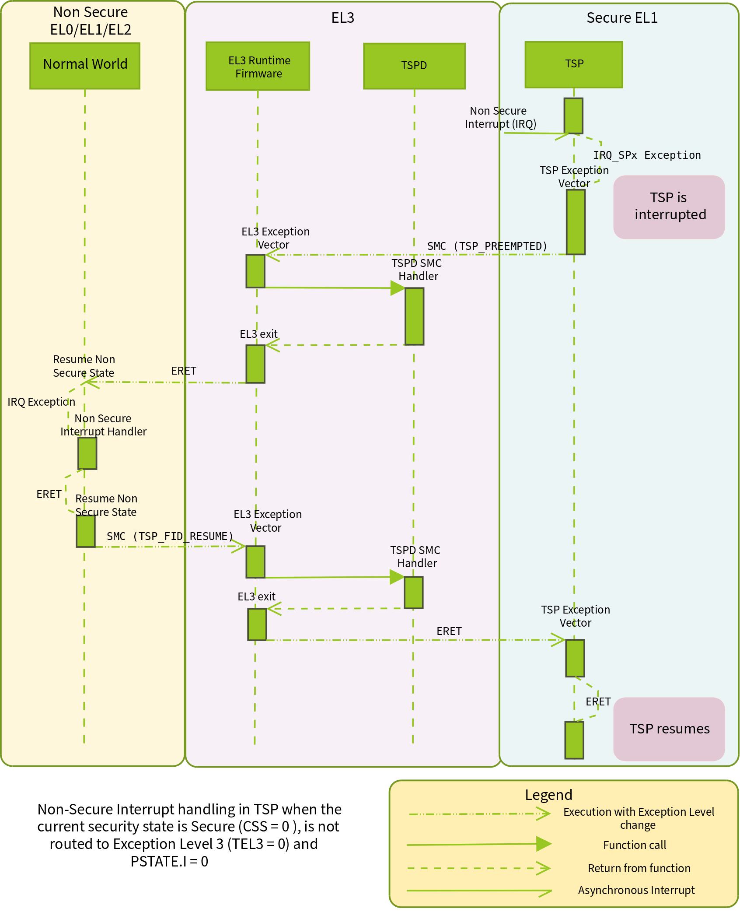

Interrupt Management Framework 
==============================

This framework is responsible for managing interrupts routed to EL3. It also
allows EL3 software to configure the interrupt routing behavior. Its main
objective is to implement the following two requirements.

#. It should be possible to route interrupts meant to be handled by secure
   software (Secure interrupts) to EL3, when execution is in non-secure state
   (normal world). The framework should then take care of handing control of
   the interrupt to either software in EL3 or Secure-EL1 depending upon the
   software configuration and the GIC implementation. This requirement ensures
   that secure interrupts are under the control of the secure software with
   respect to their delivery and handling without the possibility of
   intervention from non-secure software.

#. It should be possible to route interrupts meant to be handled by
   non-secure software (Non-secure interrupts) to the last executed exception
   level in the normal world when the execution is in secure world at
   exception levels lower than EL3. This could be done with or without the
   knowledge of software executing in Secure-EL1/Secure-EL0. The choice of
   approach should be governed by the secure software. This requirement
   ensures that non-secure software is able to execute in tandem with the
   secure software without overriding it.

Concepts
--------

Interrupt types
~~~~~~~~~~~~~~~

The framework categorises an interrupt to be one of the following depending upon
the exception level(s) it is handled in.

#. Secure EL1 interrupt. This type of interrupt can be routed to EL3 or
   Secure-EL1 depending upon the security state of the current execution
   context. It is always handled in Secure-EL1.

#. Non-secure interrupt. This type of interrupt can be routed to EL3,
   Secure-EL1, Non-secure EL1 or EL2 depending upon the security state of the
   current execution context. It is always handled in either Non-secure EL1
   or EL2.

#. EL3 interrupt. This type of interrupt can be routed to EL3 or Secure-EL1
   depending upon the security state of the current execution context. It is
   always handled in EL3.

The following constants define the various interrupt types in the framework
implementation.

.. code:: c

    #define INTR_TYPE_S_EL1      0
    #define INTR_TYPE_EL3        1
    #define INTR_TYPE_NS         2

Routing model
~~~~~~~~~~~~~

A type of interrupt can be either generated as an FIQ or an IRQ. The target
exception level of an interrupt type is configured through the FIQ and IRQ bits
in the Secure Configuration Register at EL3 (``SCR_EL3.FIQ`` and ``SCR_EL3.IRQ``
bits). When ``SCR_EL3.FIQ``\ =1, FIQs are routed to EL3. Otherwise they are routed
to the First Exception Level (FEL) capable of handling interrupts. When
``SCR_EL3.IRQ``\ =1, IRQs are routed to EL3. Otherwise they are routed to the
FEL. This register is configured independently by EL3 software for each security
state prior to entry into a lower exception level in that security state.

A routing model for a type of interrupt (generated as FIQ or IRQ) is defined as
its target exception level for each security state. It is represented by a
single bit for each security state. A value of ``0`` means that the interrupt
should be routed to the FEL. A value of ``1`` means that the interrupt should be
routed to EL3. A routing model is applicable only when execution is not in EL3.

The default routing model for an interrupt type is to route it to the FEL in
either security state.

Valid routing models
~~~~~~~~~~~~~~~~~~~~

The framework considers certain routing models for each type of interrupt to be
incorrect as they conflict with the requirements mentioned in Section 1. The
following sub-sections describe all the possible routing models and specify
which ones are valid or invalid. EL3 interrupts are currently supported only
for GIC version 3.0 (Arm GICv3) and only the Secure-EL1 and Non-secure interrupt
types are supported for GIC version 2.0 (Arm GICv2) (see `Assumptions in
Interrupt Management Framework`_). The terminology used in the following
sub-sections is explained below.

#. **CSS**. Current Security State. ``0`` when secure and ``1`` when non-secure

#. **TEL3**. Target Exception Level 3. ``0`` when targeted to the FEL. ``1`` when
   targeted to EL3.

Secure-EL1 interrupts
^^^^^^^^^^^^^^^^^^^^^

#. **CSS=0, TEL3=0**. Interrupt is routed to the FEL when execution is in
   secure state. This is a valid routing model as secure software is in
   control of handling secure interrupts.

#. **CSS=0, TEL3=1**. Interrupt is routed to EL3 when execution is in secure
   state. This is a valid routing model as secure software in EL3 can
   handover the interrupt to Secure-EL1 for handling.

#. **CSS=1, TEL3=0**. Interrupt is routed to the FEL when execution is in
   non-secure state. This is an invalid routing model as a secure interrupt
   is not visible to the secure software which violates the motivation behind
   the Arm Security Extensions.

#. **CSS=1, TEL3=1**. Interrupt is routed to EL3 when execution is in
   non-secure state. This is a valid routing model as secure software in EL3
   can handover the interrupt to Secure-EL1 for handling.

Non-secure interrupts
^^^^^^^^^^^^^^^^^^^^^

#. **CSS=0, TEL3=0**. Interrupt is routed to the FEL when execution is in
   secure state. This allows the secure software to trap non-secure
   interrupts, perform its book-keeping and hand the interrupt to the
   non-secure software through EL3. This is a valid routing model as secure
   software is in control of how its execution is preempted by non-secure
   interrupts.

#. **CSS=0, TEL3=1**. Interrupt is routed to EL3 when execution is in secure
   state. This is a valid routing model as secure software in EL3 can save
   the state of software in Secure-EL1/Secure-EL0 before handing the
   interrupt to non-secure software. This model requires additional
   coordination between Secure-EL1 and EL3 software to ensure that the
   former's state is correctly saved by the latter.

#. **CSS=1, TEL3=0**. Interrupt is routed to FEL when execution is in
   non-secure state. This is a valid routing model as a non-secure interrupt
   is handled by non-secure software.

#. **CSS=1, TEL3=1**. Interrupt is routed to EL3 when execution is in
   non-secure state. This is an invalid routing model as there is no valid
   reason to route the interrupt to EL3 software and then hand it back to
   non-secure software for handling.

EL3 interrupts
^^^^^^^^^^^^^^

#. **CSS=0, TEL3=0**. Interrupt is routed to the FEL when execution is in
   Secure-EL1/Secure-EL0. This is a valid routing model as secure software
   in Secure-EL1/Secure-EL0 is in control of how its execution is preempted
   by EL3 interrupt and can handover the interrupt to EL3 for handling.

   However, when ``EL3_EXCEPTION_HANDLING`` is ``1``, this routing model is
   invalid as EL3 interrupts are unconditionally routed to EL3, and EL3
   interrupts will always preempt Secure EL1/EL0 execution. See `exception
   handling`__ documentation.

   .. __: exception-handling.rst#interrupt-handling

#. **CSS=0, TEL3=1**. Interrupt is routed to EL3 when execution is in
   Secure-EL1/Secure-EL0. This is a valid routing model as secure software
   in EL3 can handle the interrupt.

#. **CSS=1, TEL3=0**. Interrupt is routed to the FEL when execution is in
   non-secure state. This is an invalid routing model as a secure interrupt
   is not visible to the secure software which violates the motivation behind
   the Arm Security Extensions.

#. **CSS=1, TEL3=1**. Interrupt is routed to EL3 when execution is in
   non-secure state. This is a valid routing model as secure software in EL3
   can handle the interrupt.

Mapping of interrupt type to signal
~~~~~~~~~~~~~~~~~~~~~~~~~~~~~~~~~~~

The framework is meant to work with any interrupt controller implemented by a
platform. A interrupt controller could generate a type of interrupt as either an
FIQ or IRQ signal to the CPU depending upon the current security state. The
mapping between the type and signal is known only to the platform. The framework
uses this information to determine whether the IRQ or the FIQ bit should be
programmed in ``SCR_EL3`` while applying the routing model for a type of
interrupt. The platform provides this information through the
``plat_interrupt_type_to_line()`` API (described in the
`Porting Guide`_). For example, on the FVP port when the platform uses an Arm GICv2
interrupt controller, Secure-EL1 interrupts are signaled through the FIQ signal
while Non-secure interrupts are signaled through the IRQ signal. This applies
when execution is in either security state.

Effect of mapping of several interrupt types to one signal
^^^^^^^^^^^^^^^^^^^^^^^^^^^^^^^^^^^^^^^^^^^^^^^^^^^^^^^^^^

It should be noted that if more than one interrupt type maps to a single
interrupt signal, and if any one of the interrupt type sets **TEL3=1** for a
particular security state, then interrupt signal will be routed to EL3 when in
that security state. This means that all the other interrupt types using the
same interrupt signal will be forced to the same routing model. This should be
borne in mind when choosing the routing model for an interrupt type.

For example, in Arm GICv3, when the execution context is Secure-EL1/
Secure-EL0, both the EL3 and the non secure interrupt types map to the FIQ
signal. So if either one of the interrupt type sets the routing model so
that **TEL3=1** when **CSS=0**, the FIQ bit in ``SCR_EL3`` will be programmed to
route the FIQ signal to EL3 when executing in Secure-EL1/Secure-EL0, thereby
effectively routing the other interrupt type also to EL3.

Assumptions in Interrupt Management Framework
---------------------------------------------

The framework makes the following assumptions to simplify its implementation.

#. Although the framework has support for 2 types of secure interrupts (EL3
   and Secure-EL1 interrupt), only interrupt controller architectures
   like Arm GICv3 has architectural support for EL3 interrupts in the form of
   Group 0 interrupts. In Arm GICv2, all secure interrupts are assumed to be
   handled in Secure-EL1. They can be delivered to Secure-EL1 via EL3 but they
   cannot be handled in EL3.

#. Interrupt exceptions (``PSTATE.I`` and ``F`` bits) are masked during execution
   in EL3.

#. Interrupt management: the following sections describe how interrupts are
   managed by the interrupt handling framework. This entails:

   #. Providing an interface to allow registration of a handler and
      specification of the routing model for a type of interrupt.

   #. Implementing support to hand control of an interrupt type to its
      registered handler when the interrupt is generated.

Both aspects of interrupt management involve various components in the secure
software stack spanning from EL3 to Secure-EL1. These components are described
in the section `Software components`_. The framework stores information
associated with each type of interrupt in the following data structure.

.. code:: c

    typedef struct intr_type_desc {
            interrupt_type_handler_t handler;
            uint32_t flags;
            uint32_t scr_el3[2];
    } intr_type_desc_t;

The ``flags`` field stores the routing model for the interrupt type in
bits[1:0]. Bit[0] stores the routing model when execution is in the secure
state. Bit[1] stores the routing model when execution is in the non-secure
state. As mentioned in Section `Routing model`_, a value of ``0`` implies that
the interrupt should be targeted to the FEL. A value of ``1`` implies that it
should be targeted to EL3. The remaining bits are reserved and SBZ. The helper
macro ``set_interrupt_rm_flag()`` should be used to set the bits in the
``flags`` parameter.

The ``scr_el3[2]`` field also stores the routing model but as a mapping of the
model in the ``flags`` field to the corresponding bit in the ``SCR_EL3`` for each
security state.

The framework also depends upon the platform port to configure the interrupt
controller to distinguish between secure and non-secure interrupts. The platform
is expected to be aware of the secure devices present in the system and their
associated interrupt numbers. It should configure the interrupt controller to
enable the secure interrupts, ensure that their priority is always higher than
the non-secure interrupts and target them to the primary CPU. It should also
export the interface described in the `Porting Guide`_ to enable
handling of interrupts.

In the remainder of this document, for the sake of simplicity a Arm GICv2 system
is considered and it is assumed that the FIQ signal is used to generate Secure-EL1
interrupts and the IRQ signal is used to generate non-secure interrupts in either
security state. EL3 interrupts are not considered.

Software components
-------------------

Roles and responsibilities for interrupt management are sub-divided between the
following components of software running in EL3 and Secure-EL1. Each component is
briefly described below.

#. EL3 Runtime Firmware. This component is common to all ports of TF-A.

#. Secure Payload Dispatcher (SPD) service. This service interfaces with the
   Secure Payload (SP) software which runs in Secure-EL1/Secure-EL0 and is
   responsible for switching execution between secure and non-secure states.
   A switch is triggered by a Secure Monitor Call and it uses the APIs
   exported by the Context management library to implement this functionality.
   Switching execution between the two security states is a requirement for
   interrupt management as well. This results in a significant dependency on
   the SPD service. TF-A implements an example Test Secure Payload Dispatcher
   (TSPD) service.

   An SPD service plugs into the EL3 runtime firmware and could be common to
   some ports of TF-A.

#. Secure Payload (SP). On a production system, the Secure Payload corresponds
   to a Secure OS which runs in Secure-EL1/Secure-EL0. It interfaces with the
   SPD service to manage communication with non-secure software. TF-A
   implements an example secure payload called Test Secure Payload (TSP)
   which runs only in Secure-EL1.

   A Secure payload implementation could be common to some ports of TF-A,
   just like the SPD service.

Interrupt registration
----------------------

This section describes in detail the role of each software component (see
`Software components`_) during the registration of a handler for an interrupt
type.

EL3 runtime firmware
~~~~~~~~~~~~~~~~~~~~

This component declares the following prototype for a handler of an interrupt type.

.. code:: c

        typedef uint64_t (*interrupt_type_handler_t)(uint32_t id,
                                                     uint32_t flags,
                                                     void *handle,
                                                     void *cookie);

The ``id`` is parameter is reserved and could be used in the future for passing
the interrupt id of the highest pending interrupt only if there is a foolproof
way of determining the id. Currently it contains ``INTR_ID_UNAVAILABLE``.

The ``flags`` parameter contains miscellaneous information as follows.

#. Security state, bit[0]. This bit indicates the security state of the lower
   exception level when the interrupt was generated. A value of ``1`` means
   that it was in the non-secure state. A value of ``0`` indicates that it was
   in the secure state. This bit can be used by the handler to ensure that
   interrupt was generated and routed as per the routing model specified
   during registration.

#. Reserved, bits[31:1]. The remaining bits are reserved for future use.

The ``handle`` parameter points to the ``cpu_context`` structure of the current CPU
for the security state specified in the ``flags`` parameter.

Once the handler routine completes, execution will return to either the secure
or non-secure state. The handler routine must return a pointer to
``cpu_context`` structure of the current CPU for the target security state. On
AArch64, this return value is currently ignored by the caller as the
appropriate ``cpu_context`` to be used is expected to be set by the handler
via the context management library APIs.
A portable interrupt handler implementation must set the target context both in
the structure pointed to by the returned pointer and via the context management
library APIs. The handler should treat all error conditions as critical errors
and take appropriate action within its implementation e.g. use assertion
failures.

The runtime firmware provides the following API for registering a handler for a
particular type of interrupt. A Secure Payload Dispatcher service should use
this API to register a handler for Secure-EL1 and optionally for non-secure
interrupts. This API also requires the caller to specify the routing model for
the type of interrupt.

.. code:: c

    int32_t register_interrupt_type_handler(uint32_t type,
                                            interrupt_type_handler handler,
                                            uint64_t flags);

The ``type`` parameter can be one of the three interrupt types listed above i.e.
``INTR_TYPE_S_EL1``, ``INTR_TYPE_NS`` & ``INTR_TYPE_EL3``. The ``flags`` parameter
is as described in Section 2.

The function will return ``0`` upon a successful registration. It will return
``-EALREADY`` in case a handler for the interrupt type has already been
registered. If the ``type`` is unrecognised or the ``flags`` or the ``handler`` are
invalid it will return ``-EINVAL``.

Interrupt routing is governed by the configuration of the ``SCR_EL3.FIQ/IRQ`` bits
prior to entry into a lower exception level in either security state. The
context management library maintains a copy of the ``SCR_EL3`` system register for
each security state in the ``cpu_context`` structure of each CPU. It exports the
following APIs to let EL3 Runtime Firmware program and retrieve the routing
model for each security state for the current CPU. The value of ``SCR_EL3`` stored
in the ``cpu_context`` is used by the ``el3_exit()`` function to program the
``SCR_EL3`` register prior to returning from the EL3 exception level.

.. code:: c

        uint32_t cm_get_scr_el3(uint32_t security_state);
        void cm_write_scr_el3_bit(uint32_t security_state,
                                  uint32_t bit_pos,
                                  uint32_t value);

``cm_get_scr_el3()`` returns the value of the ``SCR_EL3`` register for the specified
security state of the current CPU. ``cm_write_scr_el3()`` writes a ``0`` or ``1`` to
the bit specified by ``bit_pos``. ``register_interrupt_type_handler()`` invokes
``set_routing_model()`` API which programs the ``SCR_EL3`` according to the routing
model using the ``cm_get_scr_el3()`` and ``cm_write_scr_el3_bit()`` APIs.

It is worth noting that in the current implementation of the framework, the EL3
runtime firmware is responsible for programming the routing model. The SPD is
responsible for ensuring that the routing model has been adhered to upon
receiving an interrupt.

.. _spd-int-registration:

Secure payload dispatcher
~~~~~~~~~~~~~~~~~~~~~~~~~

A SPD service is responsible for determining and maintaining the interrupt
routing model supported by itself and the Secure Payload. It is also responsible
for ferrying interrupts between secure and non-secure software depending upon
the routing model. It could determine the routing model at build time or at
runtime. It must use this information to register a handler for each interrupt
type using the ``register_interrupt_type_handler()`` API in EL3 runtime firmware.

If the routing model is not known to the SPD service at build time, then it must
be provided by the SP as the result of its initialisation. The SPD should
program the routing model only after SP initialisation has completed e.g. in the
SPD initialisation function pointed to by the ``bl32_init`` variable.

The SPD should determine the mechanism to pass control to the Secure Payload
after receiving an interrupt from the EL3 runtime firmware. This information
could either be provided to the SPD service at build time or by the SP at
runtime.

Test secure payload dispatcher behavior
~~~~~~~~~~~~~~~~~~~~~~~~~~~~~~~~~~~~~~~

.. note::
   Where this document discusses ``TSP_NS_INTR_ASYNC_PREEMPT`` as being
   ``1``, the same results also apply when ``EL3_EXCEPTION_HANDLING`` is ``1``.

The TSPD only handles Secure-EL1 interrupts and is provided with the following
routing model at build time.

-  Secure-EL1 interrupts are routed to EL3 when execution is in non-secure
   state and are routed to the FEL when execution is in the secure state
   i.e **CSS=0, TEL3=0** & **CSS=1, TEL3=1** for Secure-EL1 interrupts

-  When the build flag ``TSP_NS_INTR_ASYNC_PREEMPT`` is zero, the default routing
   model is used for non-secure interrupts. They are routed to the FEL in
   either security state i.e **CSS=0, TEL3=0** & **CSS=1, TEL3=0** for
   Non-secure interrupts.

-  When the build flag ``TSP_NS_INTR_ASYNC_PREEMPT`` is defined to 1, then the
   non secure interrupts are routed to EL3 when execution is in secure state
   i.e **CSS=0, TEL3=1** for non-secure interrupts. This effectively preempts
   Secure-EL1. The default routing model is used for non secure interrupts in
   non-secure state. i.e **CSS=1, TEL3=0**.

It performs the following actions in the ``tspd_init()`` function to fulfill the
requirements mentioned earlier.

#. It passes control to the Test Secure Payload to perform its
   initialisation. The TSP provides the address of the vector table
   ``tsp_vectors`` in the SP which also includes the handler for Secure-EL1
   interrupts in the ``sel1_intr_entry`` field. The TSPD passes control to the TSP at
   this address when it receives a Secure-EL1 interrupt.

   The handover agreement between the TSP and the TSPD requires that the TSPD
   masks all interrupts (``PSTATE.DAIF`` bits) when it calls
   ``tsp_sel1_intr_entry()``. The TSP has to preserve the callee saved general
   purpose, SP_EL1/Secure-EL0, LR, VFP and system registers. It can use
   ``x0-x18`` to enable its C runtime.

#. The TSPD implements a handler function for Secure-EL1 interrupts. This
   function is registered with the EL3 runtime firmware using the
   ``register_interrupt_type_handler()`` API as follows

   .. code:: c

       /* Forward declaration */
       interrupt_type_handler tspd_secure_el1_interrupt_handler;
       int32_t rc, flags = 0;
       set_interrupt_rm_flag(flags, NON_SECURE);
       rc = register_interrupt_type_handler(INTR_TYPE_S_EL1,
                                        tspd_secure_el1_interrupt_handler,
                                        flags);
       if (rc)
           panic();

#. When the build flag ``TSP_NS_INTR_ASYNC_PREEMPT`` is defined to 1, the TSPD
   implements a handler function for non-secure interrupts. This function is
   registered with the EL3 runtime firmware using the
   ``register_interrupt_type_handler()`` API as follows

   .. code:: c

       /* Forward declaration */
       interrupt_type_handler tspd_ns_interrupt_handler;
       int32_t rc, flags = 0;
       set_interrupt_rm_flag(flags, SECURE);
       rc = register_interrupt_type_handler(INTR_TYPE_NS,
                                       tspd_ns_interrupt_handler,
                                       flags);
       if (rc)
           panic();

.. _sp-int-registration:

Secure payload
~~~~~~~~~~~~~~

A Secure Payload must implement an interrupt handling framework at Secure-EL1
(Secure-EL1 IHF) to support its chosen interrupt routing model. Secure payload
execution will alternate between the below cases.

#. In the code where IRQ, FIQ or both interrupts are enabled, if an interrupt
   type is targeted to the FEL, then it will be routed to the Secure-EL1
   exception vector table. This is defined as the **asynchronous mode** of
   handling interrupts. This mode applies to both Secure-EL1 and non-secure
   interrupts.

#. In the code where both interrupts are disabled, if an interrupt type is
   targeted to the FEL, then execution will eventually migrate to the
   non-secure state. Any non-secure interrupts will be handled as described
   in the routing model where **CSS=1 and TEL3=0**. Secure-EL1 interrupts
   will be routed to EL3 (as per the routing model where **CSS=1 and
   TEL3=1**) where the SPD service will hand them to the SP. This is defined
   as the **synchronous mode** of handling interrupts.

The interrupt handling framework implemented by the SP should support one or
both these interrupt handling models depending upon the chosen routing model.

The following list briefly describes how the choice of a valid routing model
(see `Valid routing models`_) effects the implementation of the Secure-EL1
IHF. If the choice of the interrupt routing model is not known to the SPD
service at compile time, then the SP should pass this information to the SPD
service at runtime during its initialisation phase.

As mentioned earlier, an Arm GICv2 system is considered and it is assumed that
the FIQ signal is used to generate Secure-EL1 interrupts and the IRQ signal
is used to generate non-secure interrupts in either security state.

Secure payload IHF design w.r.t secure-EL1 interrupts
^^^^^^^^^^^^^^^^^^^^^^^^^^^^^^^^^^^^^^^^^^^^^^^^^^^^^

#. **CSS=0, TEL3=0**. If ``PSTATE.F=0``, Secure-EL1 interrupts will be
   triggered at one of the Secure-EL1 FIQ exception vectors. The Secure-EL1
   IHF should implement support for handling FIQ interrupts asynchronously.

   If ``PSTATE.F=1`` then Secure-EL1 interrupts will be handled as per the
   synchronous interrupt handling model. The SP could implement this scenario
   by exporting a separate entrypoint for Secure-EL1 interrupts to the SPD
   service during the registration phase. The SPD service would also need to
   know the state of the system, general purpose and the ``PSTATE`` registers
   in which it should arrange to return execution to the SP. The SP should
   provide this information in an implementation defined way during the
   registration phase if it is not known to the SPD service at build time.

#. **CSS=1, TEL3=1**. Interrupts are routed to EL3 when execution is in
   non-secure state. They should be handled through the synchronous interrupt
   handling model as described in 1. above.

#. **CSS=0, TEL3=1**. Secure-EL1 interrupts are routed to EL3 when execution
   is in secure state. They will not be visible to the SP. The ``PSTATE.F`` bit
   in Secure-EL1/Secure-EL0 will not mask FIQs. The EL3 runtime firmware will
   call the handler registered by the SPD service for Secure-EL1 interrupts.
   Secure-EL1 IHF should then handle all Secure-EL1 interrupt through the
   synchronous interrupt handling model described in 1. above.

Secure payload IHF design w.r.t non-secure interrupts
^^^^^^^^^^^^^^^^^^^^^^^^^^^^^^^^^^^^^^^^^^^^^^^^^^^^^

#. **CSS=0, TEL3=0**. If ``PSTATE.I=0``, non-secure interrupts will be
   triggered at one of the Secure-EL1 IRQ exception vectors . The Secure-EL1
   IHF should co-ordinate with the SPD service to transfer execution to the
   non-secure state where the interrupt should be handled e.g the SP could
   allocate a function identifier to issue a SMC64 or SMC32 to the SPD
   service which indicates that the SP execution has been preempted by a
   non-secure interrupt. If this function identifier is not known to the SPD
   service at compile time then the SP could provide it during the
   registration phase.

   If ``PSTATE.I=1`` then the non-secure interrupt will pend until execution
   resumes in the non-secure state.

#. **CSS=0, TEL3=1**. Non-secure interrupts are routed to EL3. They will not
   be visible to the SP. The ``PSTATE.I`` bit in Secure-EL1/Secure-EL0 will
   have not effect. The SPD service should register a non-secure interrupt
   handler which should save the SP state correctly and resume execution in
   the non-secure state where the interrupt will be handled. The Secure-EL1
   IHF does not need to take any action.

#. **CSS=1, TEL3=0**. Non-secure interrupts are handled in the FEL in
   non-secure state (EL1/EL2) and are not visible to the SP. This routing
   model does not affect the SP behavior.

A Secure Payload must also ensure that all Secure-EL1 interrupts are correctly
configured at the interrupt controller by the platform port of the EL3 runtime
firmware. It should configure any additional Secure-EL1 interrupts which the EL3
runtime firmware is not aware of through its platform port.

Test secure payload behavior
~~~~~~~~~~~~~~~~~~~~~~~~~~~~

The routing model for Secure-EL1 and non-secure interrupts chosen by the TSP is
described in Section `Secure Payload Dispatcher`__. It is known to the TSPD
service at build time.

.. __: #spd-int-registration

The TSP implements an entrypoint (``tsp_sel1_intr_entry()``) for handling Secure-EL1
interrupts taken in non-secure state and routed through the TSPD service
(synchronous handling model). It passes the reference to this entrypoint via
``tsp_vectors`` to the TSPD service.

The TSP also replaces the default exception vector table referenced through the
``early_exceptions`` variable, with a vector table capable of handling FIQ and IRQ
exceptions taken at the same (Secure-EL1) exception level. This table is
referenced through the ``tsp_exceptions`` variable and programmed into the
VBAR_EL1. It caters for the asynchronous handling model.

The TSP also programs the Secure Physical Timer in the Arm Generic Timer block
to raise a periodic interrupt (every half a second) for the purpose of testing
interrupt management across all the software components listed in `Software
components`_.

Interrupt handling
------------------

This section describes in detail the role of each software component (see
Section `Software components`_) in handling an interrupt of a particular type.

EL3 runtime firmware
~~~~~~~~~~~~~~~~~~~~

The EL3 runtime firmware populates the IRQ and FIQ exception vectors referenced
by the ``runtime_exceptions`` variable as follows.

#. IRQ and FIQ exceptions taken from the current exception level with
   ``SP_EL0`` or ``SP_EL3`` are reported as irrecoverable error conditions. As
   mentioned earlier, EL3 runtime firmware always executes with the
   ``PSTATE.I`` and ``PSTATE.F`` bits set.

#. The following text describes how the IRQ and FIQ exceptions taken from a
   lower exception level using AArch64 or AArch32 are handled.

When an interrupt is generated, the vector for each interrupt type is
responsible for:

#. Saving the entire general purpose register context (x0-x30) immediately
   upon exception entry. The registers are saved in the per-cpu ``cpu_context``
   data structure referenced by the ``SP_EL3``\ register.

#. Saving the ``ELR_EL3``, ``SP_EL0`` and ``SPSR_EL3`` system registers in the
   per-cpu ``cpu_context`` data structure referenced by the ``SP_EL3`` register.

#. Switching to the C runtime stack by restoring the ``CTX_RUNTIME_SP`` value
   from the per-cpu ``cpu_context`` data structure in ``SP_EL0`` and
   executing the ``msr spsel, #0`` instruction.

#. Determining the type of interrupt. Secure-EL1 interrupts will be signaled
   at the FIQ vector. Non-secure interrupts will be signaled at the IRQ
   vector. The platform should implement the following API to determine the
   type of the pending interrupt.

   .. code:: c

       uint32_t plat_ic_get_interrupt_type(void);

   It should return either ``INTR_TYPE_S_EL1`` or ``INTR_TYPE_NS``.

#. Determining the handler for the type of interrupt that has been generated.
   The following API has been added for this purpose.

   .. code:: c

       interrupt_type_handler get_interrupt_type_handler(uint32_t interrupt_type);

   It returns the reference to the registered handler for this interrupt
   type. The ``handler`` is retrieved from the ``intr_type_desc_t`` structure as
   described in Section 2. ``NULL`` is returned if no handler has been
   registered for this type of interrupt. This scenario is reported as an
   irrecoverable error condition.

#. Calling the registered handler function for the interrupt type generated.
   The ``id`` parameter is set to ``INTR_ID_UNAVAILABLE`` currently. The id along
   with the current security state and a reference to the ``cpu_context_t``
   structure for the current security state are passed to the handler function
   as its arguments.

   The handler function returns a reference to the per-cpu ``cpu_context_t``
   structure for the target security state.

#. Calling ``el3_exit()`` to return from EL3 into a lower exception level in
   the security state determined by the handler routine. The ``el3_exit()``
   function is responsible for restoring the register context from the
   ``cpu_context_t`` data structure for the target security state.

Secure payload dispatcher
~~~~~~~~~~~~~~~~~~~~~~~~~

Interrupt entry
^^^^^^^^^^^^^^^

The SPD service begins handling an interrupt when the EL3 runtime firmware calls
the handler function for that type of interrupt. The SPD service is responsible
for the following:

#. Validating the interrupt. This involves ensuring that the interrupt was
   generated according to the interrupt routing model specified by the SPD
   service during registration. It should use the security state of the
   exception level (passed in the ``flags`` parameter of the handler) where
   the interrupt was taken from to determine this. If the interrupt is not
   recognised then the handler should treat it as an irrecoverable error
   condition.

   An SPD service can register a handler for Secure-EL1 and/or Non-secure
   interrupts. A non-secure interrupt should never be routed to EL3 from
   from non-secure state. Also if a routing model is chosen where Secure-EL1
   interrupts are routed to S-EL1 when execution is in Secure state, then a
   S-EL1 interrupt should never be routed to EL3 from secure state. The handler
   could use the security state flag to check this.

#. Determining whether a context switch is required. This depends upon the
   routing model and interrupt type. For non secure and S-EL1 interrupt,
   if the security state of the execution context where the interrupt was
   generated is not the same as the security state required for handling
   the interrupt, a context switch is required. The following 2 cases
   require a context switch from secure to non-secure or vice-versa:

   #. A Secure-EL1 interrupt taken from the non-secure state should be
      routed to the Secure Payload.

   #. A non-secure interrupt taken from the secure state should be routed
      to the last known non-secure exception level.

   The SPD service must save the system register context of the current
   security state. It must then restore the system register context of the
   target security state. It should use the ``cm_set_next_eret_context()`` API
   to ensure that the next ``cpu_context`` to be restored is of the target
   security state.

   If the target state is secure then execution should be handed to the SP as
   per the synchronous interrupt handling model it implements. A Secure-EL1
   interrupt can be routed to EL3 while execution is in the SP. This implies
   that SP execution can be preempted while handling an interrupt by a
   another higher priority Secure-EL1 interrupt or a EL3 interrupt. The SPD
   service should be able to handle this preemption or manage secure interrupt
   priorities before handing control to the SP.

#. Setting the return value of the handler to the per-cpu ``cpu_context`` if
   the interrupt has been successfully validated and ready to be handled at a
   lower exception level.

The routing model allows non-secure interrupts to interrupt Secure-EL1 when in
secure state if it has been configured to do so. The SPD service and the SP
should implement a mechanism for routing these interrupts to the last known
exception level in the non-secure state. The former should save the SP context,
restore the non-secure context and arrange for entry into the non-secure state
so that the interrupt can be handled.

Interrupt exit
^^^^^^^^^^^^^^

When the Secure Payload has finished handling a Secure-EL1 interrupt, it could
return control back to the SPD service through a SMC32 or SMC64. The SPD service
should handle this secure monitor call so that execution resumes in the
exception level and the security state from where the Secure-EL1 interrupt was
originally taken.

Test secure payload dispatcher Secure-EL1 interrupt handling
^^^^^^^^^^^^^^^^^^^^^^^^^^^^^^^^^^^^^^^^^^^^^^^^^^^^^^^^^^^^

The example TSPD service registers a handler for Secure-EL1 interrupts taken
from the non-secure state. During execution in S-EL1, the TSPD expects that the
Secure-EL1 interrupts are handled in S-EL1 by TSP. Its handler
``tspd_secure_el1_interrupt_handler()`` expects only to be invoked for Secure-EL1
originating from the non-secure state. It takes the following actions upon being
invoked.

#. It uses the security state provided in the ``flags`` parameter to ensure
   that the secure interrupt originated from the non-secure state. It asserts
   if this is not the case.

#. It saves the system register context for the non-secure state by calling
   ``cm_el1_sysregs_context_save(NON_SECURE);``.

#. It sets the ``ELR_EL3`` system register to ``tsp_sel1_intr_entry`` and sets the
   ``SPSR_EL3.DAIF`` bits in the secure CPU context. It sets ``x0`` to
   ``TSP_HANDLE_SEL1_INTR_AND_RETURN``. If the TSP was preempted earlier by a non
   secure interrupt during ``yielding`` SMC processing, save the registers that
   will be trashed, which is the ``ELR_EL3`` and ``SPSR_EL3``, in order to be able
   to re-enter TSP for Secure-EL1 interrupt processing. It does not need to
   save any other secure context since the TSP is expected to preserve it
   (see section `Test secure payload dispatcher behavior`_).

#. It restores the system register context for the secure state by calling
   ``cm_el1_sysregs_context_restore(SECURE);``.

#. It ensures that the secure CPU context is used to program the next
   exception return from EL3 by calling ``cm_set_next_eret_context(SECURE);``.

#. It returns the per-cpu ``cpu_context`` to indicate that the interrupt can
   now be handled by the SP. ``x1`` is written with the value of ``elr_el3``
   register for the non-secure state. This information is used by the SP for
   debugging purposes.

The figure below describes how the interrupt handling is implemented by the TSPD
when a Secure-EL1 interrupt is generated when execution is in the non-secure
state.

|Image 1|

The TSP issues an SMC with ``TSP_HANDLED_S_EL1_INTR`` as the function identifier to
signal completion of interrupt handling.

The TSPD service takes the following actions in ``tspd_smc_handler()`` function
upon receiving an SMC with ``TSP_HANDLED_S_EL1_INTR`` as the function identifier:

#. It ensures that the call originated from the secure state otherwise
   execution returns to the non-secure state with ``SMC_UNK`` in ``x0``.

#. It restores the saved ``ELR_EL3`` and ``SPSR_EL3`` system registers back to
   the secure CPU context (see step 3 above) in case the TSP had been preempted
   by a non secure interrupt earlier.

#. It restores the system register context for the non-secure state by
   calling ``cm_el1_sysregs_context_restore(NON_SECURE)``.

#. It ensures that the non-secure CPU context is used to program the next
   exception return from EL3 by calling ``cm_set_next_eret_context(NON_SECURE)``.

#. ``tspd_smc_handler()`` returns a reference to the non-secure ``cpu_context``
   as the return value.

Test secure payload dispatcher non-secure interrupt handling
^^^^^^^^^^^^^^^^^^^^^^^^^^^^^^^^^^^^^^^^^^^^^^^^^^^^^^^^^^^^

The TSP in Secure-EL1 can be preempted by a non-secure interrupt during
``yielding`` SMC processing or by a higher priority EL3 interrupt during
Secure-EL1 interrupt processing. When ``EL3_EXCEPTION_HANDLING`` is ``0``, only
non-secure interrupts can cause preemption of TSP since there are no EL3
interrupts in the system. With ``EL3_EXCEPTION_HANDLING=1`` however, any EL3
interrupt may preempt Secure execution.

It should be noted that while TSP is preempted, the TSPD only allows entry into
the TSP either for Secure-EL1 interrupt handling or for resuming the preempted
``yielding`` SMC in response to the ``TSP_FID_RESUME`` SMC from the normal world.
(See Section `Implication of preempted SMC on Non-Secure Software`_).

The non-secure interrupt triggered in Secure-EL1 during ``yielding`` SMC
processing can be routed to either EL3 or Secure-EL1 and is controlled by build
option ``TSP_NS_INTR_ASYNC_PREEMPT`` (see Section `Test secure payload
dispatcher behavior`_). If the build option is set, the TSPD will set the
routing model for the non-secure interrupt to be routed to EL3 from secure state
i.e. **TEL3=1, CSS=0** and registers ``tspd_ns_interrupt_handler()`` as the
non-secure interrupt handler. The ``tspd_ns_interrupt_handler()`` on being
invoked ensures that the interrupt originated from the secure state and disables
routing of non-secure interrupts from secure state to EL3. This is to prevent
further preemption (by a non-secure interrupt) when TSP is reentered for
handling Secure-EL1 interrupts that triggered while execution was in the normal
world. The ``tspd_ns_interrupt_handler()`` then invokes
``tspd_handle_sp_preemption()`` for further handling.

If the ``TSP_NS_INTR_ASYNC_PREEMPT`` build option is zero (default), the default
routing model for non-secure interrupt in secure state is in effect
i.e. **TEL3=0, CSS=0**. During ``yielding`` SMC processing, the IRQ
exceptions are unmasked i.e. ``PSTATE.I=0``, and a non-secure interrupt will
trigger at Secure-EL1 IRQ exception vector. The TSP saves the general purpose
register context and issues an SMC with ``TSP_PREEMPTED`` as the function
identifier to signal preemption of TSP. The TSPD SMC handler,
``tspd_smc_handler()``, ensures that the SMC call originated from the
secure state otherwise execution returns to the non-secure state with
``SMC_UNK`` in ``x0``. It then invokes ``tspd_handle_sp_preemption()`` for
further handling.

The ``tspd_handle_sp_preemption()`` takes the following actions upon being
invoked:

#. It saves the system register context for the secure state by calling
   ``cm_el1_sysregs_context_save(SECURE)``.

#. It restores the system register context for the non-secure state by
   calling ``cm_el1_sysregs_context_restore(NON_SECURE)``.

#. It ensures that the non-secure CPU context is used to program the next
   exception return from EL3 by calling ``cm_set_next_eret_context(NON_SECURE)``.

#. ``SMC_PREEMPTED`` is set in x0 and return to non secure state after
   restoring non secure context.

The Normal World is expected to resume the TSP after the ``yielding`` SMC
preemption by issuing an SMC with ``TSP_FID_RESUME`` as the function identifier
(see section `Implication of preempted SMC on Non-Secure Software`_).  The TSPD
service takes the following actions in ``tspd_smc_handler()`` function upon
receiving this SMC:

#. It ensures that the call originated from the non secure state. An
   assertion is raised otherwise.

#. Checks whether the TSP needs a resume i.e check if it was preempted. It
   then saves the system register context for the non-secure state by calling
   ``cm_el1_sysregs_context_save(NON_SECURE)``.

#. Restores the secure context by calling
   ``cm_el1_sysregs_context_restore(SECURE)``

#. It ensures that the secure CPU context is used to program the next
   exception return from EL3 by calling ``cm_set_next_eret_context(SECURE)``.

#. ``tspd_smc_handler()`` returns a reference to the secure ``cpu_context`` as the
   return value.

The figure below describes how the TSP/TSPD handle a non-secure interrupt when
it is generated during execution in the TSP with ``PSTATE.I`` = 0 when the
``TSP_NS_INTR_ASYNC_PREEMPT`` build flag is 0.

|Image 2|

Secure payload
~~~~~~~~~~~~~~

The SP should implement one or both of the synchronous and asynchronous
interrupt handling models depending upon the interrupt routing model it has
chosen (as described in section `Secure Payload`__).

.. __: #sp-int-registration

In the synchronous model, it should begin handling a Secure-EL1 interrupt after
receiving control from the SPD service at an entrypoint agreed upon during build
time or during the registration phase. Before handling the interrupt, the SP
should save any Secure-EL1 system register context which is needed for resuming
normal execution in the SP later e.g. ``SPSR_EL1``, ``ELR_EL1``. After handling
the interrupt, the SP could return control back to the exception level and
security state where the interrupt was originally taken from. The SP should use
an SMC32 or SMC64 to ask the SPD service to do this.

In the asynchronous model, the Secure Payload is responsible for handling
non-secure and Secure-EL1 interrupts at the IRQ and FIQ vectors in its exception
vector table when ``PSTATE.I`` and ``PSTATE.F`` bits are 0. As described earlier,
when a non-secure interrupt is generated, the SP should coordinate with the SPD
service to pass control back to the non-secure state in the last known exception
level. This will allow the non-secure interrupt to be handled in the non-secure
state.

Test secure payload behavior
^^^^^^^^^^^^^^^^^^^^^^^^^^^^

The TSPD hands control of a Secure-EL1 interrupt to the TSP at the
``tsp_sel1_intr_entry()``. The TSP handles the interrupt while ensuring that the
handover agreement described in Section `Test secure payload dispatcher
behavior`_ is maintained. It updates some statistics by calling
``tsp_update_sync_sel1_intr_stats()``. It then calls
``tsp_common_int_handler()`` which.

#. Checks whether the interrupt is the secure physical timer interrupt. It
   uses the platform API ``plat_ic_get_pending_interrupt_id()`` to get the
   interrupt number. If it is not the secure physical timer interrupt, then
   that means that a higher priority interrupt has preempted it. Invoke
   ``tsp_handle_preemption()`` to handover control back to EL3 by issuing
   an SMC with ``TSP_PREEMPTED`` as the function identifier.

#. Handles the secure timer interrupt interrupt by acknowledging it using the
   ``plat_ic_acknowledge_interrupt()`` platform API, calling
   ``tsp_generic_timer_handler()`` to reprogram the secure physical generic
   timer and calling the ``plat_ic_end_of_interrupt()`` platform API to signal
   end of interrupt processing.

The TSP passes control back to the TSPD by issuing an SMC64 with
``TSP_HANDLED_S_EL1_INTR`` as the function identifier.

The TSP handles interrupts under the asynchronous model as follows.

#. Secure-EL1 interrupts are handled by calling the ``tsp_common_int_handler()``
   function. The function has been described above.

#. Non-secure interrupts are handled by calling the ``tsp_common_int_handler()``
   function which ends up invoking ``tsp_handle_preemption()`` and issuing an
   SMC64 with ``TSP_PREEMPTED`` as the function identifier. Execution resumes at
   the instruction that follows this SMC instruction when the TSPD hands control
   to the TSP in response to an SMC with ``TSP_FID_RESUME`` as the function
   identifier from the non-secure state (see section `Test secure payload
   dispatcher non-secure interrupt handling`_).

Other considerations
--------------------

Implication of preempted SMC on Non-Secure Software
~~~~~~~~~~~~~~~~~~~~~~~~~~~~~~~~~~~~~~~~~~~~~~~~~~~

A ``yielding`` SMC call to Secure payload can be preempted by a non-secure
interrupt and the execution can return to the non-secure world for handling
the interrupt (For details on ``yielding`` SMC refer `SMC calling convention`_).
In this case, the SMC call has not completed its execution and the execution
must return back to the secure payload to resume the preempted SMC call.
This can be achieved by issuing an SMC call which instructs to resume the
preempted SMC.

A ``fast`` SMC cannot be preempted and hence this case will not happen for
a fast SMC call.

In the Test Secure Payload implementation, ``TSP_FID_RESUME`` is designated
as the resume SMC FID. It is important to note that ``TSP_FID_RESUME`` is a
``yielding`` SMC which means it too can be be preempted. The typical non
secure software sequence for issuing a ``yielding`` SMC would look like this,
assuming ``P.STATE.I=0`` in the non secure state :

.. code:: c

    int rc;
    rc = smc(TSP_YIELD_SMC_FID, ...);     /* Issue a Yielding SMC call */
    /* The pending non-secure interrupt is handled by the interrupt handler
       and returns back here. */
    while (rc == SMC_PREEMPTED) {       /* Check if the SMC call is preempted */
        rc = smc(TSP_FID_RESUME);       /* Issue resume SMC call */
    }

The ``TSP_YIELD_SMC_FID`` is any ``yielding`` SMC function identifier and the smc()
function invokes a SMC call with the required arguments. The pending non-secure
interrupt causes an IRQ exception and the IRQ handler registered at the
exception vector handles the non-secure interrupt and returns. The return value
from the SMC call is tested for ``SMC_PREEMPTED`` to check whether it is
preempted. If it is, then the resume SMC call ``TSP_FID_RESUME`` is issued. The
return value of the SMC call is tested again to check if it is preempted.
This is done in a loop till the SMC call succeeds or fails. If a ``yielding``
SMC is preempted, until it is resumed using ``TSP_FID_RESUME`` SMC and
completed, the current TSPD prevents any other SMC call from re-entering
TSP by returning ``SMC_UNK`` error.

--------------

*Copyright (c) 2014-2019, Arm Limited and Contributors. All rights reserved.*

.. _Porting Guide: ../getting_started/porting-guide.rst
.. _SMC calling convention: http://infocenter.arm.com/help/topic/com.arm.doc.den0028a/index.html

.. |Image 1| image:: ../resources/diagrams/sec-int-handling.png

