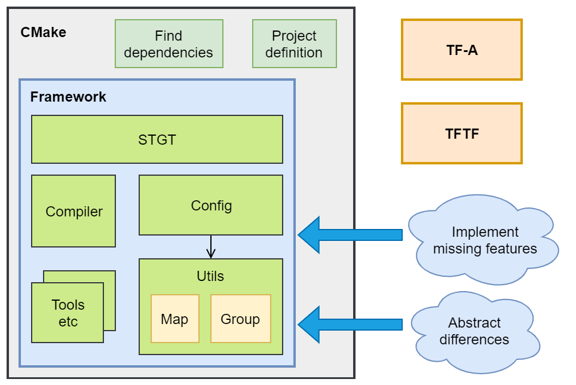
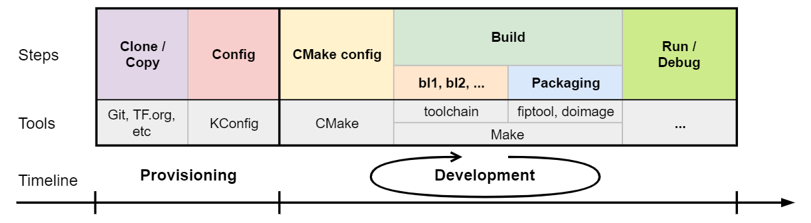

TF-A CMake buildsystem
======================

:Author: Balint Dobszay
:Organization: Arm Limited
:Contact: Balint Dobszay <balint.dobszay@arm.com>
:Status: Accepted

.. contents:: Table of Contents

Abstract
--------
This document presents a proposal for a new buildsystem for TF-A using CMake,
and as part of this a reusable CMake framework for embedded projects. For a
summary about the proposal, please see the `Phabricator wiki page
<https://developer.trustedfirmware.org/w/tf_a/cmake-buildsystem-proposal/>`_. As
mentioned there, the proposal consists of two phases. The subject of this
document is the first phase only.

Introduction
------------
The current Makefile based buildsystem of TF-A has become complicated and hard
to maintain, there is a need for a new, more flexible solution. The proposal is
to use CMake language for the new buildsystem. The main reasons of this decision
are the following:

* It is a well-established, mature tool, widely accepted by open-source
  projects.
* TF-M is already using CMake, reducing fragmentation for tf.org projects can be
  beneficial.
* CMake has various advantages over Make, e.g.:

  * Host and target system agnostic project.
  * CMake project is scalable, supports project modularization.
  * Supports software integration.
  * Out-of-the-box support for integration with several tools (e.g. project
    generation for various IDEs, integration with cppcheck, etc).

Of course there are drawbacks too:

* Language is problematic (e.g. variable scope).
* Not embedded approach.

To overcome these and other problems, we need to create workarounds for some
tasks, wrap CMake functions, etc. Since this functionality can be useful in
other embedded projects too, it is beneficial to collect the new code into a
reusable framework and store this in a separate repository. The following
diagram provides an overview of the framework structure:

|Framework structure|

Main features
-------------

Structured configuration description
^^^^^^^^^^^^^^^^^^^^^^^^^^^^^^^^^^^^
In the current Makefile system the build configuration description, validation,
processing, and the target creation, source file description are mixed and
spread across several files. One of the goals of the framework is to organize
this.

The framework provides a solution to describe the input build parameters, flags,
macros, etc. in a structured way. It contains two utilities for this purpose:

* Map: simple key-value pair implementation.
* Group: collection of related maps.

The related parameters shall be packed into a group (or "setting group"). The
setting groups shall be defined and filled with content in config files.
Currently the config files are created and edited manually, but later a
configuration management tool (e.g. Kconfig) shall be used to generate these
files. Therefore, the framework does not contain parameter validation and
conflict checking, these shall be handled by the configuration tool.

Target description
^^^^^^^^^^^^^^^^^^
The framework provides an API called STGT ('simple target') to describe the
targets, i.e. what is the build output, what source files are used, what
libraries are linked, etc. The API wraps the CMake target functions, and also
extends the built-in functionality, it can use the setting groups described in
the previous section. A group can be applied onto a target, i.e. a collection of
macros, flags, etc. can be applied onto the given output executable/library.
This provides a more granular way than the current Makefile system where most of
these are global and applied onto each target.

Compiler abstraction
^^^^^^^^^^^^^^^^^^^^
Apart from the built-in CMake usage of the compiler, there are some common tasks
that CMake does not solve (e.g. preprocessing a file). For these tasks the
framework uses wrapper functions instead of direct calls to the compiler. This
way it is not tied to one specific compiler.

External tools
^^^^^^^^^^^^^^
In the TF-A buildsystem some external tools are used, e.g. fiptool for image
generation or dtc for device tree compilation. These tools have to be found
and/or built by the framework. For this, the CMake find_package functionality is
used, any other necessary tools can be added later.

Workflow
--------
The following diagram demonstrates the development workflow using the framework:

|Framework workflow|

The process can be split into two main phases:

In the provisioning phase, first we have to obtain the necessary resources, i.e.
clone the code repository and other dependencies. Next we have to do the
configuration, preferably using a config tool like KConfig.

In the development phase first we run CMake, which will generate the buildsystem
using the selected generator backend (currently only the Makefile generator is
supported). After this we run the selected build tool which in turn calls the
compiler, linker, packaging tool, etc. Finally we can run and debug the output
executables.

Usually during development only the steps in this second phase have to be
repeated, while the provisioning phase needs to be done only once (or rarely).

Example
-------
This is a short example for the basic framework usage.

First, we create a setting group called *mem_conf* and fill it with several
parameters. It is worth noting the difference between *CONFIG* and *DEFINE*
types: the former is only a CMake domain option, the latter is only a C language
macro.

Next, we create a target called *fw1* and add the *mem_conf* setting group to
it. This means that all source and header files used by the target will have all
the parameters declared in the setting group. Then we set the target type to
executable, and add some source files. Since the target has the parameters from
the settings group, we can use it for conditionally adding source files. E.g.
*dram_controller.c* will only be added if MEM_TYPE equals dram.

.. code-block:: cmake

   group_new(NAME mem_conf)
   group_add(NAME mem_conf TYPE DEFINE KEY MEM_SIZE VAL 1024)
   group_add(NAME mem_conf TYPE CONFIG DEFINE KEY MEM_TYPE VAL dram)
   group_add(NAME mem_conf TYPE CFLAG KEY -Os)

   stgt_create(NAME fw1)
   stgt_add_setting(NAME fw1 GROUPS mem_conf)
   stgt_set_target(NAME fw1 TYPE exe)

   stgt_add_src(NAME fw1 SRC
       ${CMAKE_SOURCE_DIR}/main.c
   )

   stgt_add_src_cond(NAME fw1 KEY MEM_TYPE VAL dram SRC
       ${CMAKE_SOURCE_DIR}/dram_controller.c
   )

--------------

*Copyright (c) 2019-2020, Arm Limited and Contributors. All rights reserved.*
