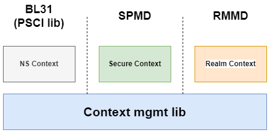
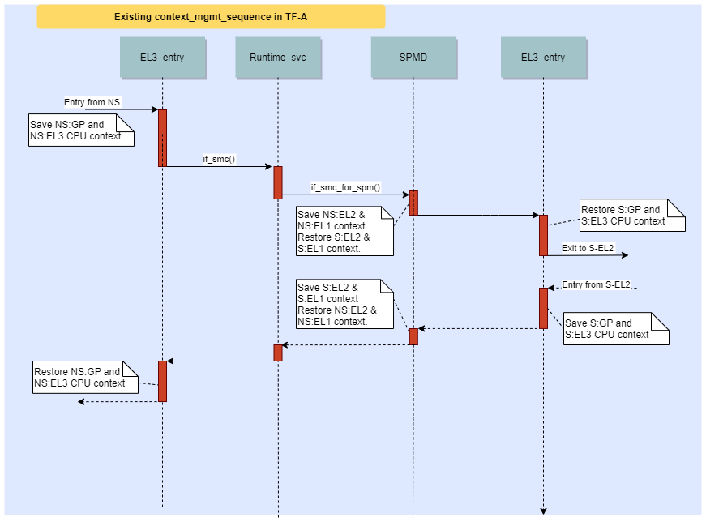
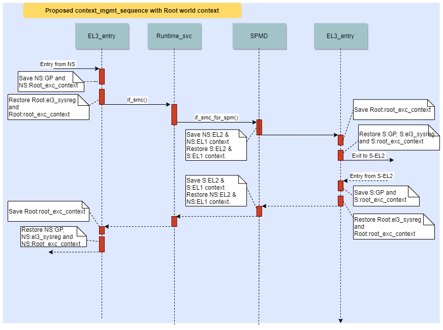

Enhance Context Management library for EL3 firmware
===================================================

:Authors: Soby Mathew & Zelalem Aweke
:Organization: Arm Limited
:Contact: Soby Mathew <soby.mathew@arm.com> & Zelalem Aweke <zelalem.aweke@arm.com>
:Status: RFC

.. contents:: Table of Contents

Introduction
------------
The context management library in TF-A provides the basic CPU context
initialization and management routines for use by different components
in EL3 firmware. The original design of the library was done keeping in
mind the 2 world switch and hence this design pattern has been extended to
keep up with growing requirements of EL3 firmware. With the introduction
of a new Realm world and a separate Root world for EL3 firmware, it is clear
that this library needs to be refactored to cater for future enhancements and
reduce chances of introducing error in code. This also aligns with the overall
goal of reducing EL3 firmware complexity and footprint.

It is expected that the suggestions below could have legacy implications and
hence we are mainly targeting SPM/RMM based systems. It is expected that these
legacy issues will need to be sorted out as part of implementation on a case
by case basis.

Design Principles
-----------------
The below section lays down the design principles for re-factoring the context
management library :

(1) **Decentralized model for context mgmt**

    Both the Secure and Realm worlds have associated dispatcher component in
    EL3 firmware to allow management of their respective worlds. Allowing the
    dispatcher to own the context for their respective world and moving away
    from a centralized policy management by context management library will
    remove the world differentiation code in the library. This also means that
    the library will not be responsible for CPU feature enablement for
    Secure and Realm worlds. See point 3 and 4 for more details.

    The Non Secure world does not have a dispatcher component and hence EL3
    firmware (BL31)/context management library needs to have routines to help
    initialize the Non Secure world context.

(2) **EL3 should only initialize immediate used lower EL**

    Due to the way TF-A evolved, from EL3 interacting with an S-EL1 payload to
    SPM in S-EL2, there is some code initializing S-EL1 registers which is
    probably redundant when SPM is present in S-EL2. As a principle, EL3
    firmware should only initialize the next immediate lower EL in use.
    If EL2 needs to be skipped and is not to be used at runtime, then
    EL3 can do the bare minimal EL2 init and init EL1 to prepare for EL3 exit.
    It is expected that this skip EL2 configuration is only needed for NS
    world to support legacy Android deployments. It is worth removing this
    `skip EL2 for Non Secure` config support if this is no longer used.

(3) **Maintain EL3 sysregs which affect lower EL within CPU context**

    The CPU context contains some EL3 sysregs and gets applied on a per-world
    basis (eg: cptr_el3, scr_el3, zcr_el3 is part of the context
    because different settings need to be applied between each world).
    But this design pattern is not enforced in TF-A. It is possible to directly
    modify EL3 sysreg dynamically during the transition between NS and Secure
    worlds. Having multiple ways of manipulating EL3 sysregs for different
    values between the worlds is flaky and error prone. The proposal is to
    enforce the rule that any EL3 sysreg which can be different between worlds
    is maintained in the CPU Context. Once the context is initialized the
    EL3 sysreg values corresponding to the world being entered will be restored.

(4) **Allow more flexibility for Dispatchers to select feature set to save and restore**

    The current functions for EL2 CPU context save and restore is a single
    function which takes care of saving and restoring all the registers for
    EL2. This method is inflexible and it does not allow to dynamically detect
    CPU features to select registers to save and restore. It also assumes that
    both Realm and Secure world will have the same feature set enabled from
    EL3 at runtime and makes it hard to enable different features for each
    world. The framework should cater for selective save and restore of CPU
    registers which can be controlled by the dispatcher.

    For the implementation, this could mean that there is a separate assembly
    save and restore routine corresponding to Arch feature. The memory allocation
    within the CPU Context for each set of registers will be controlled by a
    FEAT_xxx build option. It is a valid configuration to have
    context memory allocated but not used at runtime based on feature detection
    at runtime or the platform owner has decided not to enable the feature
    for the particular world.

Context Allocation and Initialization
-------------------------------------

|context_mgmt_abs|

The above figure shows how the CPU context is allocated within TF-A. The
allocation for Secure and Realm world is by the respective dispatcher. In the case
of NS world, the context is allocated by the PSCI lib. This scheme allows TF-A
to be built in various configurations (with or without Secure/Realm worlds) and
will result in optimal memory footprint. The Secure and Realm world contexts are
initialized by invoking context management library APIs which then initialize
each world based on conditional evaluation of the security state of the
context. The proposal here is to move the conditional initialization
of context for Secure and Realm worlds to their respective dispatchers and
have the library do only the common init needed. The library can export
helpers to initialize registers corresponding to certain features but
should not try to do different initialization between the worlds. The library
can also export helpers for initialization of NS CPU Context since there is no
dispatcher for that world.

This implies that any world specific code in context mgmt lib should now be
migrated to the respective "owners". To maintain compatibility with legacy, the
current functions can be retained in the lib and perhaps define new ones for
use by SPMD and RMMD. The details of this can be worked out during
implementation.

Introducing Root Context
------------------------
Till now, we have been ignoring the fact that Root world (or EL3) itself could
have some settings which are distinct from NS/S/Realm worlds. In this case,
Root world itself would need to maintain some sysregs settings for its own
execution and would need to use sysregs of lower EL (eg: PAuth, pmcr) to enable
some functionalities in EL3. The current sequence for context save and restore
in TF-A is as given below:

|context_mgmt_existing|

Note1: The EL3 CPU context is not a homogenous collection of EL3 sysregs but
a collection of EL3 and some other lower EL registers. The save and restore
is also not done homogenously but based on the objective of using the
particular register.

Note2: The EL1 context save and restore can possibly be removed when switching
to S-EL2 as SPM can take care of saving the incoming NS EL1 context.

It can be seen that the EL3 sysreg values applied while the execution is in Root
world corresponds to the world it came from (eg: if entering EL3 from NS world,
the sysregs correspond to the values in NS context). There is a case that EL3
itself may have some settings to apply for various reasons. A good example for
this is the cptr_el3 regsiter. Although FPU traps need to be disabled for
Non Secure, Secure and Realm worlds, the EL3 execution itself may keep the trap
enabled for the sake of robustness. Another example is, if the MTE feature
is enabled for a particular world, this feature will be enabled for Root world
as well when entering EL3 from that world. The firmware at EL3 may not
be expecting this feature to be enabled and may cause unwanted side-effects
which could be problematic. Thus it would be more robust if Root world is not
subject to EL3 sysreg values from other worlds but maintains its own values
which is stable and predictable throughout root world execution.

There is also the case that when EL3 would like to make use of some
Architectural feature(s) or do some security hardening, it might need
programming of some lower EL sysregs. For example, if EL3 needs to make
use of Pointer Authentication (PAuth) feature, it needs to program
its own PAuth Keys during execution at EL3. Hence EL3 needs its
own copy of PAuth registers which needs to be restored on every
entry to EL3. A similar case can be made for DIT bit in PSTATE,
or use of SP_EL0 for C Runtime Stack at EL3.

The proposal here is to maintain a separate root world CPU context
which gets applied for Root world execution. This is not the full
CPU_Context, but subset of EL3 sysregs (`el3_sysreg`) and lower EL
sysregs (`root_exc_context`) used by EL3. The save and restore
sequence for this Root context would need to be done in
an optimal way. The `el3_sysreg` does not need to be saved
on EL3 Exit and possibly only some registers in `root_exc_context`
of Root world context would need to be saved on EL3 exit (eg: SP_EL0).

The new sequence for world switch including Root world context would
be as given below :

|context_mgmt_proposed|

Having this framework in place will allow Root world to make use of lower EL
registers easily for its own purposes and also have a fixed EL3 sysreg setting
which is not affected by the settings of other worlds. This will unify the
Root world register usage pattern for its own execution and remove some
of the adhoc usages in code.

Conclusion
----------
Of all the proposals, the introduction of Root world context would likely need
further prototyping to confirm the design and we will need to measure the
performance and memory impact of this change. Other changes are incremental
improvements which are thought to have negligible impact on EL3 performance.

--------------

*Copyright (c) 2022, Arm Limited and Contributors. All rights reserved.*
