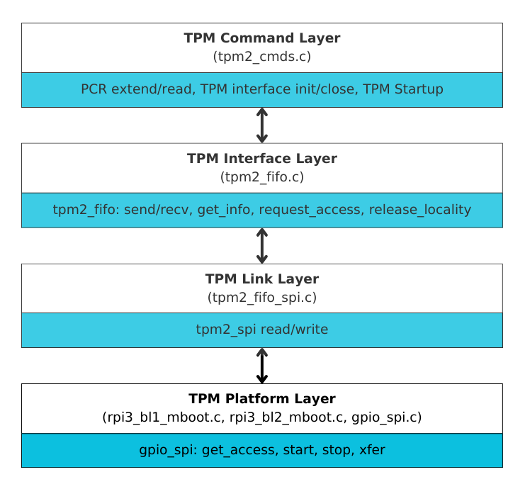

Discrete TPM drivers
====================

This section focuses on the design and functionality of Discrete TPM drivers
in |TF-A|. The |TPM| technology is designed to provide
a dedicated, hardware-based solution for storing cryptographic keys and
performing security-related operations.

Discrete TPMs are separate, standalone hardware components that are physically
isolated from the system's main processor. This isolation helps protect
sensitive information, such as encryption keys and platform credentials, from
being accessed or tampered with by malicious software or unauthorized users.
When a Discrete TPM interface is implemented correctly, the risk of software
based attacks is reduced, further reducing the attack surface.

TPM measurements establish the security posture of a system and are used for
attestation. Performing measurements using a TPM in TF-A is beneficial from
a security standpoint because it ensures hardware-backed attestation earlier
in the boot flow, reducing the risk of a compromised root of trust.

The design implemented in TF-A supports multiple types of TPM hardware interfaces
and hardware bus types in order to be compatible with different platforms.
Platforms opt to use a specific messaging interface, such as |CRB| or |FIFO|,
and a specific hardware bus interface, such as |I2C| or |SPI|.

Driver architecture
-------------------

The Discrete TPM drivers are split up into four layers, each serving a distinct
purpose in the overall architecture:

   - **Command Layer**: This layer provides various TPM commands based on the
     `TCG TPM 2.0 Library Specification`_. It allows a system to initialize the
     TPM interface, perform a TPM startup, set up a locality for operations like
     PCR extend and read, and release the locality when finished.
   - **Interface Layer**: This layer handles sending and receiving TPM commands
     via a specific TPM interface like FIFO or CRB. It also includes functions
     such as getting information, requesting access, and relinquishing access,
     tailored to the specific interface.
   - **Link Layer**: Discrete TPMs may appear as a SPI, I2C, or memory mapped
     device. The link layer maps the command passed from the interface layer to
     the appropriate bus type. It includes hardware link read and write functions
     that use the platform bus interface to transfer commands.
   - **Platform Layer**: The platform layer implements the details of how to
     communicate to the TPM chip for a specific platform. The link layer uses the
     platform layer to read and write to the TPM.

   .. note::
      The command, interface, and link layers are implemented in common code in
      TF-A. The platform layer is implemented in platform specific code.

The following diagram illustrates the Discrete TPM driver stack for the Raspberry
Pi 3 platform.

|rpi3 dtpm driver stack|

Header files
^^^^^^^^^^^^
- TPM Drivers: ``include/drivers/tpm``

Source files
^^^^^^^^^^^^
- TPM Drivers: ``drivers/tpm``

Build time config options
-------------------------

- ``MBOOT_TPM_HASH_ALG``: The hash algorithm to be used by the TPM, currently
  the only supported algorithm is ``sha256``. As additional Discrete TPMs are
  tested and integrated in TF-A, support for more algorithms will become
  available.
- ``DISCRETE_TPM``: Boolean flag to enable Discrete TPM support. Depending
  on the selected TPM interface, the appropriate drivers will be built and
  packaged into firmware.
- ``TPM_INTERFACE``: This flag is required when ``DISCRETE_TPM=1``,
  currently the only supported interface is ``FIFO_SPI``.
  Ideally there should be four options:

  .. code:: shell

      FIFO_I2C
      FIFO_SPI
      FIFO_MMIO
      CRB

  .. note::
    ``MBOOT_TPM_HASH_ALG`` will automatically overwrite ``MBOOT_EL_HASH_ALG``.
    This is to ensure the event log and the TPM are using the same hash
    algorithm.

Discrete TPM Initialization
---------------------------
The TPM needs to be initialized based on the platform, the hardware interfaces
need to be set up independently, and once they are setup, the TPM commands
``tpm_interface_init()`` and subsequently ``tpm_startup()`` can be called.
``tpm_startup()`` only needs to be called once after startup, or if the system
is reset.

An example of platform specific TPM hardware initialization for the rpi3 can be
found in ``plat/rpi/rpi3/rpi3_bl1_setup.c`` and ``plat/rpi/rpi3/rpi3_bl1_mboot.c``

Discrete TPM PCR Extend
-----------------------
Once the TPM is setup, the TPM ``pcr_extend`` operation can be used to extend
hashes and store them in PCR 0.

An example of ``pcr_extend`` that is used during rpi3 measured boot can be found
 in ``plat/rpi/rpi3/rpi3_bl1_mboot.c`` and ``plat/rpi/rpi3/rpi3_bl2_mboot.c``.

*Copyright (c) 2025, Arm Limited. All rights reserved.*

.. _TCG TPM 2.0 Library Specification: https://trustedcomputinggroup.org/resource/tpm-library-specification/
