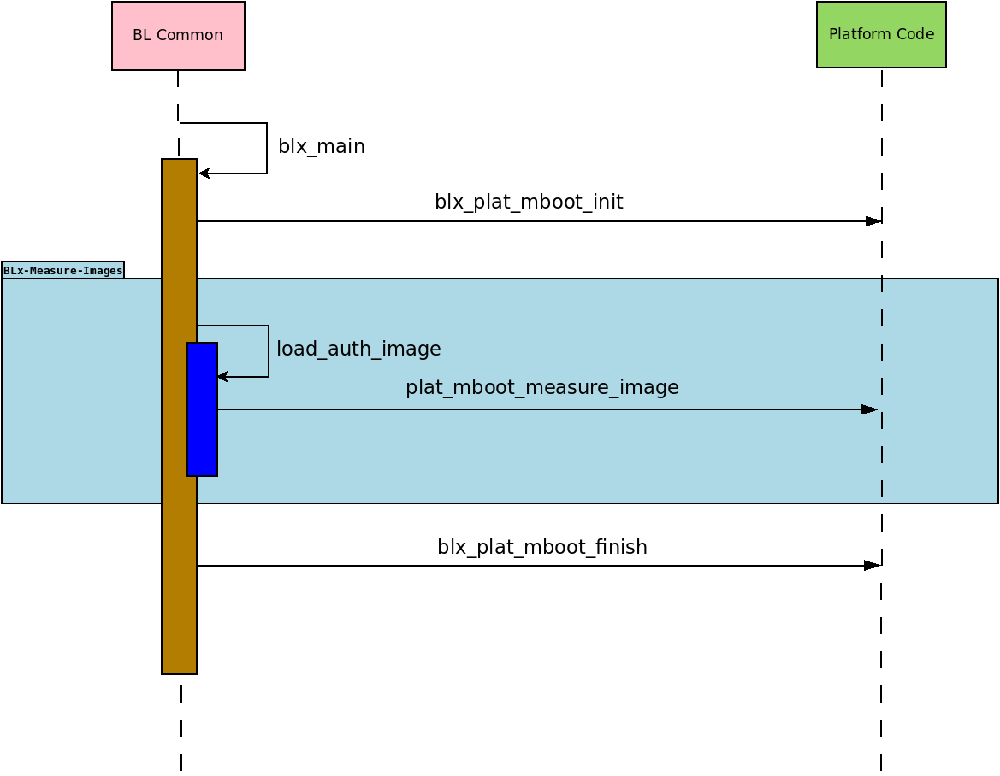

Measured Boot Design
====================

This document briefly explains the Measured-Boot design implementation
in |TF-A|.

Introduction
------------

Measured Boot is the process of computing and securely recording hashes of code
and critical data at each stage in the boot chain before the code/data is used.

These measurements can be leveraged by other components in the system to
implement a complete attestation system. For example, they could be used to
enforce local attestation policies (such as releasing certain platform keys or
not), or they could be securely sent to a remote challenger a.k.a. `verifier`
after boot to attest to the state of the code and critical-data.

Measured Boot does not authenticate the code or critical-data, but simply
records what code/critical-data was present on the system during boot.

It is assumed that BL1 is implicitly trusted (by virtue of immutability) and
acts as the root of trust for measurement hence it is not measured.

The Measured Boot implementation in TF-A supports multiple backends to securely
store measurements mentioned below in the :ref:`Measured Boot Backends` section.

Critical data
-------------

All firmware images - i.e. BLx images and their corresponding configuration
files, if any - must be measured. In addition to that, there might be specific
pieces of data which needs to be measured as well. These are typically different
on each platform. They are referred to as *critical data*.

Critical data for the platform can be determined using the following criteria:

#. Data that influence boot flow behaviour such as -

   - Configuration parameters that alter the boot flow path.
   - Parameters that determine which firmware to load from NV-Storage to
     SRAM/DRAM to pass the boot process successfully.

#. Hardware configurations settings, debug settings and security policies
   that need to be in a valid state for a device to maintain its security
   posture during boot and runtime.
#. Security-sensitive data that is being updated by hardware.

Examples of Critical data:

#. The list of errata workarounds being applied at reset.
#. State of fuses such as whether an SoC is in secure mode.
#. NV counters that determine whether firmware is up-to-date and secure.

Measurement slot
----------------

The measurement slot resides in a Trusted Module and can be either a secure
register or memory.
The measurement slot is used to provide a method to cryptographically record
(measure) images and critical data on a platform.
The measurement slot update calculation, called an **extend** operation, is
a one-way hash of all the previous measurements and the new measurement. It
is the only way to change the slot value, thus no measurements can ever be
removed or overwritten.

.. _Measured Boot Backends:

Measured Boot Backends
----------------------

The Measured Boot implementation in TF-A supports:

#. Event Log

   The TCG Event Log holds a record of measurements made into the Measurement
   Slot aka PCR (Platform Configuration Register).

   The `TCG EFI Protocol Specification`_ provides details on how to measure
   components. The Arm document
   `Arm® Server Base Security Guide`_ provides specific guidance for
   measurements on an SBSA/SBBR server system. By considering these
   specifications it is decided that -

   #. Use PCR0 for images measurements.
   #. Use PCR1 for Critical data measurements.

   TCG has specified the architecture for the structure of this log in the
   `TCG EFI Protocol Specification`_. The specification describes two event
   log event records—the legacy, fixed size SHA1 structure called TCG_PCR_EVENT
   and the variable length crypto agile structure called TCG_PCR_EVENT2. Event
   Log driver implemented in TF-A covers later part.

#. RSS

   It is one of physical backend to extend the measurements. Please refer this
   document :ref:`Runtime Security Subsystem (RSS)` for more details.

Platform Interface
------------------

Every image which gets successfully loaded in memory (and authenticated, if
trusted boot is enabled) then gets measured. In addition to that, platforms
can measure any relevant piece of critical data at any point during the boot.
The following diagram outlines the call sequence for Measured Boot platform
interfaces invoked from generic code:

These platform interfaces are used by BL1 and BL2 only, and are declared in
``include/plat/common/platform.h``.
BL31 does not load and thus does not measure any image.

Responsibilities of these platform interfaces are -

#. **Function : blx_plat_mboot_init()**

   .. code-block:: c

      void bl1_plat_mboot_init(void);
      void bl2_plat_mboot_init(void);

   Initialise all Measured Boot backends supported by the platform
   (e.g. Event Log buffer, RSS). As these functions do not return any value,
   the platform should deal with error management, such as logging the error
   somewhere, or panicking the system if this is considered a fatal error.

   - On the Arm FVP port -

     - In BL1, this function is used to initialize the Event Log backend
       driver, and also to write header information in the Event Log
       buffer.
     - In BL2, this function is used to initialize the Event Log buffer with
       the information received from the BL1. It results in panic on
       error.

#. **Function : plat_mboot_measure_image()**

   .. code-block:: c

      int plat_mboot_measure_image(unsigned int image_id,
                                   image_info_t *image_data);

   - Measure the image using a hash function of the crypto module.

   - Record the measurement in the corresponding backend -

     - If it is Event Log backend, then record the measurement in TCG Event Log
       format.
     - If it is a secure crypto-processor (like RSS), then extend the designated
       PCR (or slot) with the given measurement.
   - This function must return 0 on success, a signed integer error code
     otherwise.
   - On the Arm FVP port, this function measures the given image and then
     records that measurement in the Event Log buffer.
     The passed id is used to retrieve information about on how to measure
     the image (e.g. PCR number).

#. **Function : blx_plat_mboot_finish()**

   .. code-block:: c

      void bl1_plat_mboot_finish(void);
      void bl2_plat_mboot_finish(void);

   - Do all teardown operations with respect to initialised Measured Boot backends.
     This could be -

     - Pass the Event Log details (start address and size) to Normal world or to
       Secure World using any platform implementation way.
     - Measure all critical data if any.
     - As these functions do not return any value, the platform should deal with
       error management, such as logging the error somewhere, or panicking the
       system if this is considered a fatal error.

   - On the Arm FVP port -

     - In BL1, this function is used to pass the base address of
       the Event Log buffer and its size to BL2 via tb_fw_config to extend the
       Event Log buffer with the measurement of various images loaded by BL2.
       It results in panic on error.
     - In BL2, this function is used to pass the Event Log buffer information
       (base address and size) to non-secure(BL33) and trusted OS(BL32) via
       nt_fw and tos_fw config respectively.
       See :ref:`DTB binding for Event Log properties` for a description of the
       bindings used for Event Log properties.

#. **Function : plat_mboot_measure_critical_data()**

   .. code-block:: c

      int plat_mboot_measure_critical_data(unsigned int critical_data_id,
                                           const void *base,
                                           size_t size);

   This interface is not invoked by the generic code and it is up to the
   platform layer to call it where appropriate.

   This function measures the given critical data structure and records its
   measurement using the Measured Boot backend driver.
   This function must return 0 on success, a signed integer error code
   otherwise.

   In FVP, Non volatile counters get measured and recorded as Critical data
   using the backend via this interface.

#. **Function : plat_mboot_measure_key()**

   .. code-block:: c

      int plat_mboot_measure_key(const void *pk_oid, const void *pk_ptr,
                                 size_t pk_len);

   - This function is used by the platform to measure the passed key and
     publicise it using any of the supported backends.
   - The authentication module within the trusted boot framework calls this
     function for every ROTPK involved in verifying the signature of a root
     certificate and for every subsidiary key that gets extracted from a key
     certificate for later authentication of a content certificate.
   - A cookie, passed as the first argument, serves as a key-OID pointer
     associated with the public key data, passed as the second argument.
   - Public key data size is passed as the third argument to this function.
   - This function must return 0 on success, a signed integer error code
     otherwise.
   - In FVP platform, this function is used to calculate the hash of the given
     key and forward this hash to RSS alongside the measurement of the image
     which the key signs.

--------------

*Copyright (c) 2023, Arm Limited. All rights reserved.*

.. _Arm® Server Base Security Guide: https://developer.arm.com/documentation/den0086/latest
.. _TCG EFI Protocol Specification: https://trustedcomputinggroup.org/wp-content/uploads/EFI-Protocol-Specification-rev13-160330final.pdf
