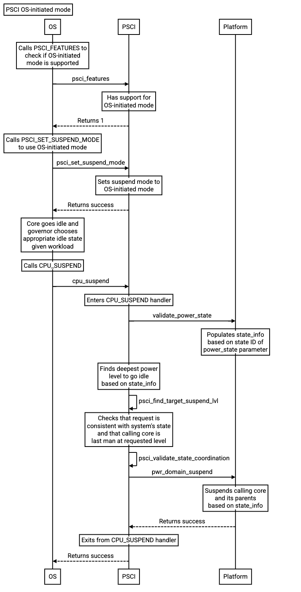
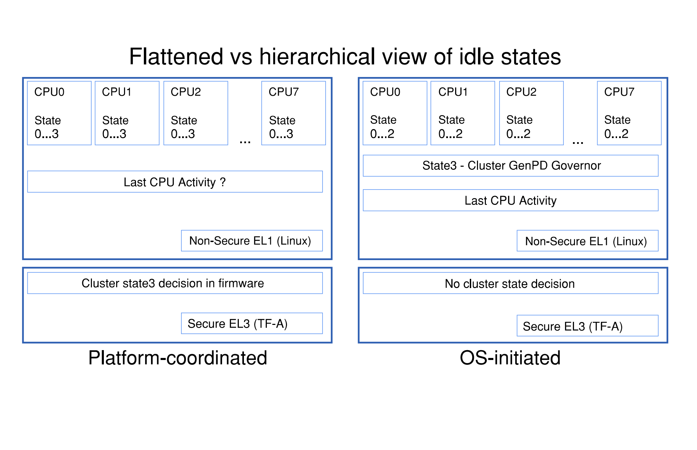
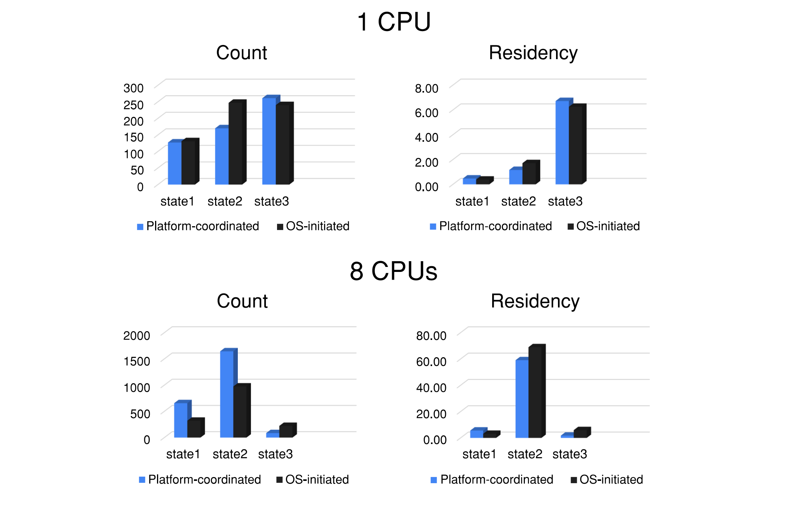

PSCI OS-initiated mode
======================

:Author: Maulik Shah & Wing Li
:Organization: Qualcomm Innovation Center, Inc. & Google LLC
:Contact: Maulik Shah <quic_mkshah@quicinc.com> & Wing Li <wingers@google.com>
:Status: Accepted

.. contents:: Table of Contents

Introduction
------------

Power state coordination
^^^^^^^^^^^^^^^^^^^^^^^^

A power domain topology is a logical hierarchy of power domains in a system that
arises from the physical dependencies between power domains.

Local power states describe power states for an individual node, and composite
power states describe the combined power states for an individual node and its
parent node(s).

Entry into low-power states for a topology node above the core level requires
coordinating its children nodes. For example, in a system with a power domain
that encompasses a shared cache, and a separate power domain for each core that
uses the shared cache, the core power domains must be powered down before the
shared cache power domain can be powered down.

PSCI supports two modes of power state coordination: platform-coordinated and
OS-initiated.

Platform-coordinated
~~~~~~~~~~~~~~~~~~~~

Platform-coordinated mode is the default mode of power state coordination, and
is currently the only supported mode in TF-A.

In platform-coordinated mode, the platform is responsible for coordinating power
states, and chooses the deepest power state for a topology node that can be
tolerated by its children.

OS-initiated
~~~~~~~~~~~~

OS-initiated mode is optional.

In OS-initiated mode, the calling OS is responsible for coordinating power
states, and may request for a topology node to enter a low-power state when
its last child enters the low-power state.

Motivation
----------

There are two reasons why OS-initiated mode might be a more suitable option than
platform-coordinated mode for a platform.

Scalability
^^^^^^^^^^^

In platform-coordinated mode, each core independently selects their own local
power states, and doesn't account for composite power states that are shared
between cores.

In OS-initiated mode, the OS has knowledge of the next wakeup event for each
core, and can have more precise control over the entry, exit, and wakeup
latencies when deciding if a composite power state (e.g. for a cluster) is
appropriate. This is especially important for multi-cluster SMP systems and
heterogeneous systems like big.LITTLE, where different processor types can have
different power efficiencies.

Simplicity
^^^^^^^^^^

In platform-coordinated mode, the OS doesn't have visibility when the last core
at a power level enters a low-power state. If the OS wants to perform last man
activity (e.g. powering off a shared resource when it is no longer needed), it
would have to communicate with an API side channel to know when it can do so.
This could result in a design smell where the platform is using
platform-coordinated mode when it should be using OS-initiated mode instead.

In OS-initiated mode, the OS can perform last man activity if it selects a
composite power state when the last core enters a low-power state. This
eliminates the need for a side channel, and uses the well documented API between
the OS and the platform.

Current vendor implementations and workarounds
^^^^^^^^^^^^^^^^^^^^^^^^^^^^^^^^^^^^^^^^^^^^^^

* STMicroelectronics

  * For their ARM32 platforms, they're using OS-initiated mode implemented in
    OP-TEE.
  * For their future ARM64 platforms, they are interested in using OS-initiated
    mode in TF-A.

* Qualcomm

  * For their mobile platforms, they're using OS-initiated mode implemented in
    their own custom secure monitor firmware.
  * For their Chrome OS platforms, they're using platform-coordinated mode in
    TF-A with custom driver logic to perform last man activity.

* Google

  * They're using platform-coordinated mode in TF-A with custom driver logic to
    perform last man activity.

Both Qualcomm and Google would like to be able to use OS-initiated mode in TF-A
in order to simplify custom driver logic.

Requirements
------------

PSCI_FEATURES
^^^^^^^^^^^^^

PSCI_FEATURES is for checking whether or not a PSCI function is implemented and
what its properties are.

.. c:macro:: PSCI_FEATURES

   :param func_id: 0x8400_000A.
   :param psci_func_id: the function ID of a PSCI function.
   :retval NOT_SUPPORTED: if the function is not implemented.
   :retval feature flags associated with the function: if the function is
       implemented.

CPU_SUSPEND feature flags
~~~~~~~~~~~~~~~~~~~~~~~~~

* Reserved, bits[31:2]
* Power state parameter format, bit[1]

  * A value of 0 indicates the original format is used.
  * A value of 1 indicates the extended format is used.

* OS-initiated mode, bit[0]

  * A value of 0 indicates OS-initiated mode is not supported.
  * A value of 1 indicates OS-initiated mode is supported.

See sections 5.1.14 and 5.15 of the PSCI spec (DEN0022D.b) for more details.

PSCI_SET_SUSPEND_MODE
^^^^^^^^^^^^^^^^^^^^^

PSCI_SET_SUSPEND_MODE is for switching between the two different modes of power
state coordination.

.. c:macro:: PSCI_SET_SUSPEND_MODE

   :param func_id: 0x8400_000F.
   :param mode: 0 indicates platform-coordinated mode, 1 indicates OS-initiated
       mode.
   :retval SUCCESS: if the request is successful.
   :retval NOT_SUPPORTED: if OS-initiated mode is not supported.
   :retval INVALID_PARAMETERS: if the requested mode is not a valid value (0 or
       1).
   :retval DENIED: if the cores are not in the correct state.

Switching from platform-coordinated to OS-initiated is only allowed if the
following conditions are met:

* All cores are in one of the following states:

  * Running.
  * Off, through a call to CPU_OFF or not yet booted.
  * Suspended, through a call to CPU_DEFAULT_SUSPEND.

* None of the cores has called CPU_SUSPEND since the last change of mode or
  boot.

Switching from OS-initiated to platform-coordinated is only allowed if all cores
other than the calling core are off, either through a call to CPU_OFF or not yet
booted.

If these conditions are not met, the PSCI implementation must return DENIED.

See sections 5.1.19 and 5.20 of the PSCI spec (DEN0022D.b) for more details.

CPU_SUSPEND
^^^^^^^^^^^

CPU_SUSPEND is for moving a topology node into a low-power state.

.. c:macro:: CPU_SUSPEND

   :param func_id: 0xC400_0001.
   :param power_state: the requested low-power state to enter.
   :param entry_point_address: the address at which the core must resume
       execution following wakeup from a powerdown state.
   :param context_id: this field specifies a pointer to the saved context that
       must be restored on a core following wakeup from a powerdown state.
   :retval SUCCESS: if the request is successful.
   :retval INVALID_PARAMETERS: in OS-initiated mode, this error is returned when
       a low-power state is requested for a topology node above the core level,
       and at least one of the node's children is in a local low-power state
       that is incompatible with the request.
   :retval INVALID_ADDRESS: if the entry_point_address argument is invalid.
   :retval DENIED: only in OS-initiated mode; this error is returned when a
       low-power state is requested for a topology node above the core level,
       and at least one of the node's children is running, i.e. not in a
       low-power state.

In platform-coordinated mode, the PSCI implementation coordinates requests from
all cores to determine the deepest power state to enter.

In OS-initiated mode, the calling OS is making an explicit request for a
specific power state, as opposed to expressing a vote. The PSCI implementation
must comply with the request, unless the request is not consistent with the
implementation's view of the system's state, in which case, the implementation
must return INVALID_PARAMETERS or DENIED.

See sections 5.1.2 and 5.4 of the PSCI spec (DEN0022D.b) for more details.

Power state formats
~~~~~~~~~~~~~~~~~~~

Original format

* Power Level, bits[25:24]

  * The requested level in the power domain topology to enter a low-power
    state.

* State Type, bit[16]

  * A value of 0 indicates a standby or retention state.
  * A value of 1 indicates a powerdown state.

* State ID, bits[15:0]

  * Field to specify the requested composite power state.
  * The state ID encodings must uniquely describe every possible composite
    power state.
  * In OS-initiated mode, the state ID encoding must allow expressing the
    power level at which the calling core is the last to enter a powerdown
    state.

Extended format

* State Type, bit[30]
* State ID, bits[27:0]

Races in OS-initiated mode
~~~~~~~~~~~~~~~~~~~~~~~~~~

In OS-initiated mode, there are race windows where the OS's view and
implementation's view of the system's state differ. It is possible for the OS to
make requests that are invalid given the implementation's view of the system's
state. For example, the OS might request a powerdown state for a node from one
core, while at the same time, the implementation observes that another core in
that node is powering up.

To address potential race conditions in power state requests:

* The calling OS must specify in each CPU_SUSPEND request the deepest power
  level for which it sees the calling core as the last running core (last man).
  This is required even if the OS doesn't want the node at that power level to
  enter a low-power state.
* The implementation must validate that the requested power states in the
  CPU_SUSPEND request are consistent with the system's state, and that the
  calling core is the last core running at the requested power level, or deny
  the request otherwise.

See sections 4.2.3.2, 6.2, and 6.3 of the PSCI spec (DEN0022D.b) for more
details.

Caveats
-------

CPU_OFF
^^^^^^^

CPU_OFF is always platform-coordinated, regardless of whether the power state
coordination mode for suspend is platform-coordinated or OS-initiated. If all
cores in a topology node call CPU_OFF, the last core will power down the node.

In OS-initiated mode, if a subset of the cores in a topology node has called
CPU_OFF, the last running core may call CPU_SUSPEND to request a powerdown state
at or above that node's power level.

See section 5.5.2 of the PSCI spec (DEN0022D.b) for more details.

Implementation
--------------

Current implementation of platform-coordinated mode
^^^^^^^^^^^^^^^^^^^^^^^^^^^^^^^^^^^^^^^^^^^^^^^^^^^

Platform-coordinated is currently the only supported power state coordination
mode in TF-A.

The functions of interest in the ``psci_cpu_suspend`` call stack are as follows:

* ``psci_validate_power_state``

  * This function calls a platform specific ``validate_power_state`` handler,
    which takes the ``power_state`` parameter, and updates the ``state_info``
    object with the requested states for each power level.

* ``psci_find_target_suspend_lvl``

  * This function takes the ``state_info`` object containing the requested power
    states for each power level, and returns the deepest power level that was
    requested to enter a low power state, i.e. the target power level.

* ``psci_do_state_coordination``

  * This function takes the target power level and the ``state_info`` object
    containing the requested power states for each power level, and updates the
    ``state_info`` object with the coordinated target power state for each
    level.

* ``pwr_domain_suspend``

  * This is a platform specific handler that takes the ``state_info`` object
    containing the target power states for each power level, and transitions
    each power level to the specified power state.

Proposed implementation of OS-initiated mode
^^^^^^^^^^^^^^^^^^^^^^^^^^^^^^^^^^^^^^^^^^^^

To add support for OS-initiated mode, the following changes are proposed:

* Add a boolean build option ``PSCI_OS_INIT_MODE`` for a platform to enable
  optional support for PSCI OS-initiated mode. This build option defaults to 0.

.. note::

   If ``PSCI_OS_INIT_MODE=0``, the following changes will not be compiled into
   the build.

* Update ``psci_features`` to return 1 in bit[0] to indicate support for
  OS-initiated mode for CPU_SUSPEND.
* Define a ``suspend_mode`` enum: ``PLAT_COORD`` and ``OS_INIT``.
* Define a ``psci_suspend_mode`` global variable with a default value of
  ``PLAT_COORD``.
* Implement a new function handler ``psci_set_suspend_mode`` for
  PSCI_SET_SUSPEND_MODE.
* Since ``psci_validate_power_state`` calls a platform specific
  ``validate_power_state`` handler, the platform implementation should populate
  the ``state_info`` object based on the state ID from the given ``power_state``
  parameter.
* ``psci_find_target_suspend_lvl`` remains unchanged.
* Implement a new function ``psci_validate_state_coordination`` that ensures the
  request satisfies the following conditions, and denies any requests
  that don't:

  * The requested power states for each power level are consistent with the
    system's state
  * The calling core is the last core running at the requested power level

  This function differs from ``psci_do_state_coordination`` in that:

  * The ``psci_req_local_pwr_states`` map is not modified if the request were to
    be denied
  * The ``state_info`` argument is never modified since it contains the power
    states requested by the calling OS

* Update ``psci_cpu_suspend_start`` to do the following:

  * If ``PSCI_SUSPEND_MODE`` is ``PLAT_COORD``, call
    ``psci_do_state_coordination``.
  * If ``PSCI_SUSPEND_MODE`` is ``OS_INIT``, call
    ``psci_validate_state_coordination``. If validation fails, propagate the
    error up the call stack.

* Add a new optional member ``pwr_domain_validate_suspend`` to
  ``plat_psci_ops_t`` to allow the platform to optionally perform validations
  based on hardware states.

* The platform specific ``pwr_domain_suspend`` handler remains unchanged.

Testing
-------

The proposed patches can be found at
https://review.trustedfirmware.org/q/topic:psci-osi.

Testing on FVP and Google platforms
^^^^^^^^^^^^^^^^^^^^^^^^^^^^^^^^^^^

The proposed patches add a new CPU Suspend in OSI mode test suite to TF-A Tests.
This has been enabled and verified on the FVP_Base_RevC-2xAEMvA platform and
Google platforms, and excluded from all other platforms via the build option
``PLAT_TESTS_SKIP_LIST``.

Testing on STM32MP15
^^^^^^^^^^^^^^^^^^^^

The proposed patches have been tested and verified on the STM32MP15 platform,
which has a single cluster with 2 CPUs, by Gabriel Fernandez
<gabriel.fernandez@st.com> from STMicroelectronics with this device tree
configuration:

.. code-block:: devicetree

   cpus {
           #address-cells = <1>;
           #size-cells = <0>;

           cpu0: cpu@0 {
                   device_type = "cpu";
                   compatible = "arm,cortex-a7";
                   reg = <0>;
                   enable-method = "psci";
                   power-domains = <&CPU_PD0>;
                   power-domain-names = "psci";
           };
           cpu1: cpu@1 {
                   device_type = "cpu";
                   compatible = "arm,cortex-a7";
                   reg = <1>;
                   enable-method = "psci";
                   power-domains = <&CPU_PD1>;
                   power-domain-names = "psci";
           };

           idle-states {
                   cpu_retention: cpu-retention {
                           compatible = "arm,idle-state";
                           arm,psci-suspend-param = <0x00000001>;
                           entry-latency-us = <130>;
                           exit-latency-us = <620>;
                           min-residency-us = <700>;
                           local-timer-stop;
                   };
           };

           domain-idle-states {
                   CLUSTER_STOP: core-power-domain {
                           compatible = "domain-idle-state";
                           arm,psci-suspend-param = <0x01000001>;
                           entry-latency-us = <230>;
                           exit-latency-us = <720>;
                           min-residency-us = <2000>;
                           local-timer-stop;
                   };
           };
   };

   psci {
           compatible = "arm,psci-1.0";
           method = "smc";

           CPU_PD0: power-domain-cpu0 {
                   #power-domain-cells = <0>;
                   power-domains = <&pd_core>;
                   domain-idle-states = <&cpu_retention>;
           };

           CPU_PD1: power-domain-cpu1 {
                   #power-domain-cells = <0>;
                   power-domains = <&pd_core>;
                   domain-idle-states = <&cpu_retention>;
           };

           pd_core: power-domain-cluster {
                   #power-domain-cells = <0>;
                   domain-idle-states = <&CLUSTER_STOP>;
           };
   };

Testing on Qualcomm SC7280
^^^^^^^^^^^^^^^^^^^^^^^^^^

The proposed patches have been tested and verified on the SC7280 platform by
Maulik Shah <quic_mkshah@quicinc.com> from Qualcomm with this device tree
configuration:

.. code-block:: devicetree

   cpus {
           #address-cells = <2>;
           #size-cells = <0>;

           CPU0: cpu@0 {
                   device_type = "cpu";
                   compatible = "arm,kryo";
                   reg = <0x0 0x0>;
                   enable-method = "psci";
                   power-domains = <&CPU_PD0>;
                   power-domain-names = "psci";
           };

           CPU1: cpu@100 {
                   device_type = "cpu";
                   compatible = "arm,kryo";
                   reg = <0x0 0x100>;
                   enable-method = "psci";
                   power-domains = <&CPU_PD1>;
                   power-domain-names = "psci";
           };

           CPU2: cpu@200 {
                   device_type = "cpu";
                   compatible = "arm,kryo";
                   reg = <0x0 0x200>;
                   enable-method = "psci";
                   power-domains = <&CPU_PD2>;
                   power-domain-names = "psci";
           };

           CPU3: cpu@300 {
                   device_type = "cpu";
                   compatible = "arm,kryo";
                   reg = <0x0 0x300>;
                   enable-method = "psci";
                   power-domains = <&CPU_PD3>;
                   power-domain-names = "psci";
           }

           CPU4: cpu@400 {
                   device_type = "cpu";
                   compatible = "arm,kryo";
                   reg = <0x0 0x400>;
                   enable-method = "psci";
                   power-domains = <&CPU_PD4>;
                   power-domain-names = "psci";
           };

           CPU5: cpu@500 {
                   device_type = "cpu";
                   compatible = "arm,kryo";
                   reg = <0x0 0x500>;
                   enable-method = "psci";
                   power-domains = <&CPU_PD5>;
                   power-domain-names = "psci";
           };

           CPU6: cpu@600 {
                   device_type = "cpu";
                   compatible = "arm,kryo";
                   reg = <0x0 0x600>;
                   enable-method = "psci";
                   power-domains = <&CPU_PD6>;
                   power-domain-names = "psci";
           };

           CPU7: cpu@700 {
                   device_type = "cpu";
                   compatible = "arm,kryo";
                   reg = <0x0 0x700>;
                   enable-method = "psci";
                   power-domains = <&CPU_PD7>;
                   power-domain-names = "psci";
           };

           idle-states {
                   entry-method = "psci";

                   LITTLE_CPU_SLEEP_0: cpu-sleep-0-0 {
                           compatible = "arm,idle-state";
                           idle-state-name = "little-power-down";
                           arm,psci-suspend-param = <0x40000003>;
                           entry-latency-us = <549>;
                           exit-latency-us = <901>;
                           min-residency-us = <1774>;
                           local-timer-stop;
                   };

                   LITTLE_CPU_SLEEP_1: cpu-sleep-0-1 {
                           compatible = "arm,idle-state";
                           idle-state-name = "little-rail-power-down";
                           arm,psci-suspend-param = <0x40000004>;
                           entry-latency-us = <702>;
                           exit-latency-us = <915>;
                           min-residency-us = <4001>;
                           local-timer-stop;
                   };

                   BIG_CPU_SLEEP_0: cpu-sleep-1-0 {
                           compatible = "arm,idle-state";
                           idle-state-name = "big-power-down";
                           arm,psci-suspend-param = <0x40000003>;
                           entry-latency-us = <523>;
                           exit-latency-us = <1244>;
                           min-residency-us = <2207>;
                           local-timer-stop;
                   };

                   BIG_CPU_SLEEP_1: cpu-sleep-1-1 {
                           compatible = "arm,idle-state";
                           idle-state-name = "big-rail-power-down";
                           arm,psci-suspend-param = <0x40000004>;
                           entry-latency-us = <526>;
                           exit-latency-us = <1854>;
                           min-residency-us = <5555>;
                           local-timer-stop;
                   };
           };

           domain-idle-states {
                   CLUSTER_SLEEP_0: cluster-sleep-0 {
                           compatible = "arm,idle-state";
                           idle-state-name = "cluster-power-down";
                           arm,psci-suspend-param = <0x40003444>;
                           entry-latency-us = <3263>;
                           exit-latency-us = <6562>;
                           min-residency-us = <9926>;
                           local-timer-stop;
                   };
           };
   };

   psci {
           compatible = "arm,psci-1.0";
           method = "smc";

           CPU_PD0: cpu0 {
                   #power-domain-cells = <0>;
                   power-domains = <&CLUSTER_PD>;
                   domain-idle-states = <&LITTLE_CPU_SLEEP_0 &LITTLE_CPU_SLEEP_1>;
           };

           CPU_PD1: cpu1 {
                   #power-domain-cells = <0>;
                   power-domains = <&CLUSTER_PD>;
                   domain-idle-states = <&LITTLE_CPU_SLEEP_0 &LITTLE_CPU_SLEEP_1>;
           };

           CPU_PD2: cpu2 {
                   #power-domain-cells = <0>;
                   power-domains = <&CLUSTER_PD>;
                   domain-idle-states = <&LITTLE_CPU_SLEEP_0 &LITTLE_CPU_SLEEP_1>;
           };

           CPU_PD3: cpu3 {
                   #power-domain-cells = <0>;
                   power-domains = <&CLUSTER_PD>;
                   domain-idle-states = <&LITTLE_CPU_SLEEP_0 &LITTLE_CPU_SLEEP_1>;
           };

           CPU_PD4: cpu4 {
                   #power-domain-cells = <0>;
                   power-domains = <&CLUSTER_PD>;
                   domain-idle-states = <&BIG_CPU_SLEEP_0 &BIG_CPU_SLEEP_1>;
           };

           CPU_PD5: cpu5 {
                   #power-domain-cells = <0>;
                   power-domains = <&CLUSTER_PD>;
                   domain-idle-states = <&BIG_CPU_SLEEP_0 &BIG_CPU_SLEEP_1>;
           };

           CPU_PD6: cpu6 {
                   #power-domain-cells = <0>;
                   power-domains = <&CLUSTER_PD>;
                   domain-idle-states = <&BIG_CPU_SLEEP_0 &BIG_CPU_SLEEP_1>;
           };

           CPU_PD7: cpu7 {
                   #power-domain-cells = <0>;
                   power-domains = <&CLUSTER_PD>;
                   domain-idle-states = <&BIG_CPU_SLEEP_0 &BIG_CPU_SLEEP_1>;
           };

           CLUSTER_PD: cpu-cluster0 {
                   #power-domain-cells = <0>;
                   domain-idle-states = <&CLUSTER_SLEEP_0>;
           };
   };

Comparisons on Qualcomm SC7280
^^^^^^^^^^^^^^^^^^^^^^^^^^^^^^

CPUIdle states
~~~~~~~~~~~~~~

* 8 CPUs, 1 L3 cache
* Platform-coordinated mode

  * CPUIdle states

    * State0 - WFI
    * State1 - Core collapse
    * State2 - Rail collapse
    * State3 - L3 cache off and system resources voted off

* OS-initiated mode

  * CPUIdle states

    * State0 - WFI
    * State1 - Core collapse
    * State2 - Rail collapse

  * Cluster domain idle state

    * State3 - L3 cache off and system resources voted off

Results
~~~~~~~

* The following stats have been captured with fixed CPU frequencies from the use
  case of 10 seconds of device idle with the display turned on and Wi-Fi and
  modem turned off.
* Count refers to the number of times a CPU or cluster entered power collapse.
* Residency refers to the time in seconds a CPU or cluster stayed in power
  collapse.
* The results are an average of 3 iterations of actual counts and residencies.

OS-initiated mode was able to scale better than platform-coordinated mode for
multiple CPUs. The count and residency results for state3 (i.e. a cluster domain
idle state) in OS-initiated mode for multiple CPUs were much closer to the
results for a single CPU than in platform-coordinated mode.

--------------

*Copyright (c) 2023, Arm Limited and Contributors. All rights reserved.*
