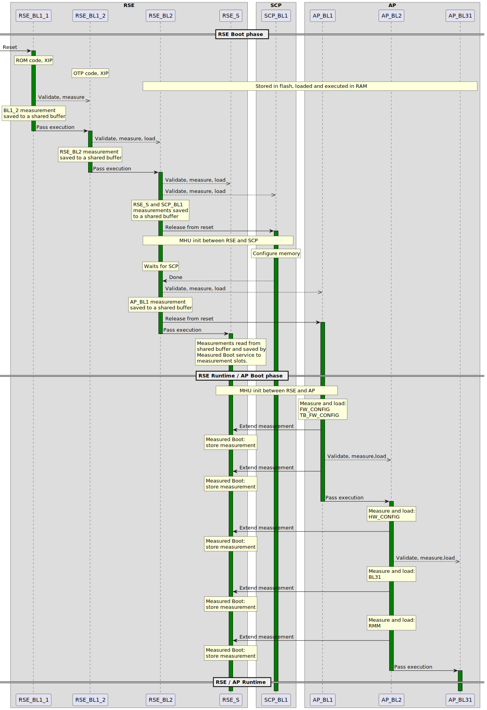
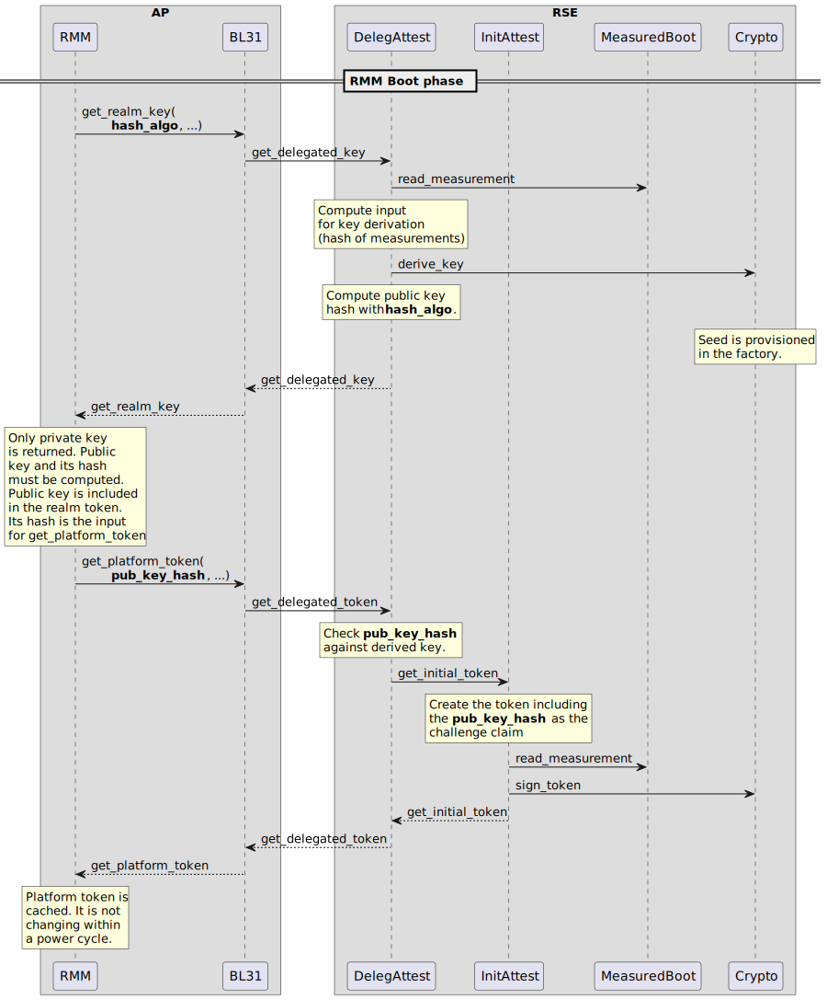

Runtime Security Engine (RSE)
=============================

This document focuses on the relationship between the Runtime Security Engine
(RSE) and the application processor (AP). According to the ARM reference design
the RSE is an independent core next to the AP and the SCP on the same die. It
provides fundamental security guarantees and runtime services for the rest of
the system (e.g.: trusted boot, measured boot, platform attestation,
key management, and key derivation).

At power up RSE boots first from its private ROM code. It validates and loads
its own images and the initial images of SCP and AP. When AP and SCP are
released from reset and their initial code is loaded then they continue their
own boot process, which is the same as on non-RSE systems. Please refer to the
``RSE documentation`` [1]_ for more details about the RSE boot flow.

The last stage of the RSE firmware is a persistent, runtime component. Much
like AP_BL31, this is a passive entity which has no periodical task to do and
just waits for external requests from other subsystems. RSE and other
subsystems can communicate with each other over message exchange. RSE waits
in idle for the incoming request, handles them, and sends a response then goes
back to idle.

RSE communication layer
-----------------------

The communication between RSE and other subsystems are primarily relying on the
Message Handling Unit (MHU) module.

However, this is possible to use this communication protocol with a different
mailbox than MHU, by setting the flag ``PLAT_MHU=NO_MHU`` and implementing the
APIs given in the file: ``include/drivers/arm/rse_comms.h``.

The number of MHU interfaces between RSE and other cores is IMPDEF. Besides MHU
other modules also could take part in the communication. RSE is capable of
mapping the AP memory to its address space.
Thereby either RSE core itself or a DMA engine if it is present, can move the
data between memory belonging to RSE or AP. In this way, a bigger amount of data
can be transferred in a short time.

The MHU comes in pairs. There is a sender and receiver side. They are connected
to each other. An MHU interface consists of two pairs of MHUs, one sender and
one receiver on both sides. Bidirectional communication is possible over an
interface. One pair provides message sending from AP to RSE and the other pair
from RSE to AP. The sender and receiver are connected via channels. There is an
IMPDEF number of channels (e.g: 4-16) between a sender and a receiver module.

The RSE communication layer provides two ways for message exchange:

- ``Embedded messaging``: The full message, including header and payload, are
  exchanged over the MHU channels. A channel is capable of delivering a single
  word. The sender writes the data to the channel register on its side and the
  receiver can read the data from the channel on the other side. One dedicated
  channel is used for signalling. It does not deliver any payload it is just
  meant for signalling that the sender loaded the data to the channel registers
  so the receiver can read them. The receiver uses the same channel to signal
  that data was read. Signalling happens via IRQ. If the message is longer than
  the data fit to the channel registers then the message is sent over in
  multiple rounds. Both, sender and receiver allocate a local buffer for the
  messages. Data is copied from/to these buffers to/from the channel registers.
- ``Pointer-access messaging``: The message header and the payload are
  separated and they are conveyed in different ways. The header is sent
  over the channels, similar to the embedded messaging but the payload is
  copied over by RSE core (or by DMA) between the sender and the receiver. This
  could be useful in the case of long messages because transaction time is less
  compared to the embedded messaging mode. Small payloads are copied by the RSE
  core because setting up DMA would require more CPU cycles. The payload is
  either copied into an internal buffer or directly read-written by RSE. Actual
  behavior depends on RSE setup, whether the partition supports memory-mapped
  ``iovec``. Therefore, the sender must handle both cases and prevent access to
  the memory, where payload data lives, while the RSE handles the request.

The RSE communication layer supports both ways of messaging in parallel. It is
decided at runtime based on the message size which way to transfer the message.

.. code-block:: bash

    +----------------------------------------------+       +-------------------+
    |                                              |       |                   |
    |                      AP                      |       |                   |
    |                                              |  +--->|       SRAM        |
    +----------------------------------------------|  |    |                   |
    |              BL1 / BL2 / BL31                |  |    |                   |
    +----------------------------------------------+  |    +-------------------+
             |                           ^            |        ^           ^
             |  send                 IRQ | receive    |direct  |           |
             V                           |            |access  |           |
    +--------------------+    +--------------------+  |        |           |
    |      MHU sender    |    |    MHU receiver    |  |        | Copy data |
    +--------------------+    +--------------------+  |        |           |
       | |           | |          | |           | |   |        |           |
       | | channels  | |          | | channels  | |   |        |           |
       | | e.g: 4-16 | |          | | e.g: 4-16 | |   |        V           |
    +--------------------+    +--------------------+  |    +-------+       |
    |     MHU receiver   |    |     MHU sender     |  | +->|  DMA  |       |
    +--------------------+    +--------------------+  | |  +-------+       |
             |                           ^            | |      ^           |
        IRQ  |  receive                  | send       | |      | Copy data |
             V                           |            | |      V           V
    +----------------------------------------------+  | |  +-------------------+
    |                                              |--+-+  |                   |
    |                  RSE                         |       |      SRAM         |
    |                                              |       |                   |
    +----------------------------------------------+       +-------------------+

.. Note::

    The RSE communication layer is not prepared for concurrent execution. The
    current use case only requires message exchange during the boot phase. In
    the boot phase, only a single core is running and the rest of the cores are
    in reset.

Message structure
^^^^^^^^^^^^^^^^^
A description of the message format can be found in the ``RSE communication
design`` [2]_ document.

Source files
^^^^^^^^^^^^
- RSE comms:  ``drivers/arm/rse``
- MHU driver: ``drivers/arm/mhu``

API for communication over MHU
^^^^^^^^^^^^^^^^^^^^^^^^^^^^^^
The API is defined in these header files:

- ``include/drivers/arm/rse_comms.h``
- ``include/drivers/arm/mhu.h``

RSE provided runtime services
-----------------------------

RSE provides the following runtime services:

- ``Measured boot``: Securely store the firmware measurements which were
  computed during the boot process and the associated metadata (image
  description, measurement algorithm, etc.). More info on measured boot service
  in RSE can be found in the ``measured_boot_integration_guide`` [3]_ .
- ``Delegated attestation``: Query the platform attestation token and derive a
  delegated attestation key. More info on the delegated attestation service
  in RSE can be found in the ``delegated_attestation_integration_guide`` [4]_ .
- ``OTP assets management``: Public keys used by AP during the trusted boot
  process can be requested from RSE. Furthermore, AP can request RSE to
  increase a non-volatile counter. Please refer to the
  ``RSE key management`` [5]_ document for more details.
- ``DICE Protection Environment``: Securely store the firmware measurements
  which were computed during the boot process and the associated metadata. It is
  also capable of representing the boot measurements in the form of a
  certificate chain, which is queriable. Please refer to the
  ``DICE Protection Environment (DPE)`` [8]_ document for more details.

Runtime service API
^^^^^^^^^^^^^^^^^^^
The RSE provided runtime services implement a PSA aligned API. The parameter
encoding follows the PSA client protocol described in the
``Firmware Framework for M`` [6]_ document in chapter 4.4. The implementation is
restricted to the static handle use case therefore only the ``psa_call`` API is
implemented.

Software and API layers
^^^^^^^^^^^^^^^^^^^^^^^

.. code-block:: bash

    +----------------+         +---------------------+
    |   BL1 / BL2    |         |       BL31          |
    +----------------+         +---------------------+
      |                         |
      | extend_measurement()    | get_delegated_key()
      |                         | get_platform_token()
      V                         V
    +----------------+         +---------------------+
    |  PSA protocol  |         |    PSA protocol     |
    +----------------+         +---------------------+
         |                               |
         | psa_call()                    | psa_call()
         |                               |
         V                               V
    +------------------------------------------------+
    |         RSE communication protocol             |
    +------------------------------------------------+
         |                     ^
         | mhu_send_data()     | mhu_receive_data()
         |                     |
         V                     |
    +------------------------------------------------+
    |                 MHU driver                     |
    +------------------------------------------------+
               |                      ^
               | Register access      | IRQ
               V                      |
    +------------------------------------------------+
    |             MHU HW on AP side                  |
    +------------------------------------------------+
                         ^
                         | Physical wires
                         |
                         V
    +------------------------------------------------+
    |             MHU HW on RSE side                 |
    +------------------------------------------------+
             |                        ^
             | IRQ                    | Register access
             V                        |
    +------------------------------------------------+
    |                 MHU driver                     |
    +------------------------------------------------+
             |                        |
             V                        V
    +---------------+       +------------------------+
    | Measured boot |       | Delegated attestation  |
    | service       |       | service                |
    +---------------+       +------------------------+

RSE based Measured Boot
-----------------------

Measured Boot is the process of cryptographically measuring (computing the hash
value of a binary) the code and critical data used at boot time. The
measurement must be stored in a tamper-resistant way, so the security state
of the device can be attested later to an external party. RSE provides a runtime
service which is meant to store measurements and associated metadata alongside.

Data is stored in internal SRAM which is only accessible by the secure runtime
firmware of RSE. Data is stored in so-called measurement slots. A platform has
IMPDEF number of measurement slots. The measurement storage follows extend
semantics. This means that measurements are not stored directly (as it was
taken) instead they contribute to the current value of the measurement slot.
The extension implements this logic, where ``||`` stands for concatenation:

.. code-block:: bash

    new_value_of_measurement_slot = Hash(old_value_of_measurement_slot || measurement)

Supported hash algorithms: sha-256, sha-512

Measured Boot API
^^^^^^^^^^^^^^^^^

Defined here:

- ``include/lib/psa/measured_boot.h``

.. code-block:: c

    psa_status_t
    rse_measured_boot_extend_measurement(uint8_t        index,
                                         const uint8_t *signer_id,
                                         size_t         signer_id_size,
                                         const uint8_t *version,
                                         size_t         version_size,
                                         uint32_t       measurement_algo,
                                         const uint8_t *sw_type,
                                         size_t         sw_type_size,
                                         const uint8_t *measurement_value,
                                         size_t         measurement_value_size,
                                         bool           lock_measurement);

Measured Boot Metadata
^^^^^^^^^^^^^^^^^^^^^^

The following metadata can be stored alongside the measurement:

- ``Signer-id``: Mandatory. The hash of the firmware image signing public key.
- ``Measurement algorithm``: Optional. The hash algorithm which was used to
  compute the measurement (e.g.: sha-256, etc.).
- ``Version info``: Optional. The firmware version info (e.g.: 2.7).
- ``SW type``: Optional. Short text description (e.g.: BL1, BL2, BL31, etc.)

.. Note::
    Version info is not implemented in TF-A yet.

The caller must specify in which measurement slot to extend a certain
measurement and metadata. A measurement slot can be extended by multiple
measurements. The default value is IMPDEF. All measurement slot is cleared at
reset, there is no other way to clear them. In the reference implementation,
the measurement slots are initialized to 0. At the first call to extend the
measurement in a slot, the extend operation uses the default value of the
measurement slot. All upcoming extend operation on the same slot contributes
to the previous value of that measurement slot.

The following rules are kept when a slot is extended multiple times:

- ``Signer-id`` must be the same as the previous call(s), otherwise a
  PSA_ERROR_NOT_PERMITTED error code is returned.

- ``Measurement algorithm``: must be the same as the previous call(s),
  otherwise, a PSA_ERROR_NOT_PERMITTED error code is returned.

In case of error no further action is taken (slot is not locked). If there is
a valid data in a sub-sequent call then measurement slot will be extended. The
rest of the metadata is handled as follows when a measurement slot is extended
multiple times:

- ``SW type``: Cleared.
- ``Version info``: Cleared.

.. Note::

    Extending multiple measurements in the same slot leads to some metadata
    information loss. Since RSE is not constrained on special HW resources to
    store the measurements and metadata, therefore it is worth considering to
    store all of them one by one in distinct slots. However, they are one-by-one
    included in the platform attestation token. So, the number of distinct
    firmware image measurements has an impact on the size of the attestation
    token.

The allocation of the measurement slot among RSE, Root and Realm worlds is
platform dependent. The platform must provide an allocation of the measurement
slot at build time. An example can be found in
``tf-a/plat/arm/board/tc/tc_bl1_measured_boot.c``
Furthermore, the memory, which holds the metadata is also statically allocated
in RSE memory. Some of the fields have a static value (measurement algorithm),
and some of the values have a dynamic value (measurement value) which is updated
by the bootloaders when the firmware image is loaded and measured. The metadata
structure is defined in
``include/drivers/measured_boot/rse/rse_measured_boot.h``.

.. code-block:: c

    struct rse_mboot_metadata {
            unsigned int id;
            uint8_t slot;
            uint8_t signer_id[SIGNER_ID_MAX_SIZE];
            size_t  signer_id_size;
            uint8_t version[VERSION_MAX_SIZE];
            size_t  version_size;
            uint8_t sw_type[SW_TYPE_MAX_SIZE];
            size_t  sw_type_size;
            void    *pk_oid;
            bool    lock_measurement;
    };

Signer-ID API
^^^^^^^^^^^^^

This function calculates the hash of a public key (signer-ID) using the
``Measurement algorithm`` and stores it in the ``rse_mboot_metadata`` field
named ``signer_id``.
Prior to calling this function, the caller must ensure that the ``signer_id``
field points to the zero-filled buffer.

Defined here:

- ``include/drivers/measured_boot/rse/rse_measured_boot.h``

.. code-block:: c

   int rse_mboot_set_signer_id(struct rse_mboot_metadata *metadata_ptr,
                               const void *pk_oid,
                               const void *pk_ptr,
                               size_t pk_len)

- First parameter is the pointer to the ``rse_mboot_metadata`` structure.
- Second parameter is the pointer to the key-OID of the public key.
- Third parameter is the pointer to the public key buffer.
- Fourth parameter is the size of public key buffer.
- This function returns 0 on success, a signed integer error code
  otherwise.

Build time config options
^^^^^^^^^^^^^^^^^^^^^^^^^

- ``MEASURED_BOOT``: Enable measured boot.
- ``MBOOT_RSE_HASH_ALG``: Determine the hash algorithm to measure the images.
  The default value is sha-256.

Measured boot flow
^^^^^^^^^^^^^^^^^^

Sample console log
^^^^^^^^^^^^^^^^^^

.. code-block:: bash

    INFO:    Measured boot extend measurement:
    INFO:     - slot        : 6
    INFO:     - signer_id   : 00 00 00 00 00 00 00 00 00 00 00 00 00 00 00 00
    INFO:                   : 00 00 00 00 00 00 00 00 00 00 00 00 00 00 00 00
    INFO:     - version     :
    INFO:     - version_size: 0
    INFO:     - sw_type     : FW_CONFIG
    INFO:     - sw_type_size: 10
    INFO:     - algorithm   : 2000009
    INFO:     - measurement : aa ea d3 a7 a8 e2 ab 7d 13 a6 cb 34 99 10 b9 a1
    INFO:                   : 1b 9f a0 52 c5 a8 b1 d7 76 f2 c1 c1 ef ca 1a df
    INFO:     - locking     : true
    INFO:    FCONF: Config file with image ID:31 loaded at address = 0x4001010
    INFO:    Loading image id=24 at address 0x4001300
    INFO:    Image id=24 loaded: 0x4001300 - 0x400153a
    INFO:    Measured boot extend measurement:
    INFO:     - slot        : 7
    INFO:     - signer_id   : b0 f3 82 09 12 97 d8 3a 37 7a 72 47 1b ec 32 73
    INFO:                   : e9 92 32 e2 49 59 f6 5e 8b 4a 4a 46 d8 22 9a da
    INFO:     - version     :
    INFO:     - version_size: 0
    INFO:     - sw_type     : TB_FW_CONFIG
    INFO:     - sw_type_size: 13
    INFO:     - algorithm   : 2000009
    INFO:     - measurement : 05 b9 dc 98 62 26 a7 1c 2d e5 bb af f0 90 52 28
    INFO:                   : f2 24 15 8a 3a 56 60 95 d6 51 3a 7a 1a 50 9b b7
    INFO:     - locking     : true
    INFO:    FCONF: Config file with image ID:24 loaded at address = 0x4001300
    INFO:    BL1: Loading BL2
    INFO:    Loading image id=1 at address 0x404d000
    INFO:    Image id=1 loaded: 0x404d000 - 0x406412a
    INFO:    Measured boot extend measurement:
    INFO:     - slot        : 8
    INFO:     - signer_id   : b0 f3 82 09 12 97 d8 3a 37 7a 72 47 1b ec 32 73
    INFO:                   : e9 92 32 e2 49 59 f6 5e 8b 4a 4a 46 d8 22 9a da
    INFO:     - version     :
    INFO:     - version_size: 0
    INFO:     - sw_type     : BL_2
    INFO:     - sw_type_size: 5
    INFO:     - algorithm   : 2000009
    INFO:     - measurement : 53 a1 51 75 25 90 fb a1 d9 b8 c8 34 32 3a 01 16
    INFO:                   : c9 9e 74 91 7d 28 02 56 3f 5c 40 94 37 58 50 68
    INFO:     - locking     : true

Delegated Attestation
---------------------

Delegated Attestation Service was mainly developed to support the attestation
flow on the ``ARM Confidential Compute Architecture`` (ARM CCA) [7]_.
The detailed description of the delegated attestation service can be found in
the ``Delegated Attestation Service Integration Guide`` [4]_ document.

In the CCA use case, the Realm Management Monitor (RMM) relies on the delegated
attestation service of the RSE to get a realm attestation key and the CCA
platform token. BL31 does not use the service for its own purpose, only calls
it on behalf of RMM. The access to MHU interface and thereby to RSE is
restricted to BL31 only. Therefore, RMM does not have direct access, all calls
need to go through BL31. The RMM dispatcher module of the BL31 is responsible
for delivering the calls between the two parties.

Delegated Attestation API
^^^^^^^^^^^^^^^^^^^^^^^^^
Defined here:

- ``include/lib/psa/delegated_attestation.h``

.. code-block:: c

    psa_status_t
    rse_delegated_attest_get_delegated_key(uint8_t   ecc_curve,
                                           uint32_t  key_bits,
                                           uint8_t  *key_buf,
                                           size_t    key_buf_size,
                                           size_t   *key_size,
                                           uint32_t  hash_algo);

    psa_status_t
    rse_delegated_attest_get_token(const uint8_t *dak_pub_hash,
                                   size_t         dak_pub_hash_size,
                                   uint8_t       *token_buf,
                                   size_t         token_buf_size,
                                   size_t        *token_size);

Attestation flow
^^^^^^^^^^^^^^^^

Sample attestation token
^^^^^^^^^^^^^^^^^^^^^^^^

Binary format:

.. code-block:: bash

    INFO:    DELEGATED ATTEST TEST START
    INFO:    Get delegated attestation key start
    INFO:    Get delegated attest key succeeds, len: 48
    INFO:    Delegated attest key:
    INFO:            0d 2a 66 61 d4 89 17 e1 70 c6 73 56 df f4 11 fd
    INFO:            7d 1f 3b 8a a3 30 3d 70 4c d9 06 c3 c7 ef 29 43
    INFO:            0f ee b5 e7 56 e0 71 74 1b c4 39 39 fd 85 f6 7b
    INFO:    Get platform token start
    INFO:    Get platform token succeeds, len: 1086
    INFO:    Platform attestation token:
    INFO:            d2 84 44 a1 01 38 22 a0 59 05 81 a9 19 01 09 78
    INFO:            23 74 61 67 3a 61 72 6d 2e 63 6f 6d 2c 32 30 32
    INFO:            33 3a 63 63 61 5f 70 6c 61 74 66 6f 72 6d 23 31
    INFO:            2e 30 2e 30 0a 58 20 0d 22 e0 8a 98 46 90 58 48
    INFO:            63 18 28 34 89 bd b3 6f 09 db ef eb 18 64 df 43
    INFO:            3f a6 e5 4e a2 d7 11 19 09 5c 58 20 7f 45 4c 46
    INFO:            02 01 01 00 00 00 00 00 00 00 00 00 03 00 3e 00
    INFO:            01 00 00 00 50 58 00 00 00 00 00 00 19 01 00 58
    INFO:            21 01 07 06 05 04 03 02 01 00 0f 0e 0d 0c 0b 0a
    INFO:            09 08 17 16 15 14 13 12 11 10 1f 1e 1d 1c 1b 1a
    INFO:            19 18 19 09 61 44 cf cf cf cf 19 09 5b 19 30 03
    INFO:            19 09 62 67 73 68 61 2d 32 35 36 19 09 60 78 3a
    INFO:            68 74 74 70 73 3a 2f 2f 76 65 72 61 69 73 6f 6e
    INFO:            2e 65 78 61 6d 70 6c 65 2f 2e 77 65 6c 6c 2d 6b
    INFO:            6e 6f 77 6e 2f 76 65 72 61 69 73 6f 6e 2f 76 65
    INFO:            72 69 66 69 63 61 74 69 6f 6e 19 09 5f 8d a4 01
    INFO:            69 52 53 45 5f 42 4c 31 5f 32 05 58 20 53 78 79
    INFO:            63 07 53 5d f3 ec 8d 8b 15 a2 e2 dc 56 41 41 9c
    INFO:            3d 30 60 cf e3 22 38 c0 fa 97 3f 7a a3 02 58 20
    INFO:            9a 27 1f 2a 91 6b 0b 6e e6 ce cb 24 26 f0 b3 20
    INFO:            6e f0 74 57 8b e5 5d 9b c9 4f 6f 3f e3 ab 86 aa
    INFO:            06 67 73 68 61 2d 32 35 36 a4 01 67 52 53 45 5f
    INFO:            42 4c 32 05 58 20 53 78 79 63 07 53 5d f3 ec 8d
    INFO:            8b 15 a2 e2 dc 56 41 41 9c 3d 30 60 cf e3 22 38
    INFO:            c0 fa 97 3f 7a a3 02 58 20 53 c2 34 e5 e8 47 2b
    INFO:            6a c5 1c 1a e1 ca b3 fe 06 fa d0 53 be b8 eb fd
    INFO:            89 77 b0 10 65 5b fd d3 c3 06 67 73 68 61 2d 32
    INFO:            35 36 a4 01 65 52 53 45 5f 53 05 58 20 53 78 79
    INFO:            63 07 53 5d f3 ec 8d 8b 15 a2 e2 dc 56 41 41 9c
    INFO:            3d 30 60 cf e3 22 38 c0 fa 97 3f 7a a3 02 58 20
    INFO:            11 21 cf cc d5 91 3f 0a 63 fe c4 0a 6f fd 44 ea
    INFO:            64 f9 dc 13 5c 66 63 4b a0 01 d1 0b cf 43 02 a2
    INFO:            06 67 73 68 61 2d 32 35 36 a4 01 66 41 50 5f 42
    INFO:            4c 31 05 58 20 53 78 79 63 07 53 5d f3 ec 8d 8b
    INFO:            15 a2 e2 dc 56 41 41 9c 3d 30 60 cf e3 22 38 c0
    INFO:            fa 97 3f 7a a3 02 58 20 15 71 b5 ec 78 bd 68 51
    INFO:            2b f7 83 0b b6 a2 a4 4b 20 47 c7 df 57 bc e7 9e
    INFO:            b8 a1 c0 e5 be a0 a5 01 06 67 73 68 61 2d 32 35
    INFO:            36 a4 01 66 41 50 5f 42 4c 32 05 58 20 53 78 79
    INFO:            63 07 53 5d f3 ec 8d 8b 15 a2 e2 dc 56 41 41 9c
    INFO:            3d 30 60 cf e3 22 38 c0 fa 97 3f 7a a3 02 58 20
    INFO:            10 15 9b af 26 2b 43 a9 2d 95 db 59 da e1 f7 2c
    INFO:            64 51 27 30 16 61 e0 a3 ce 4e 38 b2 95 a9 7c 58
    INFO:            06 67 73 68 61 2d 32 35 36 a4 01 67 53 43 50 5f
    INFO:            42 4c 31 05 58 20 53 78 79 63 07 53 5d f3 ec 8d
    INFO:            8b 15 a2 e2 dc 56 41 41 9c 3d 30 60 cf e3 22 38
    INFO:            c0 fa 97 3f 7a a3 02 58 20 10 12 2e 85 6b 3f cd
    INFO:            49 f0 63 63 63 17 47 61 49 cb 73 0a 1a a1 cf aa
    INFO:            d8 18 55 2b 72 f5 6d 6f 68 06 67 73 68 61 2d 32
    INFO:            35 36 a4 01 67 53 43 50 5f 42 4c 32 05 58 20 f1
    INFO:            4b 49 87 90 4b cb 58 14 e4 45 9a 05 7e d4 d2 0f
    INFO:            58 a6 33 15 22 88 a7 61 21 4d cd 28 78 0b 56 02
    INFO:            58 20 aa 67 a1 69 b0 bb a2 17 aa 0a a8 8a 65 34
    INFO:            69 20 c8 4c 42 44 7c 36 ba 5f 7e a6 5f 42 2c 1f
    INFO:            e5 d8 06 67 73 68 61 2d 32 35 36 a4 01 67 41 50
    INFO:            5f 42 4c 33 31 05 58 20 53 78 79 63 07 53 5d f3
    INFO:            ec 8d 8b 15 a2 e2 dc 56 41 41 9c 3d 30 60 cf e3
    INFO:            22 38 c0 fa 97 3f 7a a3 02 58 20 2e 6d 31 a5 98
    INFO:            3a 91 25 1b fa e5 ae fa 1c 0a 19 d8 ba 3c f6 01
    INFO:            d0 e8 a7 06 b4 cf a9 66 1a 6b 8a 06 67 73 68 61
    INFO:            2d 32 35 36 a4 01 63 52 4d 4d 05 58 20 53 78 79
    INFO:            63 07 53 5d f3 ec 8d 8b 15 a2 e2 dc 56 41 41 9c
    INFO:            3d 30 60 cf e3 22 38 c0 fa 97 3f 7a a3 02 58 20
    INFO:            a1 fb 50 e6 c8 6f ae 16 79 ef 33 51 29 6f d6 71
    INFO:            34 11 a0 8c f8 dd 17 90 a4 fd 05 fa e8 68 81 64
    INFO:            06 67 73 68 61 2d 32 35 36 a4 01 69 48 57 5f 43
    INFO:            4f 4e 46 49 47 05 58 20 53 78 79 63 07 53 5d f3
    INFO:            ec 8d 8b 15 a2 e2 dc 56 41 41 9c 3d 30 60 cf e3
    INFO:            22 38 c0 fa 97 3f 7a a3 02 58 20 1a 25 24 02 97
    INFO:            2f 60 57 fa 53 cc 17 2b 52 b9 ff ca 69 8e 18 31
    INFO:            1f ac d0 f3 b0 6e ca ae f7 9e 17 06 67 73 68 61
    INFO:            2d 32 35 36 a4 01 69 46 57 5f 43 4f 4e 46 49 47
    INFO:            05 58 20 53 78 79 63 07 53 5d f3 ec 8d 8b 15 a2
    INFO:            e2 dc 56 41 41 9c 3d 30 60 cf e3 22 38 c0 fa 97
    INFO:            3f 7a a3 02 58 20 9a 92 ad bc 0c ee 38 ef 65 8c
    INFO:            71 ce 1b 1b f8 c6 56 68 f1 66 bf b2 13 64 4c 89
    INFO:            5c cb 1a d0 7a 25 06 67 73 68 61 2d 32 35 36 a4
    INFO:            01 6c 54 42 5f 46 57 5f 43 4f 4e 46 49 47 05 58
    INFO:            20 53 78 79 63 07 53 5d f3 ec 8d 8b 15 a2 e2 dc
    INFO:            56 41 41 9c 3d 30 60 cf e3 22 38 c0 fa 97 3f 7a
    INFO:            a3 02 58 20 23 89 03 18 0c c1 04 ec 2c 5d 8b 3f
    INFO:            20 c5 bc 61 b3 89 ec 0a 96 7d f8 cc 20 8c dc 7c
    INFO:            d4 54 17 4f 06 67 73 68 61 2d 32 35 36 a4 01 6d
    INFO:            53 4f 43 5f 46 57 5f 43 4f 4e 46 49 47 05 58 20
    INFO:            53 78 79 63 07 53 5d f3 ec 8d 8b 15 a2 e2 dc 56
    INFO:            41 41 9c 3d 30 60 cf e3 22 38 c0 fa 97 3f 7a a3
    INFO:            02 58 20 e6 c2 1e 8d 26 0f e7 18 82 de bd b3 39
    INFO:            d2 40 2a 2c a7 64 85 29 bc 23 03 f4 86 49 bc e0
    INFO:            38 00 17 06 67 73 68 61 2d 32 35 36 58 60 31 d0
    INFO:            4d 52 cc de 95 2c 1e 32 cb a1 81 88 5a 40 b8 cc
    INFO:            38 e0 52 8c 1e 89 58 98 07 64 2a a5 e3 f2 bc 37
    INFO:            f9 53 74 50 6b ff 4d 2e 4b e7 06 3c 4d 72 41 92
    INFO:            70 c7 22 e8 d4 d9 3e e8 b6 c9 fa ce 3b 43 c9 76
    INFO:            1a 49 94 1a b6 f3 8f fd ff 49 6a d4 63 b4 cb fa
    INFO:            11 d8 3e 23 e3 1f 7f 62 32 9d e3 0c 1c c8
    INFO:    DELEGATED ATTEST TEST END

JSON format:

.. code-block:: JSON

    {
        "CCA_ATTESTATION_PROFILE": "tag:arm.com,2023:cca_platform#1.0.0",
        "CCA_PLATFORM_CHALLENGE": "b'0D22E08A98469058486318283489BDB36F09DBEFEB1864DF433FA6E54EA2D711'",
        "CCA_PLATFORM_IMPLEMENTATION_ID": "b'7F454C4602010100000000000000000003003E00010000005058000000000000'",
        "CCA_PLATFORM_INSTANCE_ID": "b'0107060504030201000F0E0D0C0B0A090817161514131211101F1E1D1C1B1A1918'",
        "CCA_PLATFORM_CONFIG": "b'CFCFCFCF'",
        "CCA_PLATFORM_LIFECYCLE": "secured_3003",
        "CCA_PLATFORM_HASH_ALGO_ID": "sha-256",
        "CCA_PLATFORM_VERIFICATION_SERVICE": "https://veraison.example/.well-known/veraison/verification",
        "CCA_PLATFORM_SW_COMPONENTS": [
            {
                "SW_COMPONENT_TYPE": "RSE_BL1_2",
                "SIGNER_ID": "b'5378796307535DF3EC8D8B15A2E2DC5641419C3D3060CFE32238C0FA973F7AA3'",
                "MEASUREMENT_VALUE": "b'9A271F2A916B0B6EE6CECB2426F0B3206EF074578BE55D9BC94F6F3FE3AB86AA'",
                "CCA_SW_COMPONENT_HASH_ID": "sha-256"
            },
            {
                "SW_COMPONENT_TYPE": "RSE_BL2",
                "SIGNER_ID": "b'5378796307535DF3EC8D8B15A2E2DC5641419C3D3060CFE32238C0FA973F7AA3'",
                "MEASUREMENT_VALUE": "b'53C234E5E8472B6AC51C1AE1CAB3FE06FAD053BEB8EBFD8977B010655BFDD3C3'",
                "CCA_SW_COMPONENT_HASH_ID": "sha-256"
            },
            {
                "SW_COMPONENT_TYPE": "RSE_S",
                "SIGNER_ID": "b'5378796307535DF3EC8D8B15A2E2DC5641419C3D3060CFE32238C0FA973F7AA3'",
                "MEASUREMENT_VALUE": "b'1121CFCCD5913F0A63FEC40A6FFD44EA64F9DC135C66634BA001D10BCF4302A2'",
                "CCA_SW_COMPONENT_HASH_ID": "sha-256"
            },
            {
                "SW_COMPONENT_TYPE": "AP_BL1",
                "SIGNER_ID": "b'5378796307535DF3EC8D8B15A2E2DC5641419C3D3060CFE32238C0FA973F7AA3'",
                "MEASUREMENT_VALUE": "b'1571B5EC78BD68512BF7830BB6A2A44B2047C7DF57BCE79EB8A1C0E5BEA0A501'",
                "CCA_SW_COMPONENT_HASH_ID": "sha-256"
            },
            {
                "SW_COMPONENT_TYPE": "AP_BL2",
                "SIGNER_ID": "b'5378796307535DF3EC8D8B15A2E2DC5641419C3D3060CFE32238C0FA973F7AA3'",
                "MEASUREMENT_VALUE": "b'10159BAF262B43A92D95DB59DAE1F72C645127301661E0A3CE4E38B295A97C58'",
                "CCA_SW_COMPONENT_HASH_ID": "sha-256"
            },
            {
                "SW_COMPONENT_TYPE": "SCP_BL1",
                "SIGNER_ID": "b'5378796307535DF3EC8D8B15A2E2DC5641419C3D3060CFE32238C0FA973F7AA3'",
                "MEASUREMENT_VALUE": "b'10122E856B3FCD49F063636317476149CB730A1AA1CFAAD818552B72F56D6F68'",
                "CCA_SW_COMPONENT_HASH_ID": "sha-256"
            },
            {
                "SW_COMPONENT_TYPE": "SCP_BL2",
                "SIGNER_ID": "b'F14B4987904BCB5814E4459A057ED4D20F58A633152288A761214DCD28780B56'",
                "MEASUREMENT_VALUE": "b'AA67A169B0BBA217AA0AA88A65346920C84C42447C36BA5F7EA65F422C1FE5D8'",
                "CCA_SW_COMPONENT_HASH_ID": "sha-256"
            },
            {
                "SW_COMPONENT_TYPE": "AP_BL31",
                "SIGNER_ID": "b'5378796307535DF3EC8D8B15A2E2DC5641419C3D3060CFE32238C0FA973F7AA3'",
                "MEASUREMENT_VALUE": "b'2E6D31A5983A91251BFAE5AEFA1C0A19D8BA3CF601D0E8A706B4CFA9661A6B8A'",
                "CCA_SW_COMPONENT_HASH_ID": "sha-256"
            },
            {
                "SW_COMPONENT_TYPE": "RMM",
                "SIGNER_ID": "b'5378796307535DF3EC8D8B15A2E2DC5641419C3D3060CFE32238C0FA973F7AA3'",
                "MEASUREMENT_VALUE": "b'A1FB50E6C86FAE1679EF3351296FD6713411A08CF8DD1790A4FD05FAE8688164'",
                "CCA_SW_COMPONENT_HASH_ID": "sha-256"
            },
            {
                "SW_COMPONENT_TYPE": "HW_CONFIG",
                "SIGNER_ID": "b'5378796307535DF3EC8D8B15A2E2DC5641419C3D3060CFE32238C0FA973F7AA3'",
                "MEASUREMENT_VALUE": "b'1A252402972F6057FA53CC172B52B9FFCA698E18311FACD0F3B06ECAAEF79E17'",
                "CCA_SW_COMPONENT_HASH_ID": "sha-256"
            },
            {
                "SW_COMPONENT_TYPE": "FW_CONFIG",
                "SIGNER_ID": "b'5378796307535DF3EC8D8B15A2E2DC5641419C3D3060CFE32238C0FA973F7AA3'",
                "MEASUREMENT_VALUE": "b'9A92ADBC0CEE38EF658C71CE1B1BF8C65668F166BFB213644C895CCB1AD07A25'",
                "CCA_SW_COMPONENT_HASH_ID": "sha-256"
            },
            {
                "SW_COMPONENT_TYPE": "TB_FW_CONFIG",
                "SIGNER_ID": "b'5378796307535DF3EC8D8B15A2E2DC5641419C3D3060CFE32238C0FA973F7AA3'",
                "MEASUREMENT_VALUE": "b'238903180CC104EC2C5D8B3F20C5BC61B389EC0A967DF8CC208CDC7CD454174F'",
                "CCA_SW_COMPONENT_HASH_ID": "sha-256"
            },
            {
                "SW_COMPONENT_TYPE": "SOC_FW_CONFIG",
                "SIGNER_ID": "b'5378796307535DF3EC8D8B15A2E2DC5641419C3D3060CFE32238C0FA973F7AA3'",
                "MEASUREMENT_VALUE": "b'E6C21E8D260FE71882DEBDB339D2402A2CA7648529BC2303F48649BCE0380017'",
                "CCA_SW_COMPONENT_HASH_ID": "sha-256"
            }
        ]
    }

RSE based DICE Protection Environment
-------------------------------------

The ``DICE Protection Environment (DPE)`` [8]_ service makes it possible to
execute |DICE| commands within an isolated execution environment. It provides
clients with an interface to send DICE commands, encoded as CBOR objects,
that act on opaque context handles. The |DPE| service performs |DICE|
derivations and certification on its internal contexts, without exposing the
|DICE| secrets (private keys and CDIs) outside of the isolated execution
environment.

|DPE| API
^^^^^^^^^

Defined here:

- ``include/lib/psa/dice_protection_environment.h``

.. code-block:: c

    dpe_error_t
    dpe_derive_context(int      context_handle,
                       uint32_t cert_id,
                       bool     retain_parent_context,
                       bool     allow_new_context_to_derive,
                       bool     create_certificate,
                       const DiceInputValues *dice_inputs,
                       int32_t  target_locality,
                       bool     return_certificate,
                       bool     allow_new_context_to_export,
                       bool     export_cdi,
                       int     *new_context_handle,
                       int     *new_parent_context_handle,
                       uint8_t *new_certificate_buf,
                       size_t   new_certificate_buf_size,
                       size_t  *new_certificate_actual_size,
                       uint8_t *exported_cdi_buf,
                       size_t   exported_cdi_buf_size,
                       size_t  *exported_cdi_actual_size);

Build time config options
^^^^^^^^^^^^^^^^^^^^^^^^^

- ``MEASURED_BOOT``: Enable measured boot.
- ``DICE_PROTECTION_ENVIRONMENT``: Boolean flag to specify the measured boot
  backend when |RSE| based ``MEASURED_BOOT`` is enabled. The default value is
  ``0``. When set to ``1`` then measurements and additional metadata collected
  during the measured boot process are sent to the |DPE| for storage and
  processing.
- ``DPE_ALG_ID``: Determine the hash algorithm to measure the images. The
  default value is sha-256.

Example certificate chain
^^^^^^^^^^^^^^^^^^^^^^^^^

``plat/arm/board/tc/tc_dpe.h``

RSE OTP Assets Management
-------------------------

RSE provides access for AP to assets in OTP, which include keys for image
signature verification and non-volatile counters for anti-rollback protection.

Non-Volatile Counter API
^^^^^^^^^^^^^^^^^^^^^^^^

AP/RSE interface for retrieving and incrementing non-volatile counters API is
as follows.

Defined here:

- ``include/lib/psa/rse_platform_api.h``

.. code-block:: c

    psa_status_t rse_platform_nv_counter_increment(uint32_t counter_id)

    psa_status_t rse_platform_nv_counter_read(uint32_t counter_id,
            uint32_t size, uint8_t *val)

Through this service, we can read/increment any of the 3 non-volatile
counters used on an Arm CCA platform:

- ``Non-volatile counter for CCA firmware (BL2, BL31, RMM).``
- ``Non-volatile counter for secure firmware.``
- ``Non-volatile counter for non-secure firmware.``

Get entropy API
^^^^^^^^^^^^^^^

AP/RSE interface for reading the entropy is as follows.

Defined here:

- ``include/lib/psa/rse_platform_api.h``

.. code-block:: c

    psa_status_t rse_platform_get_entropy(uint8_t *data, size_t data_size)

Through this service, we can read an entropy generated from RSE.

References
----------

.. [1] https://trustedfirmware-m.readthedocs.io/en/latest/platform/arm/rse/index.html
.. [2] https://trustedfirmware-m.readthedocs.io/en/latest/platform/arm/rse/rse_comms.html
.. [3] https://trustedfirmware-m.readthedocs.io/projects/tf-m-extras/en/latest/partitions/measured_boot_integration_guide.html
.. [4] https://trustedfirmware-m.readthedocs.io/projects/tf-m-extras/en/latest/partitions/delegated_attestation/delegated_attest_integration_guide.html
.. [5] https://trustedfirmware-m.readthedocs.io/en/latest/platform/arm/rse/rse_key_management.html
.. [6] https://developer.arm.com/documentation/den0063
.. [7] https://developer.arm.com/documentation/DEN0096/A_a/?lang=en
.. [8] https://trustedfirmware-m.readthedocs.io/projects/tf-m-extras/en/latest/partitions/dice_protection_environment/dice_protection_environment.html

--------------

*Copyright (c) 2023-2025, Arm Limited. All rights reserved.*
*Copyright (c) 2024, Linaro Limited. All rights reserved.*
*Copyright (c) 2025, STMicroelectronics - All Rights Reserved*
