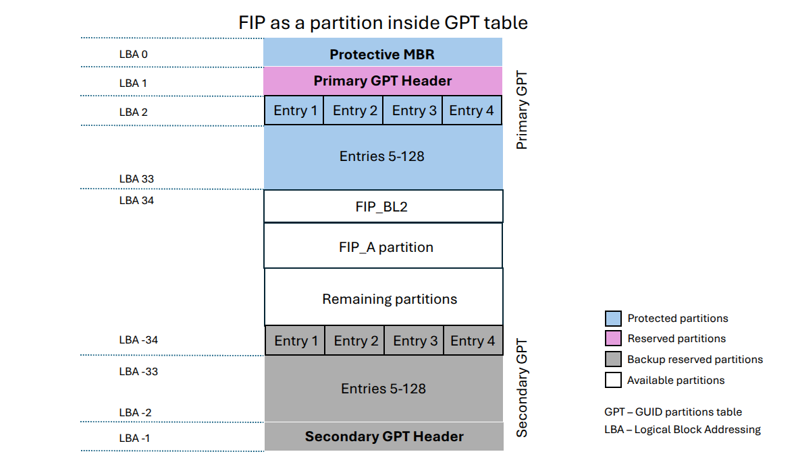

Arm Development Platform Build Options
======================================

Arm Platform Build Options
--------------------------

-  ``ARM_BL31_IN_DRAM``: Boolean option to select loading of BL31 in TZC secured
   DRAM. By default, BL31 is in the secure SRAM. Set this flag to 1 to load
   BL31 in TZC secured DRAM. If TSP is present, then setting this option also
   sets the TSP location to DRAM and ignores the ``ARM_TSP_RAM_LOCATION`` build
   flag.

-  ``ARM_CONFIG_CNTACR``: boolean option to unlock access to the ``CNTBase<N>``
   frame registers by setting the ``CNTCTLBase.CNTACR<N>`` register bits. The
   frame number ``<N>`` is defined by ``PLAT_ARM_NSTIMER_FRAME_ID``, which
   should match the frame used by the Non-Secure image (normally the Linux
   kernel). Default is true (access to the frame is allowed).

-  ``ARM_DISABLE_TRUSTED_WDOG``: boolean option to disable the Trusted Watchdog.
   By default, Arm platforms use a watchdog to trigger a system reset in case
   an error is encountered during the boot process (for example, when an image
   could not be loaded or authenticated). The watchdog is enabled in the early
   platform setup hook at BL1 and disabled in the BL1 prepare exit hook. The
   Trusted Watchdog may be disabled at build time for testing or development
   purposes.

-  ``ARM_LINUX_KERNEL_AS_BL33``: The Linux kernel expects registers x0-x3 to
   have specific values at boot. This boolean option allows the Trusted Firmware
   to have a Linux kernel image as BL33 by preparing the registers to these
   values before jumping to BL33. This option defaults to 0 (disabled). For
   AArch64 ``RESET_TO_BL31`` and for AArch32 ``RESET_TO_SP_MIN`` must be 1 when
   using it. If this option is set to 1, ``ARM_PRELOADED_DTB_BASE`` must be set
   to the location of a device tree blob (DTB) already loaded in memory. The
   Linux Image address must be specified using the ``PRELOADED_BL33_BASE``
   option.

-  ``ARM_PLAT_MT``: This flag determines whether the Arm platform layer has to
   cater for the multi-threading ``MT`` bit when accessing MPIDR. When this flag
   is set, the functions which deal with MPIDR assume that the ``MT`` bit in
   MPIDR is set and access the bit-fields in MPIDR accordingly. Default value of
   this flag is 0. Note that this option is not used on FVP platforms.

-  ``ARM_RECOM_STATE_ID_ENC``: The PSCI1.0 specification recommends an encoding
   for the construction of composite state-ID in the power-state parameter.
   The existing PSCI clients currently do not support this encoding of
   State-ID yet. Hence this flag is used to configure whether to use the
   recommended State-ID encoding or not. The default value of this flag is 0,
   in which case the platform is configured to expect NULL in the State-ID
   field of power-state parameter.

-  ``ARM_ROTPK_LOCATION``: used when ``TRUSTED_BOARD_BOOT=1``. It specifies the
   location of the ROTPK hash returned by the function ``plat_get_rotpk_info()``
   for Arm platforms. Depending on the selected option, the proper private key
   must be specified using the ``ROT_KEY`` option when building the Trusted
   Firmware. This private key will be used by the certificate generation tool
   to sign the BL2 and Trusted Key certificates. Available options for
   ``ARM_ROTPK_LOCATION`` are:

   -  ``regs`` : return the ROTPK hash stored in the Trusted root-key storage
      registers.
   -  ``devel_rsa`` : return a development public key hash embedded in the BL1
      and BL2 binaries. This hash has been obtained from the RSA public key
      ``arm_rotpk_rsa.der``, located in ``plat/arm/board/common/rotpk``. To use
      this option, ``arm_rotprivk_rsa.pem`` must be specified as ``ROT_KEY``
      when creating the certificates.
   -  ``devel_ecdsa`` : return a development public key hash embedded in the BL1
      and BL2 binaries. This hash has been obtained from the ECDSA public key
      ``arm_rotpk_ecdsa.der``, located in ``plat/arm/board/common/rotpk``. To
      use this option, ``arm_rotprivk_ecdsa.pem`` must be specified as
      ``ROT_KEY`` when creating the certificates.

-  ``ARM_ROTPK_HASH``: used when ``ARM_ROTPK_LOCATION=devel_*``. Specifies the
   location of the ROTPK hash. Not expected to be a build option. This defaults to
   ``plat/arm/board/common/rotpk/*_sha256.bin`` depending on the specified algorithm.
   Providing ``ROT_KEY`` enforces generation of the hash from the ``ROT_KEY`` and
   overwrites the default hash file.

-  ``ARM_TSP_RAM_LOCATION``: location of the TSP binary. Options:

   -  ``tsram`` : Trusted SRAM (default option when TBB is not enabled)
   -  ``tdram`` : Trusted DRAM (if available)
   -  ``dram`` : Secure region in DRAM (default option when TBB is enabled,
      configured by the TrustZone controller)

-  ``ARM_XLAT_TABLES_LIB_V1``: boolean option to compile TF-A with version 1
   of the translation tables library instead of version 2. It is set to 0 by
   default, which selects version 2.

-  ``ARM_CRYPTOCELL_INTEG`` : bool option to enable TF-A to invoke Arm®
   TrustZone® CryptoCell functionality for Trusted Board Boot on capable Arm
   platforms. If this option is specified, then the path to the CryptoCell
   SBROM library must be specified via ``CCSBROM_LIB_PATH`` flag.

-  ``ARM_ETHOSN_NPU_DRIVER``: boolean option to enable a SiP service that can
   configure an Arm Ethos-N NPU. To use this service the target platform's
   ``HW_CONFIG`` must include the device tree nodes for the NPU. Currently, only
   the Arm Juno platform has this included in its ``HW_CONFIG`` and the platform
   only loads the ``HW_CONFIG`` in AArch64 builds. Default is 0.

-  ``ARM_SPMC_MANIFEST_DTS`` : path to an alternate manifest file used as the
   SPMC Core manifest. Valid when ``SPD=spmd`` is selected.

-  ``OPTEE_SP_FW_CONFIG``: DTC build flag to include OP-TEE as SP in tb_fw_config
   device tree. This flag is defined only when ``ARM_SPMC_MANIFEST_DTS`` manifest
   file name contains pattern optee_sp.

-  ``ARM_GPT_SUPPORT``: Enable GPT parser to get the entry address and length of
   the various partitions present in the GPT image. This support is available
   only for the BL2 component, and it is disabled by default.
   The following diagram shows the view of the FIP partition inside the GPT
   image:

   |FIP in a GPT image|

For a better understanding of these options, the Arm development platform memory
map is explained in the :ref:`Firmware Design`.

.. _build_options_arm_css_platform:

Arm CSS Platform-Specific Build Options
---------------------------------------

-  ``CSS_DETECT_PRE_1_7_0_SCP``: Boolean flag to detect SCP version
   incompatibility. Version 1.7.0 of the SCP firmware made a non-backwards
   compatible change to the MTL protocol, used for AP/SCP communication.
   TF-A no longer supports earlier SCP versions. If this option is set to 1
   then TF-A will detect if an earlier version is in use. Default is 1.

-  ``CSS_LOAD_SCP_IMAGES``: Boolean flag, which when set, adds SCP_BL2 and
   SCP_BL2U to the FIP and FWU_FIP respectively, and enables them to be loaded
   during boot. Default is 1.

-  ``CSS_USE_SCMI_SDS_DRIVER``: Boolean flag which selects SCMI/SDS drivers
   instead of SCPI/BOM driver for communicating with the SCP during power
   management operations and for SCP RAM Firmware transfer. If this option
   is set to 1, then SCMI/SDS drivers will be used. Default is 0.

 - ``CSS_SGI_CHIP_COUNT``: Configures the number of chips on a SGI/RD platform
   which supports multi-chip operation. If ``CSS_SGI_CHIP_COUNT`` is set to any
   valid value greater than 1, the platform code performs required configuration
   to support multi-chip operation.

- ``CSS_SGI_PLATFORM_VARIANT``: Selects the variant of a SGI/RD platform. A
    particular SGI/RD platform may have multiple variants which may differ in
    core count, cluster count or other peripherals. This build option is used
    to select the appropriate platform variant for the build. The range of
    valid values is platform specific.

--------------

*Copyright (c) 2019-2021, Arm Limited. All rights reserved.*
