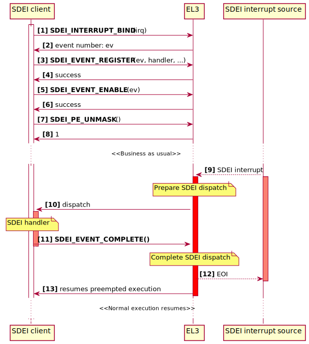
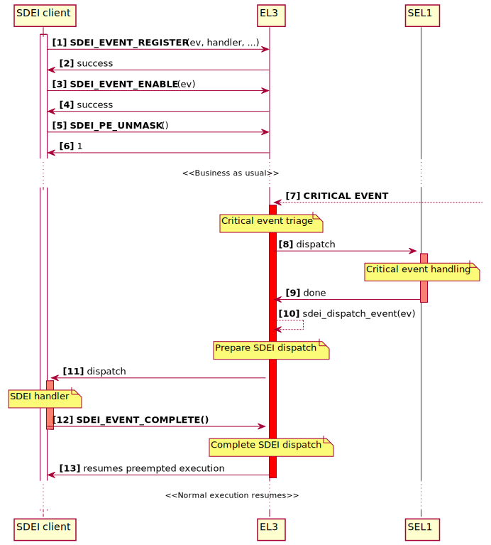

Software Delegated Exception Interface
======================================

.. section-numbering::
    :suffix: .

.. contents::
    :depth: 2

This document provides an overview of the SDEI dispatcher implementation in ARM
Trusted Firmware.

Introduction
------------

`Software Delegated Exception Interface`_ (SDEI) is an ARM specification for
Non-secure world to register handlers with firmware to receive notifications
about system events. Firmware will first receive the system events by way of
asynchronous exceptions and, in response, arranges for the registered handler to
execute in the Non-secure EL.

Normal world software that interacts with the SDEI dispatcher (makes SDEI
requests and receives notifications) is referred to as the *SDEI Client*. A
client receives the event notification at the registered handler even when it
was executing with exceptions masked. The list of SDEI events available to the
client are specific to the platform [#std-event]_. See also `Determining client
EL`_.

.. _general SDEI dispatch:

The following figure depicts a general sequence involving SDEI client executing
at EL2 and an event dispatch resulting from the triggering of a bound interrupt.
A commentary is provided below:

As part of initialisation, the SDEI client binds a Non-secure interrupt [1], and
the SDEI dispatcher returns a platform dynamic event number [2]. The client then
registers a handler for that event [3], enables the event [5], and unmasks all
events on the current PE [7]. This sequence is typical of an SDEI client, but it
may involve additional SDEI calls.

At a later point in time, when the bound interrupt triggers [9], it's trapped to
EL3. The interrupt is handed over to the SDEI dispatcher, which then arranges to
execute the registered handler [10]. The client terminates its execution with
``SDEI_EVENT_COMPLETE`` [11], following which the dispatcher resumes the
original EL2 execution [13]. Note that the SDEI interrupt remains active until
the client handler completes, at which point EL3 does EOI [12].

SDEI events can be explicitly dispatched in response to other asynchronous
exceptions. See `Explicit dispatch of events`_.

The remainder of this document only discusses the design and implementation of
SDEI dispatcher in ARM Trusted Firmware, and assumes that the reader is familiar
with the SDEI specification, the interfaces, and their requirements.

.. [#std-event] Except event 0, which is defined by the SDEI specification as a
                standard event.

Defining events
---------------

A platform choosing to include the SDEI dispatcher must also define the events
available on the platform, along with their attributes.

The platform is expected to provide two arrays of event descriptors: one for
private events, and another for shared events. The SDEI dispatcher provides
``SDEI_PRIVATE_EVENT()`` and ``SDEI_SHARED_EVENT()`` macros to populate the
event descriptors. Both macros take 3 arguments:

-  The event number: this must be a positive 32-bit integer.

-  The interrupt number the event is bound to:

   - If it's not applicable to an event, this shall be left as ``0``.

   - If the event is dynamic, this should be specified as ``SDEI_DYN_IRQ``.

-  A bit map of `Event flags`_.

To define event 0, the macro ``SDEI_DEFINE_EVENT_0()`` should be used. This
macro takes only one parameter: an SGI number to signal other PEs.

Once the event descriptor arrays are defined, they should be exported to the
SDEI dispatcher using the ``REGISTER_SDEI_MAP()`` macro, passing it the pointers
to the private and shared event descriptor arrays, respectively. Note that the
``REGISTER_SDEI_MAP()`` macro must be used in the same file where the arrays are
defined.

Regarding event descriptors:

-  For Event 0:

   - There must be exactly one descriptor in the private array, and none in the
     shared array.

   - The event should be defined using ``SDEI_DEFINE_EVENT_0()``.

   - Must be bound to a Secure SGI on the platform.

-  Statically bound shared and private interrupts must be bound to shared and
   private interrupts on the platform, respectively. See the section on
   `interrupt configuration`__.

   .. __: `Configuration within Exception Handling Framework`_

-  Both arrays should be one-dimensional. The ``REGISTER_SDEI_MAP()`` macro
   takes care of replicating private events for each PE on the platform.

-  Both arrays must be sorted in the increasing order of event number.

The SDEI specification doesn't have provisions for discovery of available events
on the platform. The list of events made available to the client, along with
their semantics, have to be communicated out of band; for example, through
Device Trees or firmware configuration tables.

See also `Event definition example`_.

Event flags
~~~~~~~~~~~

Event flags describe the properties of the event. They are bit maps that can be
``OR``\ ed to form parameters to macros that `define events`__.

.. __: `Defining events`_

-  ``SDEI_MAPF_DYNAMIC``: Marks the event as dynamic. Dynamic events can be
   bound to (or released from) any Non-secure interrupt at runtime via. the
   ``SDEI_INTERRUPT_BIND`` and ``SDEI_INTERRUPT_RELEASE`` calls.

-  ``SDEI_MAPF_BOUND``: Marks the event as statically bound to an interrupt.
   These events cannot be re-bound at runtime.

-  ``SDEI_MAPF_CRITICAL``: Marks the event as having *Critical* priority.
   Without this flag, the event is assumed to have *Normal* priority.

Event definition example
------------------------

.. code:: c

   static sdei_ev_map_t plat_private_sdei[] = {
        /* Event 0 definition */
        SDEI_DEFINE_EVENT_0(8),

        /* PPI */
        SDEI_PRIVATE_EVENT(8, 23, SDEI_MAPF_BOUND),

        /* Dynamic private events */
        SDEI_PRIVATE_EVENT(100, SDEI_DYN_IRQ, SDEI_MAPF_DYNAMIC),
        SDEI_PRIVATE_EVENT(101, SDEI_DYN_IRQ, SDEI_MAPF_DYNAMIC)
   };

   /* Shared event mappings */
   static sdei_ev_map_t plat_shared_sdei[] = {
        SDEI_SHARED_EVENT(804, 0, SDEI_MAPF_DYNAMIC),

        /* Dynamic shared events */
        SDEI_SHARED_EVENT(3000, SDEI_DYN_IRQ, SDEI_MAPF_DYNAMIC),
        SDEI_SHARED_EVENT(3001, SDEI_DYN_IRQ, SDEI_MAPF_DYNAMIC)
   };

   /* Export SDEI events */
   REGISTER_SDEI_MAP(plat_private_sdei, plat_shared_sdei);

Configuration within Exception Handling Framework
-------------------------------------------------

The SDEI dispatcher functions alongside the Exception Handling Framework. This
means that the platform must assign priorities to both Normal and Critical SDEI
interrupts for the platform:

-  Install priority descriptors for Normal and Critical SDEI interrupts.

-  For those interrupts that are statically bound (i.e. events defined as having
   the ``SDEI_MAPF_BOUND`` property), enumerate their properties for the GIC
   driver to configure interrupts accordingly.

   The interrupts must be configured to target EL3. This means that they should
   be configured as *Group 0*.  Additionally, on GICv2 systems, the build option
   ``GICV2_G0_FOR_EL3`` must be set to ``1``.

See also `SDEI porting requirements`_.

Determining client EL
---------------------

The SDEI specification requires that the *physical* SDEI client executes in the
highest Non-secure EL implemented on the system. This means that the dispatcher
will only allow SDEI calls to be made from:

-  EL2, if EL2 is implemented. The Hypervisor is expected to implement a
   *virtual* SDEI dispatcher to support SDEI clients in Guest Operating Systems
   executing in Non-secure EL1.

-  Non-secure EL1, if EL2 is not implemented or disabled.

See the function ``sdei_client_el()`` in ``sdei_private.h``.

Explicit dispatch of events
---------------------------

Typically, an SDEI event dispatch is caused by the PE receiving interrupts that
are bound to an SDEI event. However, there are cases where the Secure world
requires dispatch of an SDEI event as a direct or indirect result of a past
activity, viz. receiving a Secure interrupt or an exception.

The SDEI dispatcher implementation provides ``sdei_dispatch_event()`` API for
this purpose. The API has the following signature:

::

        int sdei_dispatch_event(int ev_num, unsigned int preempted_sec_state);

-  The parameter ``ev_num`` is the event number to dispatch;

-  The parameter ``preempted_sec_state`` indicates the context that was
   preempted. This must be either ``SECURE`` or ``NON_SECURE``.

The API returns ``0`` on success, or ``-1`` on failure.

The following figure depicts a scenario involving explicit dispatch of SDEI
event. A commentary is provided below:

As part of initialisation, the SDEI client registers a handler for a platform
event [1], enables the event [3], and unmasks the current PE [5]. Note that,
unlike in `general SDEI dispatch`_, this doesn't involve interrupt binding, as
bound or dynamic events can't be explicitly dispatched (see the section below).

At a later point in time, a critical event [#critical-event]_ is trapped into
EL3 [7]. EL3 performs a first-level triage of the event, and decides to dispatch
to a Secure Partition [#secpart]_ for further handling [8]. The dispatch
completes, but intends to involve Non-secure world in further handling, and
therefore decides to explicitly dispatch an event [10] (which the client had
already registered for [1]). The rest of the sequence is similar to that in the
`general SDEI dispatch`_: the requested event is dispatched to the client
(assuming all the conditions are met), and when the handler completes, the
preempted execution resumes.

.. [#critical-event] Examples of critical event are *SError*, *Synchronous
                     External Abort*, *Fault Handling interrupt*, or *Error
                     Recovery interrupt* from one of RAS nodes in the system.

.. [#secpart] Dispatching to Secure Partition involves *Secure Partition
              Manager*, which isn't depicted in the sequence.

Conditions for event dispatch
~~~~~~~~~~~~~~~~~~~~~~~~~~~~~

All of the following requirements must be met for the API to return ``0`` and
event to be dispatched:

-  SDEI events must be unmasked on the PE. I.e. the client must have called
   ``PE_UNMASK`` beforehand.

-  Event 0 can't be dispatched.

-  The event must neither be a dynamic event nor be bound to an interrupt.

-  The event must be private to the PE.

-  The event must have been registered for and enabled.

-  A dispatch for the same event must not be outstanding. I.e. it hasn't already
   been dispatched and is yet to be completed.

-  The priority of the event (either Critical or Normal, as configured by the
   platform at build-time) shouldn't cause priority inversion. This means:

   -  If it's of Normal priority, neither Normal nor Critical priority dispatch
      must be outstanding on the PE.

   -  If it's of a Critical priority, no Critical priority dispatch must be
      outstanding on the PE.

Further, the caller should be aware of the following assumptions made by the
dispatcher:

-  The caller of the API is a component running in EL3; for example, the *Secure
   Partition Manager*.

-  The requested dispatch will be permitted by the Exception Handling Framework.
   I.e. the caller must make sure that the requested dispatch has sufficient
   priority so as not to cause priority level inversion within Exception
   Handling Framework.

-  At the time of the call, the active context is Secure, and it has been saved.

-  Upon returning success, the Non-secure context will be restored and setup for
   the event dispatch, and it will be the active context. The Non-secure context
   should not be modified further by the caller.

-  The API returning success only means that the dispatch is scheduled at the
   next ``ERET``, and not immediately performed. Also, the caller must be
   prepared for this API to return failure and handle accordingly.

-  Upon completing the event (i.e. when the client calls either
   ``SDEI_EVENT_COMPLETE`` or ``SDEI_COMPLETE_AND_RESUME``), the preempted
   context is resumed (as indicated by the ``preempted_sec_state`` parameter of
   the API).

Porting requirements
--------------------

The porting requirements of the SDEI dispatcher are outlined in the `porting
guide`__.

.. __: `SDEI porting requirements`_

Note on writing SDEI event handlers
-----------------------------------

*This section pertains to SDEI event handlers in general, not just when using
ARM Trusted Firmware SDEI dispatcher.*

The SDEI specification requires that event handlers preserve the contents of all
registers except ``x0`` to ``x17``. This has significance if event handler is
written in C: compilers typically adjust the stack frame at the beginning and
end of C functions. For example, AArch64 GCC typically produces the following
function prologue and epilogue:

::

        c_event_handler:
                stp     x29, x30, [sp,#-32]!
                mov     x29, sp

                ...

                bl      ...

                ...

                ldp     x29, x30, [sp],#32
                ret

The register ``x29`` is used as frame pointer in the prologue. Because neither a
valid ``SDEI_EVENT_COMPLETE`` nor ``SDEI_EVENT_COMPLETE_AND_RESUME`` calls
return to the handler, the epilogue never gets executed, and registers ``x29``
and ``x30`` (in the case above) are inadvertently corrupted. This violates the
SDEI specification, and the normal execution thereafter will result in
unexpected behaviour.

To work this around, it's advised that the top-level event handlers are
implemented in assembly, following a similar pattern as below:

::

        asm_event_handler:
                /* Save link register whilst maintaining stack alignment */
                stp     xzr, x30, [sp, #-16]!
                bl      c_event_handler

                /* Restore link register */
                ldp     xzr, x30, [sp], #16

                /* Complete call */
                ldr     x0, =SDEI_EVENT_COMPLETE
                smc     #0
                b       .

----

*Copyright (c) 2017, ARM Limited and Contributors. All rights reserved.*

.. _SDEI specification: http://infocenter.arm.com/help/topic/com.arm.doc.den0054a/ARM_DEN0054A_Software_Delegated_Exception_Interface.pdf
.. _SDEI porting requirements: porting-guide.rst#sdei-porting-requirements
