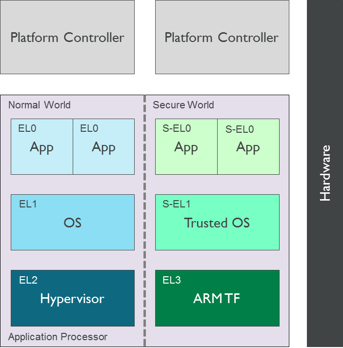
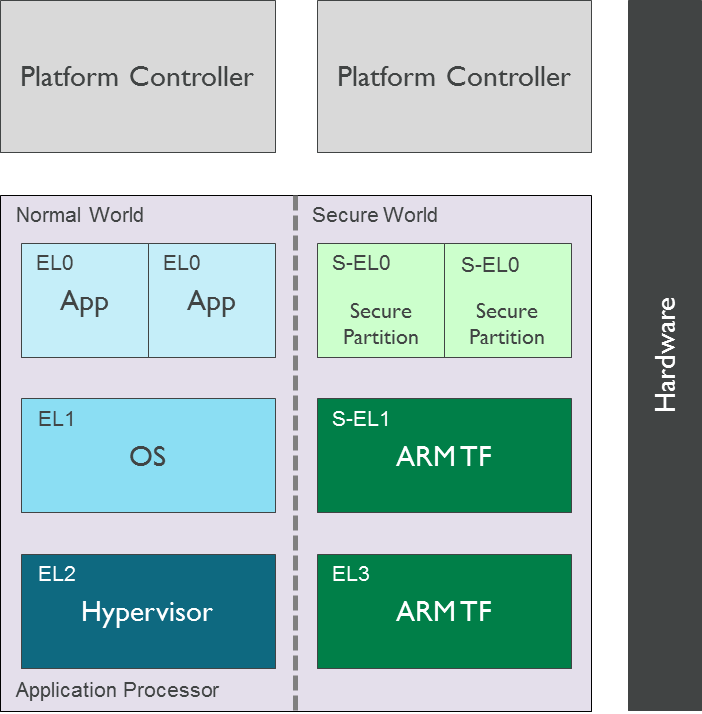

*******************************
Secure Partition Manager Design
*******************************

.. section-numbering::
    :suffix: .

.. contents::

Background
==========

In some market segments that primarily deal with client-side devices like mobile
phones, tablets, STBs and embedded devices, a Trusted OS instantiates trusted
applications to provide security services like DRM, secure payment and
authentication. The Global Platform TEE Client API specification defines the API
used by Non-secure world applications to access these services. A Trusted OS
fulfils the requirements of a security service as described above.

Management services are typically implemented at the highest level of privilege
in the system (i.e. EL3 in Arm Trusted Firmware). The service requirements are
fulfilled by the execution environment provided by Arm Trusted Firmware.

The following diagram illustrates the corresponding software stack:

|Image 1|

In other market segments that primarily deal with server-side devices (e.g. data
centres and enterprise servers) the secure software stack typically does not
include a Global Platform Trusted OS. Security functions are accessed through
other interfaces (e.g. ACPI TCG TPM interface, UEFI runtime variable service).

Placement of management and security functions with diverse requirements in a
privileged Exception Level (i.e. EL3 or S-EL1) makes security auditing of
firmware more difficult and does not allow isolation of unrelated services from
each other either.

Introduction
============

A **Secure Partition** is a software execution environment instantiated in
S-EL0 that can be used to implement simple management and security services.
Since S-EL0 is an unprivileged Exception Level, a Secure Partition relies on
privileged firmware (i.e. Arm Trusted Firmware) to be granted access to system
and processor resources. Essentially, it is a software sandbox in the Secure
world that runs under the control of privileged software, provides one or more
services and accesses the following system resources:

- Memory and device regions in the system address map.

- PE system registers.

- A range of synchronous exceptions (e.g. SMC function identifiers).

Note that currently the Arm Trusted Firmware only supports handling one Secure
Partition.

A Secure Partition enables Arm Trusted Firmware to implement only the essential
secure services in EL3 and instantiate the rest in a partition in S-EL0.
Furthermore, multiple Secure Partitions can be used to isolate unrelated
services from each other.

The following diagram illustrates the place of a Secure Partition in a typical
ARMv8-A software stack. A single or multiple Secure Partitions provide secure
services to software components in the Non-secure world and other Secure
Partitions.

|Image 2|

The Arm Trusted Firmware build system is responsible for including the Secure
Partition image in the FIP. During boot, BL2 includes support to authenticate
and load the Secure Partition image. A BL31 component called **Secure Partition
Manager (SPM)** is responsible for managing the partition. This is semantically
similar to a hypervisor managing a virtual machine.

The SPM is responsible for the following actions during boot:

- Allocate resources requested by the Secure Partition.

- Perform architectural and system setup required by the Secure Partition to
  fulfil a service request.

- Implement a standard interface that is used for initialising a Secure
  Partition.

The SPM is responsible for the following actions during runtime:

- Implement a standard interface that is used by a Secure Partition to fulfil
  service requests.

- Implement a standard interface that is used by the Non-secure world for
  accessing the services exported by a Secure Partition. A service can be
  invoked through a SMC.

Alternatively, a partition can be viewed as a thread of execution running under
the control of the SPM. Hence common programming concepts described below are
applicable to a partition.

Description
===========

The previous section introduced some general aspects of the software
architecture of a Secure Partition. This section describes the specific choices
made in the current implementation of this software architecture. Subsequent
revisions of the implementation will include a richer set of features that
enable a more flexible architecture.

Building Arm Trusted Firmware with Secure Partition support
-----------------------------------------------------------

SPM is supported on the Arm FVP exclusively at the moment. The current
implementation supports inclusion of only a single Secure Partition in which a
service always runs to completion (e.g. the requested services cannot be
preempted to give control back to the Normal world).

It is not currently possible for BL31 to integrate SPM support and a Secure
Payload Dispatcher (SPD) at the same time; they are mutually exclusive. In the
SPM bootflow, a Secure Partition image executing at S-EL0 replaces the Secure
Payload image executing at S-EL1 (e.g. a Trusted OS). Both are referred to as
BL32.

A working prototype of a SP has been implemented by re-purposing the EDK2 code
and tools, leveraging the concept of the *Standalone Management Mode (MM)* in
the UEFI specification (see the PI v1.6 Volume 4: Management Mode Core
Interface). This will be referred to as the *Standalone MM Secure Partition* in
the rest of this document.

To enable SPM support in the TF, the source code must be compiled with the build
flag ``ENABLE_SPM=1``. On Arm platforms the build option ``ARM_BL31_IN_DRAM``
can be used to select the location of BL31, both SRAM and DRAM are supported.
Also, the location of the binary that contains the BL32 image
(``BL32=path/to/image.bin``) must be specified.

First, build the Standalone MM Secure Partition. To build it, refer to the
`instructions in the EDK2 repository`_.

Then build TF with SPM support and include the Standalone MM Secure Partition
image in the FIP:

::

    BL32=path/to/standalone/mm/sp BL33=path/to/bl33.bin \
    make PLAT=fvp ENABLE_SPM=1 fip all

Describing Secure Partition resources
-------------------------------------

Arm Trusted Firmware exports a porting interface that enables a platform to
specify the system resources required by the Secure Partition. Some instructions
are given below. However, this interface is under development and it may change
as new features are implemented.

- A Secure Partition is considered a BL32 image, so the same defines that apply
  to BL32 images apply to a Secure Partition: ``BL32_BASE`` and ``BL32_LIMIT``.

- The following defines are needed to allocate space for the translation tables
  used by the Secure Partition: ``PLAT_SP_IMAGE_MMAP_REGIONS`` and
  ``PLAT_SP_IMAGE_MAX_XLAT_TABLES``.

- The functions ``plat_get_secure_partition_mmap()`` and
  ``plat_get_secure_partition_boot_info()`` have to be implemented. The file
  ``plat/arm/board/fvp/fvp_common.c`` can be used as an example. It uses the
  defines in ``include/plat/arm/common/arm_spm_def.h``.

  - ``plat_get_secure_partition_mmap()`` returns an array of mmap regions that
    describe the memory regions that the SPM needs to allocate for a Secure
    Partition.

  - ``plat_get_secure_partition_boot_info()`` returns a
    ``secure_partition_boot_info_t`` struct that is populated by the platform
    with information about the memory map of the Secure Partition.

For an example of all the changes in context, you may refer to commit
``e29efeb1b4``, in which the port for FVP was introduced.

Accessing Secure Partition services
-----------------------------------

The `SMC Calling Convention`_ (*ARM DEN 0028B*) describes SMCs as a conduit for
accessing services implemented in the Secure world. The ``MM_COMMUNICATE``
interface defined in the `Management Mode Interface Specification`_ (*ARM DEN
0060A*) is used to invoke a Secure Partition service as a Fast Call.

The mechanism used to identify a service within the partition depends on the
service implementation. It is assumed that the caller of the service will be
able to discover this mechanism through standard platform discovery mechanisms
like ACPI and Device Trees. For example, *Volume 4: Platform Initialisation
Specification v1.6. Management Mode Core Interface* specifies that a GUID is
used to identify a management mode service. A client populates the GUID in the
``EFI_MM_COMMUNICATE_HEADER``. The header is populated in the communication
buffer shared with the Secure Partition.

A Fast Call appears to be atomic from the perspective of the caller and returns
when the requested operation has completed. A service invoked through the
``MM_COMMUNICATE`` SMC will run to completion in the partition on a given CPU.
The SPM is responsible for guaranteeing this behaviour. This means that there
can only be a single outstanding Fast Call in a partition on a given CPU.

Exchanging data with the Secure Partition
-----------------------------------------

The exchange of data between the Non-secure world and the partition takes place
through a shared memory region. The location of data in the shared memory area
is passed as a parameter to the ``MM_COMMUNICATE`` SMC. The shared memory area
is statically allocated by the SPM and is expected to be either implicitly known
to the Non-secure world or discovered through a platform discovery mechanism
e.g. ACPI table or device tree. It is possible for the Non-secure world to
exchange data with a partition only if it has been populated in this shared
memory area. The shared memory area is implemented as per the guidelines
specified in Section 3.2.3 of the `Management Mode Interface Specification`_
(*ARM DEN 0060A*).

The format of data structures used to encapsulate data in the shared memory is
agreed between the Non-secure world and the Secure Partition. For example, in
the `Management Mode Interface specification`_ (*ARM DEN 0060A*), Section 4
describes that the communication buffer shared between the Non-secure world and
the Management Mode (MM) in the Secure world must be of the type
``EFI_MM_COMMUNICATE_HEADER``. This data structure is defined in *Volume 4:
Platform Initialisation Specification v1.6. Management Mode Core Interface*.
Any caller of a MM service will have to use the ``EFI_MM_COMMUNICATE_HEADER``
data structure.

Runtime model of the Secure Partition
=====================================

This section describes how the Secure Partition interfaces with the SPM.

Interface with SPM
------------------

In order to instantiate one or more secure services in the Secure Partition in
S-EL0, the SPM should define the following types of interfaces:

- Interfaces that enable access to privileged operations from S-EL0. These
  operations typically require access to system resources that are either shared
  amongst multiple software components in the Secure world or cannot be directly
  accessed from an unprivileged Exception Level.

- Interfaces that establish the control path between the SPM and the Secure
  Partition.

This section describes the APIs currently exported by the SPM that enable a
Secure Partition to initialise itself and export its services in S-EL0. These
interfaces are not accessible from the Non-secure world.

Conduit
^^^^^^^

The `SMC Calling Convention`_ (*ARM DEN 0028B*) specification describes the SMC
and HVC conduits for accessing firmware services and their availability
depending on the implemented Exception levels. In S-EL0, the Supervisor Call
exception (SVC) is the only architectural mechanism available for unprivileged
software to make a request for an operation implemented in privileged software.
Hence, the SVC conduit must be used by the Secure Partition to access interfaces
implemented by the SPM.

A SVC causes an exception to be taken to S-EL1. Arm Trusted Firmware assumes
ownership of S-EL1 and installs a simple exception vector table in S-EL1 that
relays a SVC request from a Secure Partition as a SMC request to the SPM in EL3.
Upon servicing the SMC request, Arm Trusted Firmware returns control directly to
S-EL0 through an ERET instruction.

Calling conventions
^^^^^^^^^^^^^^^^^^^

The `SMC Calling Convention`_ (*ARM DEN 0028B*) specification describes the
32-bit and 64-bit calling conventions for the SMC and HVC conduits. The SVC
conduit introduces the concept of SVC32 and SVC64 calling conventions. The SVC32
and SVC64 calling conventions are equivalent to the 32-bit (SMC32) and the
64-bit (SMC64) calling conventions respectively.

Communication initiated by SPM
^^^^^^^^^^^^^^^^^^^^^^^^^^^^^^

A service request is initiated from the SPM through an exception return
instruction (ERET) to S-EL0. Later, the Secure Partition issues an SVC
instruction to signal completion of the request. Some example use cases are
given below:

- A request to initialise the Secure Partition during system boot.

- A request to handle a runtime service request.

Communication initiated by Secure Partition
^^^^^^^^^^^^^^^^^^^^^^^^^^^^^^^^^^^^^^^^^^^

A request is initiated from the Secure Partition by executing a SVC instruction.
An ERET instruction is used by Arm Trusted Firmware to return to S-EL0 with the
result of the request.

For instance, a request to perform privileged operations on behalf of a
partition (e.g.  management of memory attributes in the translation tables for
the Secure EL1&0 translation regime).

Interfaces
^^^^^^^^^^

The current implementation reserves function IDs for Fast Calls in the Standard
Secure Service calls range (see `SMC Calling Convention`_ (*ARM DEN 0028B*)
specification) for each API exported by the SPM. This section defines the
function prototypes for each function ID. The function IDs specify whether one
or both of the SVC32 and SVC64 calling conventions can be used to invoke the
corresponding interface.

Secure Partition Event Management
^^^^^^^^^^^^^^^^^^^^^^^^^^^^^^^^^

The Secure Partition provides an Event Management interface that is used by the
SPM to delegate service requests to the Secure Partition. The interface also
allows the Secure Partition to:

- Register with the SPM a service that it provides.
- Indicate completion of a service request delagated by the SPM

Miscellaneous interfaces
------------------------

``SPM_VERSION_AARCH32``
^^^^^^^^^^^^^^^^^^^^^^^

- Description

  Returns the version of the interface exported by SPM.

- Parameters

  - **uint32** - Function ID

    - SVC32 Version: **0x84000060**

- Return parameters

  - **int32** - Status

    On success, the format of the value is as follows:

    - Bit [31]: Must be 0
    - Bits [30:16]: Major Version. Must be 0 for this revision of the SPM
      interface.
    - Bits [15:0]: Minor Version. Must be 1 for this revision of the SPM
      interface.

    On error, the format of the value is as follows:

    - ``NOT_SUPPORTED``: SPM interface is not supported or not available for the
      client.

- Usage

  This function returns the version of the Secure Partition Manager
  implementation. The major version is 0 and the minor version is 1. The version
  number is a 31-bit unsigned integer, with the upper 15 bits denoting the major
  revision, and the lower 16 bits denoting the minor revision. The following
  rules apply to the version numbering:

  - Different major revision values indicate possibly incompatible functions.

  - For two revisions, A and B, for which the major revision values are
    identical, if the minor revision value of revision B is greater than the
    minor revision value of revision A, then every function in revision A must
    work in a compatible way with revision B. However, it is possible for
    revision B to have a higher function count than revision A.

- Implementation responsibilities

  If this function returns a valid version number, all the functions that are
  described subsequently must be implemented, unless it is explicitly stated
  that a function is optional.

See `Error Codes`_ for integer values that are associated with each return
code.

Secure Partition Initialisation
-------------------------------

The SPM is responsible for initialising the architectural execution context to
enable initialisation of a service in S-EL0. The responsibilities of the SPM are
listed below. At the end of initialisation, the partition issues a
``SP_EVENT_COMPLETE_AARCH64`` call (described later) to signal readiness for
handling requests for services implemented by the Secure Partition. The
initialisation event is executed as a Fast Call.

Entry point invocation
^^^^^^^^^^^^^^^^^^^^^^

The entry point for service requests that should be handled as Fast Calls is
used as the target of the ERET instruction to start initialisation of the Secure
Partition.

Architectural Setup
^^^^^^^^^^^^^^^^^^^

At cold boot, system registers accessible from S-EL0 will be in their reset
state unless otherwise specified. The SPM will perform the following
architectural setup to enable execution in S-EL0

MMU setup
^^^^^^^^^

The platform port of a Secure Partition specifies to the SPM a list of regions
that it needs access to and their attributes. The SPM validates this resource
description and initialises the Secure EL1&0 translation regime as follows.

1. Device regions are mapped with nGnRE attributes and Execute Never
   instruction access permissions.

2. Code memory regions are mapped with RO data and Executable instruction access
   permissions.

3. Read Only data memory regions are mapped with RO data and Execute Never
   instruction access permissions.

4. Read Write data memory regions are mapped with RW data and Execute Never
   instruction access permissions.

5. If the resource description does not explicitly describe the type of memory
   regions then all memory regions will be marked with Code memory region
   attributes.

6. The ``UXN`` and ``PXN`` bits are set for regions that are not executable by
   S-EL0 or S-EL1.

System Register Setup
^^^^^^^^^^^^^^^^^^^^^

System registers that influence software execution in S-EL0 are setup by the SPM
as follows:

1. ``SCTLR_EL1``

   - ``UCI=1``
   - ``EOE=0``
   - ``WXN=1``
   - ``nTWE=1``
   - ``nTWI=1``
   - ``UCT=1``
   - ``DZE=1``
   - ``I=1``
   - ``UMA=0``
   - ``SA0=1``
   - ``C=1``
   - ``A=1``
   - ``M=1``

2. ``CPACR_EL1``

   - ``FPEN=b'11``

3. ``PSTATE``

   - ``D,A,I,F=1``
   - ``CurrentEL=0`` (EL0)
   - ``SpSel=0`` (Thread mode)
   - ``NRW=0`` (AArch64)

General Purpose Register Setup
^^^^^^^^^^^^^^^^^^^^^^^^^^^^^^

SPM will invoke the entry point of a service by executing an ERET instruction.
This transition into S-EL0 is special since it is not in response to a previous
request through a SVC instruction. This is the first entry into S-EL0. The
general purpose register usage at the time of entry will be as specified in the
"Return State" column of Table 3-1 in Section 3.1 "Register use in AArch64 SMC
calls" of the `SMC Calling Convention`_ (*ARM DEN 0028B*) specification. In
addition, certain other restrictions will be applied as described below.

1. ``SP_EL0``

   A non-zero value will indicate that the SPM has initialised the stack pointer
   for the current CPU.

   The value will be 0 otherwise.

2. ``X4-X30``

   The values of these registers will be 0.

3. ``X0-X3``

   Parameters passed by the SPM.

   - ``X0``: Virtual address of a buffer shared between EL3 and S-EL0. The
     buffer will be mapped in the Secure EL1&0 translation regime with read-only
     memory attributes described earlier.

   - ``X1``: Size of the buffer in bytes.

   - ``X2``: Cookie value (*IMPLEMENTATION DEFINED*).

   - ``X3``: Cookie value (*IMPLEMENTATION DEFINED*).

Runtime Event Delegation
------------------------

The SPM receives requests for Secure Partition services through a synchronous
invocation (i.e. a SMC from the Non-secure world). These requests are delegated
to the partition by programming a return from the last
``SP_EVENT_COMPLETE_AARCH64`` call received from the partition. The last call
was made to signal either completion of Secure Partition initialisation or
completion of a partition service request.

``SP_EVENT_COMPLETE_AARCH64``
^^^^^^^^^^^^^^^^^^^^^^^^^^^^^

- Description

  Signal completion of the last SP service request.

- Parameters

  - **uint32** - Function ID

    - SVC64 Version: **0xC4000061**

  - **int32** - Event Status Code

    Zero or a positive value indicates that the event was handled successfully.
    The values depend upon the original event that was delegated to the Secure
    partition. They are described as follows.

    - ``SUCCESS`` : Used to indicate that the Secure Partition was initialised
      or a runtime request was handled successfully.

    - Any other value greater than 0 is used to pass a specific Event Status
      code in response to a runtime event.

    A negative value indicates an error. The values of Event Status code depend
    on the original event.

- Return parameters

  - **int32** - Event ID/Return Code

    Zero or a positive value specifies the unique ID of the event being
    delegated to the partition by the SPM.

    In the current implementation, this parameter contains the function ID of
    the ``MM_COMMUNICATE`` SMC. This value indicates to the partition that an
    event has been delegated to it in response to an ``MM_COMMUNICATE`` request
    from the Non-secure world.

    A negative value indicates an error. The format of the value is as follows:

    - ``NOT_SUPPORTED``: Function was called from the Non-secure world.

    See `Error Codes`_ for integer values that are associated with each return
    code.

  - **uint32** - Event Context Address

    Address of a buffer shared between the SPM and Secure Partition to pass
    event specific information. The format of the data populated in the buffer
    is implementation defined.

    The buffer is mapped in the Secure EL1&0 translation regime with read-only
    memory attributes described earlier.

    For the SVC64 version, this parameter is a 64-bit Virtual Address (VA).

    For the SVC32 version, this parameter is a 32-bit Virtual Address (VA).

  - **uint32** - Event context size

    Size of the memory starting at Event Address.

  - **uint32/uint64** - Event Cookie

    This is an optional parameter. If unused its value is SBZ.

- Usage

  This function signals to the SPM that the handling of the last event delegated
  to a partition has completed. The partition is ready to handle its next event.
  A return from this function is in response to the next event that will be
  delegated to the partition. The return parameters describe the next event.

- Caller responsibilities

  A Secure Partition must only call ``SP_EVENT_COMPLETE_AARCH64`` to signal
  completion of a request that was delegated to it by the SPM.

- Callee responsibilities

  When the SPM receives this call from a Secure Partition, the corresponding
  syndrome information can be used to return control through an ERET
  instruction, to the instruction immediately after the call in the Secure
  Partition context. This syndrome information comprises of general purpose and
  system register values when the call was made.

  The SPM must save this syndrome information and use it to delegate the next
  event to the Secure Partition. The return parameters of this interface must
  specify the properties of the event and be populated in ``X0-X3/W0-W3``
  registers.

Secure Partition Memory Management
----------------------------------

A Secure Partition executes at S-EL0, which is an unprivileged Exception Level.
The SPM is responsible for enabling access to regions of memory in the system
address map from a Secure Partition. This is done by mapping these regions in
the Secure EL1&0 Translation regime with appropriate memory attributes.
Attributes refer to memory type, permission, cacheability and shareability
attributes used in the Translation tables. The definitions of these attributes
and their usage can be found in the `ARMv8 ARM`_ (*ARM DDI 0487*).

All memory required by the Secure Partition is allocated upfront in the SPM,
even before handing over to the Secure Partition for the first time. The initial
access permissions of the memory regions are statically provided by the platform
port and should allow the Secure Partition to run its initialisation code.

However, they might not suit the final needs of the Secure Partition because its
final memory layout might not be known until the Secure Partition initialises
itself. As the Secure Partition initialises its runtime environment it might,
for example, load dynamically some modules. For instance, a Secure Partition
could implement a loader for a standard executable file format (e.g. an PE-COFF
loader for loading executable files at runtime). These executable files will be
a part of the Secure Partition image. The location of various sections in an
executable file and their permission attributes (e.g. read-write data, read-only
data and code) will be known only when the file is loaded into memory.

In this case, the Secure Partition needs a way to change the access permissions
of its memory regions. The SPM provides this feature through the
``SP_MEMORY_ATTRIBUTES_SET_AARCH64`` SVC interface. This interface is available
to the Secure Partition during a specific time window: from the first entry into
the Secure Partition up to the first ``SP_EVENT_COMPLETE`` call that signals the
Secure Partition has finished its initialisation. Once the initialisation is
complete, the SPM does not allow changes to the memory attributes.

This section describes the standard SVC interface that is implemented by the SPM
to determine and change permission attributes of memory regions that belong to a
Secure Partition.

``SP_MEMORY_ATTRIBUTES_GET_AARCH64``
^^^^^^^^^^^^^^^^^^^^^^^^^^^^^^^^^^^^

- Description

  Request the permission attributes of a memory region from S-EL0.

- Parameters

  - **uint32** Function ID

    - SVC64 Version: **0xC4000064**

  - **uint64** Base Address

    This parameter is a 64-bit Virtual Address (VA).

    There are no alignment restrictions on the Base Address. The permission
    attributes of the translation granule it lies in are returned.

- Return parameters

  - **int32** - Memory Attributes/Return Code

    On success the format of the Return Code is as follows:

    - Bits[1:0] : Data access permission

      - b'00 : No access
      - b'01 : Read-Write access
      - b'10 : Reserved
      - b'11 : Read-only access

    - Bit[2]: Instruction access permission

      - b'0 : Executable
      - b'1 : Non-executable

    - Bit[30:3] : Reserved. SBZ.

    - Bit[31]   : Must be 0

    On failure the following error codes are returned:

    - ``INVALID_PARAMETERS``: The Secure Partition is not allowed to access the
      memory region the Base Address lies in.

    - ``NOT_SUPPORTED`` : The SPM does not support retrieval of attributes of
      any memory page that is accessible by the Secure Partition, or the
      function was called from the Non-secure world. Also returned if it is
      used after ``SP_EVENT_COMPLETE_AARCH64``.

    See `Error Codes`_ for integer values that are associated with each return
    code.

- Usage

  This function is used to request the permission attributes for S-EL0 on a
  memory region accessible from a Secure Partition. The size of the memory
  region is equal to the Translation Granule size used in the Secure EL1&0
  translation regime. Requests to retrieve other memory region attributes are
  not currently supported.

- Caller responsibilities

  The caller must obtain the Translation Granule Size of the Secure EL1&0
  translation regime from the SPM through an implementation defined method.

- Callee responsibilities

  The SPM must not return the memory access controls for a page of memory that
  is not accessible from a Secure Partition.

``SP_MEMORY_ATTRIBUTES_SET_AARCH64``
^^^^^^^^^^^^^^^^^^^^^^^^^^^^^^^^^^^^

- Description

  Set the permission attributes of a memory region from S-EL0.

- Parameters

  - **uint32** - Function ID

    - SVC64 Version: **0xC4000065**

  - **uint64** - Base Address

    This parameter is a 64-bit Virtual Address (VA).

    The alignment of the Base Address must be greater than or equal to the size
    of the Translation Granule Size used in the Secure EL1&0 translation
    regime.

  - **uint32** - Page count

    Number of pages starting from the Base Address whose memory attributes
    should be changed. The page size is equal to the Translation Granule Size.

  - **uint32** - Memory Access Controls

    - Bits[1:0] : Data access permission

      - b'00 : No access
      - b'01 : Read-Write access
      - b'10 : Reserved
      - b'11 : Read-only access

    - Bit[2] : Instruction access permission

      - b'0 : Executable
      - b'1 : Non-executable

    - Bits[31:3] : Reserved. SBZ.

    A combination of attributes that mark the region with RW and Executable
    permissions is prohibited. A request to mark a device memory region with
    Executable permissions is prohibited.

- Return parameters

  - **int32** - Return Code

    - ``SUCCESS``: The Memory Access Controls were changed successfully.

    - ``DENIED``: The SPM is servicing a request to change the attributes of a
      memory region that overlaps with the region specified in this request.

    - ``INVALID_PARAMETER``: An invalid combination of Memory Access Controls
      has been specified. The Base Address is not correctly aligned. The Secure
      Partition is not allowed to access part or all of the memory region
      specified in the call.

    - ``NO_MEMORY``: The SPM does not have memory resources to change the
      attributes of the memory region in the translation tables.

    - ``NOT_SUPPORTED``: The SPM does not permit change of attributes of any
      memory region that is accessible by the Secure Partition. Function was
      called from the Non-secure world. Also returned if it is used after
      ``SP_EVENT_COMPLETE_AARCH64``.

    See `Error Codes`_ for integer values that are associated with each return
    code.

- Usage

  This function is used to change the permission attributes for S-EL0 on a
  memory region accessible from a Secure Partition. The size of the memory
  region is equal to the Translation Granule size used in the Secure EL1&0
  translation regime. Requests to change other memory region attributes are not
  currently supported.

  This function is only available at boot time. This interface is revoked after
  the Secure Partition sends the first ``SP_EVENT_COMPLETE_AARCH64`` to signal
  that it is initialised and ready to receive run-time requests.

- Caller responsibilities

  The caller must obtain the Translation Granule Size of the Secure EL1&0
  translation regime from the SPM through an implementation defined method.

- Callee responsibilities

  The SPM must preserve the original memory access controls of the region of
  memory in case of an unsuccessful call.  The SPM must preserve the consistency
  of the S-EL1 translation regime if this function is called on different PEs
  concurrently and the memory regions specified overlap.

Error Codes
-----------

.. csv-table::
   :header: "Name", "Value"

   ``SUCCESS``,0
   ``NOT_SUPPORTED``,-1
   ``INVALID_PARAMETER``,-2
   ``DENIED``,-3
   ``NO_MEMORY``,-5
   ``NOT_PRESENT``,-7

--------------

*Copyright (c) 2017, Arm Limited and Contributors. All rights reserved.*

.. _ARMv8 ARM: https://developer.arm.com/docs/ddi0487/latest/arm-architecture-reference-manual-armv8-for-armv8-a-architecture-profile
.. _instructions in the EDK2 repository: https://github.com/tianocore/edk2-staging/blob/AArch64StandaloneMm/HowtoBuild.MD
.. _Management Mode Interface Specification: http://infocenter.arm.com/help/topic/com.arm.doc.den0060a/DEN0060A_ARM_MM_Interface_Specification.pdf
.. _SDEI Specification: http://infocenter.arm.com/help/topic/com.arm.doc.den0054a/ARM_DEN0054A_Software_Delegated_Exception_Interface.pdf
.. _SMC Calling Convention: http://infocenter.arm.com/help/topic/com.arm.doc.den0028b/ARM_DEN0028B_SMC_Calling_Convention.pdf

