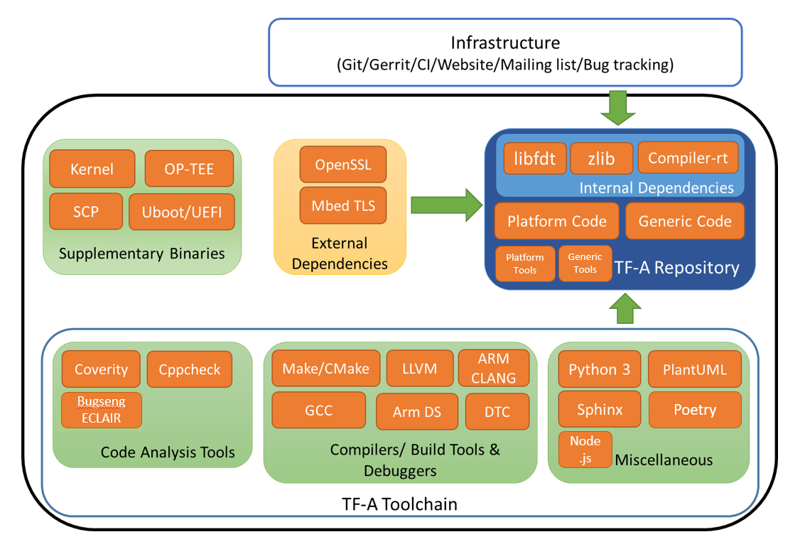
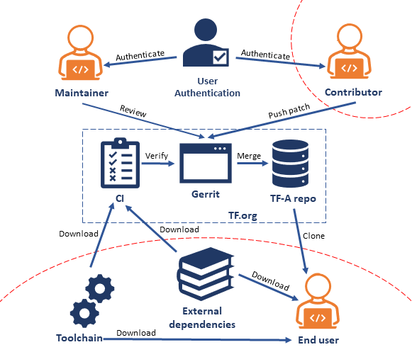
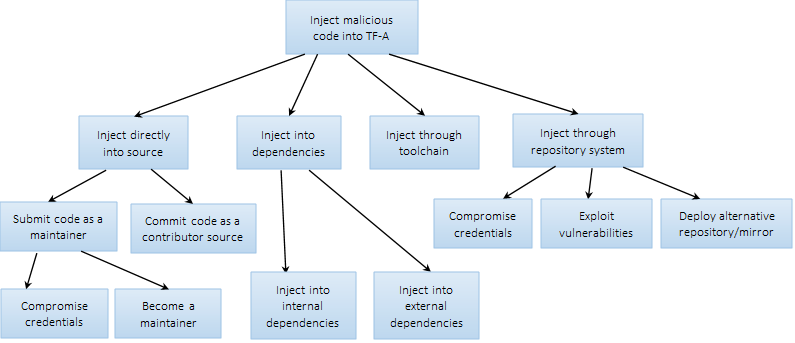

TF-A Supply Chain Threat Model
~~~~~~~~~~~~~~~~~~~~~~~~~~~~~~

Introduction
************

Software supply chain attacks aim to inject malicious code into a software
product. There are several ways a malicious code can be injected into a
software product (open-source project). These include:

- Malicious code commits: This attack directly injects code into a project
  repository. This can happen for example through developer/maintainer
  credential hijacks, or malicious external contributors.

- Malicious dependencies:  In this case malicious code is introduced into a
  project through other piece of code or packages the project depends on. This
  can happen through for example typosquatting attack where an attacker creates
  a malicious package with a very similar name to a popular package and hosts
  it on popular package repositories.

- Malicious toolchains:  This involves malicious code introduced by compromised
  resources used throughout the development and/or build process such as
  compilers and IDEs.

This document provides analysis of software supply chain attack threats for the
TF-A project.

TF-A Overview
*************

Figure 1 shows the different software components surrounding the TF-A project.
A brief description of each component is provided below.

TF-A Repository
===============

The TF-A repository contains generic and platform code contributed by TF-A
contributors as well as libraries imported from other open-source projects,
referred to as internal dependencies on Figure 1. These libraries include:

- *libfdt*: libfdt is a utility library for reading and manipulating Device
  Tree Binary (DTB) files. It is part of the Device Tree Compiler (DTC)
  toolchain [1]_. DTC is used as part of the build process on the host machine
  to build DTB files. libfdt is used to parse the DTB files at boot time.

- *zlib*: zlib is a data compression library imported from [2]_.

- *compiler-rt*: This is a collection of runtime libraries from the LLVM
  compiler infrastructure project [3]_. We import the builtins library which
  provides low-level, target-specific compiler builtins from compiler-rt.

The TF-A repository also includes source code for host tools that supplement
the TF-A build process. These tools include:

- *fiptool*: This tool is used to create a Firmware Image Package (FIP) which
  allows for packing bootloader images into a single archive that can be
  loaded by TF-A from non-volatile platform storage.

- *cert_create*: This tool is used to generate certificates for binary images.

- *encrypt_fw*: This tool takes the plain firmware image as input and generates
  the encrypted firmware image which can then be passed as input to the fiptool
  utility for creating the FIP.

- *sptool*: This tool is used to build the secure partition packages.

|TF-A System Diagram|
*Figure 1: TF-A System Diagram*

External Dependencies
=====================

These are software components that are not part of the TF-A repository but are
required to build TF-A binaries and host tools.

- *Mbed TLS Library*: This is a cryptography library from trustedfirmware.org
  (tf.org). It is required to build TF-A binaries where cryptography features
  are needed, such as Trusted Board Boot (TBB).

- *OpenSSL Library*: This is another cryptography library used by TF-A host
  tools: fiptool, cert_create, and encrypt_fw.

The following table lists TF-A dependencies including the sources of the
dependencies.

.. table:: Table 1: TF-A Dependencies

  +-------------+------------------------+------------------------------------+
  | Dependency  | Location of Dependency | Original Source                    |
  +=============+========================+====================================+
  | libfdt      | Local copy             | [1]_                               |
  +-------------+------------------------+------------------------------------+
  | zlib        | Local copy             | [2]_                               |
  +-------------+------------------------+------------------------------------+
  | compiler-rt | Local copy             | [3]_                               |
  +-------------+------------------------+------------------------------------+
  | Mbed TLS    | External               | [4]_                               |
  +-------------+------------------------+------------------------------------+
  | OpenSSL     | External               | [5]_                               |
  +-------------+------------------------+------------------------------------+

Supplementary Binaries
======================

These are binaries used to test TF-A based systems. Below is a brief
description of each component and where they are sourced from.

- *SCP-firmware*: For our tests, we use SCP-firmware binaries supplied by the
  Arm SCP team built from the source from the GitHub repository [6]_.

- *OP-TEE*: Trusted Execution Environment (TEE) from tf.org that runs as
  Secure EL1. We use OP-TEE built from source or binaries supplied with Arm
  Reference Platforms depending on the test configuration.

- *EDK2 UEFI*: Normal world bootloader from the EDK2 project [7]_. We use EDK2
  UEFI binaries hosted on tf.org servers for testing [8]_.

Other software components used to test TF-A include U-Boot, Linux kernel, RSE,
MCP, and file systems, all sourced from the Arm Reference Platforms teams.

TF-A Toolchain
==============

The TF-A project uses several tools to build, analyze and test the TF-A source
code.

Node.js Tools
-------------

These are optional quality assurance and developer utility tools that are
installed through the use of the Node.js package manager. They are pinned to
specific versions described by the package.json file in the root of the TF-A
repository, and their dependencies are downloaded from the internet at the
point of installation. These tools may be installed locally on the developer
machine and are installed within a Docker container in certain CI jobs. At
present, these are:

- Commitlint

- Commitizen

- Husky

Infrastructure
==============

TF-A uses trustedfirmware.org (tf.org) and Arm infrastructures to host the
source code, review code and run tests. Appendix A provides a security analysis
of tf.org infrastructure.

TF-A Data Flow
**************

Figure 2 below shows the data flow diagram for TF-A. The broken red lines
indicate trust boundaries.

|TF-A Data Flow Diagram|
*Figure 2: TF-A Data Flow Diagram*

Attack Tree
***********

|TF-A Attack Tree|
*Figure 3: TF-A Attack Tree*

Threat Assessment and Mitigations
*********************************

Impact and Likelihood Ratings
=============================

  +--------+------------------------------+-----------------------------------+
  | Rating | Impact                       | Likelihood                        |
  +========+==============================+===================================+
  | HIGH   | Major impact to entire       | Threat is relatively easy to      |
  |        | organization or single line  | exploit by an attacker with       |
  |        | of business if exploited.    | little effort and skill.          |
  +--------+------------------------------+-----------------------------------+
  | MEDIUM | Noticeable impact to line of | An expert attacker could exploit  |
  |        | business if exploited.       | the threat without much           |
  |        |                              | difficulty.                       |
  +--------+------------------------------+-----------------------------------+
  | LOW    | Minor damage if exploited or | Exploiting the threat would       |
  |        | could be used in conjunction | require considerable effort and   |
  |        | with other vulnerabilities   | resources.                        |
  |        | to perform a more serious    |                                   |
  |        | attack.                      |                                   |
  +--------+------------------------------+-----------------------------------+

Threats and Mitigations
=======================

Threat naming convention key

- SC – Supply Chain

- SRC – Source

- DEP – Dependency

- TOOL – Toolchain

- REPO – Repository

- MAIN – Maintainer

- CONT – Contributor

  +---------------------------------------------------------------------------+
  | Threat: TFA-SC-SRC-MAIN-01                                                |
  +=============+=============================================================+
  | Description | An attacker can submit and merge malicious code by posing   |
  |             | as a maintainer after compromising maintainers’             |
  |             | credentials.                                                |
  +-------------+-------------------------------------------------------------+
  | Impact      | HIGH                                                        |
  +-------------+-------------------------------------------------------------+
  | Likelihood  | MEDIUM                                                      |
  +-------------+-------------------------------------------------------------+
  | Threat and  | | In the TF-A code review process all submitted changes     |
  | impact      |   undergo review by a code owner and a maintainer. If the   |
  |             |   change is accepted, it will be merged (integrated) into   |
  |             |   an integration branch by a maintainer. A maintainer has   |
  |             |   the right to give a code owner review, a maintainer       |
  |             |   review and merge the submitted change.                    |
  |             |                                                             |
  |             | | tf.org users (including maintainers) are authenticated    |
  |             |   through GitHub. The likelihood of a credential compromise |
  |             |   depends on multiple factors. The authentication mechanism |
  |             |   of GitHub is strong if the recommended best practices are |
  |             |   followed [9]_ making credential compromise unlikely.      |
  |             |   GitHub (therefore tf.org) allows logins with two-factor   |
  |             |   authentication, requiring both a password and access to   |
  |             |   the user's authentication code. Depending on the strength |
  |             |   of the password and factors such as whether the           |
  |             |   maintainer reuses passwords across services, the          |
  |             |   likelihood of a compromise can be higher.                 |
  |             |                                                             |
  |             | | If an attacker manages to compromise a maintainer’s       |
  |             |   credentials, posing as the maintainer, they can in theory |
  |             |   submit a malicious change (as a maintainer or as a        |
  |             |   contributor), give all the necessary reviews and merge    |
  |             |   the change.                                               |
  +-------------+-------------------------------------------------------------+
  | Mitigations | | - Enforce best practices recommended by GitHub [9]_       |
  |             |                                                             |
  |             | | - Not allowing a committer to both self-review and merge  |
  |             |     patches they have submitted. To achieve the commit the  |
  |             |     attacker would be required to compromise at least two   |
  |             |     credentials (reviewers and maintainer).                 |
  +-------------+-------------------------------------------------------------+
  | Mitigations | We have not disallowed self-review/merge of patches         |
  | implemented?|                                                             |
  +-------------+-------------------------------------------------------------+

  +---------------------------------------------------------------------------+
  | Threat: TFA-SC-SRC-MAIN-02                                                |
  +=============+=============================================================+
  | Description | An attacker can submit and merge malicious code after       |
  |             | becoming a maintainer through social engineering            |
  |             | techniques.                                                 |
  +-------------+-------------------------------------------------------------+
  | Impact      | HIGH                                                        |
  +-------------+-------------------------------------------------------------+
  | Likelihood  | LOW                                                         |
  +-------------+-------------------------------------------------------------+
  | Threat and  | | According to the TF project maintenance process [10]_,    |
  | impact      |   maintainers of TF-A are selected by their peers based on  |
  |             |   merit. Some of the criteria of becoming a maintainer      |
  |             |   include being an active member of the project for a       |
  |             |   minimum duration and contributing a substantial number of |
  |             |   non-trivial and high-quality patches. However, there are  |
  |             |   some weaknesses in the process:                           |
  |             |                                                             |
  |             | | - There is no structured mechanism to establish trust     |
  |             |     with a maintainer other than the recommendations by     |
  |             |     peers                                                   |
  |             | | - There is no continuous monitoring of the status of a    |
  |             |     maintainer (e.g. maintainer can move from one           |
  |             |     organization to another)                                |
  |             |                                                             |
  |             | | To perform such an attack, in addition to becoming a      |
  |             |   maintainer, an attacker also must deal with all           |
  |             |   restrictions put on maintainers.                          |
  +-------------+-------------------------------------------------------------+
  | Mitigations | | - Structured mechanism to establish trust with            |
  |             |     maintainers                                             |
  |             |                                                             |
  |             | | - Not allowing a committer to both self-review and merge  |
  |             |     patches they have submitted. To achieve the commit the  |
  |             |     attacker would be required to compromise at least two   |
  |             |     credentials (reviewers and maintainer).                 |
  +-------------+-------------------------------------------------------------+
  | Mitigations | There is a structured mechanism to establish trust with     |
  | implemented?| maintainers, but self-review/merge of patches is not        |
  |             | disallowed                                                  |
  +-------------+-------------------------------------------------------------+

  +---------------------------------------------------------------------------+
  | Threat: TFA-SC-SRC-CONT-01                                                |
  +=============+=============================================================+
  | Description | An attacker can submit malicious code patch as a            |
  |             | contributor.                                                |
  +-------------+-------------------------------------------------------------+
  | Impact      | HIGH                                                        |
  +-------------+-------------------------------------------------------------+
  | Likelihood  | LOW                                                         |
  +-------------+-------------------------------------------------------------+
  | Threat and  | | TF-A accepts external contributions to both the generic   |
  | impact      |   and platform code. Unlike maintainers, contributors do    |
  |             |   not have maintainer review or merging privileges,         |
  |             |   therefore the likelihood of injecting malicious code as a |
  |             |   contributor is lower. However, even though unlikely, it   |
  |             |   is still possible for a malicious commit to go unnoticed  |
  |             |   through the code review and verification processes.       |
  |             |                                                             |
  |             | | If successful, the impact can range from low to high      |
  |             |   depending on the injected code. For example, an attacker  |
  |             |   can potentially deliberately insert a memory corruption   |
  |             |   vulnerability that is hard to notice on code review and   |
  |             |   will not be detected by the verification process. This    |
  |             |   vulnerability by itself may have a low impact but can     |
  |             |   have a major impact if used in combination with other     |
  |             |   vulnerabilities.                                          |
  +-------------+-------------------------------------------------------------+
  | Proposed    | - Code review and verification                              |
  | Mitigations | - Static analysis to try to pick up issues that typically   |
  |             |   end in some form of attack vector                         |
  +-------------+-------------------------------------------------------------+
  | Mitigations | Yes, contributions go through the thorough review,          |
  | implemented?| verification, and static analysis process automated through |
  |             | CI                                                          |
  +-------------+-------------------------------------------------------------+

  +---------------------------------------------------------------------------+
  | Threat: TFA-SC-DEP-01                                                     |
  +=============+=============================================================+
  | Description | An attacker can inject malicious code into TF-A internal    |
  |             | dependencies.                                               |
  +-------------+-------------------------------------------------------------+
  | Impact      | HIGH                                                        |
  +-------------+-------------------------------------------------------------+
  | Likelihood  | LOW                                                         |
  +-------------+-------------------------------------------------------------+
  | Threat and  | | TF-A has two types of dependencies: those that are copied |
  | impact      |   into the TF-A repository and shipped as part of TF-A code |
  |             |   (referred to as *internal dependencies* here) and those   |
  |             |   that are downloaded from external repositories and used   |
  |             |   when building TF-A (referred to as                        |
  |             |   *external dependencies* here).                            |
  |             |                                                             |
  |             | | Currently TF-A has three internal dependencies: *libfdt*  |
  |             |   [1]_, *zlib* [2]_ and *compiler-rt* [3]_ libraries. These |
  |             |   libraries are periodically updated by copying them from   |
  |             |   their source repositories. Although unlikely, it is       |
  |             |   possible for a contributor to copy the libraries from the |
  |             |   wrong (and potentially malicious) repositories. For       |
  |             |   example, there are already multiple forks of *libfdt*     |
  |             |   (DTC) on GitHub. In addition to this, the official        |
  |             |   repositories are not immune to threats described above    |
  |             |   (TFA-SC-SRC-MAIN-01, TFA-SC-SRC-MAIN-02 and               |
  |             |   TFA-SC-SRC-CONT-01).                                      |
  |             |                                                             |
  |             | | The likelihood of an attack on TF-A through internal      |
  |             |   dependencies is lower than external dependencies for the  |
  |             |   following reasons:                                        |
  |             |                                                             |
  |             | | - Internal dependencies go through the normal code review |
  |             |     process during upgrade                                  |
  |             | | - Once upgraded internal dependencies stay unchanged      |
  |             |     until the next upgrade. The upgrade window is typically |
  |             |     long (for example *libfdt* has only changed 4 times     |
  |             |     over the past 4 years). This reduces the window of      |
  |             |     opportunity for an attacker to inject malicious code    |
  |             |     into the dependencies                                   |
  +-------------+-------------------------------------------------------------+
  | Proposed    | - Explicitly document versions and official sources of      |
  | Mitigations |   dependencies                                              |
  |             | - Keep a copy of a pinned version of the source code inside |
  |             |   the TF-A tree so that the risk of getting malicious code  |
  |             |   from dependencies only arises when we upgrade them        |
  |             | - Monitor alerts for vulnerable dependencies from GitHub    |
  |             |   [11]_                                                     |
  +-------------+-------------------------------------------------------------+
  | Mitigations | Yes, we explicitly document versions and official sources   |
  | implemented?| of dependencies, keep a copy of pinned versions of the      |
  |             | source code, and monitor alerts for vulnerable dependencies |
  |             | for Python and Node.js, but we aren't able to do this for C |
  |             | dependencies                                                |
  +-------------+-------------------------------------------------------------+

  +---------------------------------------------------------------------------+
  | Threat: TFA-SC-DEP-02                                                     |
  +=============+=============================================================+
  | Description | An attacker can inject malicious code into TF-A external    |
  |             | dependencies.                                               |
  +-------------+-------------------------------------------------------------+
  | Impact      | HIGH                                                        |
  +-------------+-------------------------------------------------------------+
  | Likelihood  | MEDIUM                                                      |
  +-------------+-------------------------------------------------------------+
  | Threat and  | | Unlike internal dependencies, external dependencies are   |
  | impact      |   downloaded from external repositories by end-users.       |
  |             |   Although the TF-A documentation provides information      |
  |             |   about the versions of dependencies used for testing and   |
  |             |   links to repositories, it is up to the end-user to decide |
  |             |   where to get the dependencies from. As such, the          |
  |             |   likelihood of an attack through an external dependency is |
  |             |   higher compared to an internal dependency.                |
  |             |                                                             |
  |             | | The impact of an attack ranges from low to critical       |
  |             |   depending on which dependency and what part of the        |
  |             |   dependency is affected. For example, a malicious code     |
  |             |   that affects the signature verification functions in      |
  |             |   MbedTLS is considered critical as it can be used to       |
  |             |   bypass the TBB process of TF-A.                           |
  +-------------+-------------------------------------------------------------+
  | Proposed    | - Explicitly document versions and official sources of      |
  | Mitigations |   dependencies                                              |
  |             | - Provide scripts and build options to automatically fetch  |
  |             |   the latest stable release of external dependencies        |
  +-------------+-------------------------------------------------------------+
  | Mitigations | We explicitly document versions and official sources of     |
  | implemented?| dependencies, but do not yet provide scripts and build      |
  |             | options to automatically fetch the latest stable release of |
  |             | external dependencies                                       |
  +-------------+-------------------------------------------------------------+

  +---------------------------------------------------------------------------+
  | Threat: TFA-SC-REPO-01                                                    |
  +=============+=============================================================+
  | Description | An attacker can upload malicious versions of TF-A by        |
  |             | compromising credentials of administrator accounts on       |
  |             | tf.org or GitHub.                                           |
  +-------------+-------------------------------------------------------------+
  | Impact      | HIGH                                                        |
  +-------------+-------------------------------------------------------------+
  | Likelihood  | LOW                                                         |
  +-------------+-------------------------------------------------------------+
  | Threat and  | | This attack is like TFA-SC-SRC-MAIN-01, but the           |
  | impact      |   likelihood and impact of the two attacks are different.   |
  |             |                                                             |
  |             | | The likelihood of compromising administrator credentials  |
  |             |   is lower than that of a maintainer’s (assuming both use   |
  |             |   authentication methods of similar strength) as there are  |
  |             |   smaller number of administrators than maintainers. On the |
  |             |   other hand, the impact is higher since an administrator   |
  |             |   has more privileges than a maintainer:                    |
  |             |                                                             |
  |             | | - An administrator can upload a malicious TF-A            |
  |             |     contribution unnoticed by other reviewers               |
  |             |   - An administrator can potentially rewrite the history of |
  |             |     the repository to evade detection                       |
  +-------------+-------------------------------------------------------------+
  | Proposed    | Strong authentication (Follow best practices recommended by |
  | Mitigations | GitHub [9]_)                                                |
  +-------------+-------------------------------------------------------------+
  | Mitigations | Yes, strong authentication is implemented through           |
  | implemented?| recommended best practices                                  |
  +-------------+-------------------------------------------------------------+

  +---------------------------------------------------------------------------+
  | Threat: TFA-SC-REPO-02                                                    |
  +=============+=============================================================+
  | Description | An attacker can upload malicious versions of TF-A after     |
  |             | getting write access to the repository by exploiting a      |
  |             | vulnerability on tf.org or GitHub.                          |
  +-------------+-------------------------------------------------------------+
  | Impact      | HIGH                                                        |
  +-------------+-------------------------------------------------------------+
  | Likelihood  | LOW                                                         |
  +-------------+-------------------------------------------------------------+
  | Threat and  | | There are no reports of someone exploiting a              |
  | impact      |   vulnerability on GitHub or tf.org to upload malicious     |
  |             |   contributions. However, there are examples of             |
  |             |   vulnerabilities that allowed arbitrary code execution on  |
  |             |   popular hosting services [12]_. Such vulnerabilities can  |
  |             |   potentially be used to upload malicious packages. In      |
  |             |   addition to being hard to exploit, vulnerabilities on     |
  |             |   popular hosting sites such as GitHub are typically        |
  |             |   detected quickly, making the window of opportunity for    |
  |             |   such attack small.                                        |
  +-------------+-------------------------------------------------------------+
  | Proposed    | - Monitor alerts of any vulnerabilities that might affect   |
  | Mitigations |   TF-A repository                                           |
  |             | - Ensure tf.org is up to date with latest security patches  |
  +-------------+-------------------------------------------------------------+
  | Mitigations | Yes, alerts of vulnerabilities are monitored and tf.org is  |
  | implemented?| ensured to be up to date with the latest security patches   |
  +-------------+-------------------------------------------------------------+

  +---------------------------------------------------------------------------+
  | Threat: TFA-SC-REPO-03                                                    |
  +=============+=============================================================+
  | Description | An attacker can host a malicious version of TF-A on an      |
  |             | attacker-controlled repository, and trick end-users into    |
  |             | downloading from that repository.                           |
  +-------------+-------------------------------------------------------------+
  | Impact      | HIGH                                                        |
  +-------------+-------------------------------------------------------------+
  | Likelihood  | MEDIUM                                                      |
  +-------------+-------------------------------------------------------------+
  | Threat and  | | It is not difficult for an attacker to create a website   |
  | impact      |   with a similar domain name and look as tf.org (website    |
  |             |   spoofing) and host a malicious TF-A source repository.    |
  |             |   Similarly, an attacker can create a mirror of the TF-A    |
  |             |   repository on GitHub with malicious code in it. However,  |
  |             |   for this attack to succeed the attacker needs to trick    |
  |             |   the end-user into using the attacker-controlled           |
  |             |   repositories.                                             |
  +-------------+-------------------------------------------------------------+
  | Proposed    | - Users should carefully check the URL of the website       |
  | Mitigations |   before visiting it and the URL of the repository before   |
  |             |   checking it out                                           |
  |             | - Accept reports of spoofing attacks on tf.org and          |
  |             |   broadcast a warning to partners                           |
  +-------------+-------------------------------------------------------------+
  | Mitigations | We accept reports of spoofing attacks on tf.org and will    |
  | implemented?| broadcast a warning to partners                             |
  +-------------+-------------------------------------------------------------+

  +---------------------------------------------------------------------------+
  | Threat: TFA-SC-TOOL-01                                                    |
  +=============+=============================================================+
  | Description | Malicious code can be injected at build time through        |
  |             | malicious tools.                                            |
  +-------------+-------------------------------------------------------------+
  | Impact      | HIGH                                                        |
  +-------------+-------------------------------------------------------------+
  | Likelihood  | LOW                                                         |
  +-------------+-------------------------------------------------------------+
  | Threat and  | | End-users of TF-A use make (or cmake), compilers and      |
  | impact      |   linkers (armgcc, armclang or LLVM) to build TF-A          |
  |             |   binaries. Although TF-A documentation specifies versions  |
  |             |   and official sources of tools used to build TF-A, users   |
  |             |   can potentially be tricked into using unofficial,         |
  |             |   malicious toolchains. Similar attacks have been used in   |
  |             |   the past to inject malicious code into final products     |
  |             |   [13]_.                                                    |
  +-------------+-------------------------------------------------------------+
  | Proposed    | - Explicitly document versions and official sources of      |
  | Mitigations |   toolchains                                                |
  |             | - Provide scripts to automatically fetch the latest stable  |
  |             |   release of toolchains                                     |
  +-------------+-------------------------------------------------------------+
  | Mitigations | We explicitly document versions and official sources of     |
  | implemented?| toolchains, but have not yet provided scripts to            |
  |             | automatically fetch the latest stable release of toolchains |
  +-------------+-------------------------------------------------------------+

  +---------------------------------------------------------------------------+
  | Threat: TFA-SC-TOOL-02                                                    |
  +=============+=============================================================+
  | Description | Malicious code can be executed by developer’s tools at      |
  |             | installation time through malicious Node.js dependencies.   |
  +-------------+-------------------------------------------------------------+
  | Impact      | HIGH                                                        |
  +-------------+-------------------------------------------------------------+
  | Likelihood  | LOW                                                         |
  +-------------+-------------------------------------------------------------+
  | Threat and  | | Users of the Node.js tools, including the CI, may be      |
  | impact      |   exposed to malicious dependencies that have been missed   |
  |             |   by the Node.js dependency auditor. Users of these tools   |
  |             |   could potentially be executing malicious code when using  |
  |             |   these tools, which could potentially allow a malicious    |
  |             |   actor to make silent modifications to the repository or   |
  |             |   enable retrieval of user credentials.                     |
  |             |                                                             |
  |             | | If successful, the impact can range from low to high      |
  |             |   depending on the user's credentials. If the user is an    |
  |             |   administrator, this could imply TFA-SC-REPO-01.           |
  +-------------+-------------------------------------------------------------+
  | Proposed    | - Limit Node.js tools to a minimal set of trusted packages  |
  | Mitigations | - Pin Node.js packages to known versions                    |
  |             | - Update dependencies for which Node.js’s auditor reports   |
  |             |   known CVEs                                                |
  |             | - Execute Node.js tools in the CI only from within a        |
  |             |   trusted container                                         |
  +-------------+-------------------------------------------------------------+
  | Mitigations | Yes, Node.js tools are limited to a minimal set of trusted  |
  | implemented?| packages, packages are pinned to known versions,            |
  |             | dependencies are updated when there are known CVEs          |
  |             | reported, and Node.js tools are only executed within a      |
  |             | trusted container in CI                                     |
  +-------------+-------------------------------------------------------------+

Appendix A
**********

Summary of trustedfirmware.org security:

.. table:: Table 2: Security information of  trustedfirmware.org

  +------------+--------------------+--------------------+--------------------+
  | Software/  | Source and         | Credential and     | Security incident  |
  | System     | integrity          | permission         | response plan      |
  |            |                    | management         |                    |
  +============+====================+====================+====================+
  | Jenkins    | - Jenkins is built | - Use oauth from   | - Monitor CVE’s    |
  | (including |   using Dockerfile |   Github only      |   and update       |
  | plugins)   |   which is based   | - The password     |   Jenkins LTS on a |
  |            |   on the official  |   strength follows |   monthly cycle    |
  |            |   Jenkins docker   |   Github policy    | - Keep plugins up- |
  |            |   image            | - Do not enforce   |   to-date. But it  |
  |            | - Jenkins plugins  |   using two-factor |   is up to the     |
  |            |   are built using  |   authentication   |   plugin owner to  |
  |            |   the official     | - Jenkins uses     |   maintain said    |
  |            |   install-         |   matrix auth      |   plugin           |
  |            |   plugins.sh       |   which allows     |                    |
  |            |                    |   users to manage  |                    |
  |            |                    |   "job" level ACL  |                    |
  |            |                    |   using Jenkins    |                    |
  |            |                    |   Job Builder      |                    |
  |            |                    | - No API token     |                    |
  |            |                    |   enabled          |                    |
  |            |                    | - Jenkins uses the |                    |
  |            |                    |   inbuilt          |                    |
  |            |                    |   credential store |                    |
  |            |                    |   where we store   |                    |
  |            |                    |   credentials for  |                    |
  |            |                    |   LAVA, Jenkins    |                    |
  |            |                    |   Job Builder,     |                    |
  |            |                    |   DockerHub, AWS   |                    |
  |            |                    |   and Gerrit       |                    |
  |            |                    |   tokens. The      |                    |
  |            |                    |   credentials are  |                    |
  |            |                    |   stored as a      |                    |
  |            |                    |   secret in        |                    |
  |            |                    |   Jenkins          |                    |
  |            |                    |   credential       |                    |
  |            |                    |   store. These     |                    |
  |            |                    |   credentials      |                    |
  |            |                    |   can be accessed  |                    |
  |            |                    |   via a Jenkins    |                    |
  |            |                    |   job, but someone |                    |
  |            |                    |   would have to    |                    |
  |            |                    |   push a Jenkins   |                    |
  |            |                    |   Job through a    |                    |
  |            |                    |   Gerrit review to |                    |
  |            |                    |   do this. Gerrit  |                    |
  |            |                    |   maintains the    |                    |
  |            |                    |   ACL for this and |                    |
  |            |                    |   only admins and  |                    |
  |            |                    |   project approver |                    |
  |            |                    |   can +2 a review. |                    |
  +------------+--------------------+--------------------+--------------------+
  | Gerrit     | - Gerrit package   | - Use oauth from   | - Keep plugins up- |
  | (including |   is installed     |   Github only      |   to-date. But it  |
  | plugins)   |   from Linaro top  | - The password     |   is up to the     |
  |            |   level role,      |   strength follows |   plugin owner to  |
  |            |   which has a      |   Github policy    |   maintain said    |
  |            |   md5sum check     | - Do not enforce   |   plugin           |
  |            | - Gerrit Plugins   |   using two-factor |                    |
  |            |   are installed    |   authentication   |                    |
  |            |   from Ansible     | - Gerrit has ACL   |                    |
  |            |   playbook, from   |   setup within the |                    |
  |            |   the official     |   UI per-project   |                    |
  |            |   Gerrit CI. The   |   level            |                    |
  |            |   plugins are      | - No API token     |                    |
  |            |   downloaded from  |   enabled          |                    |
  |            |   [14]_            | - A ci-bot-user    |                    |
  |            | - Do not check     |   created for      |                    |
  |            |   md5sum for every |   getting comments |                    |
  |            |   plugin           |   from Jenkins     |                    |
  +------------+--------------------+--------------------+--------------------+
  | Git        | - Package is from  | - All credentials  | - Monitor all      |
  |            |   Linaro OBS (Open |   use GitHub. So   |   CVE's and apply  |
  |            |   Build Service)   |   password         |   them immediately |
  |            |   with a couple of |   strength etc are |   and keep servers |
  |            |   “Linaro          |   based on GitHub  |   up-to-date       |
  |            |   modifications”.  |   policy           |   monthly          |
  |            |   (reference:      |                    | - The security     |
  |            |   Ansible playbook |                    |   incident         |
  |            |   and cgit repo)   |                    |   response plan is |
  |            | - No special       |                    |   working in       |
  |            |   integrity check  |                    |   progress         |
  +------------+--------------------+--------------------+--------------------+
  | Mailman    | - Installed from   | - It has           | - Plan to monitor  |
  |            |   Ubuntu-          |   administrator    |   the CVE’s but no |
  |            |   distributed      |   passwords for    |   timetable at the |
  |            |   package          |   the various      |   moment           |
  |            | - No special       |   mailing lists    |                    |
  |            |   integrity check  | - The password     |                    |
  |            |   (reply on APT    |   strength is not  |                    |
  |            |   security)        |   specified        |                    |
  +------------+--------------------+--------------------+--------------------+
  | Website    | The website is     | There are no       | - The websites     |
  |            | built on the IT    | credentials        |   themselves are   |
  |            | Services' CI/CD    | associated with    |   static files     |
  |            | server,            | the website        |   hosted on AWS S3 |
  |            | bamboo.linaro.org, | itself. Any        |   and cached by    |
  |            | from a Jekyll git  | permissions        |   AWS CloudFront   |
  |            | repository stored  | required by bamboo | - The software     |
  |            | on GitHub          | to carry out its   |   used to build    |
  |            |                    | tasks are provided |   the website is   |
  |            |                    | through AWS        |   all open source  |
  |            |                    | instance role      |   and Linaro       |
  |            |                    | permissions        |   occasionally     |
  |            |                    |                    |   gets reports     |
  |            |                    |                    |   from GitHub when |
  |            |                    |                    |   an issue is      |
  |            |                    |                    |   detected. Apply  |
  |            |                    |                    |   a fix if it is   |
  |            |                    |                    |   available. This  |
  |            |                    |                    |   includes any     |
  |            |                    |                    |   Javascript       |
  |            |                    |                    |   frameworks that  |
  |            |                    |                    |   might be used    |
  |            |                    |                    |   within the web   |
  |            |                    |                    |   pages            |
  +------------+--------------------+--------------------+--------------------+
  | ReadTheDocs| - One webhook ID   | - One TF-A account | - Keep database    |
  |            |   per project is   |   with password    |   access list up   |
  |            |   used by TF CI    |   stored in        |   to date          |
  |            |   for building     |   engineering      | - Monitor security |
  |            |   documentation    |   password         |   advisories       |
  |            |   hosted by        |   database is used |                    |
  |            |   ReadTheDocs      |   to manage        |                    |
  |            | - Secret token     |   documentation    |                    |
  |            |   supplied as part | - Access request   |                    |
  |            |   of the webhook   |   is required      |                    |
  |            |   post build       |   for database     |                    |
  |            | - Updated content  |   access           |                    |
  |            |   goes live        | - Token for        |                    |
  |            |   automatically    |   Jenkins webhook  |                    |
  |            |                    |   for CI uses      |                    |
  |            |                    |   secret           |                    |
  |            |                    |   credential       |                    |
  |            |                    |   storage in       |                    |
  |            |                    |   internal Jenkins |                    |
  |            |                    |   and viewable     |                    |
  |            |                    |   only through     |                    |
  |            |                    |   ReadTheDocs      |                    |
  |            |                    |   admin page       |                    |
  +------------+--------------------+--------------------+--------------------+

References
**********

.. [1] https://git.kernel.org/pub/scm/utils/dtc/dtc.git
.. [2] http://zlib.net/
.. [3] https://compiler-rt.llvm.org/
.. [4] https://tls.mbed.org/
.. [5] https://www.openssl.org/
.. [6] https://github.com/ARM-software/SCP-firmware
.. [7] https://github.com/tianocore/edk2
.. [8] https://downloads.trustedfirmware.org/tf-a/
.. [9] https://docs.github.com/en/github/authenticating-to-github/creating-a-strong-password
.. [10] https://trustedfirmware-a.readthedocs.io/en/latest/process/maintenance.html#how-to-become-a-maintainer
.. [11] https://docs.github.com/en/github/managing-security-vulnerabilities/about-alerts-for-vulnerable-dependencies
.. [12] "Backstabber’s Knife Collection: A Review of Open Source Software Supply Chain Attacks"
.. [13] https://www.wired.com/story/supply-chain-hackers-videogames-asus-ccleaner/
.. [14] https://gerrit-ci.gerritforge.com/plugin-manager/

*Copyright (c) 2024-2025, Arm Limited. All rights reserved.*

